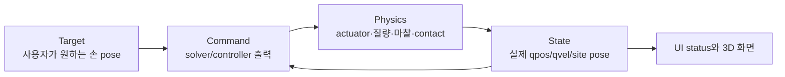

# 시스템 동작 원리

수식이나 함수 이름보다 먼저 알아야 할 프로젝트의 mental model을 정리한다.

## 먼저 보는 용어

| 용어 | 이 문서에서의 뜻 |
|---|---|
| target | 사용자가 원하는 목표값; 실제 로봇 상태가 아님 |
| pose | 위치 3개 + 자세(quaternion 또는 RPY) |
| home | 앱 시작 keyframe의 기준 자세 |
| anchor | Whole-body target XYZ 축과 world 위치를 고정하는 base 기준 |
| site | MuJoCo body에 붙인 질량 없는 기준 좌표계; 손 IK 기준점 |
| `qdot` | solver가 계산한 제어 자유도의 순간 속도 벡터 |
| `BodyTwist` | 로봇 body frame의 `vx`, `vy`, `wz` |
| hard pin/gate | weight가 아니라 lower/upper bound를 같은 값으로 고정 |
| rebase | 현재 base/target을 이후 공통 움직임의 새 zero reference로 저장 |
| capture | virtual object에 대한 양손 상대 pose를 저장 |
| CBF | 안전거리 경계로 접근하는 속도를 제한하는 control barrier function |
| slack | 동시에 만족하기 어려운 CBF를 유한하게 풀 때 남은 soft violation |

## 1. 목표, 명령, 물리는 서로 다르다

| 층 | 예 | 바로 실제 상태를 바꾸는가 |
|---|---|---|
| Target | `pos_r`, `rpy_l`, virtual object pose | 아니오 |
| Command | 팔 `q_des`, lift position, base `BodyTwist` | 아니오 |
| Actuator | torque, position target, wheel velocity target | 힘/토크를 물리에 적용 |
| State | `data.qpos`, `data.qvel`, site pose | `mj_step()` 결과로 변함 |

UI slider를 움직였는데 손이 즉시 marker와 겹치지 않는 이유가 이것이다. target은
의도이고 실제 로봇은 제한된 속도와 토크, 접촉을 거쳐 따라간다.

## 2. qpos를 직접 쓰지 않는 이유

로봇 관절의 live `data.qpos`를 매 frame target으로 덮어쓰면 IK는 쉬워 보이지만 다음을
검증할 수 없게 된다.

- 팔 토크가 충분한가
- 바퀴가 실제로 굴러 차체를 움직이는가
- 물체가 contact force로 잡혔는가
- collision과 관성이 명령에 어떤 영향을 주는가

이 프로젝트에서 live qpos 쓰기는 초기화와 자유물체 reset 같은 명시적 재배치에만
허용한다. 런타임 로봇 동작은 actuator command와 `mj_step()`으로 만든다.

## 3. 세 좌표계

| 좌표계 | 기준 | 쓰는 곳 |
|---|---|---|
| world | MuJoCo 절대 공간 | 실제 site pose, collision point, whole-body target |
| live base | 현재 `base_x/y/yaw` | keyboard body twist, arm-only target 표현 |
| startup anchor | 앱 시작 또는 수동 handover로 운반된 기준 | Whole-body ON의 world-fixed target 표현 |

### Whole-body ON에서 world-fixed target이 필요한 이유

base가 target을 향해 10 cm 움직였는데 target도 base와 함께 10 cm 이동하면 오차가
줄지 않는다. 그래서 ON에서는 최종 손 target을 world에 고정한다.

### OFF에서 live-base target이 편한 이유

arm-only에서는 base를 수동으로 재배치할 때 손 target도 로봇과 함께 움직이는 것이
자연스럽다. OFF는 target을 live base 기준으로 표현한다.

ON/OFF 전환 시 앱은 world pose를 먼저 저장하고 새 좌표계 값으로 역변환한다. 따라서
표현은 달라도 화면의 목표는 같은 곳에 남는다.

## 4. FK, 단일 팔 IK, Whole-body IK

| 이름 | 입력 | 출력/변수 | 런타임 역할 |
|---|---|---|---|
| FK mode | J1~J7 slider | 지정한 팔 관절 목표 | 해당 팔 Cartesian solver 제외 |
| `ik.py` | 한 손 world pose | 한 팔 7개 관절 위치 | Phase 3/4 독립 회귀와 단일 팔 solver |
| `whole_body_ik.py` | 양손 world pose | base/lift/양팔 differential command | 현재 teleop IK 경로 |

여기서 FK는 forward kinematics 계산 자체와 UI의 `FK mode`라는 표현이 겹친다. UI의
FK mode는 “관절 slider를 직접 목표로 사용한다”는 뜻이고, 수학적 FK 계산은
`kinematics.py`가 pose/Jacobian을 평가할 때 항상 사용한다.

## 5. Whole-body IK가 하는 일

제어 변수는 최대 18개다.

\[
\dot q=[\dot x_b,\dot y_b,\dot\theta_b,\dot q_{lift},
\dot q_{r,1:7},\dot q_{l,1:7}]^T
\]

solver는 다음 요구를 한 bounded least-squares 문제에서 절충한다.

1. 손 위치/자세 오차 감소
2. 관절 속도와 한 step 위치 한계 준수
3. home posture 쪽의 약한 선호
4. Bimanual capture 시 양손 상대 pose 유지
5. collision CBF의 분리 속도 요구

OFF에서는 첫 네 base/lift 변수를 hard bound로 0에 고정한다. 자세한 수식은
[전신 IK와 충돌 회피](guide/whole_body_ik.md)에 있다.

## 6. Collision avoidance의 범위

현재 기능은 **reactive local velocity safety**다.

| 하는 것 | 하지 않는 것 |
|---|---|
| 3 cm 안의 signed distance와 gradient 계산 | 장애물 주변의 전체 경로 생성 |
| 1 cm 안전거리 쪽 접근 속도 제한 | 미래 수 초의 trajectory 최적화 |
| 이미 가까우면 분리 방향 속도 요구 | 모든 접촉을 금지 |
| 팔-팔, 팔-몸체, 팔/손-table 감시 | wheel-floor와 finger-can 의도 접촉 차단 |

따라서 목표가 장애물 반대편이면 solver가 느려지거나 멈출 수 있다. 이것은 global
planner가 우회로를 찾는 동작과 다르다. target을 안전한 중간점으로 나눠 이동해야 한다.

## 7. `V`와 `G`의 차이

| 토글 | 데이터 | 질문 |
|---|---|---|
| `V` Collision CBF Viz | 거리 query와 CBF active pair | “충돌하기 전에 무엇을 감시하고 있나?” |
| `G` Contact Viz | MuJoCo의 실제 contact point/force | “지금 실제로 무엇이 닿았나?” |

두 표시를 동시에 켤 수 있다. 노란 collision line은 아직 물리 contact가 없어도 나타날
수 있고, 캔을 잡을 때 finger-can contact는 의도된 접촉이라 CBF pair에서 제외된다.

## 8. ROS-free의 정확한 의미

ROBOTIS AI Worker/Cyclo 공식 구현에서 참고한 것은 알고리즘 구조다.

- weighted differential IK/QP
- 공용 pose/Jacobian 계층
- velocity/joint-limit bounds
- bimanual relative-pose task
- signed-distance collision CBF/slack
- 3모듈 swerve 기구학과 reversal 흐름

ROS node, topic, service, action, tf2, MoveIt, Pinocchio, FCL, OSQP 코드는 가져오지
않는다. 공개 경계는 NumPy 배열, dataclass, Python dictionary, MuJoCo model/data다.

## 9. 한 frame의 실제 순서

1. 입력 이벤트와 ImGui frame을 시작한다.
2. keyboard 주행/lift 상태를 읽는다.
3. UI가 raw target 값을 갱신한다.
4. target을 frame당 3 cm/8° 이내로 smoothing한다.
5. target을 world pose로 변환한다.
6. WBIK 또는 arm-only solve를 실행한다.
7. keyboard/WBIK/zero 중 base command를 선택한다.
8. swerve wheel command, 팔 torque, lift/hand command를 만든다.
9. 여러 physics substep에 command를 반복 적용하고 `mj_step()`한다.
10. collision/contact/gizmo/UI를 렌더링한다.

이 순서를 코드에서 따라가려면 [아키텍처와 데이터 흐름](overview.md)과
[`teleop_app.py` 가이드](guide/teleop_app.md)를 읽는다.
