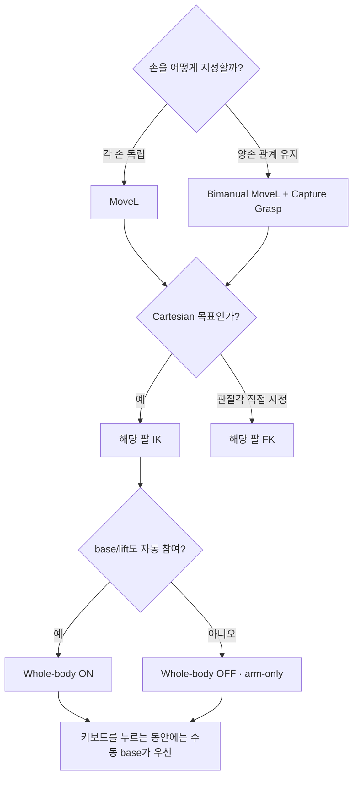
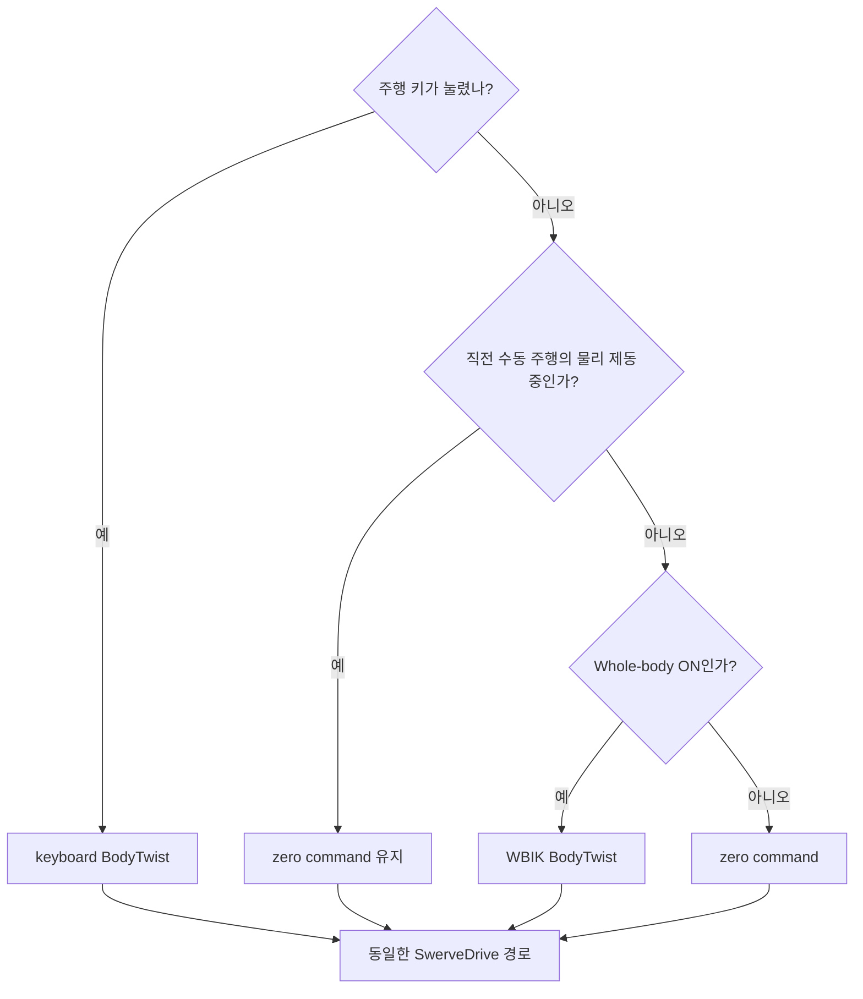

# 제어 모드 선택

화면에는 서로 다른 역할의 모드가 함께 있다. 가장 중요한 사실은 이들이 하나의
거대한 mode enum이 아니라 **서로 다른 층의 독립 스위치**라는 점이다.

## 네 가지 결정 층

| 층 | 선택지 | 결정하는 것 | 결정하지 않는 것 |
|---|---|---|---|
| 손 목표 controller | MoveL / Bimanual MoveL | 손 목표를 독립으로 움직일지 virtual object로 묶을지 | base/lift 참여 여부 |
| 팔별 제어 | IK / FK | 해당 팔이 Cartesian target을 풀지 관절 slider를 따를지 | 다른 팔의 모드 |
| 전신 참여 | Whole-body ON / OFF | IK가 base/lift까지 사용할지 팔만 사용할지 | 수동 keyboard 주행 허용 여부 |
| base 명령 우선순위 | keyboard / WBIK / zero | 현재 frame에 어느 body twist를 바퀴로 보낼지 | 손 목표 controller |



## 가장 흔한 목적별 추천

| 하고 싶은 일 | Controller | 팔 모드 | Whole-body | 이유 |
|---|---|---|---|---|
| 한 손 위치를 정밀하게 조절 | MoveL | 해당 손 IK | OFF | base/lift를 고정해 팔 동작만 관찰 |
| 먼 목표까지 양손을 함께 이동 | MoveL 또는 Bimanual | 양손 IK | ON | 팔 가동범위를 base/lift가 보완 |
| 물체를 양손으로 잡은 관계 유지 | Bimanual MoveL + Capture | 양손 IK | ON 권장 | virtual object와 rigid-grasp 제약 사용 |
| 리프트만 올리며 팔 관절 유지 | 어느 쪽이든 | 양팔 FK | OFF 권장 | 팔 IK 보정 없이 lift 수동 명령만 적용 |
| base를 수동으로 재배치 | 어느 쪽이든 | IK/FK 무관 | 어느 쪽이든 | keyboard가 WBIK보다 우선하고 target frame을 함께 운반 |
| collision 반응만 팔에서 확인 | MoveL | 해당 손 IK | OFF | base/lift를 제거해 팔 CBF 효과 분리 |

## MoveL과 Bimanual MoveL

### MoveL

오른손과 왼손 target이 독립적이다. marker selector에서 `Right goal` 또는
`Left goal`을 고르고 XYZ/RPY jog, slider, gizmo로 조작한다.

### Bimanual MoveL

`Capture Grasp`를 누른 시점의 양손 pose를 virtual object 기준으로 저장한다.

```text
Capture 시점
virtual object ── 고정 상대 transform ── right hand
               └ 고정 상대 transform ── left hand

이후
virtual object 이동 → 저장된 두 transform 적용 → 양손 target 동시 갱신
```

캡처 뒤에는 virtual-object marker가 조작 대상이 된다. `Release Grasp`를 누르면 다시
독립 손 target으로 돌아간다. 이는 물체를 simulation body에 weld하는 기능이 아니라
**양손 목표 사이의 관계를 유지하는 controller constraint**다.

## 팔별 IK와 FK

| 모드 | UI 입력 | solver 참여 | 전환 시 점프 방지 |
|---|---|---|---|
| IK | 손 XYZ/RPY target | 해당 팔 7축이 WBIK/arm-only solve에 참여 | FK→IK에서 현재 실제 손 pose로 target 재동기화 |
| FK | J1~J7 관절각 | 해당 팔 differential velocity를 0으로 고정 | IK→FK에서 현재 `q_des`를 slider로 복사 |

한 팔은 IK, 다른 팔은 FK인 조합도 가능하다. 이때 IK 팔과 Whole-body ON 상태의
base/lift만 Cartesian 목표를 푼다.

## Whole-body ON과 OFF

### ON: 18개 후보 자유도

```text
base x/y/yaw (3) + lift (1) + right arm (7) + left arm (7) = 18
```

단, FK로 전환한 팔은 solve에서 고정된다. 양손 target의 공통 이동은 명시적인 base
hierarchy를 사용하고, 남은 오차를 lift와 팔이 푼다.

### OFF: arm-only hard gate

OFF는 base/lift의 가중치를 작게 만드는 것이 아니다. 네 differential velocity의
lower/upper bound를 모두 0으로 만든다.

```text
qdot_base_x = qdot_base_y = qdot_base_yaw = qdot_lift = 0
```

그래서 damping, posture task, collision slack이 있어도 잔류 자동 주행이 나올 수 없다.
다만 keyboard와 lift slider는 IK 외부 명령이므로 계속 사용할 수 있다.

## 키보드 수동 주행의 우선순위

매 frame의 base 명령은 다음 순서로 결정된다.



수동 주행 중에는 손/virtual target frame도 측정된 base SE(2) 이동만큼 함께 옮긴다.
키를 놓고 차체가 멈추면 solver reference를 현재 위치로 `rebase()`한다. 이 과정이
과거 target을 새 오차로 해석해 원래 위치로 돌아가는 현상을 막는다.

## 모드 전환 체크리스트

- 상태줄에서 현재 `Whole-body IK ON/OFF`를 확인한다.
- 손이 안 움직이면 해당 팔이 `FK`인지 확인한다.
- virtual marker가 안 보이면 `Bimanual MoveL`에서 capture했는지 확인한다.
- base가 자동으로 안 움직이면 Whole-body가 OFF인지 확인한다.
- 키를 놓은 직후에는 물리 제동이 끝날 때까지 WBIK가 잠시 대기한다.
- collision line이 활성화되면 목표 방향보다 분리 방향이 우선될 수 있다.
