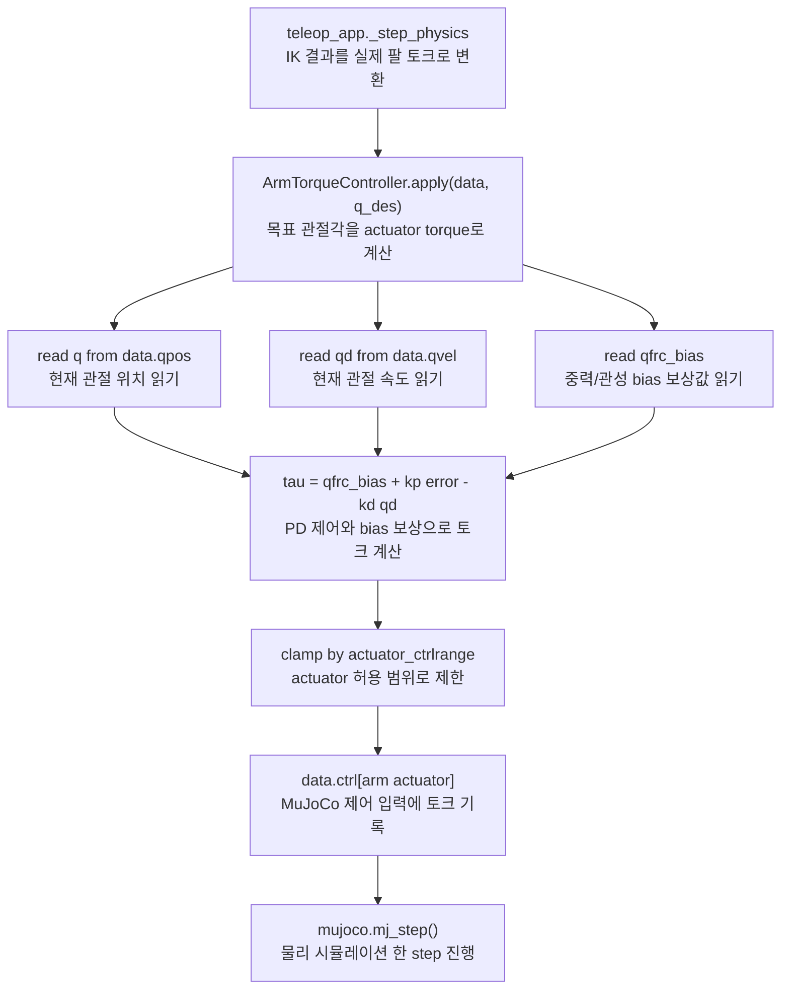

# `src/arm_control.py`

팔 관절을 torque motor로 구동하는 제어기.

## 역할

| 항목 | 내용 |
|---|---|
| 입력 | 목표 관절각 `q_des` |
| 출력 | 팔 motor actuator의 `data.ctrl` 토크 |
| 제어식 | `tau = qfrc_bias + kp * (q_des - q) - kd * qvel` |
| 목적 | 중력/코리올리 보상 + PD feedback으로 목표 자세 유지 |

## 수식

\[
\tau = h(q, \dot q) + K_p\,(q_{des} - q) - K_d\,\dot q
\]

\(h(q,\dot q)\)는 MuJoCo가 매 스텝 계산해주는 `qfrc_bias`(중력+코리올리+원심력을
정확히 상쇄하는 feedforward 항), \(K_p\)/\(K_d\)는 스칼라 게인(`kp=600.0`,
`kd=40.0`)을 모든 관절에 동일하게 적용한다. 계산 결과는 `actuator_ctrlrange`로
clamp한 뒤 `data.ctrl`에 쓴다.

**왜 \(h(q,\dot q)\)가 없으면 안 되는가**: 정적 평형(\(\dot q=\ddot q=0\))에서
필요한 토크는 정확히 \(h(q,0)\)이다. `feedforward` 없이 \(\tau=K_p(q_{des}-q)\)만
쓰면 평형 조건에서 정상상태 오차 \(q_{des}-q = h(q,0)/K_p\)가 남는다 — \(K_p\)를
아무리 올려도 0이 아니라 반비례로 줄어들 뿐이다. \(h(q,\dot q)\)를 더하면 평형
조건의 양변에서 그 항이 상쇄돼 \(K_p(q_{des}-q)=0\), 즉 유한한 \(K_p\)에서도
오차가 정확히 0이 되는 평형점으로 바뀐다. 유도 과정은
[ROS2 개발자를 위한 튜토리얼 Part 7.2](ros2-guide.md#part-7-2) 참고.

## 클래스

### `ArmTorqueController`

| 메서드 | 역할 |
|---|---|
| `__init__(model, joint_names, kp=600.0, kd=40.0)` | 관절 id, qpos address, dof id, actuator id를 캐싱한다. |
| `apply(data, q_des, kp_scale=1.0)` | 현재 상태를 읽어 토크를 계산하고 actuator `ctrlrange`로 clamp한 뒤 `data.ctrl`에 쓴다. |

## 함수 흐름



## 사용 위치

`teleop_app.py`의 `_step_physics()`에서 양팔에 대해 매 물리 substep 호출된다.

```python
self.ctrl_r.apply(data, self.q_des_r)
self.ctrl_l.apply(data, self.q_des_l)
```

## 데이터 접근

| 읽기 | 쓰기 |
|---|---|
| `data.qpos`, `data.qvel`, `data.qfrc_bias` | `data.ctrl[arm_motor_actuator]` |

`data.qpos`를 직접 수정하지 않는다.
