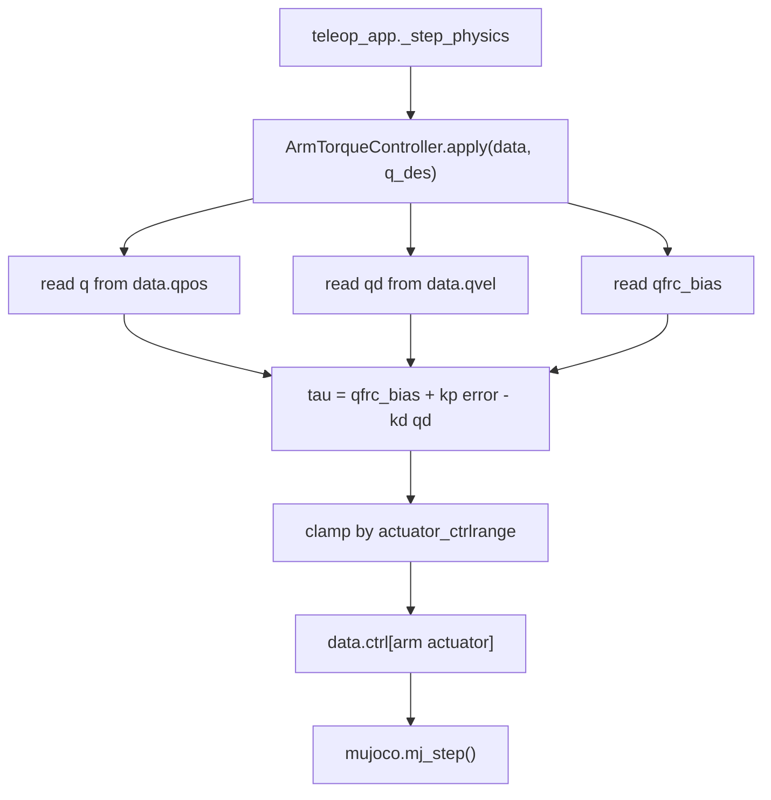

# `src/arm_control.py`

팔 관절을 torque motor로 구동하는 제어기.

## 역할

| 항목 | 내용 |
|---|---|
| 입력 | 목표 관절각 `q_des` |
| 출력 | 팔 motor actuator의 `data.ctrl` 토크 |
| 제어식 | `tau = qfrc_bias + kp * (q_des - q) - kd * qvel` |
| 목적 | 중력/코리올리 보상 + PD feedback으로 목표 자세 유지 |

## 클래스

### `ArmTorqueController`

| 메서드 | 역할 |
|---|---|
| `__init__(model, joint_names, kp=600.0, kd=40.0)` | 관절 id, qpos address, dof id, actuator id를 캐싱한다. |
| `apply(data, q_des, kp_scale=1.0)` | 현재 상태를 읽어 토크를 계산하고 actuator `ctrlrange`로 clamp한 뒤 `data.ctrl`에 쓴다. |

## 함수 흐름



## 사용 위치

`teleop_app.py`의 `_step_physics()`에서 양팔에 대해 매 물리 substep 호출된다.

```python
self.ctrl_r.apply(data, self.q_des_r)
self.ctrl_l.apply(data, self.q_des_l)
```

## 데이터 접근

| 읽기 | 쓰기 |
|---|---|
| `data.qpos`, `data.qvel`, `data.qfrc_bias` | `data.ctrl[arm_motor_actuator]` |

`data.qpos`를 직접 수정하지 않는다.
