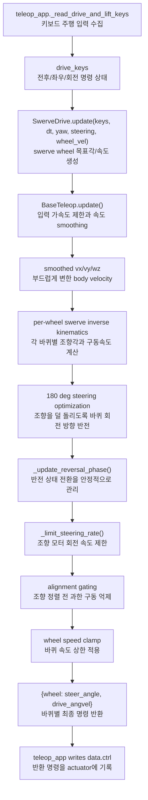

# `src/base_teleop.py`

키보드 입력을 ROBOTIS-style swerve drive 명령으로 변환한다.

## 역할

| 단계 | 내용 |
|---|---|
| 입력 smoothing | 전진/후진/strafe/yaw 키를 부드러운 body-frame 속도로 변환 |
| swerve IK | body velocity를 3개 wheel module의 조향각/바퀴 속도로 변환 |
| 반전 처리 | 180도 steering flip, 감속-조향-가속 sequence |
| 안전 처리 | steering rate limit, alignment gating, wheel speed clamp |

## 클래스와 함수

| 이름 | 역할 |
|---|---|
| `BaseTeleop` | 키 입력을 smoothed velocity command로 변환 |
| `BaseTeleop.update(keys, dt, yaw=0.0)` | `vx_world, vy_world, wz`를 반환 |
| `ReversalPhase` | wheel 방향 반전 상태 enum |
| `SwerveDrive` | 3-wheel swerve command generator |
| `SwerveDrive.update(keys, dt, yaw, steering_positions, wheel_velocities)` | wheel별 `(steer_angle, drive_angvel)` 반환 |
| `_limit_steering_rate(current, target, dt)` | 조향각 변화량 제한 |
| `_normalize_angle(angle)` | 각도를 `[-pi, pi)`로 정규화 |
| `_shortest_angular_distance(start, target)` | 최단 각도 차 계산 |
| `_clamp(value, lo, hi)` | 값 clamp |

## 함수 흐름



## 출력 형식

```python
{
    "left_wheel": (steer_angle_rad, drive_angvel_rad_s),
    "right_wheel": (steer_angle_rad, drive_angvel_rad_s),
    "rear_wheel": (steer_angle_rad, drive_angvel_rad_s),
}
```

## 사용 위치

`teleop_app.py`가 매 render frame마다 한 번 호출하고, 반환된 wheel command를 물리
substep마다 `data.ctrl`에 반복 적용한다.
