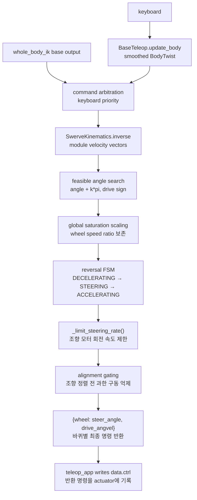

# `src/base_teleop.py`

body-frame 속도 명령을 ROBOTIS AI Worker식 스워브 바퀴 명령으로 변환한다. 키보드는
가능한 입력원 중 하나일 뿐이며 whole-body IK도 같은 `BodyTwist` 경로를 사용한다.

## 역할

| 단계 | 내용 |
|---|---|
| 입력 smoothing | 전진/후진/strafe/yaw 키를 부드러운 body-frame 속도로 변환 |
| swerve 역기구학 | body velocity를 3개 wheel module의 조향각/바퀴 속도로 변환 |
| swerve 정기구학 | 실제 조향각/바퀴 속도 feedback에서 body twist를 최소제곱으로 복원 |
| 제한 조향 | 런타임 ±2π 범위에서 `angle + k*pi` 동치 상태를 비교해 가장 가까운 상태 선택 |
| 반전 처리 | 움직이는 바퀴는 감속-조향-가속, 이미 멈춘 바퀴는 즉시 방향 전환 |
| 안전 처리 | command-trajectory steering rate limit, 전체 module alignment gating, 비율 보존 전역 wheel saturation |

## 수식

강체가 각속도 \(\omega\)로 돌면서 동시에 \((v_x,v_y)\)로 평행이동할 때, 중심에서
\((x_i,y_i)\)만큼 떨어진 점의 속도는 \(v_{point}=v_{center}+\omega\times r\)이고,
2D에서 \(\omega \times (x_i,y_i) = \omega(-y_i, x_i)\)다(회전 접선속도가 반지름
벡터에 수직). 바퀴 모듈 위치 \((x_i, y_i)\)(베이스 중심 기준), 몸체 속도
\(v_x, v_y, \omega\)에서 그 모듈이 실제로 내야 하는 평면 속도(강체 운동학):

\[
\begin{pmatrix} v_{i,x} \\ v_{i,y} \end{pmatrix}
=
\begin{pmatrix} v_x - \omega\, y_i \\ v_y + \omega\, x_i \end{pmatrix}
\]

이 벡터의 극좌표 변환이 그 모듈의 목표 조향각/목표 속력이고, 바퀴 반지름 \(r\)로
나누면 목표 구동 각속도가 된다:

\[
\theta_i = \operatorname{atan2}(v_{i,y}, v_{i,x}), \quad
s_i = \sqrt{v_{i,x}^2+v_{i,y}^2}, \quad
\dot\phi_i = s_i / r
\]

이 극좌표 변환이 필요한 이유는 스워브 모듈이 "방향(조향각) + 그 방향으로의
속력(구동)"이라는 두 액추에이터로만 이 속도 벡터를 낼 수 있기 때문이다 —
180도 반전 최적화, 정렬 게이팅, 반전 시퀀스(FSM)의 물리적 근거까지 포함한 전체
설명은 [ROS2 개발자를 위한 튜토리얼 Part 8.3](ros2-guide.md#part-8-3) 참고.

런타임 조향 범위는 공식 AI Worker 설정과 같은 약 ±2π다. 그래도 알고리즘은 좁은
범위에도 동작하도록 후보를 먼저 범위로 거른다. `test_whole_body.py`는 별도의 ±1.58
rad kinematics를 주입해 100° 요청이 -80° 조향 + 역구동으로 표현되는지도 확인한다.

## 응답성과 안정성

키보드 translation과 yaw를 독립적으로 shaping하므로 전진하면서 회전할 수 있다.
현재 translation 목표는 0.62 m/s, yaw 목표는 1.6 rad/s이고, 입력 follow rate는 각각
5.0/s다. 키를 놓으면 translation 8.0/s, yaw 8.0/s로 더 빠르게 감쇠한다. 테스트에서
전진은 0.6초에 0.589 m/s, 전진+yaw는 1초에 0.616 m/s와 1.589 rad/s에 도달하고,
release 뒤 약 0.92초 안에 zero deadband로 들어온다.

조향 rate limiter는 실제 조향 피드백이 아니라 이전 **명령 궤적**에서 다음 명령을
만든다. 피드백을 기준으로 제한하면 타이어 정지마찰로 실제 각도가 지연될 때 servo
오차와 토크가 일정 값에 갇혀 조향이 약 20°에서 멈출 수 있다. 피드백은 정렬 여부와
반전 FSM 판정에는 계속 사용한다.

키를 놓으면 zero body command가 세 drive velocity target을 즉시 0으로 만든다.
이전 구현의 `coast()`는 차체 반동을 피하려고 실제 wheel speed를 목표로 계속
복사했기 때문에 차체가 멈춘 뒤에도 바퀴가 무한히 도는 문제가 있었다. 반대로 기존
저관성 rotor를 즉시 제동하면 고마찰 접촉을 통해 차체가 크게 튕겼다. wheel joint에
기어드 모터의 reflected rotor inertia를 나타내는 `armature=0.8`을 반영해 두 문제를
함께 해결했다. 앱은 키 해제 즉시 이 zero command를 선택하고 차체 피드백이 정지를
확인할 때까지 WBIK 주행 명령을 넘기지 않는다. 1초 후진 release 회귀에서 차체
속도는 0.20초, 모든 바퀴는 0.32초 안에 정지하고, 차체의 역방향 복귀는 3.73 mm다.
독립 `BaseTeleop` shaping 회귀의 zero deadband 0.92초는 앱의 키 해제 주차 경로와
구분되는 호환 API 측정값이다.

세 모듈이 평행하면 바퀴 축에 수직인 속도는 wheel odometry만으로 관측할 수 없다.
정기구학은 truncated SVD(`rcond=1e-6`)로 이 특이방향을 제거해 미세 조향 잡음이
수 m/s의 가짜 횡속도로 증폭되는 것을 막는다.

## 클래스와 함수

| 이름 | 역할 |
|---|---|
| `BodyTwist` | body-frame `vx`, `vy`, `wz` 값 객체 |
| `BaseTeleop` | 키 입력을 smoothed body velocity command로 변환 |
| `BaseTeleop.update_body(keys, dt)` | `BodyTwist` 반환 |
| `BaseTeleop.update(keys, dt, yaw=0.0)` | 기존 테스트 호환용 world `vx, vy, wz` 반환 |
| `SwerveKinematics.inverse(twist, steering_positions)` | body twist → feasible wheel states + 공통 saturation scale |
| `SwerveKinematics.forward(steering_positions, wheel_velocities)` | wheel feedback → body twist 최소제곱 복원 |
| `ReversalPhase` | wheel 방향 반전 상태 enum |
| `SwerveDrive` | feedback-dependent 3-wheel swerve controller |
| `SwerveDrive.update_twist(twist, dt, steering_positions, wheel_velocities)` | 임의 body twist를 wheel별 `(steer_angle, drive_angvel)`로 변환 |
| `SwerveDrive.update(keys, ...)` | 키보드 호환 wrapper |
| `SwerveDrive._hold_zero(steering_positions)` | 정지 명령일 때 반전 상태 리셋 + 현재 조향각 유지 |
| `SwerveDrive._control_module(...)` | 바퀴 하나의 reversal FSM, rate limit, alignment 계산 |
| `_limit_steering_rate(previous_command, target, dt)` | 조향 명령 궤적의 프레임별 변화량 제한 |
| `_normalize_angle(angle)` | 각도를 `[-pi, pi)`로 정규화 |
| `_shortest_angular_distance(start, target)` | 최단 각도 차 계산 |
| `_clamp(value, lo, hi)` | 값 clamp |

## 함수 흐름



## 출력 형식

```python
{
    "left_wheel": (steer_angle_rad, drive_angvel_rad_s),
    "right_wheel": (steer_angle_rad, drive_angvel_rad_s),
    "rear_wheel": (steer_angle_rad, drive_angvel_rad_s),
}
```

## 사용 위치

`teleop_app.py`가 매 render frame마다 키보드 명령과 whole-body IK 명령을 중재한 뒤
`update_twist()`를 호출한다. 반환 wheel command는 물리 substep마다 `data.ctrl`에
반복 적용된다. ROS message, node, controller manager는 사용하지 않는다.

모델은 `base_link`와 세 `wheel_drive` body 사이 접촉을 제외한다. 90° 조향에서 실제
바퀴 원통과 베이스의 보이지 않는 box가 약 25 mm 겹쳐 차체 회전을 막던 모델 내부
접촉이었기 때문이다. `test_phase_5.py`가 이 각도에서 내부 접촉 0건을 먼저 검사한 뒤
strafe, pure yaw, translation+yaw, 전후 반전을 실제 wheel-floor contact로 반복한다.
