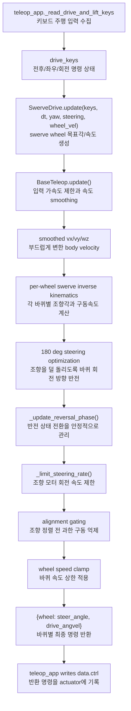

# `src/base_teleop.py`

키보드 입력을 ROBOTIS-style swerve drive 명령으로 변환한다.

## 역할

| 단계 | 내용 |
|---|---|
| 입력 smoothing | 전진/후진/strafe/yaw 키를 부드러운 body-frame 속도로 변환 |
| swerve IK | body velocity를 3개 wheel module의 조향각/바퀴 속도로 변환 |
| 반전 처리 | 180도 steering flip, 감속-조향-가속 sequence |
| 안전 처리 | steering rate limit, alignment gating, wheel speed clamp |

## 수식

바퀴 모듈 위치 \((x_i, y_i)\)(베이스 중심 기준), 몸체 속도 \(v_x, v_y, \omega\)에서
그 모듈이 실제로 내야 하는 평면 속도(강체 운동학):

\[
\begin{pmatrix} v_{i,x} \\ v_{i,y} \end{pmatrix}
=
\begin{pmatrix} v_x - \omega\, y_i \\ v_y + \omega\, x_i \end{pmatrix}
\]

이 벡터의 극좌표 변환이 그 모듈의 목표 조향각/목표 속력이고, 바퀴 반지름 \(r\)로
나누면 목표 구동 각속도가 된다:

\[
\theta_i = \operatorname{atan2}(v_{i,y}, v_{i,x}), \quad
s_i = \sqrt{v_{i,x}^2+v_{i,y}^2}, \quad
\dot\phi_i = s_i / r
\]

## 클래스와 함수

| 이름 | 역할 |
|---|---|
| `BaseTeleop` | 키 입력을 smoothed velocity command로 변환 |
| `BaseTeleop.update(keys, dt, yaw=0.0)` | `vx_world, vy_world, wz`를 반환 |
| `ReversalPhase` | wheel 방향 반전 상태 enum |
| `SwerveDrive` | 3-wheel swerve command generator |
| `SwerveDrive.update(keys, dt, yaw, steering_positions, wheel_velocities)` | wheel별 `(steer_angle, drive_angvel)` 반환 -- cmd_zero면 `_hold_zero`, 아니면 바퀴마다 `_solve_wheel_module` 호출 |
| `SwerveDrive._hold_zero(steering_positions)` | 정지 명령일 때 반전 상태 리셋 + 현재 조향각 유지 |
| `SwerveDrive._solve_wheel_module(name, module_x, module_y, vx_body, vy_body, wz, dt, steering_positions, wheel_velocities)` | 바퀴 모듈 하나의 조향각/구동속도/정렬 여부 계산 (역기구학 + 180도 반전 최적화 + 정렬 게이팅) |
| `_limit_steering_rate(current, target, dt)` | 조향각 변화량 제한 |
| `_normalize_angle(angle)` | 각도를 `[-pi, pi)`로 정규화 |
| `_shortest_angular_distance(start, target)` | 최단 각도 차 계산 |
| `_clamp(value, lo, hi)` | 값 clamp |

## 함수 흐름



## 출력 형식

```python
{
    "left_wheel": (steer_angle_rad, drive_angvel_rad_s),
    "right_wheel": (steer_angle_rad, drive_angvel_rad_s),
    "rear_wheel": (steer_angle_rad, drive_angvel_rad_s),
}
```

## 사용 위치

`teleop_app.py`가 매 render frame마다 한 번 호출하고, 반환된 wheel command를 물리
substep마다 `data.ctrl`에 반복 적용한다.
