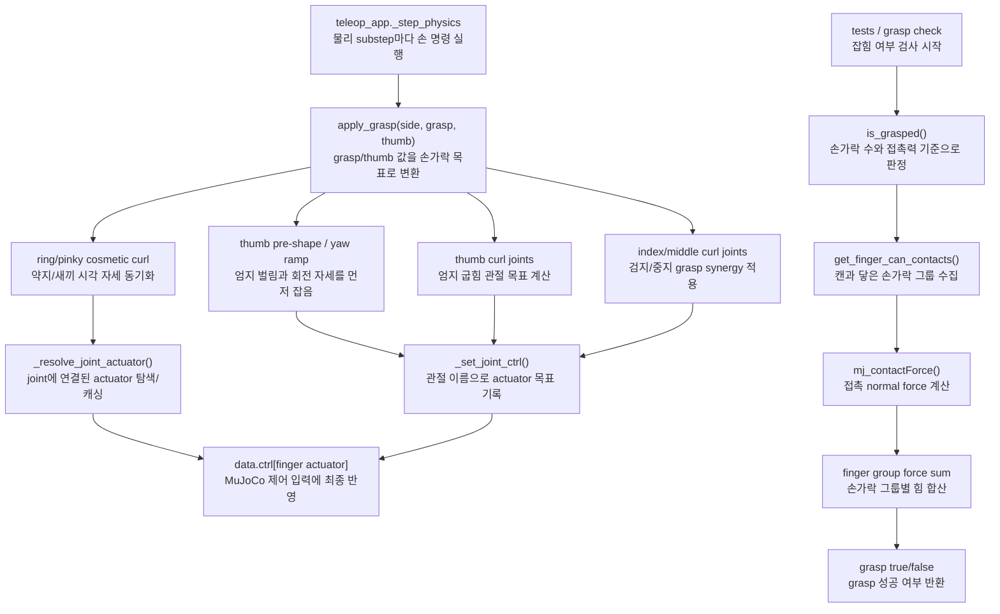

# `src/grasp.py`

손가락 synergy를 actuator target으로 변환하고, 접촉력으로 grasp 여부를 판정한다.

## Target 구조

| UI 값 | 적용 대상 |
|---|---|
| `grasp` | 검지/중지 curl, 약지/새끼 cosmetic curl |
| `thumb` | 엄지 pitch/IP curl, 엄지 MCP yaw ramp |

## 주요 상수

| 이름 | 역할 |
|---|---|
| `FINGER_CURL_JOINTS` | 검지/중지 curl 관절 목록 |
| `THUMB_CURL_JOINTS` | 엄지 pitch/IP 관절 목록 |
| `THUMB_PRESHAPE` | 엄지 CMC 고정 pre-shape |
| `THUMB_YAW_REST`, `THUMB_YAW_CURL` | thumb 값에 따른 MCP yaw 범위 |
| `RING_PINKY_CURL_JOINTS` | 약지/새끼 cosmetic curl 관절 |
| `FINGER_BODY_GROUPS` | 접촉 body를 손가락 그룹으로 매핑 |

## 함수

| 함수 | 역할 |
|---|---|
| `_resolve_joint_actuator(model, joint_name)` | joint id와 actuator id를 찾고 캐싱 |
| `_set_joint_ctrl(model, data, joint_name, value)` | 관절 이름 기준으로 actuator target 기록 |
| `apply_grasp(model, data, grasp, thumb, side="r")` | synergy 값을 손가락 actuator target으로 변환 |
| `apply_open_hand(model, data, side="r")` | actuated finger joint를 open pose로 명령 |
| `get_finger_can_contacts(model, data, side="r")` | 캔과 닿은 finger group별 normal force 합산 |
| `is_grasped(model, data, min_fingers=2, min_total_force=0.05, require_thumb=True, side="r")` | 접촉력 기준 grasp 성공 여부 반환 |
| `get_box_hand_contacts(model, data)` | legacy box 접촉 force 측정 |
| `is_box_held(model, data, min_force_per_hand=1.0)` | legacy box 양손 hold 판정 |

## 함수 흐름



## 사용 위치

`teleop_app.py`의 물리 substep에서 양손에 대해 호출된다.

```python
grasp.apply_grasp(model, data, grasp=targets["grasp_r"], thumb=targets["thumb_r"], side="r")
grasp.apply_grasp(model, data, grasp=targets["grasp_l"], thumb=targets["thumb_l"], side="l")
```

## 데이터 접근

| 읽기 | 쓰기 |
|---|---|
| `model.jnt_range`, `data.contact`, `mj_contactForce` | `data.ctrl[finger_actuator]` |
