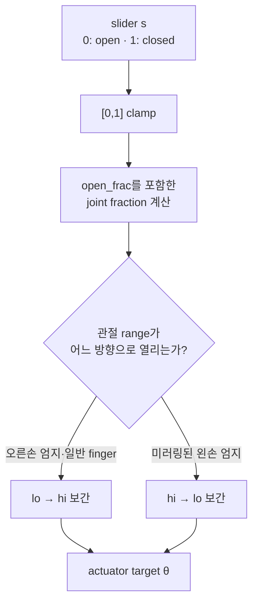
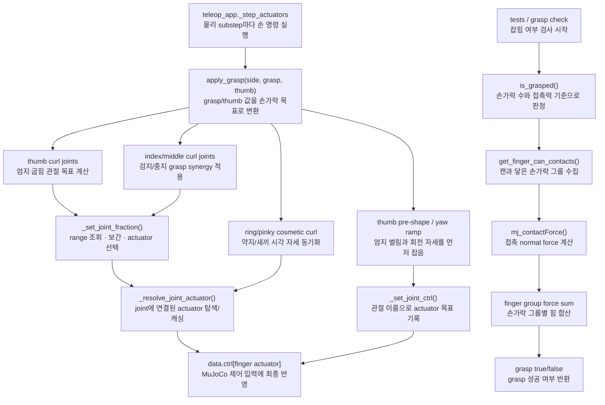

# `src/grasp.py`

손가락 synergy를 actuator target으로 변환하고, 접촉력으로 grasp 여부를 판정한다.

## Target 구조

| UI 값 | 적용 대상 |
|---|---|
| `grasp` | 검지/중지 curl, 약지/새끼 cosmetic curl |
| `thumb` | 엄지 pitch/IP curl, 엄지 MCP yaw ramp |

## 주요 상수

| 이름 | 역할 |
|---|---|
| `FINGER_CURL_JOINTS` | 검지/중지 curl 관절 목록 |
| `THUMB_CURL_JOINTS` | 엄지 pitch/IP 관절 목록 |
| `THUMB_PRESHAPE` | 엄지 CMC 고정 pre-shape |
| `THUMB_YAW_REST`, `THUMB_YAW_CURL` | thumb 값에 따른 MCP yaw 범위 |
| `RING_PINKY_CURL_JOINTS` | 약지/새끼 cosmetic curl 관절 |
| `FINGER_BODY_GROUPS` | 접촉 body를 손가락 그룹으로 매핑 |
| `BODY_TO_FINGER_GROUP` | 접촉 판정 때 재사용하는 body→finger 역매핑 |

## 수식

> **왜 `open_frac`만큼 미리 오므려 두는가**: `hand_only.xml`은 아직 테이블이 없어
> 캔이 자유낙하하는데, 손가락 액추에이터는 일부러 힘을 약하게 만들어뒀다(접촉
> 시 토크 포화로 순응 그립이 나오도록, ROS2 관점의 시스템 해설
> [MuJoCo contact](ros2/02-mujoco-model-data.md#part-2-6)/[손 관절 지도](ros2/05-hand-control.md#part-5-2) 참고).
> Range 전체(완전히 편 상태부터)를 다 오므리면 그 약한
> 액추에이터가 다 닫기 전에 캔이 이미 손 밖으로 떨어진다 — 그래서 "펼침"
> 자체를 range 끝이 아니라 캔 표면 근처로 당겨둔다.

슬라이더 스칼라 \(s\in[0,1]\)(`grasp` 또는 `thumb`)를 관절 range \([lo,hi]\) 위의
목표각으로 바꾸는 보간(`_ramp_value`), `open_frac`은 "완전히 편 상태에서도
남겨두는 여유":

\[
\text{frac} = \text{open\_frac} + s\,(1-\text{open\_frac}), \qquad
\theta =
\begin{cases}
lo + \text{frac}\,(hi-lo) & \text{open\_at\_hi=False} \\
hi - \text{frac}\,(hi-lo) & \text{open\_at\_hi=True (왼손 엄지처럼 range가 미러링된 경우)}
\end{cases}
\]



같은 slider 값이라도 미러링된 왼손 엄지는 range를 반대 방향으로 읽는다. 그림의
분기 없이 항상 `lo → hi`로 보간하면 왼손 엄지는 open/close가 뒤집힌다.

약지/새끼 코스메틱 curl은 `open_frac` 없이 `grasp` 스칼라에 비례해 자기 range의
`RING_PINKY_MAX_FRAC`까지만 움직인다: \(\theta = lo + (s\cdot\text{RING\_PINKY\_MAX\_FRAC})(hi-lo)\).

엄지 MCP-yaw는 같은 형태의 선형 램프이지만 대상이 range가 아니라 REST/CURL 두
각도 사이다: \(\text{yaw}(s) = \text{yaw}_{rest} + s\,(\text{yaw}_{curl}-\text{yaw}_{rest})\).

## 함수

| 함수 | 역할 |
|---|---|
| `_validate_side(side)` | 손 방향을 `l`/`r`로 제한하고 잘못된 입력을 명확히 거부 |
| `_resolve_joint_actuator(model, joint_name)` | joint id와 actuator id를 찾고 캐싱 (actuator 탐색 자체는 `mj_util.find_actuator_for_joint` 공용 함수 사용) |
| `_ramp_value(lo, hi, frac, open_at_hi=False)` | 관절 range를 frac(0~1) 비율로 보간 |
| `_set_joint_ctrl(model, data, joint_name, value)` | 관절 이름 기준으로 actuator target 기록 |
| `_set_joint_fraction(...)` | joint range 조회와 보간, actuator 기록을 한 단계로 처리 |
| `apply_grasp(model, data, grasp, thumb, side="r")` | synergy 값을 손가락 actuator target으로 변환 |
| `get_finger_can_contacts(model, data, side="r")` | 캔과 닿은 finger group별 normal force 합산 |
| `is_grasped(model, data, min_fingers=2, min_total_force=0.05, require_thumb=True, side="r")` | 접촉력 기준 grasp 성공 여부 반환 |

## 함수 흐름



## 사용 위치

`teleop_app.py`의 `_step_actuators()`가 물리 substep마다 양손에 대해 호출한다.

```python
grasp.apply_grasp(model, data, grasp=targets["grasp_r"], thumb=targets["thumb_r"], side="r")
grasp.apply_grasp(model, data, grasp=targets["grasp_l"], thumb=targets["thumb_l"], side="l")
```

## 데이터 접근

| 읽기 | 쓰기 |
|---|---|
| `model.jnt_range`, `data.contact`, `mj_contactForce` | `data.ctrl[finger_actuator]` |
