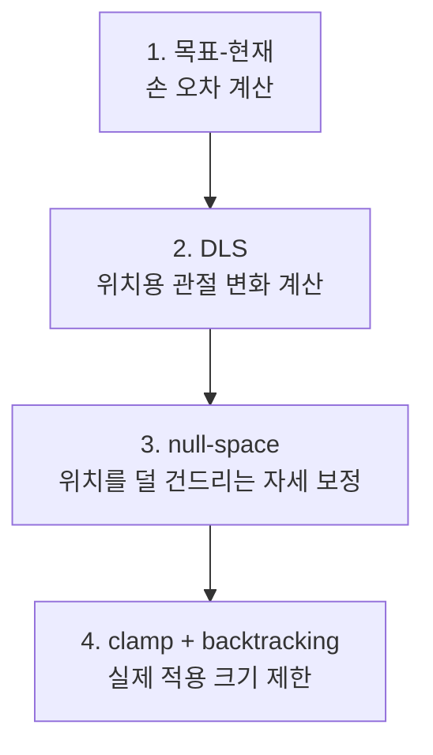
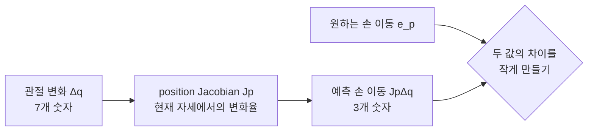
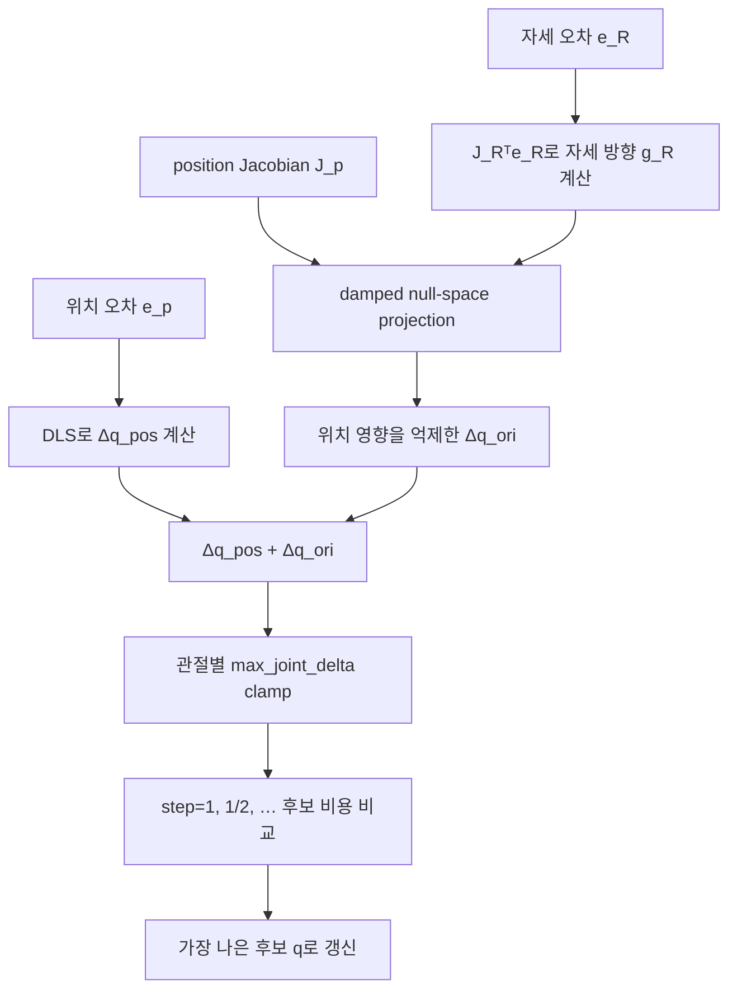

# DLS와 위치 우선 IK 수학

이 페이지는 `src/ik.py`를 읽을 때 가장 헷갈리기 쉬운 두 질문에 답한다.

1. DLS는 왜 특이점 근처에서 관절 움직임이 폭발하지 않게 하는가?
2. 자세 보정은 어떻게 이미 맞춘 손 위치를 거의 망치지 않고 더할 수 있는가?

설명은 7자유도 팔의 **한 solver iteration**을 기준으로 한다. 실제 클래스와 호출
흐름은 [단일 팔 IK](ik.md), Jacobian과 좌표계 정의는
[기구학과 충돌 거리](kinematics.md)를 참고한다.

!!! note "현재 텔레옵과 이 페이지의 관계"
    현재 텔레옵은 [`src/whole_body_ik.py`](whole_body_ik.md)의 bounded solver를
    사용한다. 여기서 설명하는 `src/ik.py`는 legacy 단일 팔 solver지만, DLS·특이점·
    null space를 이해하는 데 가장 작은 예제이므로 회귀 테스트와 학습용으로 유지한다.

## 먼저 보는 전체 흐름

세부 수식보다 아래 네 단계를 먼저 기억하면 된다.



| 기호 | 크기 | 쉬운 의미 |
|---|---:|---|
| \(q\) | \(7\times1\) | 현재 관절각 7개 |
| \(\Delta q\) | \(7\times1\) | 이번 iteration에 움직일 관절량 |
| \(p(q),\ p^\ast\) | 각각 \(3\times1\) | 현재 손 위치와 목표 손 위치 |
| \(e_p=p^\ast-p(q)\) | \(3\times1\) | 손이 더 움직여야 할 거리와 방향 |
| \(J_p\) | \(3\times7\) | 관절 변화가 손 위치 변화로 바뀌는 비율 |
| \(J_R\) | \(3\times7\) | 관절 변화가 손 자세 변화로 바뀌는 비율 |
| \(\lambda\) | 스칼라 | 큰 관절 움직임을 얼마나 강하게 억제할지 정하는 damping |

!!! tip "처음 읽는다면"
    먼저 1절의 문제, 4절의 그래프, 6절의 컵 비유와 마지막 요약을 읽으면 큰 흐름을
    잡을 수 있다. 그다음 2절부터 순서대로 읽으면 각 등식이 어디서 나왔는지 중간
    단계를 건너뛰지 않고 확인할 수 있다.

## 1. IK가 푸는 문제

7개 관절각을 벡터 \(q\in\mathbb R^7\), 손의 현재 위치를
\(p(q)\in\mathbb R^3\), 목표 위치를 \(p^\ast\)라고 하자. 위치 오차는 다음과 같다.

\[
e_p = p^\ast - p(q)
\]

관절을 작은 양 \(\Delta q\)만큼 움직였을 때 손 위치 변화는 position Jacobian
\(J_p\in\mathbb R^{3\times7}\)으로 선형 근사한다.

\[
\Delta p \approx J_p\Delta q
\]

따라서 한 iteration의 목표는 다음 식을 가능한 한 잘 만족하는 \(\Delta q\)를 찾는
것이다.

\[
J_p\Delta q \approx e_p
\]



### 왜 해가 여러 개인가

\(J_p\)는 식 3개에 미지수 7개인 \(3\times7\) 행렬이다. 일반적인 자세에서
\(\operatorname{rank}(J_p)\approx3\)이면 위치를 움직이지 않는 관절 방향이 대략
4차원 남는다.

\[
\dim\mathcal N(J_p)
= 7-\operatorname{rank}(J_p)
\approx 4
\]

\(J_pz=0\)인 관절 벡터 \(z\)는 1차 근사에서 손 위치를 바꾸지 않는다. 손을 한 점에
둔 채 팔꿈치 자세를 바꾸는 움직임이 이 **null space(영공간)**의 직관적인 예다.

## 2. DLS는 무엇을 최소화하는가

Damped least-squares(DLS)는 위치 오차만 줄이는 대신 관절 변화량에도 벌점을 준다.

\[
\boxed{
\min_{\Delta q}
\left(
\lVert J_p\Delta q-e_p\rVert^2
+\lambda^2\lVert\Delta q\rVert^2
\right)
}
\]

| 항 | 의미 |
|---|---|
| \(\lVert J_p\Delta q-e_p\rVert^2\) | 예측한 손 이동이 원하는 이동과 얼마나 다른가 |
| \(\lambda^2\lVert\Delta q\rVert^2\) | 관절을 얼마나 과격하게 움직이는가 |

\(\lambda\)가 커지면 작은 관절 움직임을 더 선호해 안정적이지만 느려지고,
작아지면 목표를 적극적으로 쫓지만 특이점 근처에서 민감해진다.

!!! summary "이 식을 말로 읽으면"
    **손 오차는 줄이되, 그 대가로 관절을 너무 크게 움직여야 한다면 조금 양보한다.**
    DLS의 핵심은 정확한 오차 0만 고집하지 않고 안정적인 관절 움직임과 절충하는 것이다.

### 2.1 목적함수 완전 전개

아래에서는 표기를 짧게 하기 위해 \(J_p\)를 \(J\), \(e_p\)를 \(e\)로 쓴다.
제곱 노름의 정의부터 시작한다.

\[
\begin{aligned}
L(\Delta q)
&=\lVert J\Delta q-e\rVert^2
+\lambda^2\lVert\Delta q\rVert^2 \\
&=(J\Delta q-e)^T(J\Delta q-e)
+\lambda^2\Delta q^T\Delta q
\end{aligned}
\]

첫 번째 곱을 네 항으로 전개한다.

\[
\begin{aligned}
(J\Delta q-e)^T(J\Delta q-e)
&=(\Delta q^TJ^T-e^T)(J\Delta q-e) \\
&=\Delta q^TJ^TJ\Delta q
-\Delta q^TJ^Te
-e^TJ\Delta q
+e^Te
\end{aligned}
\]

\(\Delta q^TJ^Te\)는 스칼라이므로 전치해도 값이 같다.

\[
\Delta q^TJ^Te
=(\Delta q^TJ^Te)^T
=e^TJ\Delta q
\]

따라서 가운데 두 항을 합칠 수 있다.

\[
\boxed{
L(\Delta q)
=\Delta q^TJ^TJ\Delta q
-2e^TJ\Delta q
+e^Te
+\lambda^2\Delta q^T\Delta q
}
\]

### 2.2 미분에서 normal equation까지

필요한 미분 규칙은 세 가지다. \(A=A^T\)이고 \(b\)가 상수일 때

\[
\frac{\partial}{\partial x}(x^TAx)=2Ax,
\qquad
\frac{\partial}{\partial x}(b^Tx)=b,
\qquad
\frac{\partial}{\partial x}(\text{constant})=0
\]

여기서 \(J^TJ\)는 대칭행렬이고 \(e^Te\)는 \(\Delta q\)와 무관한 상수다.
각 항을 하나씩 미분하면

\[
\begin{aligned}
\frac{\partial}{\partial\Delta q}
(\Delta q^TJ^TJ\Delta q)
&=2J^TJ\Delta q, \\
\frac{\partial}{\partial\Delta q}
(-2e^TJ\Delta q)
&=-2J^Te, \\
\frac{\partial}{\partial\Delta q}(e^Te)
&=0, \\
\frac{\partial}{\partial\Delta q}
(\lambda^2\Delta q^T\Delta q)
&=2\lambda^2\Delta q
\end{aligned}
\]

이들을 더한 gradient를 0으로 둔다.

\[
\begin{aligned}
\nabla_{\Delta q}L
&=2J^TJ\Delta q-2J^Te+2\lambda^2\Delta q \\
&=0
\end{aligned}
\]

양변을 2로 나누고 \(\Delta q\)가 들어간 항을 묶으면

\[
\begin{aligned}
J^TJ\Delta q-J^Te+\lambda^2\Delta q&=0 \\
J^TJ\Delta q+\lambda^2\Delta q&=J^Te \\
(J^TJ+\lambda^2I)\Delta q&=J^Te
\end{aligned}
\]

\(\lambda>0\)이면 \(J^TJ+\lambda^2I\)는 positive definite라 역행렬이 존재한다.
따라서 관절 공간에서 푸는 primal form은

\[
\boxed{
\Delta q=(J^TJ+\lambda^2I)^{-1}J^Te
}
\]

이다.

### 2.3 Primal form에서 코드의 dual form까지

관절이 \(n\)개이고 task가 \(m\)차원이면 primal form은 \(n\times n\) system을
푼다. 이 프로젝트의 위치 IK는 \(n=7\), \(m=3\)이므로 \(3\times3\) system을 푸는
dual form이 더 작다. 두 형태가 같은 이유를 등식으로 확인한다.

\[
\begin{aligned}
(J^TJ+\lambda^2I_n)J^T
&=J^TJJ^T+\lambda^2J^T \\
&=J^T(JJ^T+\lambda^2I_m)
\end{aligned}
\]

왼쪽에서 \((J^TJ+\lambda^2I_n)^{-1}\), 오른쪽에서
\((JJ^T+\lambda^2I_m)^{-1}\)를 차례로 곱한다.

\[
\begin{aligned}
J^T
&=(J^TJ+\lambda^2I_n)^{-1}
J^T(JJ^T+\lambda^2I_m), \\
J^T(JJ^T+\lambda^2I_m)^{-1}
&=(J^TJ+\lambda^2I_n)^{-1}J^T
\end{aligned}
\]

두 번째 등식의 좌우를 바꾸고 primal form에 대입하면

\[
\begin{aligned}
\Delta q
&=(J^TJ+\lambda^2I_n)^{-1}J^Te \\
&=J^T(JJ^T+\lambda^2I_m)^{-1}e
\end{aligned}
\]

따라서 실제 solver가 사용하는 결과식은

\[
\boxed{
\Delta q=J^T(JJ^T+\lambda^2I)^{-1}e
}
\]

이다. 여기까지가 목적함수에서 코드의 DLS 식까지 생략 없는 전개다.

## 3. 수식과 코드의 대응

`InverseKinematics.solve_pose()`는 위 식을 다음 코드로 직접 구현한다. 별도 helper로
감싸지 않아 수식의 각 항이 iteration 안에서 그대로 보인다.

```python
lam2 = self.damping ** 2
position_system = jacp @ jacp.T + lam2 * np.eye(3)
dq_pos = jacp.T @ np.linalg.solve(position_system, pos_err)
```

| 코드 | 수식 | 역할 |
|---|---|---|
| `jacp @ jacp.T` | \(J_pJ_p^T\) | task-space sensitivity를 모은다. |
| `+ lam2 * I` | \(J_pJ_p^T+\lambda^2I\) | 0에 가까운 방향의 분모를 안정화한다. |
| `solve(position_system, pos_err)` | \((J_pJ_p^T+\lambda^2I)^{-1}e_p\) | 역행렬을 만들지 않고 선형계를 푼다. |
| `jacp.T @ ...` | \(J_p^T(\cdots)\) | 결과를 관절 공간으로 돌려보낸다. |

기본 감쇠는 `DEFAULT_DAMPING = 0.05`, iteration당 관절 변화 제한은
`DEFAULT_MAX_JOINT_DELTA = 0.05 rad`다. 두 값은 역할이 다르다. damping은 해를
계산하는 과정의 정규화이고, clamp는 계산된 해에 마지막으로 적용하는 상한이다.

## 4. DLS가 특이점에서 폭발을 막는 이유

Jacobian을 singular value decomposition(SVD)으로 쓰면
\(J=U\Sigma V^T\)다. 각 특이값 \(\sigma_i\)는 해당 task 방향으로 관절 움직임이
얼마나 잘 전달되는지를 나타낸다.

### 4.1 순수 pseudoinverse의 방향별 gain

SVD에서 pseudoinverse는 \(J^+=V\Sigma^+U^T\)이고, \(\Sigma^+\)의 대각 원소는
0이 아닌 각 특이값의 역수다.

\[
\Sigma^+
=\operatorname{diag}\left(
\frac{1}{\sigma_1},\ldots,\frac{1}{\sigma_r}
\right)
\]

오차를 왼쪽 singular vector \(u_i\) 방향 성분으로 나눠 쓰면

\[
e=\sum_{i=1}^{r}(u_i^Te)u_i+e_\perp
\]

이고, pseudoinverse 해는 다음 순서로 전개된다.

\[
\begin{aligned}
\Delta q_{\text{pinv}}
&=J^+e \\
&=V\Sigma^+U^Te \\
&=\sum_{i=1}^{r}
\frac{1}{\sigma_i}v_i(u_i^Te)
\end{aligned}
\]

따라서 \(u_i\) 방향의 task error는 관절 공간에서 정확히 \(1/\sigma_i\)배 된다.

### 4.2 DLS gain을 SVD에서 끝까지 전개

DLS 식에 \(J=U\Sigma V^T\)를 대입한다. 먼저 \(JJ^T\)를 계산하면

\[
\begin{aligned}
JJ^T
&=(U\Sigma V^T)(U\Sigma V^T)^T \\
&=(U\Sigma V^T)(V\Sigma^TU^T) \\
&=U\Sigma(V^TV)\Sigma^TU^T \\
&=U\Sigma\Sigma^TU^T
\end{aligned}
\]

이다. \(U\)가 orthogonal이므로 \(I=UIU^T\)이고

\[
\begin{aligned}
JJ^T+\lambda^2I
&=U\Sigma\Sigma^TU^T+\lambda^2UIU^T \\
&=U(\Sigma\Sigma^T+\lambda^2I)U^T
\end{aligned}
\]

이다. Orthogonal similarity transform의 역은

\[
[UCU^T]^{-1}=UC^{-1}U^T
\]

이므로 DLS operator를 전개하면

\[
\begin{aligned}
J^T(JJ^T+\lambda^2I)^{-1}
&=V\Sigma^TU^T
\left[U(\Sigma\Sigma^T+\lambda^2I)U^T\right]^{-1} \\
&=V\Sigma^TU^T
U(\Sigma\Sigma^T+\lambda^2I)^{-1}U^T \\
&=V\Sigma^T(\Sigma\Sigma^T+\lambda^2I)^{-1}U^T
\end{aligned}
\]

대각 원소끼리 계산하면

\[
\Sigma^T(\Sigma\Sigma^T+\lambda^2I)^{-1}
=\operatorname{diag}\left(
\frac{\sigma_1}{\sigma_1^2+\lambda^2},\ldots,
\frac{\sigma_r}{\sigma_r^2+\lambda^2}
\right)
\]

이므로 최종 해는

\[
\boxed{
\Delta q_{\text{DLS}}
=\sum_{i=1}^{r}
\frac{\sigma_i}{\sigma_i^2+\lambda^2}
v_i(u_i^Te)
}
\]

이다. 따라서 DLS의 방향별 gain은

\[
\boxed{g(\sigma)=\frac{\sigma}{\sigma^2+\lambda^2}}
\]

로 정확히 나타난다.

### 4.3 DLS gain의 최대값과 극한

gain을 \(\sigma\)로 미분한다. 몫의 미분법을 그대로 적용하면

\[
\begin{aligned}
g'(\sigma)
&=\frac{1\cdot(\sigma^2+\lambda^2)
-\sigma\cdot2\sigma}
{(\sigma^2+\lambda^2)^2} \\
&=\frac{\lambda^2-\sigma^2}
{(\sigma^2+\lambda^2)^2}
\end{aligned}
\]

\(\sigma\ge0\)에서 \(g'(\sigma)=0\)이면

\[
\lambda^2-\sigma^2=0
\quad\Longrightarrow\quad
\sigma=\lambda
\]

이고, 그때의 gain은

\[
g(\lambda)
=\frac{\lambda}{\lambda^2+\lambda^2}
=\frac{1}{2\lambda}
\]

이다. 양 끝의 극한도 직접 계산할 수 있다.

\[
\lim_{\sigma\to0}
\frac{\sigma}{\sigma^2+\lambda^2}=0,
\qquad
\lim_{\sigma\to\infty}
\frac{\sigma}{\sigma^2+\lambda^2}=0
\]

| 특이값 상태 | 뜻 | 순수 pseudoinverse | DLS |
|---|---|---|---|
| \(\sigma_i\)가 큼 | 손이 잘 움직이는 방향 | 평범한 크기의 명령 | 거의 같은 방향으로 움직임 |
| \(\sigma_i\approx\lambda\) | 민감도가 낮아지기 시작 | 명령이 커짐 | gain이 최대값에 도달 |
| \(\sigma_i\to0\) | 사실상 움직일 수 없는 방향 | \(1/\sigma_i\)가 폭발 | gain이 0으로 내려가 방향을 포기 |

순수 역은 \(\sigma_i\to0\)일 때 무한대로 커지지만 DLS는 위 전개처럼 0으로
내려간다. 즉 로봇이 거의 움직일 수 없는 방향을 억지로 만들기 위해 관절을 크게
휘두르지 않는다.

<figure markdown>
  
  <figcaption>빨강은 순수 pseudoinverse, 초록은 λ=0.1인 DLS 예시다. 그래프 위쪽 범위를 넘는 빨강 곡선은 σ→0에서 계속 발산한다.</figcaption>
</figure>

예를 들어 \(\sigma=0.001\), \(\lambda=0.1\)이면 다음과 같다.

\[
\frac{1}{\sigma}=1000,
\qquad
\frac{\sigma}{\sigma^2+\lambda^2}
=\frac{0.001}{0.010001}
\approx0.1
\]

같은 아주 작은 손 오차가 순수 pseudoinverse에서는 관절 공간에서 크게 증폭되지만,
DLS에서는 해당 특이 방향이 강하게 억제된다.

!!! summary "그래프의 한 줄 결론"
    **움직일 수 없는 방향일수록 더 세게 명령하는 것이 아니라, 그 방향의 명령을
    포기하는 것**이 DLS가 특이점에서 안전한 이유다.

## 5. 왜 위치와 자세를 한 번에 풀지 않는가

가장 단순한 pose IK는 위치와 자세 오차, Jacobian을 각각 세로로 쌓는다.

\[
e=
\begin{bmatrix}e_p\\e_R\end{bmatrix},
\qquad
J=
\begin{bmatrix}J_p\\J_R\end{bmatrix}
\]

하지만 하나의 least-squares 문제에서는 위치와 자세가 같은 단계에서 경쟁한다.
가중치 \(w_p\gg w_R\)를 주어도 “위치를 절대 보존하라”가 아니라 “위치를 더 비싸게
취급하라”는 절충일 뿐이다.

이 solver는 **위치를 먼저 풀고**, 자세는 위치 task가 쓰지 않는 관절 방향으로만
보정하는 task-priority 구조를 사용한다.

!!! example "책상 위 컵으로 생각하기"
    먼저 컵을 목표 지점으로 옮기는 동작이 위치 보정 \(\Delta q_{pos}\)다. 그다음
    컵을 제자리에서 돌리고 싶다. 자세 보정이 컵을 옆으로 밀면 방금 맞춘 위치가
    깨진다. Null-space projection은 자세 보정에서 **컵을 미는 성분을 빼고,
    제자리 회전에 해당하는 성분만 남기는 필터**라고 생각할 수 있다.

\[
\Delta q=\Delta q_{pos}+\Delta q_{ori}
\]

자세 보정이 위치에 영향을 주지 않으려면 이상적으로 다음을 만족해야 한다.

\[
J_p\Delta q_{ori}=0
\]

## 6. Null-space projector

Moore–Penrose pseudoinverse \(J_p^+\)를 사용한 정확한 projector는 다음과 같다.

\[
\boxed{N_p=I-J_p^+J_p}
\]

projector가 임의의 후보 관절 방향 \(z\)를 처리하는 순서는 다음과 같다.

\[
\boxed{
N_pz
=\underbrace{z}_{\text{원래 후보}}
-\underbrace{J_p^+(J_pz)}_{\text{손 위치를 움직이는 성분}}
}
\]

1. \(J_pz\): 후보 \(z\)가 손 위치를 얼마나 움직이는지 계산한다.
2. \(J_p^+(J_pz)\): 그 움직임을 만드는 관절 성분을 다시 구한다.
3. 원래 후보에서 그 성분을 빼 위치 변화가 없는 쪽만 남긴다.

임의의 관절 방향 \(z\)에 \(N_p\)를 곱하면 위치를 움직이는 성분이 제거된다.
이를 projector 정의에서 직접 확인하면

\[
\begin{aligned}
J_pN_p
&=J_p(I-J_p^+J_p) \\
&=J_pI-J_pJ_p^+J_p \\
&=J_p-J_pJ_p^+J_p
\end{aligned}
\]

이다. Moore–Penrose pseudoinverse의 정의 성질 중 하나가

\[
J_pJ_p^+J_p=J_p
\]

이므로 이를 바로 대입하면

\[
\boxed{
J_pN_p=J_p-J_p=0
}
\]

을 얻는다. 따라서 모든 \(z\)에 대해 \(J_p(N_pz)=(J_pN_p)z=0\)이다.

자세 오차 \(e_R\in\mathbb R^3\)와 rotational Jacobian
\(J_R\in\mathbb R^{3\times7}\)에서 자세를 개선하는 단순 관절 방향은
\(g_R=J_R^Te_R\)다. 이 방향도 목적함수의 gradient에서 나온다. 작은 관절 변화
\(\delta q\)에 대한 orientation 비용을

\[
F_R(\delta q)
=\frac12\lVert e_R-J_R\delta q\rVert^2
\]

라고 하면

\[
\begin{aligned}
\nabla_{\delta q}F_R
&=\frac12\cdot2(-J_R)^T(e_R-J_R\delta q) \\
&=-J_R^T(e_R-J_R\delta q)
\end{aligned}
\]

이다. 현재점 \(\delta q=0\)에서 비용을 줄이는 negative-gradient 방향은

\[
-\nabla_{\delta q}F_R\big|_{\delta q=0}
=J_R^Te_R
=g_R
\]

가 된다. 이를 위치 null space에 투영하면 다음과 같다.

\[
\Delta q_{ori}=\alpha N_pJ_R^Te_R
\]

일반식의 \(\alpha\)는 자세 보정 gain이다. 현재 `src/ik.py`는 별도 gain을 곱하지 않아
사실상 \(\alpha=1\)이다. `ori_weight=0.3`은 line search의 후보 비용을 비교할 때만
사용하며 orientation gradient gain이 아니다.

### 중요한 주의점: damped projector는 근사다

실제 코드는 안정성을 위해 정확한 \(J_p^+\) 대신 damped pseudoinverse를 재사용한다.

\[
J_{p,\lambda}^+
=J_p^T(J_pJ_p^T+\lambda^2I)^{-1},
\qquad
N_{p,\lambda}=I-J_{p,\lambda}^+J_p
\]

이 경우 \(J_pN_{p,\lambda}=0\)이 엄밀하게 성립하지 않는다. 따라서 문서와 코드를
해석할 때는 “자세 보정이 위치를 전혀 움직이지 않는다”가 아니라
**“자세 보정이 위치에 미치는 1차 영향을 크게 억제한다”**가 정확하다.

얼마나 남는지도 생략 없이 계산할 수 있다. 정의를 대입하면

\[
\begin{aligned}
J_pN_{p,\lambda}
&=J_p(I-J_{p,\lambda}^+J_p) \\
&=J_p-J_pJ_p^T
(J_pJ_p^T+\lambda^2I)^{-1}J_p
\end{aligned}
\]

\(A=J_pJ_p^T\)라고 놓고 \(J_p\)를 오른쪽으로 묶으면

\[
\begin{aligned}
J_pN_{p,\lambda}
&=\left[I-A(A+\lambda^2I)^{-1}\right]J_p \\
&=\left[(A+\lambda^2I)(A+\lambda^2I)^{-1}
-A(A+\lambda^2I)^{-1}\right]J_p \\
&=\left[(A+\lambda^2I-A)(A+\lambda^2I)^{-1}\right]J_p \\
&=\lambda^2(A+\lambda^2I)^{-1}J_p
\end{aligned}
\]

이다. 다시 \(A=J_pJ_p^T\)를 대입하면 정확한 잔차는

\[
\boxed{
J_pN_{p,\lambda}
=\lambda^2(J_pJ_p^T+\lambda^2I)^{-1}J_p
}
\]

다. SVD 방향 \(i\)에서 이 잔차의 gain은

\[
\boxed{
\frac{\lambda^2\sigma_i}{\sigma_i^2+\lambda^2}
}
\]

이므로 \(\lambda>0\)에서는 일반적으로 0이 아니다. 이것이 damped projector가
정확한 null-space projector가 아니라는 수학적 이유다.

다음 상황에서는 작은 위치 변화가 남을 수 있다.

- damping \(\lambda\)가 큰 경우
- singularity 또는 joint limit 근처
- 관절 변화량 clamp가 성분별로 걸린 경우
- 한 iteration의 변화가 커서 Jacobian 선형근사가 부정확한 경우

## 7. 실제 solver의 한 iteration

현재 구현의 핵심 계산은 다음 식으로 요약된다.

먼저 damped projector에 \(g_R\)를 대입해 orientation 보정식을 전개하면

\[
\begin{aligned}
\Delta q_{ori}
&=N_{p,\lambda}g_R \\
&=(I-J_{p,\lambda}^+J_p)g_R \\
&=g_R-J_{p,\lambda}^+(J_pg_R) \\
&=g_R-J_p^T(J_pJ_p^T+\lambda^2I)^{-1}(J_pg_R)
\end{aligned}
\]

이다. 반복해서 나타나는 system을 \(A=J_pJ_p^T+\lambda^2I\)로 줄여 쓰면

\[
\begin{aligned}
A
&=J_pJ_p^T+\lambda^2I \\
\Delta q_{pos}
&=J_p^TA^{-1}e_p \\
g_R
&=J_R^Te_R \\
\Delta q_{ori}
&=g_R-J_p^TA^{-1}(J_pg_R) \\
\Delta q
&=\operatorname{clip}(\Delta q_{pos}+\Delta q_{ori})
\end{aligned}
\]

| 계산 조각 | 말로 읽기 |
|---|---|
| \(A=J_pJ_p^T+\lambda^2I\) | 위치 Jacobian에 damping을 더한 공통 system |
| \(J_p^TA^{-1}e_p\) | 위치 오차를 안정적인 관절 변화로 변환 |
| \(g_R=J_R^Te_R\) | 자세 오차를 줄이고 싶은 관절 방향 생성 |
| \(g_R-J_p^TA^{-1}(J_pg_R)\) | 자세 방향에서 위치를 움직이는 성분 제거 |
| \(\operatorname{clip}(\cdot)\) | 각 관절의 한 iteration 최대 이동량 제한 |

수식의 \(A^{-1}x\)는 개념 표기다. 코드는 역행렬을 직접 만들지 않고
`np.linalg.solve(A, x)`로 선형계를 푼다.



clamp 뒤에는 backtracking으로 step을 최대 6번 절반씩 줄이며 실제 forward
kinematics 비용을 비교한다.

\[
C(q)=\lVert e_p(q)\rVert+\text{ori\_weight}\,\lVert e_R(q)\rVert
\]

비용이 현재보다 낮은 후보를 찾으면 탐색을 멈춘다. 여섯 후보가 모두 개선되지
않으면 구현은 그중 비용이 가장 작은 후보를 채택한다. 따라서 line search는 큰
비선형 step의 위험을 줄이지만, 모든 iteration의 단조 감소를 수학적으로 보장하는
구조는 아니다.

## 8. 2관절로 보는 null space

위치 task가 하나이고 Jacobian이 다음과 같다고 하자.

\[
J_p=\begin{bmatrix}1&1\end{bmatrix},
\qquad
\Delta x=\Delta q_1+\Delta q_2
\]

관절을 반대 방향으로 같은 양만큼 움직이는 벡터는 null space에 있다.

\[
z=\begin{bmatrix}1\\-1\end{bmatrix},
\qquad
J_pz=
\begin{bmatrix}1&1\end{bmatrix}
\begin{bmatrix}1\\-1\end{bmatrix}=0
\]

이 예제의 pseudoinverse와 projector도 끝까지 계산해보자.

\[
\begin{aligned}
J_pJ_p^T
&=\begin{bmatrix}1&1\end{bmatrix}
\begin{bmatrix}1\\1\end{bmatrix}
=2, \\
J_p^+
&=J_p^T(J_pJ_p^T)^{-1} \\
&=\begin{bmatrix}1\\1\end{bmatrix}\frac{1}{2} \\
&=\begin{bmatrix}\frac12\\\frac12\end{bmatrix}
\end{aligned}
\]

따라서

\[
\begin{aligned}
N_p
&=I-J_p^+J_p \\
&=\begin{bmatrix}1&0\\0&1\end{bmatrix}
-\begin{bmatrix}\frac12\\\frac12\end{bmatrix}
 \begin{bmatrix}1&1\end{bmatrix} \\
&=\begin{bmatrix}1&0\\0&1\end{bmatrix}
-\begin{bmatrix}\frac12&\frac12\\\frac12&\frac12\end{bmatrix} \\
&=\begin{bmatrix}\frac12&-\frac12\\-\frac12&\frac12\end{bmatrix}
\end{aligned}
\]

이다. 임의의 후보 \(c=[1,0]^T\)를 투영하면

\[
\begin{aligned}
N_pc
&=\begin{bmatrix}\frac12&-\frac12\\-\frac12&\frac12\end{bmatrix}
\begin{bmatrix}1\\0\end{bmatrix} \\
&=\begin{bmatrix}\frac12\\-\frac12\end{bmatrix}
\end{aligned}
\]

이고 실제 위치 변화는

\[
J_pN_pc
=\begin{bmatrix}1&1\end{bmatrix}
\begin{bmatrix}\frac12\\-\frac12\end{bmatrix}
=\frac12-\frac12
=0
\]

이다.

즉 첫 관절을 \(+1\), 둘째 관절을 \(-1\) 움직이면 이 단순 모델에서 손 위치는
그대로다. 자세를 개선하는 관절 방향 중 이 성분만 남기는 것이 null-space
projection이다.

7자유도 팔은 위치 3자유도를 맞춘 뒤 일반적으로 약 4자유도가 남는다. 위치와 자세
6자유도를 모두 맞추고 나면 약 1자유도의 redundancy가 남지만, 특이 자세나 관절
한계에서는 \(\operatorname{rank}(J_RN_p)<3\)이 되어 자세를 완전히 맞추지 못할 수 있다.
이는 버그가 아니라 위치 우선순위를 지킨 결과일 수 있다.

## 9. 현재 방식과 더 엄밀한 계층형 DLS

현재 구현은 계산이 단순한 **gradient projection method**다.

\[
\boxed{
\Delta q
=J_{p,\lambda}^+e_p
+N_{p,\lambda}J_R^Te_R
}
\]

| 장점 | 한계 |
|---|---|
| 계산량이 작고 구현 의도가 분명하다. | 자세 오차를 가장 빨리 줄이는 해는 아닐 수 있다. |
| 위치 우선의 부가 task를 쉽게 넣을 수 있다. | damped projector라 위치 보존은 근사적이다. |
| 특이점에서 안정적인 DLS를 재사용한다. | null space가 부족하면 자세 보정이 거의 사라질 수 있다. |

### 더 엄밀한 계층형 식의 전개

더 엄밀한 방법은 위치 해가 자세에 이미 미친 영향까지 뺀 뒤, 남은 자세 오차를
위치 null space 안에서 다시 푼다. 먼저 primary 위치 해를

\[
\Delta q_p=J_p^+e_p
\]

로 둔다. 위치를 보존하는 추가 움직임은 어떤 벡터 \(y\)에 대해

\[
\Delta q_{secondary}=N_py
\]

로 쓸 수 있다. 최종 관절 변화는

\[
\Delta q=\Delta q_p+N_py
\]

다. 이를 orientation의 선형 근사 \(J_R\Delta q\approx e_R\)에 대입하면

\[
\begin{aligned}
J_R\Delta q&\approx e_R \\
J_R(\Delta q_p+N_py)&\approx e_R \\
J_R\Delta q_p+J_RN_py&\approx e_R \\
J_RN_py&\approx e_R-J_R\Delta q_p
\end{aligned}
\]

가 된다. 마지막 식에서 \(y\)의 최소 노름 해는

\[
y=(J_RN_p)^+(e_R-J_R\Delta q_p)
\]

다. 이를 \(\Delta q=\Delta q_p+N_py\)에 다시 대입하면

\[
\begin{aligned}
\Delta q
&=\Delta q_p+N_py \\
&=\Delta q_p
+N_p(J_RN_p)^+(e_R-J_R\Delta q_p)
\end{aligned}
\]

이므로 최종식은

\[
\boxed{
\Delta q
=\Delta q_p
+N_p(J_RN_p)^+
(e_R-J_R\Delta q_p)
}
\]

이다. 순서는 “위치를 먼저 풂 → 그 해가 자세에 준 영향 \(J_R\Delta q_p\)를 뺌 →
남은 자세 오차를 위치 null space 안에서 다시 풂”이다. 우선순위는 더 명확하지만
projector와 두 번째 pseudoinverse의 damping, rank 변화, joint limit를 함께
설계해야 하므로 구현 복잡도가 커진다.

## 핵심만 다시 보기

\[
\boxed{
\Delta q
=\underbrace{J_{p,\lambda}^+e_p}_{\text{위치를 맞추는 움직임}}
+\underbrace{N_{p,\lambda}J_R^Te_R}_{\text{위치 영향을 억제한 자세 보정}}
}
\]

- DLS는 오차와 관절 변화량을 함께 최소화한다.
- 특이값이 0에 가까운 방향의 gain을 유한하게 만들어 관절 폭주를 억제한다.
- 위치를 먼저 풀고 자세 방향을 위치 null space에 투영한다.
- damped projector의 위치 보존은 정확한 등식이 아니라 근사다.
- clamp와 backtracking은 damping과 별개의 추가 안전층이다.

다음으로 [단일 팔 IK 구현](ik.md)에서 이 식이 함수와 제어 흐름에 어떻게 대응하는지
확인할 수 있다.
