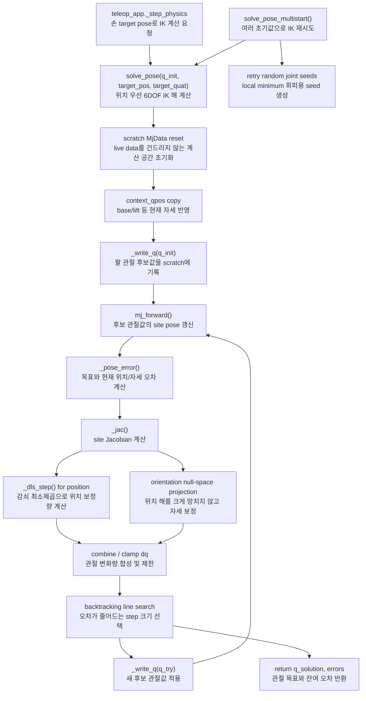

# `src/ik.py`

MuJoCo site의 목표 위치/자세를 만족하는 팔 관절각을 계산한다.

## 역할

| 항목 | 내용 |
|---|---|
| 입력 | `q_init`, `target_pos`, `target_quat` |
| 출력 | 목표 관절각 `q_solution` |
| 계산 대상 | `site_name`으로 지정한 MuJoCo site |
| 방식 | damped least-squares, task-priority pose IK, multistart |
| live data 접근 | 없음. solver 내부 scratch `MjData`만 사용 |

## 클래스

### `InverseKinematics`

| 메서드 | 역할 |
|---|---|
| `__init__(model, site_name, joint_names, damping, max_joint_delta)` | site id, joint id, dof id, qpos address, joint range, scratch data 준비 |
| `_read_q(scratch)` | solver 담당 관절각을 scratch에서 읽음 |
| `_write_q(scratch, q)` | solver 담당 관절각을 scratch qpos에 씀 |
| `_clamp_to_limits(q)` | joint range로 clamp |
| `_jac(scratch)` | 목표 site의 position/rotation Jacobian 계산 |
| `_dls_step(J, err)` | damped least-squares 1 step 계산 |
| `solve_position(q_init, target_pos, max_iter, tol, context_qpos)` | 위치만 맞추는 3DOF IK |
| `_pose_error(scratch, target_pos, target_quat)` | 위치/자세 오차 계산 |
| `solve_pose(q_init, target_pos, target_quat, ...)` | 위치 우선 + 자세 보정 6DOF IK |
| `solve_pose_multistart(q_init, target_pos, target_quat, rng, ...)` | 여러 초기값으로 재시도해 local minimum 회피 |

## 함수 흐름



## `context_qpos`

`full_scene.xml`에서는 lift/base 등 solver가 직접 제어하지 않는 관절도 site pose에 영향을 준다.
`context_qpos`는 그런 관절의 현재 값을 scratch data에 복사하기 위한 입력이다.

## 사용 위치

`teleop_app.py`의 `_step_physics()`에서 손별 target world pose를 `solve_pose()`에 넘긴다.

```python
q_des, pos_err, ori_err = solver.solve_pose(
    q_des,
    target_pos_world,
    target_quat_world,
    context_qpos=data.qpos,
)
```

## 보장

- live simulation의 `data.qpos`를 직접 수정하지 않는다.
- 계산 결과는 관절각 배열로 반환된다.
- 실제 로봇 움직임은 `arm_control.py`가 actuator torque로 만든다.
