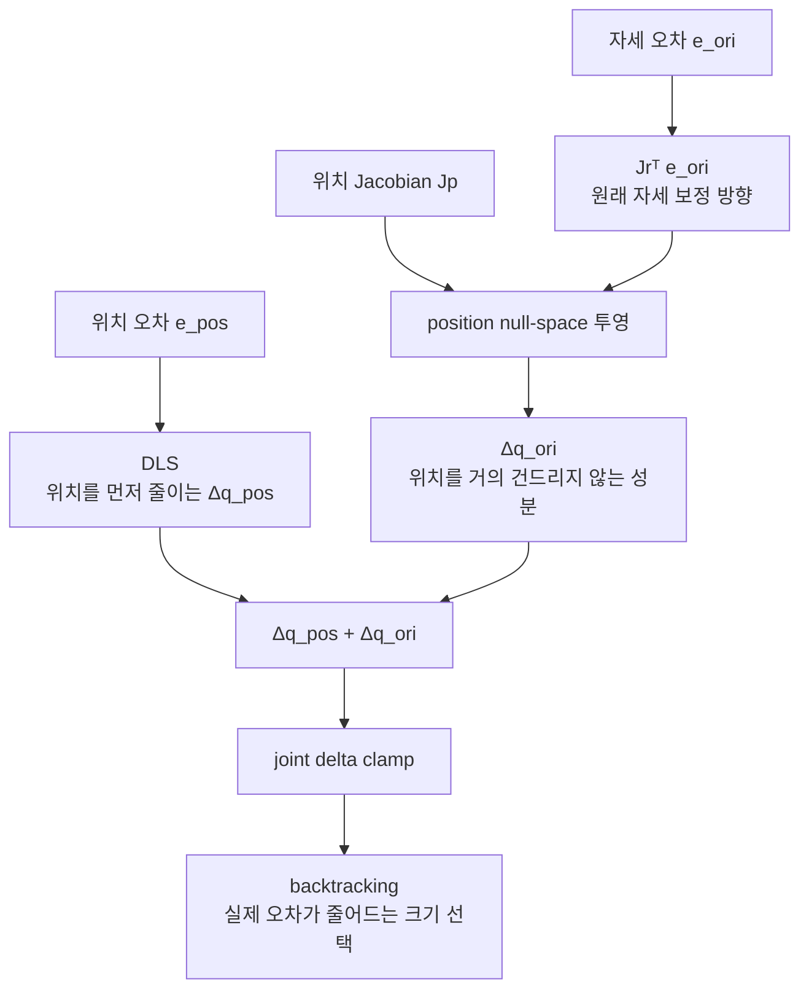
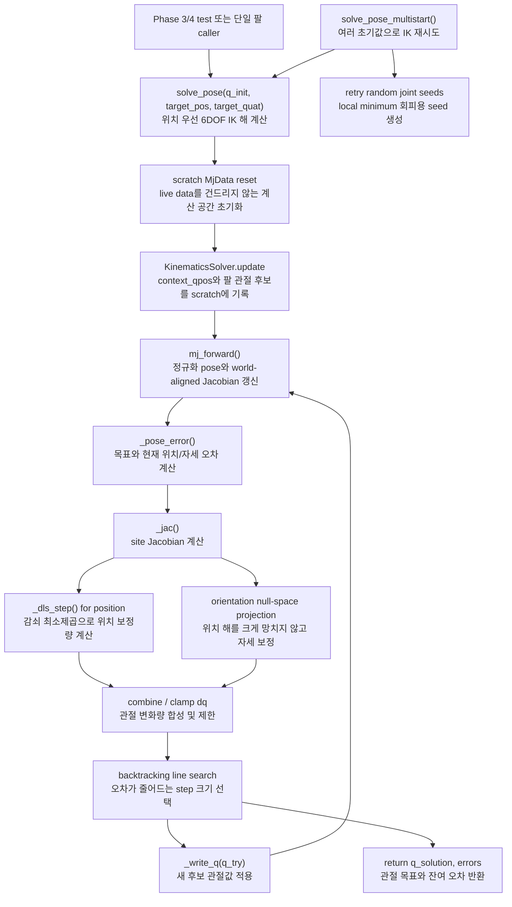

# `src/ik.py`

MuJoCo site의 목표 위치/자세를 만족하는 팔 관절각을 계산한다.

!!! note "현재 텔레옵 런타임은 whole-body IK 사용"
    이 모듈은 이전 단일 팔 solver와 회귀 테스트를 보존하기 위한 legacy 경로다.
    현재 `teleop_app.py`는 base, lift, 양팔을 한 번에 푸는
    [`src/whole_body_ik.py`](whole_body_ik.md)를 사용한다.

## 역할

| 항목 | 내용 |
|---|---|
| 입력 | `q_init`, `target_pos`, `target_quat` |
| 출력 | 목표 관절각 `q_solution` |
| 계산 대상 | `site_name`으로 지정한 MuJoCo site |
| 방식 | damped least-squares, task-priority pose IK, multistart |
| live data 접근 | 없음. solver 내부 scratch `MjData`만 사용 |

[`src/kinematics.py`](kinematics.md)가 공용 scratch 기구학 경계를 담당한다.
`forward_kinematics()` 한 번으로 정규화된 world pose와
`LOCAL_WORLD_ALIGNED`에 해당하는 6×N geometric Jacobian을 함께 얻는다. 단일 팔 IK와
whole-body IK가 같은 quaternion 부호 규칙과 회전 오차 좌표계를 사용하므로, 두 경로의
FK/Jacobian 정의가 달라지는 문제를 막는다.

## 수식

> 왜 이런 식들이 필요한지(특이점에서 역행렬이 왜 폭발하는지, null-space 투영이
> 왜 위치를 안 건드리는지, backtracking이 왜 따로 필요한지)는
> [ROS2 개발자를 위한 튜토리얼 Part 6](ros2-guide.md#part-6)이 유도 과정과
> 필요한 선형대수(야코비안, null space)까지 포함해 자세히 다룬다. 여기서는
> 최종 식만 정리한다.

Damped least-squares(DLS) 한 스텝(`_dls_step`, 위치 오차 \(e\), 위치 야코비안 \(J_p\),
감쇠 \(\lambda\)) — \(\lambda\)가 없는 순수 pseudo-inverse는 특이 자세 근처에서
관절 속도가 발산하므로, "오차도 줄이고 관절도 작게 움직이는" 절충해를 찾는다:

\[
\Delta q_{pos} = J_p^{T} \big(J_p J_p^{T} + \lambda^2 I\big)^{-1} e
\]

`solve_pose`는 이 위치 보정 위에, 자세 오차 \(e_{ori}\)(방향 야코비안 \(J_r\))를
위치 야코비안의 **null space**에만 투영해 더한다(위치를 흔들지 않는 성분만 반영):

\[
\Delta q_{ori} = J_r^{T} e_{ori} - J_p^{T} \big(J_p J_p^{T} + \lambda^2 I\big)^{-1} \big(J_p\, J_r^{T} e_{ori}\big)
\]



위쪽 경로가 우선순위가 높은 위치 task다. 아래 자세 경로는 `Jp`가 이미 사용하는
방향을 제거한 뒤에만 합쳐지므로, 자세를 맞추다가 손 위치를 크게 잃는 현상을 줄인다.

\(e_{ori}\)는 정규화한 quaternion으로
\(q_e=q_{target}\otimes q_{current}^{-1}\)를 만든 뒤 가장 짧은 축각 벡터로 변환한다.
이 곱셈 순서의 축은 처음부터 world frame이므로, world-aligned \(J_r\)과 바로 곱한다.
또한 target/current의 내적이 음수면 target 부호를 뒤집어 \(q\)와 \(-q\)가 동일한
자세라는 quaternion double-cover 성질을 명시적으로 보장한다.

## 클래스

### `InverseKinematics`

| 메서드 | 역할 |
|---|---|
| `__init__(model, site_name, joint_names, damping, max_joint_delta)` | site id, joint id, dof id, qpos address, joint range, scratch data 준비 |
| `forward_kinematics(q, context_qpos)` | scratch에서 정규화 world pose와 world-aligned 6×N Jacobian 계산 |
| `_write_q(scratch, q)` | solver 담당 관절각을 scratch qpos에 씀 |
| `_clamp_to_limits(q)` | joint range로 clamp |
| `_jac(scratch)` | 목표 site의 position/rotation Jacobian 계산 |
| `_dls_step(J, err)` | damped least-squares 1 step 계산 |
| `solve_position(q_init, target_pos, max_iter, tol, context_qpos)` | 위치만 맞추는 3DOF IK |
| `_pose_error(scratch, target_pos, target_quat)` | 위치/자세 오차 계산 |
| `solve_pose(q_init, target_pos, target_quat, ...)` | 위치 우선 + 자세 보정 6DOF IK |
| `solve_pose_multistart(q_init, target_pos, target_quat, rng, ...)` | 여러 초기값으로 재시도해 local minimum 회피 |

## 함수 흐름



## `context_qpos`

`full_scene.xml`에서는 lift/base 등 solver가 직접 제어하지 않는 관절도 site pose에 영향을 준다.
`context_qpos`는 그런 관절의 현재 값을 scratch data에 복사하기 위한 입력이다.

## legacy 사용 위치

기존 단일 팔 회귀 테스트와 독립적인 알고리즘 실험에서 사용한다. 현재
`teleop_app.py`의 `_step_physics()`는 아래 호출 대신 `WholeBodyIK.solve()`를 사용한다.

```python
q_des, pos_err, ori_err = solver.solve_pose(
    q_des,
    target_pos_world,
    target_quat_world,
    context_qpos=data.qpos,
)
```

## 보장

- live simulation의 `data.qpos`를 직접 수정하지 않는다.
- 계산 결과는 관절각 배열로 반환된다.
- 실제 로봇 움직임은 `arm_control.py`가 actuator torque로 만든다.
