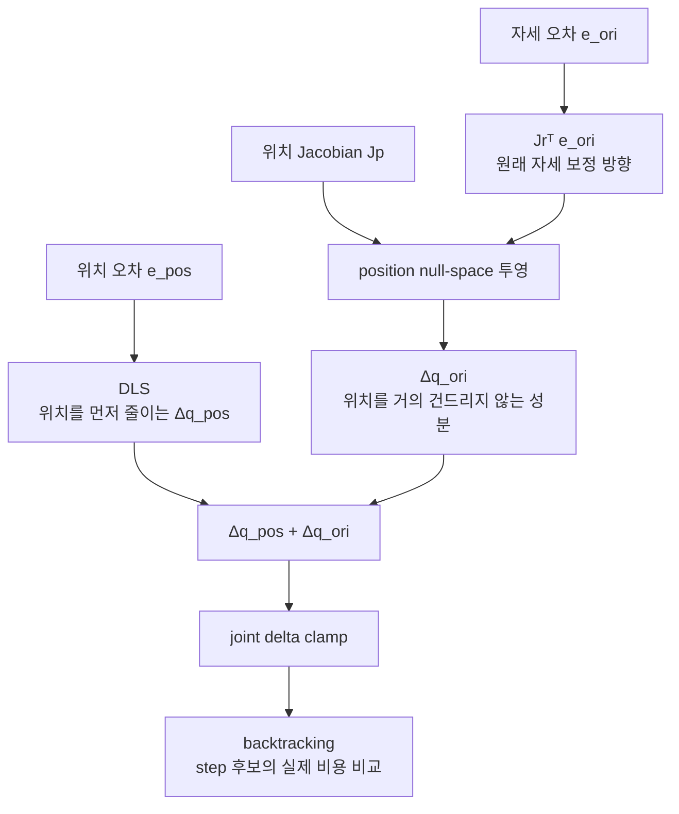
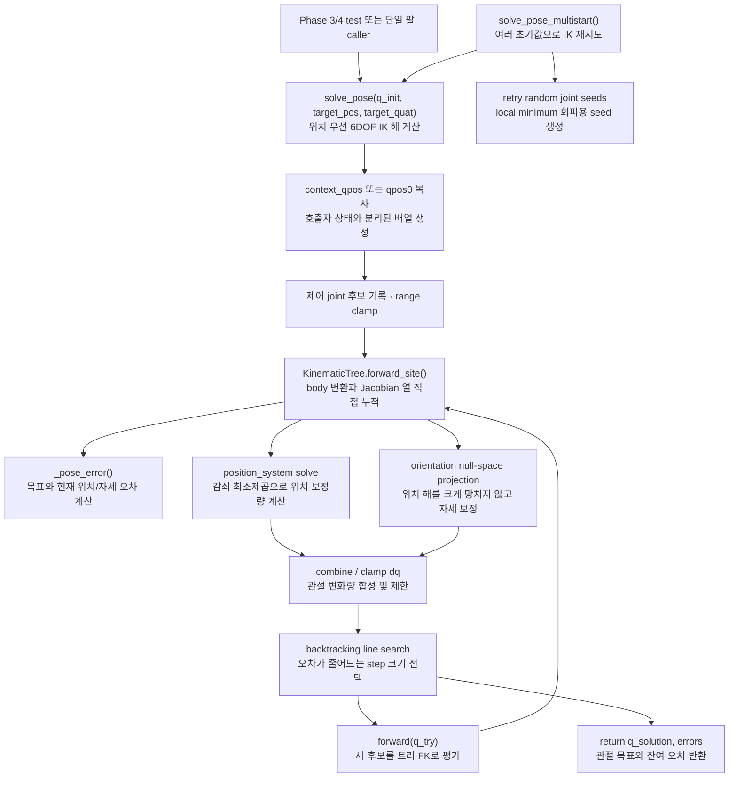

# `KinematicsSolver`와 `src/ik.py` 호환 계층

`src/kinematics.py`의 `KinematicsSolver`가 MJCF 트리 파싱, FK, Jacobian, 단일 팔
IK를 한 구조에서 제공한다. `src/ik.py`는 기존 호출 코드가 계속 동작하도록
`InverseKinematics`라는 이름과 기본 상수만 다시 노출하는 얇은 호환 계층이다.

!!! note "현재 텔레옵 런타임은 whole-body IK 사용"
    반복 `solve_pose()`는 단일 팔 회귀 테스트와 오프라인 계산을 위한 경로다.
    현재 `teleop_app.py`는 base, lift, 양팔을 한 번에 푸는
    [`src/whole_body_ik.py`](whole_body_ik.md)를 사용하지만, 그 경로의 FK와 Jacobian도
    동일한 `KinematicTree`/`KinematicsSolver`에서 얻는다.

## 역할

| 항목 | 내용 |
|---|---|
| 입력 | `q_init`, `target_pos`, `target_quat` |
| 출력 | 목표 관절각 `q_solution` |
| 계산 대상 | `site_name`으로 지정한 MuJoCo site |
| 방식 | damped least-squares, task-priority pose IK, multistart |
| 모델 입력 | 기존 `MjModel` 또는 `KinematicsSolver.from_mjcf(path, ...)` |
| live data 접근 | 없음. 파싱한 불변 트리와 NumPy 배열만 사용 |

[`src/kinematics.py`](kinematics.md)의 `forward_kinematics()` 한 번으로 정규화된 world pose와
`LOCAL_WORLD_ALIGNED`에 해당하는 6×N geometric Jacobian을 함께 얻는다. 단일 팔 IK와
whole-body IK가 같은 quaternion 부호 규칙과 회전 오차 좌표계를 사용하므로, 두 경로의
FK/Jacobian 정의가 달라지는 문제를 막는다.

## 수식

> 특이점에서 역행렬이 왜 폭발하는지, DLS가 이를 어떻게 제한하는지, damped
> null-space 투영이 왜 위치 보존의 근사인지까지 단계별로 보려면
> [DLS와 위치 우선 IK 수학](ik-math.md)을 먼저 읽는다. ROS2 관점의 전체 흐름은
> [역기구학 시스템 해설](ros2/06-inverse-kinematics.md)에 이어진다.

Damped least-squares(DLS) 한 스텝(`solve_pose` 내부, 위치 오차 \(e\), 위치 야코비안 \(J_p\),
감쇠 \(\lambda\)) — \(\lambda\)가 없는 순수 pseudo-inverse는 특이 자세 근처에서
관절 속도가 발산하므로, "오차도 줄이고 관절도 작게 움직이는" 절충해를 찾는다:

\[
\Delta q_{pos} = J_p^{T} \big(J_p J_p^{T} + \lambda^2 I\big)^{-1} e
\]

`solve_pose`는 이 위치 보정 위에, 자세 오차 \(e_{ori}\)(방향 야코비안 \(J_r\))를
위치 야코비안의 **null space**에만 투영해 더한다(위치를 흔들지 않는 성분만 반영):

\[
\Delta q_{ori} = J_r^{T} e_{ori} - J_p^{T} \big(J_p J_p^{T} + \lambda^2 I\big)^{-1} \big(J_p\, J_r^{T} e_{ori}\big)
\]



위쪽 경로가 우선순위가 높은 위치 task다. 아래 자세 경로는 `Jp`가 이미 사용하는
방향을 제거한 뒤에만 합쳐지므로, 자세를 맞추다가 손 위치를 크게 잃는 현상을 줄인다.

\(e_{ori}\)는 정규화한 quaternion으로
\(q_e=q_{target}\otimes q_{current}^{-1}\)를 만든 뒤 가장 짧은 축각 벡터로 변환한다.
이 곱셈 순서의 축은 처음부터 world frame이므로, world-aligned \(J_r\)과 바로 곱한다.
또한 target/current의 내적이 음수면 target 부호를 뒤집어 \(q\)와 \(-q\)가 동일한
자세라는 quaternion double-cover 성질을 명시적으로 보장한다.

## 클래스와 호환 이름

새 코드의 본체는 `kinematics.KinematicsSolver`다.

| 메서드 | 역할 |
|---|---|
| `__init__(model, site_name, joint_names, damping, max_joint_delta, tree=None)` | 컴파일된 모델에서 트리를 만들거나 공유 트리를 받고 target site/제어 joint 선택 |
| `from_mjcf(path, site_name, joint_names, ...)` | MJCF를 컴파일하고 트리를 파싱해 solver 생성 |
| `forward(q, context_qpos)` | 트리에서 정규화 world pose와 world-aligned 6×N Jacobian 계산 |
| `forward_kinematics(q, context_qpos)` | 기존 caller를 위한 `forward()` 호환 이름 |
| `_clamp_to_limits(q)` | joint range로 clamp |
| `_pose_error(state, target_pos, target_quat)` | 트리 FK 결과와 목표의 위치/자세 오차 계산 |
| `solve_pose(q_init, target_pos, target_quat, ...)` | 위치 우선 + 자세 보정 6DOF IK |
| `solve_pose_multistart(q_init, target_pos, target_quat, rng, ...)` | 여러 초기값으로 재시도해 local minimum 회피 |

`ik.InverseKinematics`는 이 클래스를 그대로 상속한다. 별도의 알고리즘 복사본이
없으므로 어느 import 경로를 쓰더라도 같은 FK·Jacobian·IK 코드가 실행된다.

## 함수 흐름



## `context_qpos`

`full_scene.xml`에서는 lift/base 등 solver가 직접 제어하지 않는 관절도 site pose에 영향을 준다.
`context_qpos`는 그런 관절의 현재 값을 solver 내부 NumPy 복사본에 넣기 위한 입력이다.
입력 배열 자체는 수정하지 않는다. 생략하면 MJCF의 `qpos0`를 기준 상태로 쓴다.

## legacy 사용 위치

기존 단일 팔 회귀 테스트와 독립적인 알고리즘 실험에서 사용한다. 현재
`teleop_app.py`의 `_step_physics()`는 아래 호출 대신 `WholeBodyIK.solve()`를 사용한다.

```python
q_des, pos_err, ori_err = solver.solve_pose(
    q_des,
    target_pos_world,
    target_quat_world,
    context_qpos=data.qpos,
)
```

## 보장

- live simulation의 `data.qpos`를 직접 수정하지 않는다.
- FK/IK 계산에서 `mujoco.mj_forward()`를 호출하지 않는다.
- 계산 결과는 관절각 배열로 반환된다.
- 실제 로봇 움직임은 `arm_control.py`가 actuator torque로 만든다.
