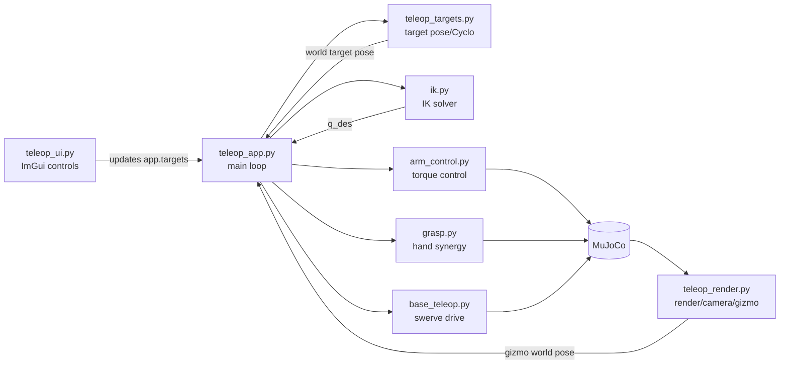

# 코드 가이드

`src/` 모듈별 역할과 주요 함수/클래스를 정리한다.

## 모듈 의존 구조

## 읽는 순서

| 순서 | 문서 | 내용 |
|---|---|---|
| 1 | [grasp.py](grasp.md) | 손가락 synergy와 grasp 판정 |
| 2 | [ik.py](ik.md) | site 기준 6DOF IK |
| 3 | [arm_control.py](arm_control.md) | 팔 토크 제어 |
| 4 | [base_teleop.py](base_teleop.md) | swerve drive |
| 5 | [teleop_targets.py](teleop_targets.md) | target pose와 Bimanual MoveL |
| 6 | [teleop_ui.py](teleop_ui.md) | ImGui control panel |
| 7 | [teleop_render.py](teleop_render.md) | 렌더링과 gizmo |
| 8 | [teleop_app.py](teleop_app.md) | 전체 조립과 main loop |

## 공통 규칙

- live simulation의 로봇 관절 `qpos`를 직접 덮어쓰지 않는다.
- UI/gizmo는 target 값을 바꾸고, 물리 반영은 `teleop_app.py`의 step에서 한다.
- IK는 scratch `MjData`에서만 계산하고, 결과는 actuator command로 적용한다.
- 렌더/UI/target/control 로직은 분리되어 있고 `TeleopApp`이 조립한다.
