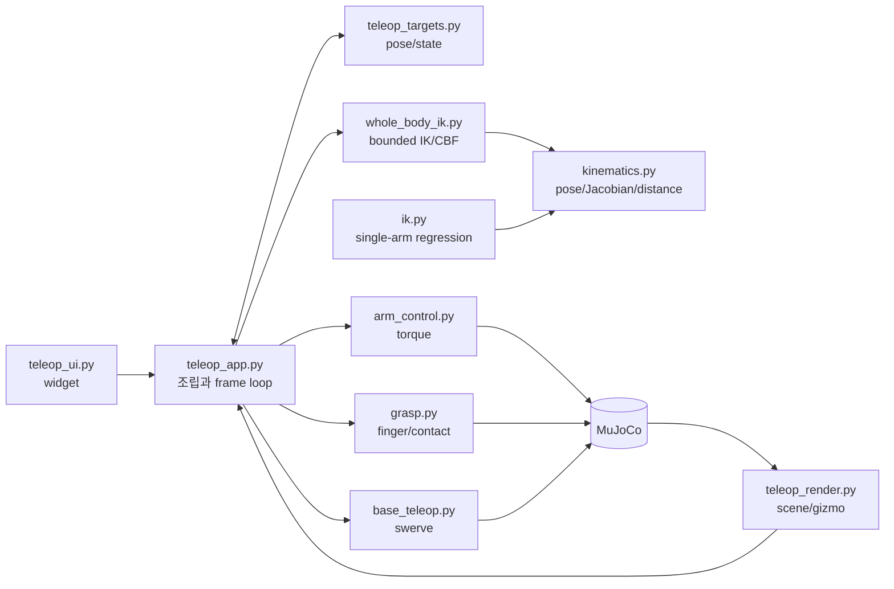

# 코드 가이드

이 섹션은 이미 앱을 한 번 실행하고 [핵심 개념](../concepts.md)을 이해한 뒤, 특정
함수나 모듈을 수정하려는 사람을 위한 레퍼런스다.

!!! note "사용법을 찾는 중이라면"
    버튼/키는 [조작과 UI](../run.md), 모드 조합은 [제어 모드 선택](../control-modes.md),
    증상 진단은 [문제 해결](../troubleshooting.md)이 더 빠르다.

## 목적별 읽기 경로

=== "Whole-body / Collision"

    1. [`kinematics.py`](whole_body_ik.md#weighted-differential-ik)의 pose/Jacobian 전제
    2. [`whole_body_ik.py`](whole_body_ik.md)
    3. [`teleop_targets.py`](teleop_targets.md)
    4. [`teleop_app.py`](teleop_app.md)의 `_step_physics()`
    5. [테스트와 검증](../testing.md)

=== "Mobile / Wheel"

    1. [`base_teleop.py`](base_teleop.md)
    2. [`teleop_app.py`](teleop_app.md)의 command arbitration
    3. [문제 해결의 키 해제 항목](../troubleshooting.md#wheel-keeps-rolling)
    4. `test_phase_5.py`, `test_whole_body.py`

=== "UI / Marker"

    1. [`teleop_ui.py`](teleop_ui.md)
    2. [`teleop_targets.py`](teleop_targets.md)
    3. [`teleop_render.py`](teleop_render.md)
    4. [`teleop_app.py`](teleop_app.md)
    5. `test_phase_6.py`

=== "Grasp / Arm"

    1. [`grasp.py`](grasp.md)
    2. [`ik.py`](ik.md)
    3. [`arm_control.py`](arm_control.md)
    4. `test_phase_1.py`~`test_phase_4.py`

## 모듈 의존 구조

## 파일별 질문

| 파일 | 이 파일이 답하는 질문 |
|---|---|
| `kinematics.py` | “현재 손 pose/Jacobian과 두 geom의 거리 gradient는 무엇인가?” |
| `whole_body_ik.py` | “허용된 DOF로 손 오차를 줄이면서 limit/collision을 지키는 속도는?” |
| `base_teleop.py` | “body twist를 가능한 steer angle과 wheel speed로 어떻게 바꾸나?” |
| `arm_control.py` | “목표 관절각을 따라갈 motor torque는?” |
| `grasp.py` | “grasp 값이 finger target으로 어떻게 펼쳐지고 실제로 잡혔나?” |
| `teleop_targets.py` | “UI 숫자와 world marker pose는 어떻게 왕복 변환되나?” |
| `teleop_ui.py` | “어떤 widget이 어떤 app 상태를 바꾸나?” |
| `teleop_render.py` | “scene, camera, gizmo, collision overlay를 어떻게 그리나?” |
| `teleop_app.py` | “이 계산을 어느 순서로 호출하고 어떤 명령을 최종 선택하나?” |

## 공통 불변식

- 초기화/reset 외에 live robot `data.qpos`를 직접 덮어쓰지 않는다.
- UI와 gizmo는 target/state만 바꾸고 physics command를 직접 만들지 않는다.
- pose quaternion은 정규화하고 rotational Jacobian/error frame을 일치시킨다.
- FK arm, Whole-body OFF DOF는 solver bound에서 정확히 고정한다.
- keyboard와 WBIK base command는 동일한 swerve path를 사용한다.
- finger-object와 wheel-floor 같은 의도 접촉은 collision CBF 대상에서 제외한다.
- target frame이나 mode를 바꾸면 world pose 불변성을 테스트한다.

## 보조 레퍼런스

- [MuJoCo 최소 개념 사전](00-basics.md)
- [개발 체크리스트](pitfalls.md)
- [API 치트시트](cheatsheet.md)
- [ROS2 개발자 심화 튜토리얼](ros2-guide.md)
