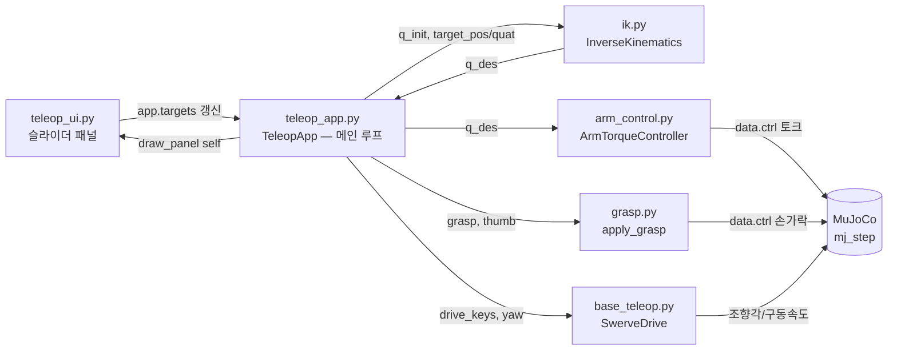

# MuJoCo 튜토리얼 — `src/` 코드가 실제로 하는 일과, 그 파일들이 합쳐지는 방식

ROBOTIS FFW-SH5 로봇이 **kinematic 치팅 없이, 오직 접촉력(contact force)만으로**
테이블 위 캔을 집어 드는 시뮬레이터의 `src/` 코드를 파일 단위로 뜯어본다. 각
페이지는 **그 파일이 무엇을 구현하는지 → 어떻게 구현했는지(실제 코드) → 다른
파일과 어떻게 연결되는지** 순서로 구성된다. 코드 스니펫은 전부 실제 레포
(`ffw-sh5-grasp`)에서 그대로 가져온 것이다.

이 프로젝트를 **왜** 이런 구조로 설계했는지(실패했던 이전 두 번의 시도, 설계 판단의
근거)가 궁금하다면 [프로젝트 개요](../overview.md)를 먼저 보는 것도 좋다. 이
튜토리얼은 그 반대편 — **어떻게(How)** 구현되고 **어떻게 합쳐지는가**에 집중한다.

## 파일이 합쳐지는 방식 (한눈에)

`teleop_app.py`가 유일하게 나머지 다섯 파일 전부를 import하는 "허브"다. 나머지
파일들은 서로를 알지 못한다 — `ik.py`는 `arm_control.py`가 존재하는지 모르고,
`grasp.py`는 `base_teleop.py`가 뭘 하는지 모른다. 전부 `teleop_app.py`의 물리
루프 안에서만 만난다. 자세한 호출 시점/순서는 [teleop_app.py](teleop_app.md)
페이지에 그대로 나온다.

## 읽는 순서

1. [MuJoCo 최소 개념 사전](00-basics.md) — model/data, actuator 세 가지, contact
   파라미터. 낯선 용어가 나올 때 참고.
2. [`src/grasp.py`](grasp.md) — grasp synergy 매핑 + 접촉력 기반 파지 판정
3. [`src/ik.py`](ik.md) — 6DOF damped least squares IK
4. [`src/arm_control.py`](arm_control.md) — PD + 중력/코리올리 feedforward 토크 제어
5. [`src/base_teleop.py`](base_teleop.md) — 조작감 스무딩 + 스워브 드라이브 기구학
6. [`src/teleop_app.py`](teleop_app.md) — 위 네 파일이 실제로 합쳐지는 메인 루프
7. [`src/teleop_ui.py`](teleop_ui.md) — ImGui 슬라이더 패널
8. [흔한 함정 총정리](pitfalls.md) — 이 프로젝트가 반복해서 배운 것들
9. [API 치트시트](cheatsheet.md) — 실제로 쓴 MuJoCo API/MJCF 요소 전부 + 더 읽어볼 곳

!!! tip "이 문서 전체에서 가장 자주 반복되는 진단 원칙"
    파라미터를 몇 배씩 바꿔도 결과가 거의 그대로면, 그 파라미터는 원인이 아니다.
    "게인을 더 올리면 되겠지" 식으로 큰 수를 넣어보는 습관은 시간을 크게 낭비시킨다 —
    이 프로젝트에서 최소 세 번, 그 신호를 무시하고 계속 파라미터를 밀어붙였다가
    나중에야 진짜 원인(좌표계 버그, keyframe 오타, 구조적 접촉 조건)을 찾은 사례가
    나온다.

!!! quote "절대 규칙 하나만 먼저 기억하자"
    이 프로젝트 전체에서 `data.qpos[...] = 값`으로 로봇의 물리 상태를 직접 덮어쓰는
    코드는 (리셋과 물체 초기 배치를 제외하고) 단 한 줄도 없다. "물리 엔진이 원하는
    결과를 안 주면, 상태를 억지로 만들지 말고 XML의 물리 파라미터(질량, 마찰,
    solver, actuator)를 고친다"는 태도로 이해하면 된다. 이게 바로 **kinematic
    시뮬레이션**(좌표를 직접 지정)과 **dynamic 시뮬레이션**(힘과 접촉으로 좌표가
    결과로 나옴)의 차이이고, 이 프로젝트가 정확히 후자를 지키려고 만들어졌다.
