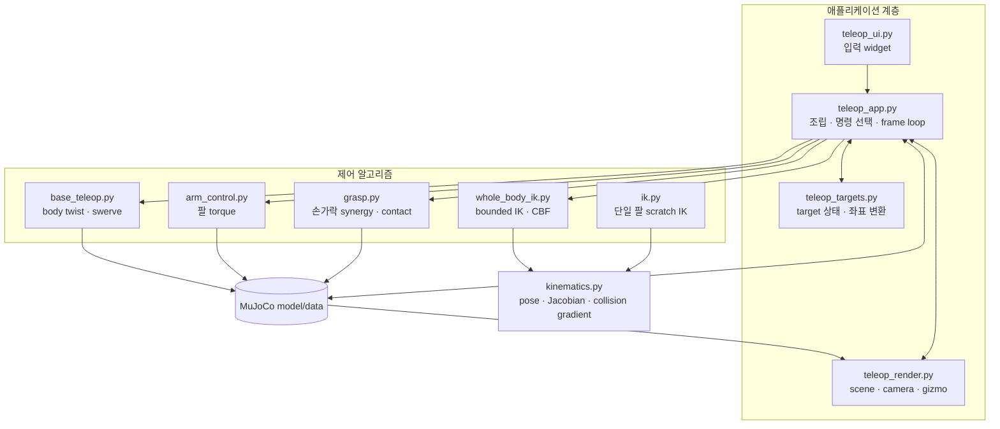

# 코드 읽기 시작

이 섹션은 기능을 사용하는 방법이 아니라, 코드를 안전하게 수정하기 위한 개발자
가이드다. 앱을 아직 실행하지 않았다면 [빠른 시작](../getting-started.md)을 먼저
따라 해보는 편이 이해가 빠르다.

## 권장 읽기 순서

처음 코드를 보는 경우 다음 네 단계면 전체 흐름을 잡을 수 있다.

1. [동작 원리](../concepts.md): target, command, physics, 좌표계 구분
2. [아키텍처와 데이터 흐름](../overview.md): 모듈 책임과 한 frame의 순서
3. 이 페이지의 계층 지도: 수정할 파일 선택
4. 해당 모듈 가이드와 [테스트와 검증](../testing.md): 구현과 회귀 범위 확인

!!! tip "사용법을 찾는 중이라면"
    키와 버튼은 [화면과 조작](../run.md), 모드 조합은
    [모드 선택](../control-modes.md), 증상 진단은
    [문제 해결](../troubleshooting.md)이 더 빠르다.

## 코드 계층

의존 방향의 핵심은 `teleop_app.py`가 조립을 담당하고, 계산 모듈은 UI나 renderer를
알지 않는다는 점이다. `kinematics.py`는 단일 팔 IK와 전신 IK가 함께 사용하는 가장
낮은 수학 계층이다.

## 수정 목적별 경로

| 수정 목적 | 먼저 볼 문서 | 함께 볼 문서 | 최소 회귀 |
|---|---|---|---|
| 손 pose/Jacobian | [기구학과 충돌 거리](kinematics.md) | [전신 IK](whole_body_ik.md) | Phase 3, Whole-body |
| 전신 IK·관절 한계·충돌 | [전신 IK와 충돌 회피](whole_body_ik.md) | [목표와 좌표 변환](teleop_targets.md) | Whole-body, Phase 6 |
| 바퀴·조향·수동 주행 | [모바일 스워브 제어](base_teleop.md) | [앱 조립](teleop_app.md) | Phase 5, Whole-body |
| 단일 팔 IK | [단일 팔 IK](ik.md) | [DLS와 위치 우선 IK 수학](ik-math.md), [기구학](kinematics.md) | Phase 3, 4 |
| 팔 torque | [팔 토크 제어](arm_control.md) | [앱 조립](teleop_app.md) | Phase 3, 4 |
| 손가락·파지 판정 | [손 파지와 접촉 판정](grasp.md) | [MuJoCo 기본 용어](00-basics.md) | Phase 1, 2 |
| target·marker·좌표계 | [목표와 좌표 변환](teleop_targets.md) | [동작 원리](../concepts.md) | Phase 6 |
| 패널·입력 | [UI 패널](teleop_ui.md) | [앱 조립](teleop_app.md) | Phase 6 |
| 카메라·gizmo·overlay | [렌더링과 Gizmo](teleop_render.md) | [목표와 좌표 변환](teleop_targets.md) | Phase 6 |

## 소스 파일 책임

| 파일 | 한 문장 책임 | 주요 쓰기 대상 |
|---|---|---|
| `teleop_app.py` | 모듈을 초기화하고 frame별 최종 명령을 선택 | app 상태, `data.ctrl`, physics step |
| `teleop_ui.py` | ImGui 입력을 target과 mode 상태로 변환 | app target/mode |
| `teleop_render.py` | scene, camera, gizmo, collision overlay 렌더링 | render state, gizmo target |
| `teleop_targets.py` | UI 값과 world pose를 왕복 변환 | target/marker state |
| `kinematics.py` | pose, Jacobian, signed-distance gradient 계산 | scratch `MjData`만 |
| `whole_body_ik.py` | 허용된 DOF의 안전한 differential command 계산 | 반환 command만 |
| `base_teleop.py` | body twist를 steer/drive command로 변환 | controller 내부 상태 |
| `arm_control.py` | 목표 관절각을 torque로 변환 | arm `data.ctrl` |
| `grasp.py` | synergy를 finger command로 바꾸고 contact force 판정 | finger `data.ctrl` |
| `ik.py` | 단일 팔 pose를 scratch state에서 풀이 | scratch `MjData`만 |
| `mj_util.py` | joint에서 actuator를 찾는 공용 MuJoCo helper | 없음 |

## 반드시 지킬 불변식

- 초기화와 자유물체 reset 외에는 live robot `data.qpos`를 직접 덮어쓰지 않는다.
  시작 시 `_disable_legacy_box_asset()`이 사용하지 않는 box를 비활성화하는 것은
  can-only workflow를 위한 명시적 초기화 예외다.
- UI와 gizmo는 target/state만 바꾸고 actuator command를 직접 만들지 않는다.
- quaternion을 정규화하고 orientation error와 rotational Jacobian의 frame을 맞춘다.
- FK arm과 Whole-body OFF DOF는 weight가 아니라 solver bound로 정확히 고정한다.
- keyboard와 WBIK base command는 같은 `SwerveDrive` 경로를 사용한다.
- wheel-floor, finger-object 같은 의도된 contact는 collision CBF에서 제외한다.
- 좌표계나 mode 전환은 target의 world pose를 보존해야 한다.

## 개발 전후 체크

1. [개발 체크리스트](pitfalls.md)에서 MuJoCo/NumPy 함정을 확인한다.
2. 변경 파일과 직접 연결된 최소 테스트를 먼저 실행한다.
3. 최종적으로 [테스트와 검증](../testing.md)의 전체 suite를 실행한다.
4. 문서를 바꿨다면 `mkdocs build --strict`도 실행한다.

짧은 함수 서명과 기본값은 [API 치트시트](cheatsheet.md), ROS2 구성과의 대응은
[ROS2 관점의 시스템 해설](ros2-guide.md)에서 찾을 수 있다.
