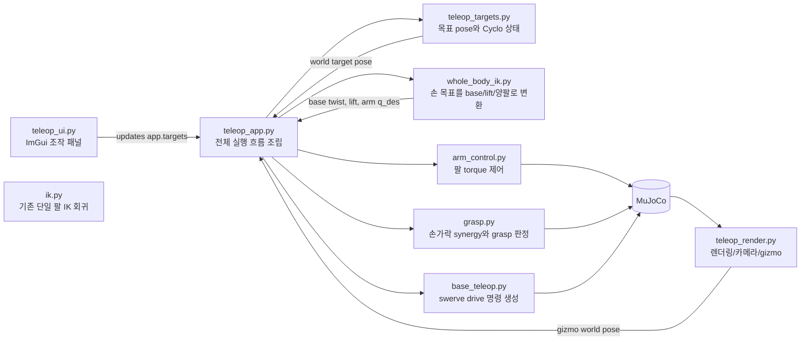

# 코드 가이드

`src/` 모듈별 역할과 주요 함수/클래스를 정리한다. 함수 표/Mermaid 흐름도 위주의
빠른 레퍼런스이며, 개념 설명이나 "왜 이렇게 만들었는지"는 다루지 않는다 — 그건
[ROS2 개발자를 위한 튜토리얼](ros2-guide.md)이 순서대로 설명한다.

## 모듈 의존 구조

## 읽는 순서

| 순서 | 문서 | 내용 | 파일이 분리된 이유 |
|---|---|---|---|
| 1 | grasp.py | 손가락 synergy와 grasp 판정 | 손 제어는 팔/베이스와 독립적으로 actuator target과 contact force만 다루기 때문 |
| 2 | kinematics.py | 정규화 pose, world-aligned FK/Jacobian, collision distance gradient | 단일 팔/whole-body IK의 좌표계와 collision geometry 규칙을 하나로 유지하기 위해 |
| 3 | ik.py | 기존 site 기준 단일 팔 6DOF IK | Phase 3/4 회귀와 단일 팔 solver를 독립 검증하기 위해 |
| 4 | whole_body_ik.py | base/lift/양팔 differential IK | 양손 task와 전신 제한을 한 최적화에서 풀기 위해 |
| 5 | arm_control.py | 팔 토크 제어 | IK 결과를 실제 torque command로 바꾸는 제어층이기 때문 |
| 6 | base_teleop.py | body twist와 swerve drive | 입력원과 wheel controller를 분리해 키보드/whole-body가 같은 경로를 쓰기 위해 |
| 7 | teleop_targets.py | world-fixed target pose와 Bimanual MoveL | UI/gizmo/IK 사이 좌표 변환과 Cyclo 상태가 한곳에 있어야 하기 때문 |
| 8 | teleop_ui.py | ImGui control panel | 화면 위젯과 상태 변경만 담당하고 physics/render와 분리하기 위해 |
| 9 | teleop_render.py | 렌더링과 gizmo | GLFW/MuJoCo render/ImGuizmo plumbing이 물리 제어와 독립적이기 때문 |
| 10 | teleop_app.py | 전체 조립과 main loop | 각 모듈을 순서대로 호출하는 composition root 역할만 남기기 위해 |

## 공통 규칙

- live simulation의 로봇 관절 `qpos`를 직접 덮어쓰지 않는다.
- UI/gizmo는 target 값을 바꾸고, 물리 반영은 `teleop_app.py`의 step에서 한다.
- whole-body IK는 live state의 Jacobian을 읽기만 하고, 결과는 actuator command로 적용한다.
- 렌더/UI/target/control 로직은 분리되어 있고 `TeleopApp`이 조립한다.
