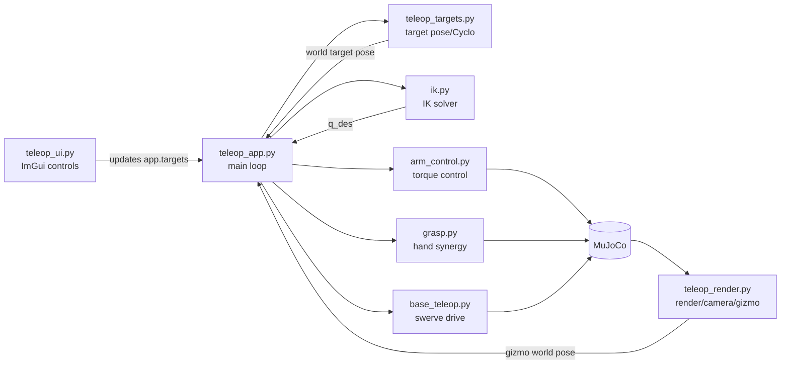

# 코드 가이드

`src/` 모듈별 역할과 주요 함수/클래스를 정리한다.

## 모듈 의존 구조

## 읽는 순서

| 순서 | 문서 | 내용 | 파일이 분리된 이유 |
|---|---|---|---|
| 1 | grasp.py | 손가락 synergy와 grasp 판정 | 손 제어는 팔/베이스와 독립적으로 actuator target과 contact force만 다루기 때문 |
| 2 | ik.py | site 기준 6DOF IK | live simulation을 건드리지 않는 scratch 기구학 계산이라 별도 테스트가 쉽기 때문 |
| 3 | arm_control.py | 팔 토크 제어 | IK 결과를 실제 torque command로 바꾸는 제어층이기 때문 |
| 4 | base_teleop.py | swerve drive | 베이스 입력 smoothing과 wheel command는 팔/손 target과 독립적이기 때문 |
| 5 | teleop_targets.py | target pose와 Bimanual MoveL | UI/gizmo/IK 사이 좌표 변환과 Cyclo 상태가 한곳에 있어야 조작감 수정이 쉽기 때문 |
| 6 | teleop_ui.py | ImGui control panel | 화면 위젯과 상태 변경만 담당하고 physics/render와 분리하기 위해 |
| 7 | teleop_render.py | 렌더링과 gizmo | GLFW/MuJoCo render/ImGuizmo plumbing이 물리 제어와 독립적이기 때문 |
| 8 | teleop_app.py | 전체 조립과 main loop | 각 모듈을 순서대로 호출하는 composition root 역할만 남기기 위해 |

## 공통 규칙

- live simulation의 로봇 관절 `qpos`를 직접 덮어쓰지 않는다.
- UI/gizmo는 target 값을 바꾸고, 물리 반영은 `teleop_app.py`의 step에서 한다.
- IK는 scratch `MjData`에서만 계산하고, 결과는 actuator command로 적용한다.
- 렌더/UI/target/control 로직은 분리되어 있고 `TeleopApp`이 조립한다.
