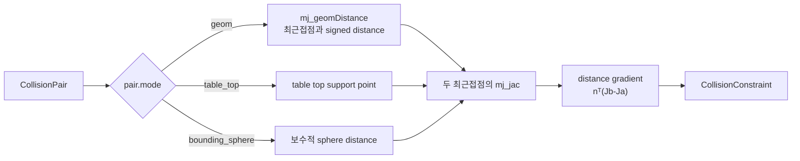
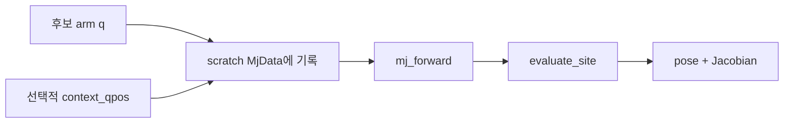

# `src/kinematics.py`: 기구학과 충돌 거리

단일 팔 IK와 전신 IK가 함께 사용하는 공용 계산 계층이다. MuJoCo 상태에서 site의
world pose와 Jacobian을 읽고, 충돌 geometry 사이의 signed distance와 그 변화율을
계산한다.

## 언제 이 파일을 보는가

- 손 pose 또는 Jacobian 값이 예상과 다를 때
- quaternion 부호 때문에 orientation error가 튈 때
- collision 선이나 CBF gradient가 실제 geometry와 맞지 않을 때
- live simulation을 바꾸지 않는 FK 계산이 필요할 때

앱의 명령 선택이나 solver weight는 이 파일의 책임이 아니다. 전신 task 조립과 bound는
[`whole_body_ik.py`](whole_body_ik.md), UI 좌표계는
[`teleop_targets.py`](teleop_targets.md)가 담당한다.

## 공개 데이터 구조

| 타입 | 내용 |
|---|---|
| `SiteKinematics` | world position, 정규화 quaternion, 6×N geometric Jacobian |
| `CollisionPair` | 감시할 두 geometry id, 표시 이름, 거리 계산 mode |
| `CollisionConstraint` | signed distance, controlled-DOF gradient, 두 최근접점 |

## Site pose와 Jacobian

`evaluate_site(model, data, site_id, dof_ids=None)`는 이미 `mj_forward()`가 반영된
상태에서 다음 값을 한 번에 반환한다.

```text
position    shape (3,)   world position
quaternion  shape (4,)   MuJoCo 순서 (w, x, y, z)
jacobian    shape (6,N)  [translation; rotation], world-aligned
```

`dof_ids`를 주면 solver가 제어하는 열만 선택한다. 주지 않으면 `model.nv` 전체 열을
반환한다. `qpos` 주소와 Jacobian의 DOF 열 주소는 일반적으로 같은 개념이 아니므로,
호출자는 `model.jnt_qposadr`와 `model.jnt_dofadr`를 구분해야 한다.

## Quaternion 처리

`normalize_quaternion()`은 입력을 단위 quaternion으로 만들고 스칼라 성분이 음수면
전체 부호를 뒤집는다. 유효하지 않거나 norm이 거의 0인 입력은 identity quaternion으로
대체한다.

`shortest_orientation_error(target, current)`는 다음 순서로 world-frame 최단 회전
벡터를 만든다.

1. 두 quaternion을 정규화한다.
2. 내적이 음수면 target 부호를 뒤집어 같은 회전의 가까운 표현을 선택한다.
3. `target × inverse(current)`의 상대 회전을 구한다.
4. axis-angle의 3차원 회전 벡터로 변환한다.

이 world-frame 오차는 `mj_jacSite()`의 rotational Jacobian과 같은 frame이므로 바로
IK task에 사용할 수 있다.

## Collision distance 계산 흐름



일반 geometry 쌍은 `mj_geomDistance()`의 최근접점을 사용한다. 두 점을 잇는 단위
법선 \(n\)과 각 점의 translational Jacobian으로 다음 gradient를 계산한다.

\[
\nabla d = n^T(J_B-J_A)
\]

이 값은 “제어 속도 `qdot`이 현재 거리를 얼마나 빠르게 바꾸는가”를 뜻한다.
`whole_body_ik.py`는 이를 collision CBF의 한 행으로 사용한다.

### 특수 거리 mode

| mode | 사용하는 경우 | 이유 |
|---|---|---|
| `geom` | 대부분의 mesh/primitive 쌍 | 실제 MuJoCo 최근접점 사용 |
| `table_top` | palm box와 table top | 일부 convex query의 불연속적인 0 거리 회피 |
| `bounding_sphere` | palm과 palm | feature 전환에 민감하지 않은 보수적 거리 |

특수 mode는 모든 geometry를 근사하는 일반 대체물이 아니다. 불연속이 확인된 제한된
쌍에만 사용한다.

## 기본 collision pair 구성

`default_collision_pairs(model)`는 먼저 collision-enabled geometry를 body별로 한 번
인덱싱한 뒤 다음 pair를 만든다.

- 양팔 사이의 link/palm 조합(고정된 shoulder link 제외)
- 같은 팔에서 충분히 떨어진 비인접 link 조합
- 팔과 base/lift/상체/head 조합
- 팔·palm과 table 조합

wheel-floor, finger-object, can 접촉은 의도된 물리 상호작용이므로 제외한다. pair의
선택 범위를 바꿀 때는 성능뿐 아니라 “원래 허용해야 하는 접촉을 막지 않는가”를 함께
검토해야 한다.

## Scratch 기구학

`KinematicsSolver`는 전용 `mujoco.MjData`를 소유한다.



`context_qpos`는 lift처럼 solver가 직접 풀지 않지만 arm chain의 pose에 영향을 주는
관절을 실제 상태와 맞추기 위해 사용한다. shape가 다르면 즉시 `ValueError`를 내며,
제어 관절은 model range 안으로 clamp한다. 이 scratch 경계 덕분에 반복 IK가 live
simulation의 robot state를 덮어쓰지 않는다.

## 호출 관계

| 호출자 | 사용하는 기능 |
|---|---|
| `ik.py` | `KinematicsSolver`, shortest orientation error |
| `whole_body_ik.py` | site pose/Jacobian, collision pair와 distance gradient |
| `teleop_render.py` | solver가 반환한 collision 진단을 화면에 표시 |
| `test_whole_body.py` | gradient 유한차분, pair scope, read-only 성질 검증 |

## 변경 후 검증

```bash
python tests/test_phase_3.py
python tests/test_whole_body.py
```

특히 collision 계산을 바꿨다면 distance 값만 보지 말고 중앙 유한차분과 analytic
gradient가 일치하는지, 멀리 있는 pair에서 기존 command가 변하지 않는지도 확인한다.
