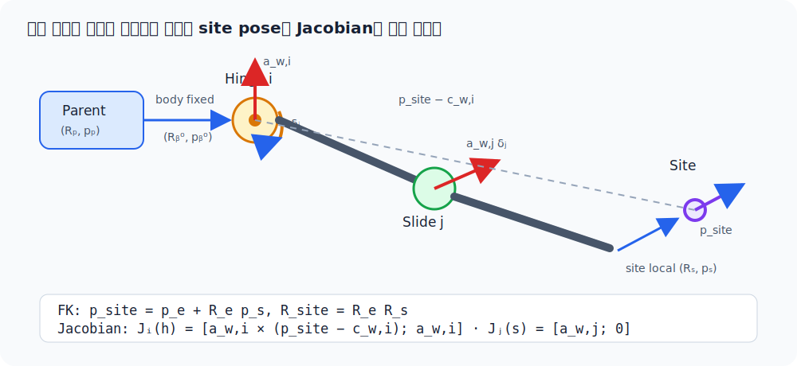
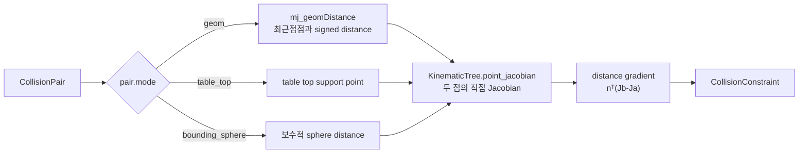
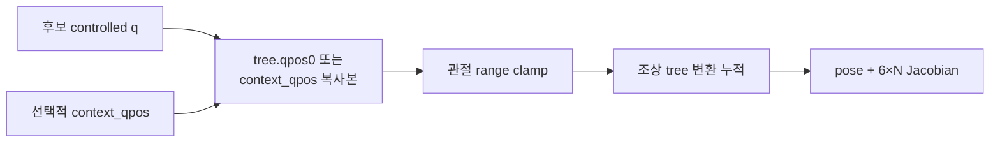

# `src/kinematics.py`: 기구학과 충돌 거리

단일 팔 IK와 전신 IK가 함께 사용하는 공용 계산 계층이다. 컴파일된 MJCF에서
body–joint–site 트리를 만들고, 이 트리에서 site의 world pose와 Jacobian을 직접
계산한다. 충돌 geometry의 signed distance와 변화율만 현재 MuJoCo 물리 상태를
사용한다.

이 계산이 실시간 전신 IK와 legacy 단일 팔 DLS에서 어떻게 사용되는지는
[Part 6 — 전신 IK와 단일 팔 DLS IK](ros2/06-inverse-kinematics.md)에서 연결해 설명한다.

## 언제 이 파일을 보는가

- 손 pose 또는 Jacobian 값이 예상과 다를 때
- quaternion 부호 때문에 orientation error가 튈 때
- collision 선이나 CBF gradient가 실제 geometry와 맞지 않을 때
- live simulation을 바꾸지 않는 FK 계산이 필요할 때

앱의 명령 선택이나 solver weight는 이 파일의 책임이 아니다. 전신 task 조립과 bound는
[`whole_body_ik.py`](whole_body_ik.md), UI 좌표계는
[`teleop_targets.py`](teleop_targets.md)가 담당한다.

## 공개 데이터 구조

| 타입 | 내용 |
|---|---|
| `KinematicBody` | 부모 body id, 고정 position/quaternion, 소속 joint id |
| `KinematicJoint` | body id, 종류 이름, 축·원점, qpos/dof 주소, range |
| `KinematicSite` | 소속 body id와 body-local position/quaternion |
| `KinematicTree` | 컴파일된 MJCF에서 복사한 불변 body–joint–site 트리 |
| `SiteKinematics` | world position, 정규화 quaternion, 6×N geometric Jacobian |
| `CollisionPair` | 감시할 두 geometry id, 표시 이름, 거리 계산 mode |
| `CollisionConstraint` | signed distance, controlled-DOF gradient, 두 최근접점 |

## 하나의 Site 계산 경로

`KinematicsSolver.forward(q, context_qpos=None)`가 IK와 Whole-Body IK의 실제 계산
경로이자 유일한 site 기구학 경로다. `MjData`나 MuJoCo의 forward/Jacobian solver를
호출하지 않고, 파싱한 트리를 직접 순회해 다음 값을 반환한다.

앱의 초기 home 기준 pose, FK→IK 모드 전환, rigid-grasp 캡처, 전신 IK 반복도 모두
`WholeBodyIK.site_state()`를 통해 이 경로를 사용한다. 런타임 제어 코드가
`data.site_xpos`나 `data.site_xmat`을 우회해서 읽지 않도록 회귀 테스트가 AST로
검사한다. 앱 초기화와 캔 reset에서도 `mj_forward()`를 호출하지 않는다. MuJoCo의
파생 동역학·접촉 상태는 정상적인 다음 `mj_step()`에서 갱신된다.

```text
position    shape (3,)   world position
quaternion  shape (4,)   MuJoCo 순서 (w, x, y, z)
jacobian    shape (6,N)  [translation; rotation], world-aligned
```

`KinematicsSolver`는 생성 시 받은 `joint_names` 순서로 Jacobian 열을 만든다. 목표
site의 조상 경로에 없는 관절은 그
site를 움직일 수 없으므로 해당 열은 정확히 0이다. `qpos` 주소와 Jacobian의 DOF
열 주소는 일반적으로 다른 개념이므로 트리에 둘 다 보관한다.

## MJCF를 트리로 만드는 과정

`KinematicsSolver.from_mjcf(path, site_name, joint_names)`는 다음 순서로 동작한다.


XML을 임의로 다시 해석하지 않고 MuJoCo 컴파일 결과를 입력으로 쓰는 이유는
`include`, `default`, 각도 단위 같은 MJCF 규칙을 그대로 존중하기 위해서다. 하지만
컴파일 뒤의 FK·Jacobian·IK 반복에는 MuJoCo runtime state가 개입하지 않는다. 앱은
이미 만든 `MjModel`에서 `KinematicTree(model)`을 한 번 생성해 양손 solver가 공유한다.

현재 자체 FK가 지원하는 가동 관절은 이 로봇 경로에 실제로 있는 scalar `hinge`와
`slide`다. 목표 site의 조상 경로에 `ball` 또는 `free` joint가 있으면 조용히 틀린
값을 만들지 않고 `NotImplementedError`를 낸다.

트리는 계산뿐 아니라 GUI 탐색에도 같은 구조를 제공한다. `children_by_body`는 body의
자식 body id, `sites_by_body`는 body에 붙은 site id, `site_paths`는 world에서 각
site body까지의 경로다. [`teleop_ui.py`](teleop_ui.md)의 **Kinematic Tree** 창은 이
세 인덱스를 그대로 읽으므로 화면의 계층과 solver가 계산하는 계층이 달라지지 않는다.

## FK 변환을 생략 없이 전개

부모 body의 world pose를 \((R_p,p_p)\), MJCF에 저장된 고정 body 변환을
부모 좌표계 기준 \((R_b^0,p_b^0)\)라고 하자. 먼저 관절이 움직이기 전 body pose는

\[
p_b=p_p+R_p p_b^0
\]

\[
R_b=R_pR_b^0
\]

로 계산한다. joint의 body-local 축을 \(a\), body-local 회전 중심을 \(r\), 현재
관절값을 \(q\), MJCF 기준값을 \(q_0\)라 두면 실제 변위는

\[
\delta=q-q_0
\]

이다. 이때 world 축과 world 회전 중심은 각각

\[
a_w=R_ba
\]

\[
c_w=p_b+R_br
\]

이다.

### Slide joint

slide는 회전 없이 world 축 방향으로 이동하므로

\[
p_b' = p_b+a_w\delta
\]

\[
R_b'=R_b
\]

이다.

### Hinge joint

축 \(a\), 각도 \(\delta\)의 Rodrigues 회전행렬을 \(R_a(\delta)\)라 하면

\[
R_a(\delta)
=I\cos\delta
+(1-\cos\delta)aa^T
+[a]_\times\sin\delta
\]

이다. body 회전은

\[
R_b'=R_bR_a(\delta)
\]

가 된다. 회전 중심 \(c_w\)가 움직이지 않아야 하므로
\(c_w=p_b'+R_b'r\)이고, 이를 \(p_b'\)에 대해 한 단계씩 풀면

\[
c_w=p_b'+R_b'r
\]

\[
c_w-R_b'r=p_b'
\]

\[
p_b'=c_w-R_b'r
\]

이다. 구현의 `position = anchor_world - rotation @ joint.position`이 바로 마지막
식이다.

모든 조상 body와 joint를 위 순서로 누적한 결과를 \((R_e,p_e)\), site의 body-local
고정 변환을 \((R_s,p_s)\)라 하면 최종 site pose는

\[
p_{site}=p_e+R_ep_s
\]

\[
R_{site}=R_eR_s
\]

이다.

<figure markdown>
  
  <figcaption>고정 body 변환 뒤에 joint 변환을 적용하고, 마지막에 site의 local 변환을 합성한다.</figcaption>
</figure>

## 기하 Jacobian을 트리에서 직접 만드는 과정 {: #direct-geometric-jacobian }

FK 중 각 관절의 \(a_w\)와 \(c_w\)를 저장했다. 작은 joint 속도와 site twist의 관계는

\[
\begin{bmatrix}v_{site}\\\omega_{site}\end{bmatrix}
=J(q)\dot q
\]

이다. slide joint \(i\)는 축 방향 병진만 만들므로 그 열은

\[
J_i^{slide}
=\begin{bmatrix}a_{w,i}\\0\end{bmatrix}
\]

이다. hinge joint \(i\)는 각속도 \(a_{w,i}\dot q_i\)를 만들고, 회전 중심에서
site까지의 벡터가 \(p_{site}-c_{w,i}\)이므로 선속도는 외적으로

\[
v_i
=\omega_i\times(p_{site}-c_{w,i})
=a_{w,i}\times(p_{site}-c_{w,i})\dot q_i
\]

가 된다. 따라서 Jacobian 열은

\[
J_i^{hinge}
=\begin{bmatrix}
a_{w,i}\times(p_{site}-c_{w,i})\\
a_{w,i}
\end{bmatrix}
\]

이다. 이 열들을 `joint_names` 순서로 옆에 붙이면 6×N geometric Jacobian이 된다.

## Quaternion 처리

`normalize_quaternion()`은 입력을 단위 quaternion으로 만들고 스칼라 성분이 음수면
전체 부호를 뒤집는다. 유효하지 않거나 norm이 거의 0인 입력은 identity quaternion으로
대체한다.

`shortest_orientation_error(target, current)`는 다음 순서로 world-frame 최단 회전
벡터를 만든다.

1. 두 quaternion을 정규화한다.
2. 내적이 음수면 target 부호를 뒤집어 같은 회전의 가까운 표현을 선택한다.
3. `target × inverse(current)`의 상대 회전을 구한다.
4. axis-angle의 3차원 회전 벡터로 변환한다.

자체 기하 Jacobian의 회전 열도 world 축으로 구성되므로, 이 world-frame 오차를 별도
좌표 변환 없이 IK task에 사용할 수 있다.

## Collision distance 계산 흐름



일반 geometry 쌍은 `mj_geomDistance()`의 최근접점을 사용한다. 두 점을 잇는 단위
법선 \(n\)과 각 점의 translational Jacobian으로 다음 gradient를 계산한다.

\[
\nabla d = n^T(J_B-J_A)
\]

여기서 MuJoCo가 제공하는 것은 거리 \(d\)와 두 최근접점 \(p_A,p_B\)뿐이다.
`KinematicTree.point_jacobian()`은 각 점이 붙은 body의 조상 관절을 다시 순회한다.
점 \(p\)에 대한 열도 site와 같은 방식으로 직접 만든다.

\[
J_{p,i}^{slide}=a_{w,i}
\]

\[
J_{p,i}^{hinge}=a_{w,i}\times(p-c_{w,i})
\]

따라서 collision gradient에도 MuJoCo Jacobian solver가 개입하지 않는다.

<figure markdown>
  
  <figcaption>두 최근접점의 상대 속도 중 법선 방향 성분만 distance 변화에 기여한다.</figcaption>
</figure>

이 값은 “제어 속도 `qdot`이 현재 거리를 얼마나 빠르게 바꾸는가”를 뜻한다.
그림의 \(\dot d>0\)은 분리, \(\dot d<0\)은 접근을 의미한다. `whole_body_ik.py`는
이 gradient를 collision CBF의 한 행으로 사용한다.

### 특수 거리 mode

| mode | 사용하는 경우 | 이유 |
|---|---|---|
| `geom` | 대부분의 mesh/primitive 쌍 | 실제 MuJoCo 최근접점 사용 |
| `table_top` | palm box와 table top | 일부 convex query의 불연속적인 0 거리 회피 |
| `bounding_sphere` | palm과 palm | feature 전환에 민감하지 않은 보수적 거리 |

특수 mode는 모든 geometry를 근사하는 일반 대체물이 아니다. 불연속이 확인된 제한된
쌍에만 사용한다.

## 기본 collision pair 구성

`default_collision_pairs(model)`는 먼저 collision-enabled geometry를 body별로 한 번
인덱싱한 뒤 다음 pair를 만든다.

- 양팔 사이의 link/palm 조합(고정된 shoulder link 제외)
- 같은 팔에서 충분히 떨어진 비인접 link 조합
- 팔과 base/lift/상체/head 조합
- 팔·palm과 table 조합

wheel-floor, finger-object, can 접촉은 의도된 물리 상호작용이므로 제외한다. pair의
선택 범위를 바꿀 때는 성능뿐 아니라 “원래 허용해야 하는 접촉을 막지 않는가”를 함께
검토해야 한다.

## 상태를 바꾸지 않는 기구학



`context_qpos`는 lift처럼 해당 solver가 직접 풀지 않지만 site chain에 영향을 주는
관절을 실제 상태와 맞추는 입력이다. solver는 이 배열도 먼저 복사하므로 호출자의
live `data.qpos`를 바꾸지 않는다. shape가 다르면 즉시 `ValueError`를 내며 제어
관절은 range 안으로 clamp한다.

## 호출 관계

| 호출자 | 사용하는 기능 |
|---|---|
| `ik.py` | 기존 `InverseKinematics` 이름을 `KinematicsSolver`에 연결 |
| `whole_body_ik.py` | 공유 `KinematicTree`의 양손 pose/Jacobian, collision distance gradient |
| `teleop_targets.py` | `site_state()` 결과로 home position/quaternion 기준 설정 |
| `teleop_app.py` | FK→IK 전환 시 `site_state()`로 현재 손 pose를 target에 복사 |
| `teleop_render.py` | solver가 반환한 collision 진단을 화면에 표시 |
| `teleop_ui.py` | body–joint–site 구조와 현재 joint 값을 Kinematic Tree 창에 표시 |
| `test_whole_body.py` | gradient 유한차분, pair scope, read-only 성질 검증 |

## 변경 후 검증

```bash
python tests/test_phase_3.py
python tests/test_whole_body.py
```

특히 collision 계산을 바꿨다면 distance 값만 보지 말고 중앙 유한차분과 analytic
gradient가 일치하는지, 멀리 있는 pair에서 기존 command가 변하지 않는지도 확인한다.
