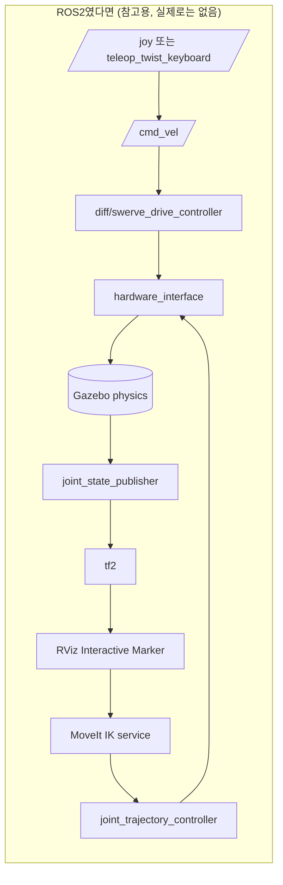
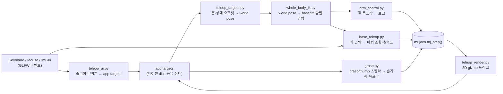
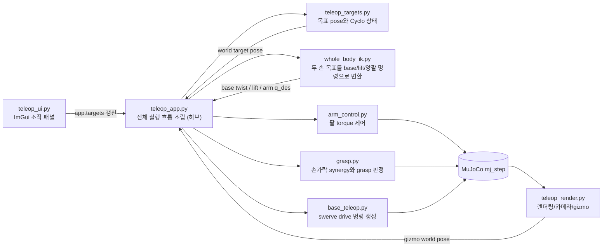
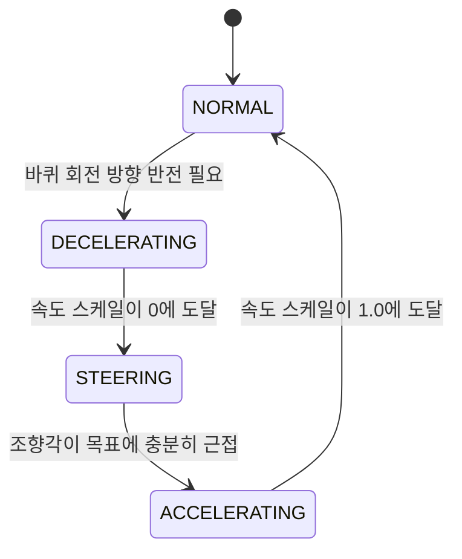
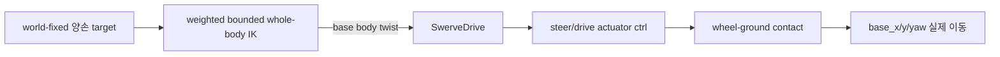
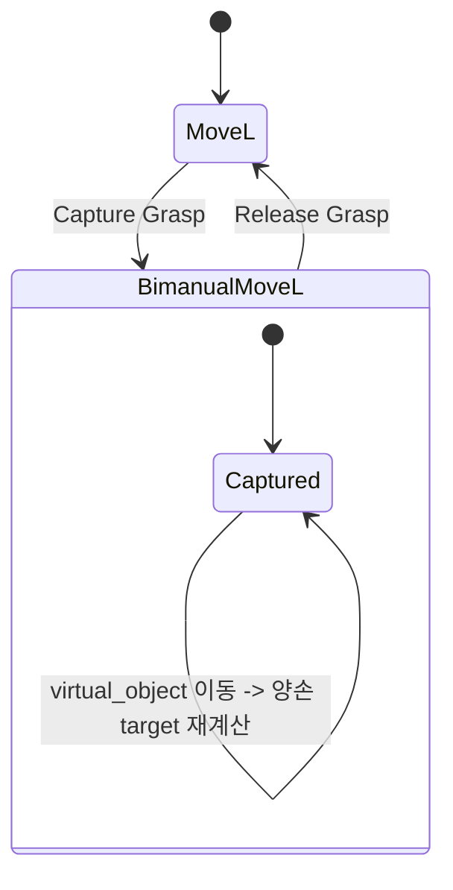
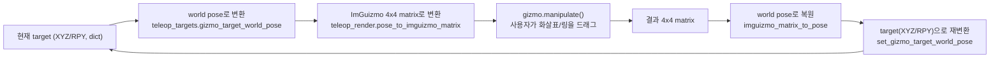
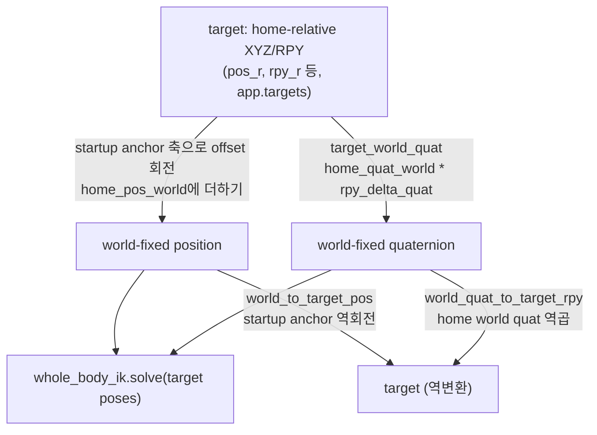

# ROS2 개발자를 위한 심화 튜토리얼

이 문서는 ROS2/Gazebo 경험을 MuJoCo 기반 단일 프로세스 제어 구조에 대응시키고,
수학·코드·개발 과정·실제 버그를 깊게 설명한다. **실행을 위해 처음부터 끝까지 읽을
필요는 없다.** 처음 사용자에게는 다음 짧은 경로가 더 적합하다.

- 실행: [10분 빠른 시작](../getting-started.md)
- 모드 조합: [모드 선택](../control-modes.md)
- 전체 mental model: [동작 원리](../concepts.md)
- 증상 진단: [문제 해결](../troubleshooting.md)

이 문서는 “왜 이런 알고리즘과 구조인가?”를 이해하거나 ROS2 시스템과 설계를 비교할
때 사용한다.

## 이 문서의 사용법

1. Part 1~2는 **개념**이다 — ROS2/Gazebo에서 이미 알고 있는 것과 이 프로젝트가
   쓰는 것을 1:1로 매칭한다. MuJoCo를 한 번도 안 써봤어도 여기까지 읽으면
   "이게 대충 뭐 하는 물건인지" 감이 잡힌다.
2. Part 3~4는 **이 프로젝트 자체**다 — 무엇을 목표로 하는지, 왜 이런 규칙을
   세웠는지, 전체 코드가 한 프레임 동안 정확히 어떤 순서로 실행되는지.
3. Part 5~9는 **모듈별 딥다이브**다 — `src/` 밑의 파일 하나하나를, 수식과
   실제 코드를 인용하면서 설명한다. 순서는 저장소가 실제로 커진 순서(Phase
   순서)와도 같다. 필요한 선형대수(벡터/행렬/야코비안/null space)와 쿼터니언,
   외적도 각각 처음 필요해지는 지점(Part 6.2, 6.5, 8.3)에서 그 자리에 설명한다.
4. Part 10~12는 **실전**이다 — 좌표계 정리, 테스트 철학, 실행 방법.
5. Part 13은 **버그 사례집**이다 — 이 프로젝트가 실제로 겪은 버그들을, 일반적인
   교훈으로 뽑아서 정리한다. MuJoCo/물리 시뮬레이션을 다루는 사람이라면 프로젝트와
   무관하게 읽을 가치가 있다.
6. Part 14 맨 끝에 **ROS2 ↔ 이 프로젝트 용어 대조표**가 있다. 읽다가 막히면
   거기로 점프해도 된다.

### 목적별 바로가기

| 궁금한 것 | 바로 갈 곳 |
|---|---|
| ROS2 구성요소와 파일 대응 | [Part 1](#part-1) |
| MuJoCo model/data/actuator/contact | [Part 2](#part-2) |
| 한 frame의 실제 실행 순서 | [Part 4](#part-4) |
| 단일 팔 IK 수학 | [Part 6](#part-6) |
| 팔 torque controller | [Part 7](#part-7) |
| swerve와 키 해제 제동 | [Part 8](#part-8) |
| MoveL/Bimanual/marker | [Part 9](#part-9) |
| target 좌표계 | [Part 10](#part-10) |
| 테스트 근거 | [Part 11](#part-11) |
| 실제 버그 사례 | [Part 13](#part-13) |

이 문서의 모든 Part/절은 화면 오른쪽(또는 모바일에서는 상단) **목차** 패널에
그대로 나열된다 — 특정 절로 바로 건너뛰고 싶으면 본문을 스크롤하는 대신
그 패널을 쓰면 된다. (다른 문서에서 이 문서의 특정 절로 link를 걸 때도 그
목차 패널이 가리키는 것과 같은 앵커, 예: `#part-7-2`를 그대로 쓴다.)

---

## TL;DR — 30초 요약

이 프로젝트는 ROS2 노드가 아니다. **`python3 src/teleop_app.py` 하나를 실행하면
끝나는 단일 프로세스, 단일 스레드 프로그램**이다. 그 안에서 MuJoCo라는 물리
엔진이 로봇(ROBOTIS FFW-SH5, 양팔+양손+모바일 베이스)을 시뮬레이션하고, 화면에는
3D 뷰와 ImGui 슬라이더 패널이 같이 뜬다. 사람이 슬라이더/버튼/3D 기즈모/키보드로
목표값을 입력하면, 매 프레임(25Hz) 다음이 순서대로 일어난다:

```
입력(마우스/키보드/ImGui) → 목표 pose 갱신(teleop_targets.py)
  → whole-body/arm-only IK(whole_body_ik.py, base/lift/양팔 command 계산)
  → 팔 토크 제어(arm_control.py) + 손가락 synergy(grasp.py) + 바퀴 명령(base_teleop.py)
  → data.ctrl에 기록 → MuJoCo 물리 스텝(mj_step) 실행 → 화면 렌더
```

로봇이 캔을 "쥔다"는 것은 좌표를 코드로 붙이는 게(kinematic attach) **절대**
아니고, 손가락 액추에이터가 실제로 캔 표면에 접촉력을 만들어서 마찰로 붙잡는
것이다 — 이게 이 프로젝트 세 번째 시도의 존재 이유다(아래 Part 3 참고).

---

## Part 1 — 개념 지도: ROS2 세계관에서 이 프로젝트로 {: #part-1 }

### 1.1 큰 그림 비교표 {: #part-1-1 }

ROS2로 로봇을 다뤄본 사람이 이 저장소를 열었을 때 가장 먼저 느낄 위화감은
"어라, `ros2 node list`가 없네, 토픽도 없네, launch 파일도 없네"일 것이다.
맞다. 없다. 이 프로젝트는 로보틱스 미들웨어(ROS2/DDS)를 전혀 쓰지 않고,
MuJoCo Python 바인딩 위에 순수 Python으로 물리 루프 + GUI를 얹은
**모놀리식 시뮬레이터**다. 아래 표로 개념을 먼저 맞춰두자.

| ROS2/로보틱스 스택 개념 | 이 프로젝트에서의 대응 | 비고 |
|---|---|---|
| ROS2 노드(node) | 없음 — `TeleopApp` 클래스 인스턴스 하나 | 프로세스가 하나뿐이라 노드 경계 자체가 없다 |
| 토픽 publish/subscribe | 없음 — 파이썬 함수 호출과 공유 dict(`app.targets`) | 전부 같은 프로세스, 같은 스레드라 직렬화/네트워크가 필요 없다 |
| 서비스(service) 호출 | 없음 — 그냥 함수 호출 | 예: `capture_grasp()`는 서비스가 아니라 메서드 |
| 액션(action, ex. `GripperCommand`) | `grasp.apply_grasp()` (스칼라 즉시 반영) | goal/feedback/result 개념 없음, 매 스텝 값만 밀어넣음 |
| URDF/xacro | MJCF(`models/full_scene.xml`) | 아래 2.1에서 상세 비교 |
| `robot_state_publisher` + tf2 | 없음 — MuJoCo가 `data.site_xpos`/`xmat`를 직접 계산해줌 | tf 트리 자체가 없다, 아래 Part 11 참고 |
| `joint_state_publisher` / `/joint_states` 토픽 | `data.qpos` 배열 직접 읽기 | 퍼블리시 안 하고 그냥 메모리에서 읽는다 |
| `ros2_control` (hardware_interface, controller_manager) | `arm_control.ArmTorqueController`, `grasp.apply_grasp`, `base_teleop.SwerveDrive` | 컨트롤러 플러그인 로딩 없이 그냥 파이썬 클래스 3개 |
| `ros2_control` command interface (position/velocity/effort) | MuJoCo actuator 타입 3종(`<position>`/`<velocity>`/`<motor>`) | 아래 2.5 |
| MoveIt (IK 서비스, 모션 플래닝, 충돌 회피 경로) | `src/whole_body_ik.py`의 `WholeBodyIK` | base/lift/양팔 differential IK와 reactive collision CBF가 있고, ROS·전역 경로 플래너는 없다 |
| RViz Interactive Marker (3D 드래그 핸들) | `teleop_render.py`의 ImGuizmo + MuJoCo mocap body | 아래 Part 10 |
| `rqt`/dynamic reconfigure 슬라이더 패널 | `teleop_ui.py`의 ImGui 패널 | 그림도 물리도 같은 창 안에서 그려진다 |
| Gazebo/Ignition (물리 시뮬레이터) | MuJoCo | 둘 다 "물리 엔진"이지만 세부 개념이 다르다 (아래 Part 2) |
| `nav2`(cmd_vel, twist_mux, diff_drive_controller) | `base_teleop.SwerveDrive` | ROS2 없이 직접 구현한 스워브 역기구학 |
| launch 파일(`.launch.py`) | 없음 — `python3 src/teleop_app.py` 한 줄 | 노드가 하나뿐이니 launch로 여러 프로세스를 묶을 필요가 없다 |
| 파라미터 서버(`ros2 param`) | 파이썬 모듈 최상단 상수(`grasp.py`의 `FINGER_OPEN_FRAC` 등) | 런타임 재설정 불가, 코드/XML 값을 고쳐야 함 |
| `colcon test` / `launch_testing` | `tests/test_phase_{0..6}.py`, `tests/test_whole_body.py` | headless, 순차 실행; 아래 Part 12 |
| DDS QoS, 콜백 그룹, executor, spin | 없음 — `while` 루프 하나 | "멀티스레드로 인한 레이스 컨디션"이라는 문제 자체가 없다 |

### 1.2 왜 ROS2가 없는가 {: #part-1-2 }

이 프로젝트는 실물 로봇을 조작하는 프로덕션 스택이 아니라, **"contact force만으로
캔을 쥘 수 있는가"**라는 물리 시뮬레이션 질문 하나에 집중하려고 만든 연구용/학습용
시뮬레이터다(Part 3 참고). ROS2를 쓰면 얻는 이점(멀티 프로세스 분산, 실제 하드웨어
드라이버 재사용, 표준화된 메시지)이 이 목표에는 오히려 군더더기다 — 노드 간
통신 지연, DDS 설정, launch 파일 관리 같은 인프라 문제를 디버깅하느라 정작
물리 튜닝에 쓸 시간을 뺏기고 싶지 않았다는 뜻이다. 그래서 **하나의 while 루프
안에서 입력→계산→물리 스텝→렌더가 전부 동기적으로 일어나는 구조**를 택했다.
이건 흔히 "teleop 프로토타입"에서 쓰는 접근이고, 실제로 이 프로젝트의 설계 원칙도
맨 위에 "사람이 조작해서 집는다(자율 실행 FSM 없음)"를 명시하고 시작했다.

### 1.3 아키텍처 다이어그램 비교 {: #part-1-3 }

ROS2로 같은 걸 만들었다면 대략 이런 그래프가 됐을 것이다(참고용, 이 프로젝트엔
실존하지 않음):



이 프로젝트의 실제 구조는 이렇다 — 전부 한 프로세스, 화살표는 네트워크 메시지가
아니라 **파이썬 함수 호출/딕셔너리 읽기쓰기**:



핵심 차이: ROS2 버전은 노드마다 별도 프로세스/스레드이고 메시지가 DDS를 거쳐
비동기로 전달된다. 이 프로젝트는 **전부 하나의 `while` 루프 안에서 순서대로,
동기적으로** 실행된다. 그래서 "레이스 컨디션"이라는 단어 자체가 이 코드베이스에
등장하지 않는다 — 애초에 두 스레드가 동시에 뭔가를 건드릴 일이 없다.

---

## Part 2 — MuJoCo 속성 강의 (ROS2/Gazebo 경험자를 위해) {: #part-2 }

### 2.1 URDF vs MJCF {: #part-2-1 }

ROS2 생태계에서 로봇 모델은 URDF(또는 xacro로 조립되는 URDF)로 쓴다. MuJoCo는
자기만의 XML 방언인 **MJCF**(`models/*.xml`)를 쓴다. 개념은 비슷하지만
(둘 다 "링크 트리 + 관절 + 충돌/시각 형상"을 XML로 서술) 세부가 다르다:

| URDF | MJCF | 차이 |
|---|---|---|
| `<link>` | `<body>` | body는 관성(mass/inertia)뿐 아니라 그 안에 자식 body/joint/geom을 중첩해서 담을 수 있다(트리 구조가 XML 중첩 그 자체) |
| `<joint type="revolute">` | `<joint type="hinge">` | 개념 동일. MJCF는 `range`, `damping`, `armature`, `frictionloss` 등을 훨씬 세밀하게 노출 |
| `<visual>`/`<collision>` mesh | `<geom>` (visual/collision 겸용, `contype`/`conaffinity`로 구분) | URDF는 시각/충돌을 별도 태그로 분리, MJCF는 태그 하나에 role을 플래그로 표시 |
| 없음(tf가 대신함) | `<site>` | **이 프로젝트에서 가장 중요한 개념 중 하나** — 질량도 충돌도 없는 순수 "참조 좌표계" 마커. IK 목표점(`grasp_target_r/l`)이 바로 이 site다. tf frame과 비슷하지만 tf처럼 전역 트리로 자동 발행되지 않고, 코드가 필요할 때 `mj_jacSite` 등으로 직접 계산한다 |
| `<transmission>` + ros2_control `<ros2_control>` 블록 | `<actuator>` | 관절을 "무엇으로 어떻게 구동하는지" 지정. 아래 2.5 |
| 없음(Gazebo SDF에서 따로) | `<keyframe>` | qpos/ctrl의 스냅샷을 이름 붙여 저장(`home`, `pregrasp` 등) — 리셋할 때 그 상태로 즉시 복원 |

### 2.2 body / joint / site / geom / actuator 요약표 {: #part-2-2 }

| MJCF 요소 | 의미 | ROS2/URDF 유사 개념 |
|---|---|---|
| `<body>` | 질량+관성을 가진 강체, 트리의 노드 | `<link>` |
| `<joint>` | body 사이의 자유도(각도, 위치 등) | `<joint>` |
| `<geom>` | 충돌/시각 형상(캡슐, 박스, mesh 등) | `<collision>`+`<visual>` |
| `<site>` | 질량 없는 참조 좌표계(센서/타겟 부착점) | tf frame(단, 자동 트리 발행은 없음) |
| `<actuator>` | joint에 힘/토크/속도/위치 목표를 넣는 구동기 | `ros2_control` command interface |
| `<keyframe>` | qpos/ctrl 스냅샷 | 없음(가장 가까운 게 MoveIt named target) |
| `mocap="true"` body | 물리(질량/충돌) 없이 외부 코드가 pose를 직접 지정하는 body | RViz Interactive Marker의 내부 표현과 비슷 |

### 2.3 `MjModel`과 `MjData` — "정적 서술"과 "동적 상태"의 분리 {: #part-2-3 }

ROS2에서 URDF는 한 번 파싱되면 불변이고, 실제로 시시각각 변하는 상태(관절각 등)는
`/joint_states` 토픽으로 흐른다. MuJoCo도 정확히 이 둘을 나눈다:

- **`MjModel`**: XML을 컴파일한 결과. body/joint/geom/actuator 개수, 이름,
  질량, 관절 range, 액추에이터 게인 등 **바뀌지 않는 구조**. `mujoco.MjModel.from_xml_path(...)`로 한 번만 만든다.
- **`MjData`**: 그 모델의 **현재 상태**. `qpos`(관절 위치), `qvel`(관절 속도),
  `ctrl`(액추에이터 입력), `contact`(현재 접촉 목록) 등. `mujoco.MjData(model)`로
  만들고, 시뮬레이션이 진행되며 계속 바뀐다.

이 프로젝트가 "kinematic override 금지"라고 부르는 규칙(Part 3.2)은 결국
"`data.qpos`를 파이썬에서 직접 대입하지 마라, `data.ctrl`만 써서 액추에이터를
통해 간접적으로 움직여라"는 뜻이다. Gazebo에서 `SetModelState` 서비스로 모델을
순간이동시키는 것과 비슷한 치팅을 막는 것이다.

### 2.4 시뮬레이션을 진행시키는 두 함수 {: #part-2-4 }

| 함수 | 하는 일 | 시간이 흐르는가 |
|---|---|---|
| `mj_forward(model, data)` | 지금 `qpos` 기준으로 운동학(forward kinematics)/힘/접촉을 다시 계산 | 아니오 |
| `mj_step(model, data)` | 한 타임스텝만큼 물리를 적분 — `qpos`/`qvel`이 실제로 바뀜 | 예 |

IK 솔버(`ik.py`)는 `mj_forward`만 반복 호출한다 — "이 관절각이면 손끝이 어디에
있을까"를 계산만 할 뿐 시간을 흘려보내지 않는다. 실제 로봇이 움직이는 건 메인
루프가 `mj_step`을 부를 때뿐이다. 이 구분이 "IK는 그냥 계산, 실제 이동은 물리
엔진이 담당"이라는 이 프로젝트 전체의 핵심 원칙이다.

### 2.5 액추에이터 3종 — `ros2_control` command interface와 비교 {: #part-2-5 }

| MJCF 태그 | 동작 방식 | 이 프로젝트에서 쓰는 곳 | `ros2_control` 유사 인터페이스 |
|---|---|---|---|
| `<position>` | 목표 각도를 향해 내장 P(비례) 제어로 힘을 낸다 | 손가락, 리프트, 바퀴 조향 | `PositionJointInterface` |
| `<velocity>` | 목표 각속도를 추종 | 바퀴 구동(`wheel_drive`) | `VelocityJointInterface` |
| `<motor>` | 목표값을 그대로 토크로 출력(내장 제어 없음) | 팔 7관절(`arm_r_joint1..7`) | `EffortJointInterface` |

**왜 팔만 `<motor>`(순수 토크)를 쓰는가**가 이 프로젝트의 중요한 설계 결정이다.
MuJoCo의 `<position>` 액추에이터는 순수 비례 제어라 적분(I)도 피드포워드도
없어서, 무거운 7링크 팔이 정적 자세를 버틸 때 중력 때문에 15~20mm 정도의 잔류
오차가 생겼다(`arm_control.py` 참고). 그래서 팔은 `<motor>`로 바꾸고
파이썬에서 직접 `tau = qfrc_bias + kp*(q_des-q) - kd*qvel`(Part 7)을 계산해
써준다 — `ros2_control`의 `effort_controllers/JointGroupEffortController`를
직접 구현한 셈이다. 반면 손가락은 일부러 `<position>`(P 제어, 힘 제한 있음)을
그대로 쓰는데, 접촉하면 토크가 **포화(saturate, 액추에이터가 낼 수 있는 최대
힘까지 이미 다 써버려서 더 이상 늘어나지 않는 상태)**돼서 스스로 멈추는
"순응(compliant) 그립"이 바로 이 힘 제한 위치 제어에서 나오는 의도된
효과이기 때문이다(Part 5).

### 2.6 접촉(contact) — Gazebo에는 없던 새 개념들 {: #part-2-6 }

Gazebo(ODE/Bullet/DART)를 써봤다면 마찰(friction), restitution 정도는 익숙할
텐데, MuJoCo는 접촉을 훨씬 세밀하게 조절하는 파라미터를 노출한다. 이 프로젝트의
grasp가 성립하는 이유가 전부 이 파라미터들에 있으므로 정리한다.

| 파라미터 | 의미 |
|---|---|
| `solref` | 접촉을 스프링-댐퍼로 모델링할 때의 시간상수/감쇠비. 작을수록(더 뻣뻣, stiff) 관통이 줄지만 발산하기 쉽다 |
| `solimp` | 접촉 impedance(얼마나 "단단하게" 위반을 막을지) 곡선 |
| `friction` | 접촉 마찰 계수(접선 방향 2개 + 비틀림/구름 방향까지, 최대 5차원) |
| `condim` | 접촉력의 차원(1=법선만, 3=마찰까지, 6=비틀림/구름까지) — `condim=6`은 캔이 손안에서 겉돌지 않게 회전 마찰까지 모델링 |
| `priority` | 두 geom이 접촉할 때 어느 쪽의 solref/solimp/friction/condim을 쓸지 우선순위. **이 프로젝트는 캔에 `priority="1"`을 줘서, 손가락 수십 개 geom을 하나하나 튜닝하는 대신 캔 쪽 파라미터 하나만 맞추면 되게 만들었다** |

Gazebo에서 물체를 "쥔다"는 걸 구현할 때 흔히 유혹받는 지름길이 fixed joint를
런타임에 붙였다 뗐다 하는 것(kinematic attach)인데, 이 프로젝트는 그 지름길을
전면 금지한다(Part 3.2) — 순전히 위 표의 파라미터들로 만든 접촉력만으로 캔이
붙어 있어야 한다.

### 2.7 "물리 치팅 금지" 철학이 왜 이렇게 강한가 {: #part-2-7 }

이 프로젝트는 사실 **세 번째 시도**다. 이전 두 저장소(`ffw-sh5-mujoco`,
`ffw-sh5-teleoperation`)가 각각 "kinematic 부착 방식이라 사실 물리가 아님",
"C++ Bullet3인데 관통(penetration)을 못 잡음"으로 실패했다. 그래서 이번 저장소는
맨 처음부터 절대 규칙 1번으로 "kinematic override 금지"를 못 박고 시작했다 —
ROS2로 치면 "이 패키지는 `set_entity_state` 서비스를 그 어떤 이유로도 호출하지
않는다"는 프로젝트 헌장 같은 것이다.

---

## Part 3 — 프로젝트 정체성 {: #part-3 }

### 3.1 무엇을 만들었나 {: #part-3-1 }

ROBOTIS FFW-SH5(양팔 7DOF×2 + HX5-D20 5지 핸드×2 + 모바일 베이스)가 테이블
위의 캔을 **오직 접촉력만으로** 집어 드는 MuJoCo 텔레오퍼레이션 시뮬레이터.
기준 모델은 공식 `robotis_mujoco_menagerie`, contact/actuator 레시피의
기준점은 DeepMind `mujoco_menagerie/shadow_hand`(검증된 값에서 시작하고
임의로 발명하지 않는다는 원칙).

### 3.2 절대 규칙 (모든 Phase에 적용) {: #part-3-2 }

1. **kinematic override 금지** — `data.qpos[...] = value`로 물리 상태를 직접
   덮어쓰지 않는다. 유일한 예외는 reset과 물체 초기 배치(`teleop_app.py`의
   `_reset_can_random`이 이 예외에 해당하는 유일한 곳).
2. **물리 파라미터는 전부 XML에** — 파이썬에서 `model.geom_friction[...] = ...`
   같은 컴파일 후 수정 금지.
3. **Phase 순서 준수** — 성공 기준을 통과하기 전 다음 Phase 코드를 쓰지 않는다.
4. **Phase 완료마다 git commit + tag**.
5. **Phase마다 headless 테스트 스크립트를 남긴다.**

이 다섯 규칙은 지금까지 한 번도 깨진 적이 없다 — Part 14의 버그
사례들도 전부 "qpos를 덮어써서 대충 해결"하는 대신 XML/알고리즘에서 진짜 원인을
찾은 기록이다. (이 규칙들과 Phase별 상세 튜닝 기록은 저장소 초기에 `PLAN.md`/
`NOTES.md`라는 별도 파일에 있었으나, 이 문서를 포함한 mkdocs 사이트가 실제
문서 역할을 대체하면서 정리됐다 — 원본 기록은 git 히스토리에 남아 있다.)

### 3.3 Phase 0~6 여정 요약 {: #part-3-3 }

| Phase | 무엇을 추가했나 | 핵심 성공 기준 | 테스트 파일 |
|---|---|---|---|
| 0 | 공식 모델 그대로 로드해서 구조 검증 | 5초 무제어 시뮬레이션 발산 없음 | `test_phase_0.py` |
| 1 | 오른손 단독 씬, mesh collision → capsule 교체 | 관통 20회 테스트 < 2mm | `test_phase_1.py` |
| 2 | grasp synergy(`grasp.py`) + 접촉력 기반 판정 | grasp+lift 10회 중 8회 이상 성공 | `test_phase_2.py` |
| 3 | 오른팔 + IK(`ik.py`) | IK 100개 샘플 95% 수렴, pick 7/10 | `test_phase_3.py` |
| 4 | 전신 로봇 + 텔레옵 GUI | pick 10회 중 3회 이상(수동), 스크립트 재현 10/10 | `test_phase_4.py` |
| 5 | 모바일 베이스, 실제 바퀴 마찰 주행(`base_teleop.py`) | 유휴/직진/충돌정지/제자리회전 회귀 | `test_phase_5.py` |
| 6 | Cyclo Control 스타일 3D 마커 텔레옵(`teleop_targets.py`, gizmo) | marker jog, capture/release, XYZ/RPY IK 게이트 | `test_phase_6.py` |

Phase 4까지는 "손이 캔을 쥔다"가 목표였고, Phase 5는 "로봇 전체가 바퀴로
움직인다", Phase 6은 "조작 인터페이스를 어떻게 손으로 직관적으로 다루는가"에
집중한 단계다. 특히 Phase 6은 요구사항이 여러 번 정정되며 진화했다
(슬라이더 → +/- jog 버튼 → Cyclo 패널 → 화면 안 3D gizmo, Part 9.5 참고) —
"내가 생각한 UI"와 "사용자가 실제로 원한 UI"가 다를 수 있다는 걸 보여주는 좋은
사례다.

### 3.4 현재 상태 스냅샷 {: #part-3-4 }

- 최신 버전 태그: `1.1.1` (`1.1.0`에는 ROS-free WBIK와 모바일 안정화, `1.1.1`에는
  IK/FK·collision 개선과 whole-body/arm-only 전환이 포함된다.)
- 캔 시나리오만 라이브 — 한때 있었던 "상자 양손 들기(box scenario)" teleop 경로는
  이후 세션에서 제거되고(`4fabaae Remove box scenario from teleop`), 관련 물리
  코드(`bimanual_constraint.py`, XML의 `box_body`)는 legacy로 남아있지만
  `teleop_app.py`가 시작 시 `_disable_legacy_box_asset()`로 비활성화한다.
- 조작 철학은 "Cyclo Control"(ROBOTIS 자체 텔레옵 UI) 스타일 3D 마커
  기반으로 정착 — 자세한 내용은 Part 10.
- 문서 사이트: https://ggh-png.github.io/ffw-sh5-grasp/ (mkdocs-material,
  GitHub Pages를 쓰려고 저장소가 의도적으로 public이다)

---

## Part 4 — 전체 아키텍처 실행 흐름 {: #part-4 }

### 4.1 파일 지도 {: #part-4-1 }

```text
ffw-sh5-grasp/
├── assets/robotis_ffw/        # 공식 menagerie 원본 (수정 금지)
├── models/
│   ├── hand_only.xml          # Phase 1-2: 오른손 단독 + 캔
│   ├── arm_hand.xml           # Phase 3: 오른팔+오른손+테이블+캔
│   └── full_scene.xml         # Phase 4-6: 전신 로봇 (지금 teleop이 로드하는 모델)
├── src/
│   ├── teleop_app.py          # 조립 지점 + 메인 루프 (이 문서의 "허브")
│   ├── teleop_ui.py           # ImGui 패널
│   ├── teleop_render.py       # GLFW/렌더/카메라/3D gizmo
│   ├── teleop_targets.py      # target ↔ world pose 변환, Cyclo 상태
│   ├── kinematics.py          # 정규화 pose + world-aligned FK/Jacobian 공용 계층
│   ├── whole_body_ik.py       # base/lift/양팔 weighted differential IK
│   ├── ik.py                  # legacy 단일 팔 6DOF DLS IK(회귀 테스트용)
│   ├── arm_control.py         # 팔 토크 제어(PD+중력보상)
│   ├── grasp.py               # 손가락 synergy + 접촉 기반 grasp 판정
│   ├── base_teleop.py         # 스워브 드라이브
│   ├── bimanual_constraint.py # legacy(상자 양손 구속) — 현재 teleop 경로에서는 미사용
│   └── mj_util.py             # joint -> actuator 탐색 등 공용 MuJoCo 헬퍼
└── tests/                     # Phase별 + whole-body headless 회귀 테스트
```

### 4.2 모듈 의존 다이어그램 {: #part-4-2 }



각 화살표는 네트워크 메시지가 아니라 **같은 프로세스 안의 함수 호출/인자 전달**
이라는 점을 다시 강조한다.

### 4.3 메인 루프 완전 해부 {: #part-4-3 }

`src/teleop_app.py`의 `TeleopApp.run()`이 프로그램의 심장이다. 실제 코드를
그대로 인용하고 줄마다 설명을 붙인다.

```python
def run(self):
    while not glfw.window_should_close(self.window):
        t0 = time.perf_counter()
        io = teleop_render.begin_frame(self)

        teleop_render.handle_camera_mouse(self, io)
        self._handle_edge_keys(io)
        drive_keys = self._read_drive_and_lift_keys(io)
        self._draw_ui_panel()
        self._step_physics(drive_keys)
        teleop_render.render_scene(self)
        teleop_render.end_frame(self, t0)

    teleop_render.shutdown(self)
```

| 줄 | ROS2식으로 말하면 |
|---|---|
| `while not glfw.window_should_close(...)` | `rclpy.spin()`에 해당하는 "이 프로그램이 살아있는 동안 반복" 루프. 단, executor도 콜백 큐도 없이 그냥 while문 |
| `begin_frame` | GLFW 이벤트 폴링 + ImGui 새 프레임 시작. `sensor_msgs/Joy` 콜백이 큐에서 이벤트를 꺼내는 것과 비슷한 역할을 여기서 동기적으로 함 |
| `handle_camera_mouse` | 순수 뷰어 카메라 조작(로봇 상태와 무관) — RViz 카메라 조작과 동급, 시뮬레이션에 영향 없음 |
| `_handle_edge_keys` | R(캔 리셋)/G(접촉 시각화)/V(collision CBF 시각화)/C(카메라 전환) — "눌렀다 뗄 때 한 번만" 발동하는 키. `KeyEdge` 클래스가 직접 구현한 간단한 엣지 검출기(디바운스와 비슷) |
| `_read_drive_and_lift_keys` | 계속 눌려 있는 동안 계속 반응해야 하는 키(방향키 주행, Q/E 리프트) — level-triggered |
| `_draw_ui_panel` | `teleop_ui.draw_panel(self)` 호출 — 이 프레임의 슬라이더/버튼 렌더 + `app.targets` 갱신 (이 함수 자체는 물리를 전혀 안 건드림) |
| `_step_physics` | **진짜 로봇을 움직이는 부분.** 아래 4.3.1에서 통째로 해부 |
| `render_scene` | MuJoCo 3D 렌더 + gizmo + ImGui 그리기 + 버퍼 스왑 |
| `end_frame` | FPS 계산 + 남는 시간만큼 `time.sleep` (25Hz 유지) |

**"ROS2였다면 이건 무엇인가"**: 이 루프 전체가 대략 `MultiThreadedExecutor` 없이
`rclpy.spin_once()`를 25Hz 타이머 콜백 하나 안에서 반복하는 것과 같다. 다만
그 콜백 하나가 센서 읽기, 컨트롤러 계산, 액추에이터 명령, 렌더링까지 전부
한다 — 실제 ROS2라면 여러 노드/콜백 그룹으로 쪼갤 일을 일부러 안 쪼갠 것이다
(1.2절 참고).

#### 4.3.1 `_step_physics(drive_keys)` 내부 순서

```python
def _step_physics(self, drive_keys):
    ctx_qpos = data.qpos.copy()
    # 1) Bimanual MoveL이 캡처된 상태면 virtual object target으로 양손 target을 갱신
    if self.cyclo_grasp_captured:
        self.apply_virtual_object_target()
    # 2) Grab/Release 버튼 상태를 grasp/thumb 슬라이더 값으로 서서히 ramp
    for side in ("r", "l"):
        ...
    # 3) 슬라이더 원시값 -> rate-limit된 smoothed_pos/smoothed_rpy
    for side in ("r", "l"):
        ...
    # 4) IK 모드인 손: solve_pose() 호출. FK 모드인 손: 관절각 슬라이더 값을 그대로 사용
    if self.arm_mode["r"] == "ik": ...
    if self.arm_mode["l"] == "ik": ...
    # 5) 스워브 드라이브 명령 계산 (프레임당 1회)
    wheel_cmds = self.base_drive.update(...)
    # 6) 물리 서브스텝 여러 번 반복: 토크/grasp/lift/바퀴 ctrl 기록 -> mj_step
    for _ in range(self.steps_per_frame):
        self.ctrl_r.apply(data, self.q_des_r)
        self.ctrl_l.apply(data, self.q_des_l)
        data.ctrl[self.lift_aid] = self.targets["lift"]
        ... wheel ctrl ...
        grasp.apply_grasp(model, data, ...)
        mujoco.mj_step(model, data)
```

여기서 반드시 짚어야 할 것 두 가지:

1. **렌더 프레임(25Hz)과 물리 스텝(더 촘촘한 `timestep`)은 다른 주기다.**
   `steps_per_frame = frame_dt / model.opt.timestep`만큼 `mj_step`을 여러 번
   돌린다 — ROS2의 "제어 루프 주기(예: 1kHz)"와 "디스플레이 갱신 주기(60Hz)"가
   다른 것과 같은 이유다. 안정적인 물리 적분에는 훨씬 촘촘한 타임스텝이
   필요하기 때문.
2. **IK/토크/grasp/바퀴 명령은 매 서브스텝마다 다시 적용된다.** 한 번 계산해서
   여러 스텝 동안 값을 "붙박이"로 두지 않고, 서브스텝 루프 안에서 매번
   `ctrl_r.apply`, `grasp.apply_grasp` 등을 다시 호출한다 — `ros2_control`의
   컨트롤러가 매 제어 주기마다 다시 계산되는 것과 같은 이유(제어값이 상태
   피드백에 반응해야 하므로).

### 4.4 "이건 ROS2 노드로 치면 무엇인가" — 파일별 정리 {: #part-4-4 }

| 파일 | 굳이 ROS2 노드로 비유하면 |
|---|---|
| `teleop_app.py` | 모든 걸 한 콜백 안에서 처리하는 유일한 노드(사실상 launch 파일 + 노드 + executor를 겸함) |
| `teleop_ui.py` | `rqt` 플러그인 하나, 단 별도 프로세스가 아니라 인프로세스 위젯 |
| `teleop_render.py` | RViz(3D 뷰) + 그 안의 InteractiveMarkerServer를 한 파일에 합친 것 |
| `teleop_targets.py` | tf2 buffer/lookup + MoveIt의 "pose goal 계산"을 대신하는 순수 함수 모음 |
| `kinematics.py` | Pinocchio `framesForwardKinematics`/`LOCAL_WORLD_ALIGNED` Jacobian 계층의 MuJoCo 버전 |
| `ik.py` | MoveIt의 IK 플러그인(KDL/TRAC-IK 자리) 하나만 떼어낸 것. 플래닝은 없다 |
| `arm_control.py` | `ros2_control`의 `effort_controllers` 플러그인 하나 |
| `grasp.py` | 그리퍼 액션 서버 + `/gripper/force_torque` 센서 판정 로직을 합친 것 |
| `base_teleop.py` | `swerve_drive_controller` + `twist_mux`를 합친 것 |

---

## Part 5 — 손 제어: `src/grasp.py` {: #part-5 }

### 5.1 grasp synergy란 무엇인가 {: #part-5-1 }

실제 로봇 손(HX5-D20)은 손가락 마디마다 관절이 있지만(엄지 4개, 검지/중지/약지/
새끼 각 3~4개), 텔레옵에서 사람이 그 관절 하나하나를 슬라이더로 조작하는 건
비현실적이다. 그래서 **"synergy"**(스칼라 하나가 여러 관절을 동시에 움직이는
매핑)를 쓴다 — ROS2의 `control_msgs/action/GripperCommand`가 "그리퍼를 얼마나
닫을지" 스칼라 하나(`position`)만 받는 것과 똑같은 아이디어다. 이 프로젝트는
스칼라 2개를 쓴다:

| 슬라이더 | 매핑 대상 |
|---|---|
| `grasp` (0~1) | 검지+중지의 pip/dip/tip 관절 전부 동시에 |
| `thumb` (0~1) | 엄지의 mcp_pitch/ip 관절 + 엄지 MCP-yaw(방향) |

### 5.2 관절 지도와 상수 {: #part-5-2 }

```python
FINGER_CURL_JOINTS = {
    "r": {
        "index": ("finger_r_joint6", "finger_r_joint7", "finger_r_joint8"),
        "middle": ("finger_r_joint10", "finger_r_joint11", "finger_r_joint12"),
    }, ...
}
THUMB_CURL_JOINTS = {"r": ("finger_r_joint3", "finger_r_joint4"), ...}
FINGER_OPEN_FRAC = 0.20   # grasp=0이어도 range 전체를 펴지 않고 20% 남겨둠
RING_PINKY_MAX_FRAC = 0.35  # 약지/새끼는 실제 grasp에 참여 안 함, 코스메틱으로만 35%까지 굽음
```

3점 파지(엄지+검지+중지)만 실제로 캔을 쥐고, **약지/새끼는 애초에 grasp에
참여하지 않는다** — MCP(스프레드) 관절은 XML에서 `range="0 0"`으로 아예
잠겨 있다. 이건 튜닝 실패가 아니라 처음부터 제시된 fallback이다:
"5지 전부"에 집착하지 않고 3점 파지로 단순화하는 게 "정직한 물리 파지"라는
목표에 더 맞다는 판단.

#### 관절 매핑 공식

**이 공식이 왜 필요한가**: 슬라이더/그리퍼 명령은 스칼라 \(s\in[0,1]\) 하나뿐인데,
실제로 액추에이터에 넣어야 하는 값은 그 관절의 절대 각도(라디안)다. 이 둘을 잇는
가장 단순한 방법은 "0=완전히 편 상태(`lo`), 1=완전히 굽힌 상태(`hi`)"로 range 전체를
그대로 선형 보간하는 것이다. 하지만 이 프로젝트는 실제로 겪은 문제 때문에 그보다
한 단계 더 들어간 식을 쓴다: `hand_only.xml`에는 아직 테이블이 없어서 캔이
자유낙하하는데, 손가락 액추에이터는 일부러 힘을 약하게(force-limited) 설정해뒀다
— 그래야 접촉하는 순간 토크가 포화돼서 손가락이 캔 형상에 순응(compliant)하며
감기기 때문이다(Part 2.6). 그런데 range 전체(`lo`~`hi`, 완전히 편 상태부터)를 다
써서 닫으면, 그 약한 액추에이터가 손가락을 다 오므리기도 전에 캔이 이미 낙하해서
손 밖으로 벗어나 버렸다. 그래서 "완전히 편 상태여도 이미 캔 표면 근처까지 살짝
오므려둔" 시작점을 만들고, 그 지점부터만 나머지 구간을 보간한다.

이 시작점을 정하는 여유 비율이 `open_frac`(검지/중지는 `FINGER_OPEN_FRAC=0.20`,
엄지 curl은 `THUMB_OPEN_FRAC=0.0`)이고, 실제 보간 비율은 여기서부터 \(s\)에 비례해
1.0까지 선형으로 올라간다(\(s=0\)일 때 \(\text{frac}=\text{open\_frac}\), \(s=1\)일
때 \(\text{frac}=1\)이 되도록 나머지 구간 \((1-\text{open\_frac})\)을 \(s\)로
스케일):

\[
\text{frac} = \text{open\_frac} + s\,(1 - \text{open\_frac})
\]

그다음 이 비율로 range를 선형 보간해서 실제 목표각을 구한다. 여기서 두 갈래로
나뉘는 이유는 순전히 XML 관절 정의 때문이다: 대부분의 관절은 `lo`가 "편 상태",
`hi`가 "굽힌 상태"이지만, 왼손 엄지(`finger_l_joint3/4`)는 오른손을 기하학적으로
거울에 비춘 모델이라 range 자체의 부호가 뒤집혀 있어서 `hi`가 "편 상태"다(Part
13 사례 1 — 이 차이를 놓쳤을 때 실제로 자가충돌 버그가 났다). 그래서 어느 쪽이
"편 상태"인지를 `open_at_hi` 플래그로 나눠 보간 방향 자체를 뒤집는다:

\[
\theta =
\begin{cases}
lo + \text{frac}\,(hi - lo) & \text{open\_at\_hi = False (검지/중지, 오른손 엄지 등 대부분)} \\
hi - \text{frac}\,(hi - lo) & \text{open\_at\_hi = True (왼손 엄지 -- range 부호 자체가 미러링됨)}
\end{cases}
\]

이 두 식이 `grasp.py`의 `_ramp_value(lo, hi, frac, open_at_hi)` 함수 그 자체다.

약지/새끼는 위와 다른, 더 단순한 식을 쓴다 — 이유는 이 두 손가락이 애초에
"자유낙하하는 캔을 놓치지 않게 미리 오므려둘" 필요 자체가 없기 때문이다(3점
파지에 참여하지 않으므로, 이 프로젝트 설계 초기부터의 fallback 결정). 그래서 `open_frac`으로
시작점을 당겨줄 이유가 없고, 대신 순전히 보기 좋으라고(다른 손가락이 다 오므릴 때
이 둘만 뻣뻣하게 펴진 채로 있으면 어색해 보여서) `grasp` 스칼라에 비례해 자기
range의 일부(`RING_PINKY_MAX_FRAC=0.35`)까지만 코스메틱하게 움직인다 — 이 상한값
자체도 임의로 고른 게 아니라 0.20~0.60 구간을 스윕해서 0.40/0.45 사이에서 pick
성공률이 10/10→0/10으로 무너지는 절벽을 찾고, 그보다 충분히 낮은 값을 고른
것이다(Part 13에서 다루는 "절벽 근처 대신 여유를 둔 값을 고른다" 패턴):

\[
\theta_{\text{ring/pinky}} = lo + \big(s \cdot \text{RING\_PINKY\_MAX\_FRAC}\big)\,(hi - lo)
\]

### 5.3 접촉력 기반 판정 — `is_grasped` {: #part-5-3 }

이 프로젝트에서 "쥐었다"의 정의는 **위치가 아니라 순전히 접촉력**이다:

```python
def is_grasped(model, data, min_fingers=2, min_total_force=0.05,
               require_thumb=True, side="r"):
    forces = get_finger_can_contacts(model, data, side=side)
    if require_thumb and "thumb" not in forces:
        return False
    if len(forces) < min_fingers:
        return False
    return sum(forces.values()) >= min_total_force
```

`get_finger_can_contacts`는 이번 스텝에 발생한 모든 접촉(`data.contact`)을
순회하며, 캔과 맞닿은 접촉만 골라 `mj_contactForce()`로 법선력을 읽어 손가락
그룹별로 합산한다. ROS2로 치면 실제 F/T(force-torque) 센서 토픽을 구독해서
"그리퍼가 물체를 쥐었는지" 판정하는 노드와 같은 역할이다 — 다만 진짜 센서가
아니라 물리 엔진이 계산한 접촉력을 직접 읽는다는 차이가 있을 뿐, **"위치가
가까우면 쥔 걸로 친다" 같은 치팅은 하지 않는다.**

### 5.4 사례 연구 — 엄지 프리쉐입 버그 {: #part-5-4 }

이 버그는 "고정값처럼 보이는 상수가 사실은 안전하지 않았다"는, 시뮬레이션
디버깅에서 자주 나오는 패턴을 잘 보여준다.

- **증상**: 엄지가 옆으로 벌어지는 대신 손바닥 쪽으로 접히길 원해서, MCP-yaw
  각도를 `-1.309 → -2.0326 rad`로 넓혔다.
- **회귀**: 그런데 `tests/test_phase_4.py`의 통합 pick 성공률이 80~90%에서
  20%로 급락했다.
- **원인**: 이 각도가 `THUMB_PRESHAPE` 안의 **완전 고정값**이라, `thumb=0`인
  **pregrasp 접근 단계**(팔이 아직 캔 쪽으로 스윙하는 중)에도 그대로 적용됐다.
  넓어진 각도 때문에 엄지가 스윙 도중 캔을 미리 쳐서 최대 85mm까지 밀어냈다
  (계측: 접촉이 스윙의 47% 지점에서 시작). `hand_only.xml` 기반 테스트는 팔
  자체가 없어서 이 문제를 원천적으로 못 잡는다.
- **수정**: MCP-yaw를 고정값이 아니라 `thumb` 스칼라로 `THUMB_YAW_REST`(안전한
  기존 각도) → `THUMB_YAW_CURL`(넓은 새 각도) 사이를 **선형 램프**하게 바꿨다.
  `thumb=0`(접근 중)엔 안전한 각도, `thumb`이 실제로 올라갈 때(팔이 이미 멈춘
  뒤)만 넓은 각도로 전환된다.

\[
\text{yaw}(\text{thumb}) = \text{yaw}_{\text{rest}} + \text{thumb}\,\big(\text{yaw}_{\text{curl}} - \text{yaw}_{\text{rest}}\big)
\]

코드로는 그대로:

```python
yaw_value = THUMB_YAW_REST[side] + thumb * (THUMB_YAW_CURL[side] - THUMB_YAW_REST[side])
```

`thumb=0`이면 항상 안전한 `yaw_rest`, `thumb=1`이면 사용자가 확인한 `yaw_curl`이 되고
그 사이는 선형 보간된다 — 5.2의 관절 매핑 공식과 똑같은 선형 램프이지만, 대상이
`grasp`/`thumb` 곡선 자체가 아니라 "커브가 어느 각도에서 어느 각도로 이어지는가"라는
점이 다르다.

**교훈**(일반화): "이 값은 스칼라와 무관하게 항상 적용된다"는 설계는, 그
스칼라가 취할 수 있는 **모든** 상태(여기서는 `thumb=0`인 접근 단계까지 포함)에서
안전할 때만 유효하다. 값을 하나 바꿀 때는 "지금 보고 있는 상태"뿐 아니라 그
값이 적용되는 **모든** 호출 시점을 따져봐야 한다.

---

## Part 6 — 역기구학: `src/ik.py` {: #part-6 }

!!! tip "DLS와 null-space 식만 집중해서 보고 싶다면"
    [DLS와 위치 우선 IK 수학](ik-math.md)은 문제 정의, SVD 관점의 안정성,
    2관절 예제와 damped projector의 한계를 한 페이지에 모아 설명한다.

### 6.1 이 프로젝트에 왜 MoveIt이 없는가 {: #part-6-1 }

MoveIt은 (1) IK 계산 (2) 충돌을 피하는 전체 궤적 플래닝 (3) 궤적 실행까지
포괄하는 무거운 프레임워크다. 이 프로젝트는 그중 **(1)만** 필요하다 — 사람이
프레임마다 목표 pose를 조금씩 옮기면, 그 순간 "지금 관절각에서 그 목표까지
한 스텝 다가가는 관절각"만 풀면 되기 때문이다(연속 텔레옵이지 "여기서 저기로
경로를 계획해서 한 번에 가라"가 아니다). 그래서 `src/ik.py`는 MoveIt의 IK
플러그인 자리에 해당하는 것만 직접 구현했다 — 장애물을 피해 돌아가는 경로
계획, 궤적 스무딩, 속도 프로파일은 없다.

### 6.2 이 Part를 이해하는 데 필요한 수학: 벡터, 행렬, 야코비안, null space {: #part-6-2 }

> 이 절은 선형대수를 아직 안 배웠거나(대학 1학년 1학기 수준을 가정) 배웠어도
> 가물가물한 사람을 위한 것이다. 아래 개념들만 잡고 가면 이후 나오는 모든 식을
> 그대로 따라갈 수 있다. 이미 익숙하다면 6.3으로 건너뛰어도 된다.

**벡터란**: 숫자를 순서대로 여러 개 묶어놓은 것. 화살표로 그리면 "어느
방향으로 얼마나"를 나타내는 것과 같다. 이 문서에서는 "위치"(x, y, z 세 숫자)나
"관절각 전체"(이 팔은 관절이 7개니까 숫자 7개)를 벡터로 다룬다.

**행렬이란, "벡터에 행렬을 곱한다"는 게 무슨 뜻인가**: 행렬은 숫자를 격자(표)
모양으로 늘어놓은 것이다. 행렬을 벡터에 곱하면(\(Ax\)) 새 벡터가 나오는데, 이건
"\(x\)라는 입력을 \(A\)라는 규칙에 따라 변환해서 출력을 만든다"는 뜻이다.
예를 들어

\[
\begin{pmatrix}\cos\theta & -\sin\theta \\ \sin\theta & \cos\theta\end{pmatrix}
\begin{pmatrix}x\\y\end{pmatrix}
\]

라는 곱은 "점 \((x,y)\)를 원점 기준으로 각도 \(\theta\)만큼 돌린 새 점"을
계산한다(이 행렬이 실제로 Part 8.3의 스워브 계산과 Part 10.3의 좌표 변환에
그대로 나온다). 즉 행렬은 "벡터를 다른 벡터로 바꾸는 규칙"을 숫자 표 하나로
적어둔 것이라고 생각하면 된다.

이 문서에서 또 자주 나오는 표기 두 가지:

- **전치(transpose, \(A^T\))**: 행렬의 행과 열을 맞바꾼 것(대각선을 기준으로
  뒤집는다고 생각해도 된다).
- **직교행렬(orthogonal matrix)**: 회전을 나타내는 행렬처럼, 열벡터들이 서로
  수직인 단위벡터로 이뤄진 특별한 행렬. 이런 행렬은 \(A^TA=I\)(단위행렬)를
  만족하는데, 이 말은 곧 **전치가 바로 역행렬**(\(A^{-1}=A^T\))이라는
  뜻이다 — 역행렬을 따로 어렵게 계산할 필요 없이 그냥 뒤집기만 하면 된다는
  것(Part 9.2, Part 10.3에서 이 성질을 그대로 쓴다). 아무 행렬이나 이 성질을
  갖는 건 아니고, 회전처럼 "길이와 각도를 보존하는 변환"만 그렇다.

**야코비안(Jacobian)이란**: 고등학교/1학년 미적분에서 "미분"은 "입력을 아주
조금 바꾸면 출력이 얼마나 바뀌는가"(변화율)를 알려주는 값이다. 그런데 이
프로젝트의 IK 문제는 입력이 숫자 하나가 아니라 관절각 7개, 출력도 손끝 위치
3개(x,y,z)다 — **입력도 여러 개, 출력도 여러 개인 함수의 "미분"에 해당하는
것이 야코비안**이다.

구체적으로, 관절각 \(q=(q_1,\dots,q_7)\)이 바뀌면 손끝 위치
\(x=(x_1,x_2,x_3)\)도 바뀐다. 이 관계를 \(x=f(q)\)라 하면, 야코비안 \(J\)는
"\(q_i\) 하나만 아주 조금 바꿨을 때 \(x_j\)가 얼마나 바뀌는지"를 전부 모아놓은
3×7 행렬이다(각 성분이 편미분):

\[
J_{ji} = \frac{\partial x_j}{\partial q_i}
\]

이 행렬을 알면, 관절을 \(\Delta q\)만큼 바꿨을 때 손끝이 대략 얼마나 움직일지
근사적으로 예측할 수 있다: \(\Delta x \approx J\,\Delta q\)(이것도 결국 "행렬 곱 =
변환"이라는 위 개념 그대로다). IK가 실제로 풀려는 문제는 이 식의 반대
방향이다 — "손끝이 목표까지의 오차 \(e\)만큼 움직이길 원하는데, 그러려면
관절을 얼마나(\(\Delta q\)) 바꿔야 하는가"를 거꾸로 구하는 것이 6.3의 DLS
공식이다. `mj_jacSite`가 매 반복마다 이 야코비안을 계산해준다 — MuJoCo가 로봇의
관절 구조(기구학)를 이미 알고 있어서 대신 계산해주는 것이고, 사용자가 미분식을
손으로 유도할 필요는 없다.

**null space(영공간, 커널)란**: 이 로봇 팔은 관절이 7개인데, 손끝 pose(위치
3 + 자세 3 = 6개 숫자)를 정하는 데는 이론적으로 6개 자유도만 있으면 충분하다 —
즉 필요한 것보다 관절이 하나 더 많다("여유 자유도", redundant DOF). 이런
경우 "손끝 위치는 전혀 안 바꾼 채로 팔 안쪽 자세만 바꿀 수 있는 관절 움직임의
조합"이 반드시 존재한다 — 실제로 팔을 뻗어 손끝을 책상 위 한 점에 고정한 채로
팔꿈치만 위아래로 움직여 보면, 사람 팔에서도 이런 여유가 있다는 걸 몸으로
느낄 수 있다.

야코비안의 언어로 말하면: 이렇게 "손끝에는 (근사적으로) 아무 영향을 주지 않는"
관절 방향 \(v\)들의 집합이 바로 \(J\)의 **null space**다. 정의는 \(Jv=0\)을
만족하는 모든 \(v\)의 집합 — "이 방향으로 관절을 움직여도 야코비안이 예측하는
손끝 변화는 정확히 0"이라는 뜻이다.

이게 6.4(계층형 IK)에서 왜 중요한가: 위치를 이미 다 맞춘 뒤에 자세가 아직
안 맞았다면, "위치에 영향을 주지 않는 방향"(=위치 야코비안 \(J_p\)의 null
space) 안에서만 관절을 추가로 움직이면, 방금 맞춘 위치에 미치는 영향을 억제하면서
자세를 마저 맞출 수 있다. "자세 오차를 관절 방향으로 바꾼 값"(\(J_r^Te_{ori}\))을
통째로 다 쓰는 대신, 그중 null space에 들어가는 성분만 걸러 쓰는 것이 6.4의
투영 공식이 하는 일이다.

**특이점(singularity) — 왜 갑자기 역행렬이 폭발하는가**: 관절 개수만큼 자유도가
있어도, 어떤 특정 자세에서는 "야코비안이 표현할 수 있는 방향의 개수"가
순간적으로 줄어드는 경우가 있다 — 예를 들어 팔을 완전히 쭉 편 자세에서는
팔꿈치를 살짝 굽혀도 손끝이 거의 안 움직인다(그 방향으로의 "민감도"가 0에
가까워진다). 이런 자세를 **특이점**이라 부른다. 역행렬을 취하는 계산은 사실상
"그 민감도로 나누기"를 하는 셈이라, 민감도가 0에 가까워지면 결과가 0으로
나누는 것처럼 무한대로 튄다. 6.3의 DLS 공식에 들어가는 감쇠항 \(\lambda\)가
바로 이 "거의 0으로 나누기"를 막아주는 안전장치다 — 나눗셈의 분모에 작은
양수를 더해 절대 0에 너무 가까워지지 않게 하는 것과 같은 발상이다.

### 6.3 문제 정의와 DLS(damped least squares) {: #part-6-3 }

목표: MJCF의 `site`(`grasp_target_r`) 하나가 목표 위치/자세에 오도록 팔
7관절의 각도를 구한다. 관절각을 조금 바꿨을 때(\(\Delta q\)) site 위치가 얼마나
움직이는지는 야코비안 \(J\)(`mj_jacSite`가 계산)이 1차 근사로 알려준다:
\(\Delta x \approx J\,\Delta q\). 목표는 원하는 위치 오차 \(e\)(목표-현재)를
그대로 만드는 \(\Delta q\)를 찾는 것, 즉 \(J\,\Delta q = e\)를 푸는 것이다.

**왜 그냥 \(J^{-1}\)(또는 \(J^+\), pseudo-inverse)로 풀지 않는가**: 이 로봇 팔은
7자유도라 \(J\)가 정사각행렬이 아니고(3×7 또는 6×7), 게다가 특정 자세(singularity,
예: 팔이 거의 다 펴진 상태)에서는 \(J J^T\)가 거의 특이(singular, 행렬식이 0에
가까움)해진다 — 역행렬을 취하면 그 근처에서 아주 작은 위치 오차 \(e\)에도 관절
속도 \(\Delta q\)가 무한대로 튄다(역행렬의 원소가 행렬식에 반비례하기 때문).
실제 텔레옵에서는 이게 "팔이 갑자기 확 튀는" 증상으로 나타난다.

**DLS가 이걸 어떻게 막는가**: 순수 최소제곱 대신, 아래 두 항을 동시에 작게 만드는
\(\Delta q\)를 찾도록 문제 자체를 바꾼다 — "오차를 줄이되, 관절을 너무 크게
움직이는 것도 페널티로 취급한다"(Tikhonov/능형 회귀와 같은 정규화 기법):

\[
\min_{\Delta q} \; \|J\,\Delta q - e\|^2 + \lambda^2 \|\Delta q\|^2
\]

이 최소화 문제를 풀면(미분해서 0으로 놓고 정리) 바로 아래 닫힌 형태 해가
나온다 — \(\lambda\)가 클수록 "관절을 작게 움직여라"는 페널티가 세져서 특이
자세 근처에서도 해가 안전한 크기로 유지되고, \(\lambda\)가 0이면 순수
pseudo-inverse와 같아진다:

\[
\Delta q = J^T (J J^T + \lambda^2 I)^{-1} \, e
\]

여기서 \(e\)는 위치 오차(목표 - 현재), \(\lambda=0.05\)가 기본값
(`DEFAULT_DAMPING`) — 너무 크면 수렴이 느려지고(관절을 조금씩만 움직이므로),
너무 작으면 다시 특이 자세 근처에서 불안정해지는 트레이드오프다. 코드로는 이렇게
그대로 나타난다:

```python
def _dls_step(self, J, err):
    lam2 = self.damping ** 2
    JJt = J @ J.T + lam2 * np.eye(J.shape[0])
    return J.T @ np.linalg.solve(JJt, err)
```

### 6.4 계층형 IK — position이 orientation보다 우선 {: #part-6-4 }

**왜 위치와 자세를 한 번에 안 푸는가**: 가장 직관적인 확장은 위치 오차(3)와 자세
오차(3)를 이어붙인 6차원 오차 벡터 하나에 6.3과 똑같은 DLS를 적용하는 것이다(스택
야코비안 6×n). 실제로 처음엔 이렇게 구현했지만, 자세 오차가 크면 위치를 맞추려는
성분과 자세를 맞추려는 성분이 같은 \(\Delta q\) 안에서 서로 간섭해 흔들리고
발산했다(실측으로 확인) — 두 목표가 같은 관절 예산을 놓고 매 스텝 다투는 구조이기
때문이다. 그래서 "위치가 항상 이긴다"는 우선순위를 아예 식에 박아넣는
**task-priority(계층형)** 방식을 쓴다:

1. 위치 오차만으로 \(\Delta q_{pos}\)를 6.3의 DLS로 먼저 푼다 — 자세는 아직
   전혀 고려하지 않은 순수 위치 해.
2. 자세 보정 \(\Delta q_{ori}\)를 그 위에 더하되, **위치에 미치는 영향을 크게 줄인
   방향으로만** 더한다. "위치를 안 건드리는 관절 조합들의 집합"이 정확히
   \(J_p\)의 null space(핵공간, \(J_p x = 0\)을 만족하는 \(x\) 전체)다. 임의의
   벡터 \(g\)를 그 null space에 투영하는 표준 공식은 \(g - J_p^{+}(J_p g)\)
   (전체에서 "\(J_p\)를 통해 위치에 영향을 주는 성분"을 빼는 것)인데, 여기서
   \(J_p^{+}\)는 6.3과 같은 damped pseudo-inverse를 재사용한다. \(g\)로는 자세
   오차를 관절 공간으로 보낸 gradient \(J_r^T e_{ori}\)를 쓴다:

\[
\Delta q_{ori} = \underbrace{J_r^T e_{ori}}_{g} - J_p^T (J_p J_p^T + \lambda^2 I)^{-1} \big(J_p \, \underbrace{J_r^T e_{ori}}_{g}\big)
\]

이렇게 만든 \(\Delta q_{ori}\)는 1차 근사에서 \(J_p\,\Delta q_{ori}\approx 0\)이라
— 즉 위에서 이미 구한 위치 해 \(\Delta q_{pos}\)를 거의 망치지 않으면서 남는
여유 자유도만으로 자세를 맞춘다.

!!! warning "damped projector는 정확한 영공간 projector가 아니다"
    여기서는 안정성을 위해 Moore–Penrose pseudoinverse 대신 damped
    pseudoinverse를 재사용한다. 따라서 \(J_p\Delta q_{ori}=0\)이 정확히 성립하는
    것이 아니라 대략 0에 가까워진다. damping, clamp, 유한 step과 비선형성 때문에
    작은 위치 변화가 남을 수 있다.

3. \(\Delta q = \Delta q_{pos} + \Delta q_{ori}\), 관절당 최대 변화량으로
   clamp.

이 순서 자체가 **ROS2/로보틱스에서 흔한 "task-priority IK"**(예: 상체는
위치 우선, 자세는 여유 자유도로만 맞추는 휴머노이드 전신 제어와 같은 발상)와
같은 패턴이다.

### 6.5 좌표계 함정 — site-local vs world {: #part-6-5 }

#### 쿼터니언(quaternion)이란

3차원 회전은 숫자 3개(Roll/Pitch/Yaw 같은 오일러각)로도 나타낼 수 있지만,
Part 10에서 보듯 오일러각은 축끼리 서로 얽히는("짐벌락"류) 문제가 있고, 두
회전을 이어붙이는 계산도 지저분하다. 그래서 로봇공학/그래픽스에서는 회전을
숫자 4개짜리 **쿼터니언** \(q=(w,x,y,z)\)로 표현하는 경우가 많다.

직관적으로: 3차원의 모든 회전은 "어떤 축 \(\hat n\)을 기준으로 각도 \(\theta\)만큼
돈다"는 형태로 나타낼 수 있다(회전축 + 회전각, 팽이가 어느 축으로 얼마나 도는지
떠올리면 된다). 쿼터니언은 이 정보를 \(q = (\cos\frac{\theta}{2},\ \sin\frac{\theta}{2}\,\hat n)\)
형태로 담아둔 것뿐이다(\(\theta=0\), 즉 "회전 없음"일 때 \(q=(1,0,0,0)\) —
이 문서에서 종종 나오는 "identity quaternion"이 이거다). 이 프로젝트가 실제로
쓰는 연산은 딱 세 가지다:

- **곱셈/합성(\(\otimes\))**: 두 회전을 순서대로 이어붙인 회전을 만든다 —
  "먼저 이만큼 돌리고 그다음 이만큼 더 돌린다"를 쿼터니언 곱 하나로 표현한다
  (Part 9, Part 10의 `q_base ⊗ q_home ⊗ q_rpy` 같은 식이 바로 이것).
- **역(inverse)**: 그 회전을 정확히 반대로 되돌리는 회전.
- **뺄셈(`mju_subQuat`)**: "회전 A에서 회전 B까지 가려면 어떤 회전을 추가로
  해야 하는가"를 구한다(오차 계산에 쓰인다) — 바로 아래에서 이 연산이 나온다.

곱셈/역원의 정확한 계산식은 이 문서 범위 밖이지만, **"곱하면 회전이 합쳐지고,
역을 취하면 회전이 반대로 뒤집힌다"**는 성질만 기억하면 이후 나오는 식을 전부
그대로 읽을 수 있다 — 회전 버전의 "숫자 곱하기/나누기"라고 생각하면 된다.

#### quaternion 부호와 world-aligned 회전 오차

`kinematics.shortest_orientation_error()`는 "지금 자세(`cur_quat`)에서 목표
자세(`target_quat`)까지 가는 데 필요한 가장 짧은 회전"을 world-frame 축각 벡터로
반환한다:

\[
q_e=q_{target}\otimes q_{current}^{-1},\qquad
e_{ori}=\hat n\,2\operatorname{atan2}(\|q_{e,xyz}\|,q_{e,w})
\]

곱셈을 `target * inverse(current)` 순서로 하므로 축은 MuJoCo `jacr`와 같은 world
frame이다. 또 quaternion은 \(q\)와 \(-q\)가 같은 자세를 나타내므로, 두 quaternion의
내적이 음수면 target 부호를 뒤집고 단위 길이로 정규화한다. 이 과정을 빼면 180°
근처에서 같은 자세가 갑자기 긴 회전 명령으로 바뀔 수 있다. 현재 공용 코드:

```python
target = normalize_quaternion(target)
current = normalize_quaternion(current)
if np.dot(target, current) < 0:
    target = -target
error_world = shortest_orientation_error(target, current)
```

`kinematics.evaluate_site()`와 scratch `KinematicsSolver.forward()`가 pose와 Jacobian을
항상 이 규칙으로 제공하므로 단일 팔 IK와 whole-body IK가 같은 좌표계를 사용한다.

### 6.6 backtracking line search {: #part-6-6 }

**왜 DLS+null-space 투영만으로는 부족한가**: `max_joint_delta`로 스텝 크기 자체는
이미 한 번 clamp되지만(6.3), 그건 "관절이 한 번에 얼마나 크게 움직일 수 있는지"의
상한일 뿐이지 "그 방향이 실제로 오차를 줄이는 방향인지"는 보장하지 않는다.
\(\Delta q = J^{-1}e\) 형태의 계산은 애초에 야코비안이 **국소(local) 선형 근사**
라는 전제 위에 있다 — 오차 \(e\)가 작을 때는 이 근사가 잘 맞지만, 오차가 크면
실제 site 이동량이 야코비안이 예측한 것과 크게 달라질 수 있다(관절 각도가 크게
움직일수록 비선형성이 커지므로). 계층형 IK만으로도 오차가 큰 경우 반복할수록
진동/발산한 게 바로 이 근사 오차가 누적된 결과였다. 그래서 매 반복마다
전체 스텝을 그대로 쓰지 않고, **실제로 비용(위치 오차 + 가중치×자세 오차)이
줄어드는지 확인하며 스텝을 절반씩 줄여 재시도**한다(최대 6회) — "계산된 방향은
믿되, 그 방향으로 얼마나 멀리 가도 안전한지는 직접 측정해서 정한다"는 뜻이다:

```python
cur_cost = pos_err_norm + ori_weight * ori_err_norm
step = 1.0
for _ in range(6):
    q_try = clamp(q + step * dq_full)
    ... 비용 재계산 ...
    if cost < cur_cost:
        break
    step *= 0.5
```

구현은 비용이 감소한 후보를 찾으면 즉시 채택한다. 여섯 후보가 모두 개선되지 않으면
시험한 후보 중 비용이 가장 작은 것을 택하므로 큰 step의 위험은 줄지만, **매 반복의
단조 감소를 수학적으로 보장하지는 않는다**.

### 6.7 multistart — 국소해(local minimum) 탈출 {: #part-6-7 }

`solve_pose`만으로는 큰 격차나 관절 한계 근처에서 국소해에 갇힐 수 있다.
`solve_pose_multistart`는 우선 `q_init`(보통 직전 프레임의 해 — 웜스타트라
싸고 대개 좋은 시작점)으로 시도하고, 실패하면 관절 range 안에서 무작위로
뽑은 시작점 여러 개(기본 8개)로 재시도한다. 이건 MoveIt의 IK 플러그인들도
흔히 쓰는 전략(예: BioIK, TRAC-IK의 랜덤 재시작)과 같다. 단, 실시간 텔레옵
루프(`_step_physics`)는 매 프레임 웜스타트 `solve_pose` 한 번만 쓴다 —
multistart는 비용이 크므로(최대 250 iter × 9 시도) 테스트/오프라인 검증에서만
쓰인다.

### 6.8 "왜 관절이 갑자기 멈춘 것처럼 보일까" — stuck-frame 최적화 {: #part-6-8 }

`teleop_app.py`는 각 손의 IK 오차가 `STUCK_POS_TOL`(3cm) 이상인 상태가
`STUCK_FRAMES_THRESHOLD`(5프레임) 연속되면, 그 손의 반복 예산을 `IK_MAX_ITER`
(15)에서 `STUCK_MAX_ITER`(4)로 낮춘다. 이건 **정확도를 낮추는 게 아니다** —
어차피 15번을 다 써도 수렴 못 하고 같은 값에 멈춰 있던(실측으로 확인된) 경우만
골라서, "안 되는 걸 계속 비싸게 재시도"하는 낭비를 줄이는 최적화다. 실제로
수렴 중인 손은 항상 풀 예산(15)을 받는다.

---

## Part 7 — 팔 토크 제어: `src/arm_control.py` {: #part-7 }

### 7.1 왜 `<position>` 액추에이터로는 부족했나 {: #part-7-1 }

MuJoCo 내장 `<position>` 액추에이터는 순수 비례(P) 제어다. 무거운 7링크 팔이
정지 자세를 유지할 때, 중력을 버티려면 어느 정도 오차가 "남아있는 상태"에서
힘이 나와야 하는데(비례 제어의 근본 특성), 이 잔류 오차가 사이트 기준
15~20mm나 됐다. 진단은 순서대로 세 가지 가설을 배제하며 진행했다(이 프로젝트의
"파라미터 무작위 조정 대신 순서대로 가설 검증" 원칙 그대로):

1. 텔레포트 테스트(목표각을 새 `MjData`에 직접 넣고 `mj_forward` 한 번) → 오차
   0.004mm. IK 자체는 문제없음.
2. 액추에이터 힘이 `forcerange`에 포화됐는지 확인 → 포화 안 됨(최대 부하의
   1/3 수준).
3. `ctrl` 클램핑이 실제로 걸렸는지 확인 → 안 걸림.
4. 60초 정지 테스트로 오차가 서서히(수 초 시간상수로) 줄어드는 걸 확인 →
   `<position>`의 `dampratio=1` 설정은 관절 하나하나가 서로 무관하게 따로
   움직인다고 가정하고 "출렁임 없이 딱 멈추는" 감쇠값을 계산해주는데, 실제로는
   7개 관절이 서로 물리적으로 연결된 하나의 사슬이라 한 관절의 움직임이 다른
   관절에도 영향을 준다 — 그 가정이 이 결합된 시스템에는 안 맞아서 감쇠가
   제대로 걸리지 않는 게 근본 원인.

### 7.2 PD + 중력/코리올리 feedforward {: #part-7-2 }

#### 코리올리(Coriolis) 힘이란

본격적인 식으로 들어가기 전에, 계속 나오는 "코리올리"부터 짚고 넘어가자. 이
프로젝트 코드는 중력·코리올리·원심력을 굳이 셋으로 나누지 않고 `qfrc_bias`
하나로 뭉뚱그려 쓰지만, "이게 대체 어디서 나온 힘인지" 정도는 알고 넘어가는
게 낫다.

**놀이터 회전무대 비유**: 빠르게 도는 회전무대 위에 가만히 서 있으면 아무
일도 없다. 그런데 무대가 도는 동안 중심을 향해 똑바로 "걸어가려고" 하면,
걷는 방향과 다른 옆으로 자꾸 밀리는 느낌을 받는다 — 실제로 누가 옆에서
민 게 아니라, **회전하고 있는 좌표계 "안에서" 움직이려 했다는 사실 자체가**
추가로 힘이 작용하는 것처럼 보이게 만든다. 이 겉보기 힘이 코리올리 힘이다.

로봇 팔에서도 똑같은 일이 벌어진다. 팔꿈치가 돌면 팔꿈치보다 먼 손목/손
입장에서는 자기 기준 좌표계 자체가 회전하고 있는 셈이다 — 그래서 여러
관절이 동시에 움직이는 동안(속도가 0이 아닌 동안)에는 한 관절의 움직임이
다른 관절에 **중력과 무관한** 겉보기 토크를 만들어낸다. 이 힘은 관절
속도들의 곱(\(\dot q_i \dot q_j\))에 비례하기 때문에 **팔이 완전히 멈추면
(\(\dot q = 0\)) 정확히 0이 된다** — "원심력"도 속도의 제곱에 비례해 똑같이
사라지므로, 이 프로젝트에서는 이 둘을 "속도가 있을 때만 나타나는 힘"으로
묶어 중력과 함께 다룬다.

#### 제어식

관절 벡터 \(q\), 목표 관절각 \(q_{des}\), 관절 속도 \(\dot q\)에 대해 매 스텝
계산하는 토크는:

\[
\tau = \underbrace{h(q, \dot q)}_{\text{중력+코리올리+원심력 feedforward}}
     \;+\; \underbrace{K_p\,(q_{des} - q)}_{\text{위치 피드백}}
     \;-\; \underbrace{K_d\,\dot q}_{\text{속도 피드백(능동 댐핑)}}
\]

여기서 \(h(q,\dot q)\)는 방금 설명한 중력+코리올리+원심력의 합을 MuJoCo가
매 스텝 계산해주는 `qfrc_bias`를 그대로 가져다 쓴 것이고, \(K_p\), \(K_d\)는
대각 게인 행렬(코드에서는 스칼라 `kp`, `kd`를 모든 관절에 동일하게 적용).
표준 로봇 팔 제어 문헌의 계산 토크(computed-torque)/역동역학 제어 형태
그대로다. 코드는 이 식을 그대로 옮긴 것뿐이다:

```python
tau = qfrc_bias[joint]         # h(q, qdot): 지금 상태에서 중력+코리올리+원심력을 정확히 상쇄
    + kp * (q_des - q)          # Kp (q_des - q)
    - kd * qvel                 # -Kd qdot
```

#### 왜 이 항이 있고 없고에 따라 결과가 이렇게 달라지는가

로봇 팔의 운동방정식은 일반적으로 \(M(q)\ddot q + h(q,\dot q) = \tau\) 형태다
(\(M\)은 관성행렬). 가만히 멈춰서 자세를 유지하는 정적 평형 상태에서는
\(\ddot q = \dot q = 0\)이므로, 그 자세를 버티는 데 **필요한 토크는 정확히
\(h(q,0)\)** 다(중력을 상쇄하는 힘 — 정지 상태라 코리올리/원심력은 이미 0).
아래는 feedforward 유무에 따라 이 평형 조건이 어떻게 달라지는지 정리한 것이다:

| | 제어식 | 평형 조건(\(\tau=h(q,0)\)) | 정상상태 오차 |
|---|---|---|---|
| **P 제어만** | \(\tau = K_p(q_{des}-q)\) | \(K_p(q_{des}-q) = h(q,0)\) | \(e = h(q,0)/K_p\) — **0이 아니고 \(K_p\)에 반비례할 뿐** |
| **PD+feedforward** | \(\tau = h(q,\dot q)+K_p(q_{des}-q)-K_d\dot q\) | 양변에서 \(h(q,0)\) 상쇄 → \(K_p(q_{des}-q)=0\) | \(e = 0\) — **\(K_p\)가 어떤 유한값이어도 정확히 0** |

P 제어만 쓰면 \(K_p\)를 5배로 올려도 오차가 1/5로 줄 뿐 절대 0이 되지
않는다(무한대 \(K_p\)가 아닌 한) — 실제로 이 프로젝트에서 \(K_p\)를 5배
올려봐도 처짐이 거의 안 줄었던 게 바로 이 관계식대로다. feedforward를
더하면 오차가 "줄어드는" 게 아니라 **애초에 0이 되는 평형점 자체가 바뀐다.**
\(K_p\)를 올리는 문제가 아니라 애초에 안 하고 있던 feedforward를 넣는
문제였다는 게 이 진단의 핵심 결론이다.

```python
def apply(self, data, q_des, kp_scale=1.0):
    q = np.array([data.qpos[a] for a in self.qpos_adrs])
    qd = data.qvel[self.dof_ids]
    qfrc_bias = data.qfrc_bias[self.dof_ids]
    tau = qfrc_bias + self.kp * kp_scale * (np.asarray(q_des) - q) - self.kd * qd
    for aid, t in zip(self.actuator_ids, tau):
        lo, hi = self.model.actuator_ctrlrange[aid]
        data.ctrl[aid] = np.clip(t, lo, hi)
```

기본 게인은 `kp=600.0`, `kd=40.0`. `kp_scale`은 Bimanual 상자를 쥘 때 팔
강성을 낮추기 위한 여지로 남겨둔 파라미터(현재 can-only 경로에서는 항상 1.0).

### 7.3 `ros2_control`과 비교 {: #part-7-3 }

이건 정확히 `ros2_control`의 `effort_controllers/JointGroupEffortController`가
하는 일을 직접 구현한 것이다 — 차이라면 `ros2_control`은 하드웨어 추상화 계층
(`hardware_interface`)을 거쳐 실제 모터 드라이버까지 이어지지만, 여기서는
`data.ctrl[aid] = tau`가 그대로 MuJoCo의 다음 `mj_step`에 반영된다는 점.

---

## Part 8 — 모바일 베이스: `src/base_teleop.py` {: #part-8 }

### 8.1 스워브 드라이브란 {: #part-8-1 }

이 로봇은 차동구동(differential drive)이 아니라 **스워브(swerve) 드라이브**
다 — 바퀴 3개(`left_wheel`, `right_wheel`, `rear_wheel`) 각각이 독립적인
**조향(steer) 액추에이터**와 **구동(drive) 액추에이터**를 가진다. 그래서
로봇이 몸을 돌리지 않고도 임의 방향으로 이동(strafe)하거나, 제자리에서
회전할 수 있다. `src/base_teleop.py`는 ROBOTIS AI Worker의
`ffw_swerve_drive_controller` 구조를 그대로 본떴다.

### 8.2 세 계층 — 입력, 기구학, feedback 제어 {: #part-8-2 }

| 클래스 | 역할 |
|---|---|
| `BaseTeleop` | 키 입력(전후진/좌우/회전)을 부드러운 body-frame 속도 `(vx, vy, wz)`로 변환. 가속/제동을 지수적으로 스무딩 |
| `SwerveKinematics` | 임의 body twist를 feasible wheel state로 변환하고, wheel feedback에서 body twist를 복원 |
| `SwerveDrive` | reversal FSM, steering rate limit, 전체 module alignment gating을 적용해 actuator 명령 생성 |

`BodyTwist(vx, vy, wz)`는 ROS2의 `geometry_msgs/Twist`와 비슷한 개념이지만 실제
ROS message는 아니다. 키보드의 `BaseTeleop.update_body()`와
`WholeBodyIK.solve()`가 같은 순수 Python 값 객체를 만들며, 토픽이나 node 없이
`SwerveDrive.update_twist()`에 바로 전달한다.

### 8.3 스워브 역기구학의 세부 로직 {: #part-8-3 }

#### 외적(cross product)이란, 그리고 왜 회전하는 물체 위의 점은 원 접선 방향으로 움직이는가

두 3차원 벡터 \(a\), \(b\)의 **외적** \(a\times b\)는 그 둘 다에 수직인 새
벡터를 만드는 연산이다(방향은 오른손 법칙으로 정해지고, 크기는
\(|a||b|\sin\phi\), \(\phi\)는 두 벡터 사이 각도). "왜 회전에 이게 나오는가"는
다음 그림으로 이해하면 된다: 팽이가 중심을 축으로 각속도 \(\omega\)로 돌고
있을 때, 중심에서 \(r\)만큼 떨어진 점은 원을 그리며 움직이는데, 원운동 중인
점의 순간 속도는 항상 그 점과 중심을 잇는 반지름 벡터에 **수직**이다(원의
접선 방향). 각속도 벡터(회전축 방향, 크기가 \(\omega\))를 \(\vec\omega\)라 하면
그 점의 속도는 정확히 \(\vec\omega \times r\)로 쓸 수 있다 — 외적이 "두 벡터
모두에 수직인 벡터"를 만드는 연산이라는 정의 자체가 "반지름에 수직인 접선
속도"라는 그림과 정확히 들어맞기 때문이다.

이 로봇의 베이스는 z축(수직축) 둘레로만 도니까 \(\vec\omega\)는 z축 방향
성분만 있고 크기가 스칼라 \(\omega\)인 벡터다. 이 특수한 경우(2D 평면 회전)엔
외적 공식이 아주 간단해진다: z축 방향 벡터와 xy평면 벡터 \(r=(x_i,y_i)\)의
외적은 \(\omega\times r = \omega\,(-y_i,\,x_i)\) — \(r\)을 정확히 90도 회전시킨
벡터에 크기 \(\omega\)를 곱한 것과 같다. (2D에서는 외적을 벡터가 아니라
스칼라 \(\omega\)만으로 다루는 게 관례라, 이후로는 그냥 이 결과 공식만 쓴다.)

**이 식이 실제로 어디에 쓰이는가**: 강체(베이스)가 중심에서 각속도 \(\omega\)로
회전하고 동시에 \((v_x,v_y)\)로 평행이동할 때, 중심에서 \((x_i,y_i)\)만큼
떨어진 점(바퀴 모듈)의 순간 속도는 "중심의 이동 속도" + "회전으로 인한 접선
속도"를 그냥 더한 것이다(강체 속도장 공식 \(v_{point} = v_{center} + \omega
\times r\)). 그래서 각 바퀴 모듈이 실제로 내야 하는 평면 속도는:

\[
\begin{pmatrix} v_{i,x} \\ v_{i,y} \end{pmatrix}
=
\underbrace{\begin{pmatrix} v_x \\ v_y \end{pmatrix}}_{\text{베이스 평행이동}}
+
\underbrace{\omega\begin{pmatrix} -y_i \\ x_i \end{pmatrix}}_{\text{회전에 의한 접선 속도}}
=
\begin{pmatrix} v_x - \omega\, y_i \\ v_y + \omega\, x_i \end{pmatrix}
\]

**왜 조향각을 따로 계산하는가**: 스워브 모듈은 자동차 바퀴처럼 "이 방향으로
굴러갈 수 있는" 방향이 조향각 하나로 정해져 있어서, 위에서 구한 속도 벡터를
그 바퀴가 낼 수 있는 형태(방향 하나 + 그 방향으로의 속력 하나)로 다시 분해해야
한다 — 벡터를 극좌표로 바꾸는 것과 같다:

\[
\theta_i = \operatorname{atan2}(v_{i,y},\, v_{i,x}), \qquad
s_i = \sqrt{v_{i,x}^2 + v_{i,y}^2}
\]

목표 구동 각속도(바퀴 반지름 \(r\))는 바퀴가 미끄러짐 없이 굴러간다고 가정할 때
접선속도 \(=\) 반지름×각속도이므로 \(\dot\phi_i = s_i / r\)다. 코드는 이 두
벡터식을 그대로 옮긴 것이다. 완전 정지는 각도를 새로 계산하지 않고 현재 조향각을
유지하는 별도 분기로 처리한다:

```python
wheel_vel_x = vx_body - wz * module_y
wheel_vel_y = vy_body + wz * module_x
robot_angle = math.atan2(wheel_vel_y, wheel_vel_x)
linear_speed = math.hypot(wheel_vel_x, wheel_vel_y)
```

1. **제한 범위 안 동치각 탐색**: 조향각 \(\theta_i\)와 \(\theta_i+180°\)는 "같은 직선
   위에서 반대로 도는" 같은 조향 자세다 — 바퀴 방향 자체는 축이지 화살표가
   아니므로, 반대 방향으로 구르면 원래 원하던 속도 벡터와 정확히 같은 효과를
   낸다. 그래서 목표 조향각이 현재 조향각과 90도 넘게 차이 나면,
   조향을 반대쪽으로 도는 대신 "조향각 + 180도"로 놓고 바퀴 회전 방향을
   반대로 뒤집는다. 현재 MuJoCo 모델과 런타임은 공식 최신 설정과 같은 약
   ±6.28 rad를 사용한다. 그래도 먼저 각도를 구한 뒤 clamp하지 않고
   `target + k*pi` 후보를 모두 만들고, 주어진 제한 범위 안에서 현재각과 가장
   가까운 `(조향각, drive sign)` 조합을 고른다. 그래서 좁은 범위를 주입한 단위
   테스트에서도 같은 알고리즘을 그대로 검증할 수 있다.
2. **정렬 게이팅**(alignment gating): 조향이 아직 목표각에 충분히 안 맞았으면
   (`align_err`가 임계값 이상) 그 바퀴의 구동 속도를 0으로 강제한다 — 바퀴가
   가리키는 방향과 실제로 굴러가는 방향은 같아야 하는데, 조향이 안 끝난
   중간 각도에서 구동을 걸면 바퀴는 "지금 가리키는(틀린) 방향"으로 미는 힘을
   내서 로봇 전체가 의도와 다른 쪽으로 밀린다 — 위 벡터 분해가 "조향이
   이미 끝났다"는 걸 전제로 하고 있기 때문에 생기는 제약이다.
3. **반전 시퀀스**(`ReversalPhase`): 바퀴 회전 방향이 바뀔 때는
   `DECELERATING`(감속) → `STEERING`(그 자리에서 재조향) → `ACCELERATING`(재가속)
   순서로 상태를 전이한다 — 이건 사실상 작은 유한 상태 기계(FSM)다. 이미 멈춘
   바퀴는 없애야 할 운동 에너지가 없으므로 방향을 즉시 바꿔 불필요한 지연을 없앤다.



4. **전역 wheel saturation**: 어떤 한 바퀴가 속도 상한을 넘으면 그 바퀴만 clamp하지
   않고 모든 바퀴 속도에 같은 scale을 곱한다. 그래야 모듈 속도 비율이 보존돼 요청한
   차체 translation/yaw 방향이 포화 뒤에도 바뀌지 않는다.

### 8.4 `nav2`와 비교하면 {: #part-8-4 }

ROS2 nav2 스택이라면 `cmd_vel`을 만드는 부분(`BaseTeleop`에 해당)과, 그걸
실제 바퀴 명령으로 바꾸는 부분(`ros2_controllers`의 `swerve_drive_controller`
또는 유사 컨트롤러, `SwerveDrive`에 해당)이 별도 노드/플러그인으로 나뉜다.
여기서는 그냥 파이썬 클래스 3개다. `twist_mux`가 여러 소스(조이스틱, nav2,
키보드)의 `cmd_vel`을 우선순위로 중재하는 역할까지 하는데, 여기서는 키보드와
whole-body IK 두 소스를 `teleop_app.py`가 직접 중재한다. 키를
누르는 동안 manual body twist가 우선이고, 그렇지 않으면 whole-body base twist가
같은 스워브 경로로 들어간다. ROS 패키지나 controller manager는 설치하지 않는다.

### 8.5 Whole-body IK와 연결 {: #part-8-5 }

`whole_body_ik.py`는 MuJoCo의 full Jacobian에서 base x/y/yaw 열도 함께 사용한다.
해에서 나온 world base velocity는 현재 yaw의 역회전으로 body frame에 바꾼 뒤
`SwerveDrive.update_twist()`에 전달된다. solver가 base qpos를 직접 적는 것은 아니다.
UI의 **Whole-body Control**을 OFF로 바꾸면 base x/y/yaw와 lift의 velocity bound를
정확히 0으로 고정해 팔만 IK에 참여한다. 키보드 주행과 수동 lift 명령은 별도 경로라
계속 쓸 수 있고, 전환 시 world target과 virtual object pose는 보존된다.



Cyclo 공식 구현에서 참고한 핵심은 공용 kinematics 계층, `J^T W J` 형태의 weighted
task, velocity bound, 관절 한계 control-barrier constraint, bimanual rigid-grasp
relative Jacobian이다. collision pair도 최근접점의 점 Jacobian 차이로 distance
gradient를 만들고 3 cm 안에서 감시해 1 cm CBF를 건다. 이 프로젝트는 Pinocchio/FCL/OSQP/ROS를
가져오지 않고 MuJoCo의
world-aligned site Jacobian과 18변수 NumPy BVLS box-QP로 푼다. 한 번 bound에
고정한 변수를 해제하지 못했던 이전 one-way active set과 달리 active-bound
gradient의 KKT 부호를 검사해 필요한 변수를 다시 free set으로 돌려보낸다.

### 8.6 해결된 모바일 결함 — 조향 정지와 제자리 회전 {: #part-8-6 }

게인만 올려서는 풀리지 않던 두 원인을 물리 회귀로 분리했다.

첫째, 조향 rate limiter가 매 프레임 실제 조향각을 기준으로 다음 명령을 만들었다.
타이어 정지마찰로 실제축이 늦으면 position servo 오차가 일정하게 고정되어 토크도
더 이상 커지지 않았고, 앞바퀴가 약 20°에서 갇혔다. 이제 limiter는 이전 **명령
궤적**에서 다음 명령을 만든다. 실제 피드백은 alignment gating과 reversal FSM에만
사용한다. 피드백이 일부러 지연되는 단위 테스트에서도 명령이 1.57 rad까지 계속
전진하는지 검사한다.

둘째, 90° 조향에서 세 wheel-drive collision cylinder가 `base_link`의 보이지 않는
collision box와 약 25.3 mm 교차했다. steer body만 제외했던 기존 contact 설정으로는
그 자식인 drive body 접촉이 남았다. 세 `base_link↔wheel_drive` pair를 명시적으로
제외하고 조향 범위를 공식 설정의 ±2π로 맞춰, ±90° 경계의 동치각 선택이 작은
명령 변화마다 drive sign을 뒤집는 현상도 제거했다.

셋째, 키를 놓자 wheel velocity actuator의 제동 역토크가 접촉을 통해 차체를 반대
방향으로 밀었고, 동시에 startup WBIK reference가 수동 이동을 오차로 해석해 원위치
복귀 명령까지 만들었다. 수동 이동 중 target frame을 실제 base SE(2)만큼 운반하고
handover 시 solver를 rebase한다. 한때 제동 반동을 피하려고 현재 wheel speed를 계속
목표로 복사했지만, 이 방식은 차체가 멈춘 뒤에도 바퀴가 계속 도는 결함을 남겼다.
현재는 geared drive의 reflected rotor inertia를 `armature=0.8`로 모델링하고 zero
body command에서 wheel target을 0으로 만들어 실제로 주차한다. 1초 후진 release
회귀에서 차체 속도는 0.20초, 모든 바퀴는 0.32초 안에 멈추며 역방향 이동은
3.73 mm다.

현재 headless 물리 테스트는 90° 자세 내부 접촉 0건을 확인한 다음 strafe, pure yaw,
translation+yaw, 전후 반전을 실제 wheel-floor contact로 실행한다. pure yaw 1 rad/s
명령은 초기 조향 시간을 포함한 2초에 약 94.5° 회전하고, 복합 명령은 2초에
0.671 m와 59.6°를 동시에 만든다. 따라서 예전의 "명령의 23% 견인력 한계" 결론은
폐기되었고, 원인은 마찰 예산 자체가 아니라 rate-limit 기준과 내부 충돌 기하였다.

---

## Part 9 — Cyclo Control UI: 3D 마커 텔레옵 {: #part-9 }

이 부분이 Phase 6에서 가장 많이 진화한 부분이자, ROS2의 RViz Interactive
Marker + MoveIt Cartesian 경로 개념과 가장 직접적으로 비교되는 부분이다.

### 9.1 MoveL / Bimanual MoveL — 두 가지 컨트롤러 모드 {: #part-9-1 }

ROBOTIS의 "Cyclo Control" 텔레옵 UI(`/capture_grasp`,
`virtual_object_goal_move` 등 서비스/토픽 이름을 쓰는 실제 ROBOTIS 스택)를
본떠 이 프로젝트도 같은 이름의 개념을 UI에 재현했다:

| 모드 | 의미 | 이 프로젝트의 구현 |
|---|---|---|
| **MoveL** | 양손을 각각 독립적으로 목표 pose로 이동 | `pos_r/rpy_r`, `pos_l/rpy_l`을 각각 직접 편집 |
| **Bimanual MoveL** | "가상의 물체(virtual object)"를 하나 놓고, 그 물체를 옮기면 양손이 물체에 고정된 것처럼 같이 따라간다 | `virtual_object_pos/rpy` 하나만 편집하면 양손 target이 파생됨 |

### 9.2 Capture Grasp / Release Grasp 상태 머신 {: #part-9-2 }



**이 변환이 왜 필요한가**: "양손으로 물건을 함께 들고 있다"는 건 곧 두 손이
서로에 대해 정해진 상대 위치/자세를 유지한 채(마치 보이지 않는 막대로 이어진
강체처럼) 같이 움직인다는 뜻이다. 이 프로젝트에서 그 "보이지 않는 막대"의
기준이 virtual object다 — 사용자가 그 하나의 target만 옮기면, 미리 잠가둔 상대
관계를 통해 양손 target이 자동으로 따라온다. 이 관계를 잠그는(capture) 시점의
pose가 기준이 된다.

`capture_grasp(app)`가 하는 일: 캡처 순간의 virtual object pose를 \((p_{obj},
R_{obj})\), 그 순간 손의 world pose를 \((p_{hand}, R_{hand})\)라 하면, 손을
virtual object 기준 **상대 좌표**로 표현한 오프셋은 world→local 변환이다. 회전
행렬 \(R_{obj}\)는 직교행렬(orthogonal, 열벡터들이 서로 수직인 단위벡터)이라서
역행렬이 전치행렬과 같다는 성질(\(R_{obj}^{-1} = R_{obj}^{T}\), 곱해서 확인:
\(R^TR=I\))을 그대로 쓸 수 있어 역행렬을 따로 계산할 필요가 없다:

\[
p_{\text{offset}} = R_{obj}^{T}\,(p_{hand} - p_{obj}), \qquad
R_{\text{offset}} = R_{obj}^{T} R_{hand}
\]

1. `sync_virtual_object_to_hand_targets` — virtual object를 지금 양손 target의
   중점으로 이동.
2. 위 식으로 양손 각각의 오프셋을 계산해 저장(`cyclo_capture_offsets`).

이후 `apply_virtual_object_target(app)`가 매 프레임(가상 물체가 캡처된 동안)
같은 관계를 역방향으로 풀어 virtual object의 **현재** pose \((p_{obj}',
R_{obj}')\)에서 손의 target pose를 다시 계산한다 — 저장해둔 오프셋을 그대로
다시 world 좌표로 펼치는 것뿐이다:

\[
p_{hand}' = p_{obj}' + R_{obj}'\,p_{\text{offset}}, \qquad
R_{hand}' = R_{obj}'\,R_{\text{offset}}
\]

```python
hand_pos = obj_pos + obj_R @ offset["pos"]
hand_quat = mat_to_quat(obj_R @ offset["mat"])
```

이건 정확히 **강체 변환(rigid transform) 합성**이다 — tf2의
`tf2_ros.TransformListener`가 "부모 프레임이 움직이면 자식 프레임도 같이
따라간다"를 계산하는 것과 수학적으로 동일한 연산을, 이 프로젝트는 tf 트리
없이 `teleop_targets.py`의 순수 함수로 직접 구현한 것이다.

### 9.3 mocap body와 RViz Interactive Marker {: #part-9-3 }

MuJoCo의 `mocap="true"` body(`ik_target_l`, `ik_target_r`,
`virtual_object_marker`)는 물리(질량/충돌)가 없고, 코드가 pose를 직접 써넣을
수 있는 "표시 전용" body다. 이 프로젝트에서는:

- 실제 **제어 입력**은 `app.targets`의 숫자 값(XYZ/RPY)이다.
- mocap body는 그 숫자 target을 **시각화**하기 위한 마커일 뿐이다
  (`sync_ik_mocaps_from_targets`가 매 프레임 동기화).
- **드래그해서 조작하는 3D gizmo도 결국 이 mocap의 world pose를 numeric
  target으로 역산해서 반영**한다(9.4절).

RViz의 Interactive Marker도 개념적으로 똑같다 — 화면에 표시되는 마커
자체는 "지금 목표가 어디인지 보여주는 것"이고, 실제 로봇을 움직이는 건 그
마커가 발행하는 pose를 구독하는 별도 컨트롤러다. 차이는 이 프로젝트엔
퍼블리셔/구독자가 없고 그냥 같은 프로세스 안 함수 호출이라는 것뿐.

### 9.4 3D gizmo — ImGuizmo와 좌표 변환 파이프라인 {: #part-9-4 }

Session 11~12에 걸쳐 조작 방식이 여러 번 정정됐다(9.5절). 최종적으로 정착한
방식은 **화면 안 3D 오브젝트에 이동 화살표(XYZ)와 회전 링(Roll/Pitch/Yaw)이
직접 붙어서, 마우스로 드래그**하는 것이다(`imgui_bundle.imguizmo`, RViz의
Interactive Marker와 거의 똑같은 사용자 경험).

파이프라인:



`draw_transform_gizmo`가 매 프레임 하는 일 — 카메라의 view/projection
행렬을 MuJoCo의 `MjvCamera`에서 직접 재구성해서 ImGuizmo에 넘겨준다(3D
장면과 정확히 같은 시점에서 gizmo가 그려지도록):

```python
target = app._active_gizmo_target()          # "r"/"l"/"virtual" 중 지금 조작 대상
world_pos, world_quat = app._gizmo_target_world_pose(target)
object_matrix = pose_to_imguizmo_matrix(app, world_pos, world_quat)
view_matrix, proj_matrix = _imguizmo_camera_matrices(app, viewport)
changed = gizmo.manipulate(view_matrix, proj_matrix, gizmo.OPERATION.translate, ...)
if changed:
    new_pos, new_quat = imguizmo_matrix_to_pose(app, object_matrix)
    app._set_gizmo_target_world_pose(target, new_pos, new_quat)
```

`app.gizmo_mouse_active`(gizmo를 드래그 중이거나 마우스가 그 위에 있는지)는
`handle_camera_mouse`가 카메라 조작과 gizmo 조작을 혼동하지 않도록 막는
플래그다 — 마우스가 gizmo 위에 있으면 카메라 orbit이 동작하지 않는다.

### 9.5 진화 히스토리로 보는 "요구사항 정정" 사례 {: #part-9-5 }

Phase 6은 UI 방식이 네 번 바뀌었다 — 각 단계는 "이게 맞겠지"라는 합리적
추측이 실제 사용자 의도와 달랐던 걸 보여준다:

1. **슬라이더**만: 처음엔 XYZ/RPY 값을 각각 슬라이더로 직접 편집.
2. **+/- jog 버튼**("조작감이 너무 구려, MoveIt처럼 해달라"는 요청): 선택한
   손 + step 크기를 정하고 +/- 버튼을 누르고 있으면 매 프레임 반복 적용.
3. **Cyclo Control 패널**("MoveIt jog가 아니라 ROBOTIS Cyclo Control 문서의
   `MoveL`/`Bimanual MoveL`/`virtual_object_goal_move` 구조를 원한다"는 정정):
   패널을 MoveL/Bimanual MoveL 라디오 버튼 + Capture/Release 버튼 구조로
   재구성.
4. **3D gizmo**("패널 버튼이 아니라 RViz Interactive Marker처럼 3D 화면 안에서
   직접 드래그하고 싶다"는 재정정): `imguizmo`를 렌더 루프에 붙여 지금 형태로
   완성.

**교훈**: "조작감이 구리다"는 피드백은 원인이 하나가 아닐 수 있다. 여기서는
겉보기에 비슷한 대안(2번, 3번)을 순서대로 시도했지만, 사용자가 실제로 참고하고
있던 건 구체적인 레퍼런스(ROBOTIS Cyclo Control 문서, RViz 스타일 gizmo)였다
— 애매한 요청일수록 "어떤 기존 도구/문서를 염두에 두고 있는지" 먼저 확인하는
게 왕복을 줄인다.

---

## Part 10 — 좌표계 완전 정리 {: #part-10 }

### 10.1 이 프로젝트에 tf가 없는 이유 {: #part-10-1 }

ROS2의 tf2는 "여러 좌표계(map, odom, base_link, ..., gripper) 사이의 관계를
트리로 관리하고, 아무 프레임 쌍이든 `lookupTransform`으로 바로 물어볼 수
있게" 해준다. 이 프로젝트는 그런 범용 트리가 없다 — 대신 `teleop_targets.py`
안에 **딱 필요한 변환들만** 손으로 짠 함수로 존재한다. 이건 tf2가 나쁘다는
뜻이 아니라, 좌표계 개수가 작고 고정돼 있어서(로봇 베이스, 손 2개, 가상
물체) 범용 트리 인프라를 들여올 이유가 없었다는 뜻이다. 다만 **그 대가로,
새 좌표계 관계가 필요할 때마다 수동으로 변환 함수를 추가해야 한다** —
tf2라면 자동으로 얻었을 조합(`lookupTransform("a", "z")`)을 여기서는 직접
구현해야 한다.

### 10.2 이 프로젝트가 실제로 쓰는 좌표계들 {: #part-10-2 }

| 이름 | 원점/기준 | 무엇에 쓰이나 |
|---|---|---|
| world frame | MuJoCo 절대 좌표계 | `data.site_xpos`, `data.qpos`의 베이스 위치 등 물리 엔진이 실제로 계산하는 기준 |
| live base frame | 로봇 베이스의 현재 `(base_x, base_y, base_yaw)` | wheel command의 body/world 변환과 현재 상태 표시 |
| startup anchor frame | 앱 시작 시 캡처한 base pose | 입력 XYZ 축은 로봇의 시작 앞/옆/위를 유지하면서 target world pose를 고정 |
| home-relative target | 각 손의 시작 world 위치/자세(`home_pos_world`, `home_quat_world`) 기준 오프셋 | 슬라이더/gizmo가 편집하는 값(`pos_r`, `rpy_r` 등) |
| virtual object frame | `virtual_object_marker`의 world pose | Bimanual MoveL에서 양손의 상대 pose를 저장하는 기준 |

### 10.3 변환 함수 지도 {: #part-10-3 }



**왜 현재 base frame을 쓰면 안 되는가**: 팔만 IK 변수였을 때는 손 목표를 현재
base에 붙여도 된다. 하지만 whole-body IK에서 base를 10 cm 움직였는데 target도 같은
방향으로 10 cm 다시 계산되면 task error는 그대로다. solver는 목표를 잡으려고 계속
주행하고 목표는 계속 도망가는 양의 피드백이 된다.

그래서 UI offset 축은 앱 시작 시 base 방향으로 고정하고, 최종 목표는 world에
고정한다. startup base pose \((x_{b0},y_{b0},\theta_{b0})\)에서 anchor-local 위치를
world로 옮기는 식은:

\[
\begin{pmatrix} X \\ Y \\ Z \end{pmatrix}
=
\begin{pmatrix} x_{b0} \\ y_{b0} \\ 0 \end{pmatrix}
+
\begin{pmatrix} \cos\theta_{b0} & -\sin\theta_{b0} & 0 \\ \sin\theta_{b0} & \cos\theta_{b0} & 0 \\ 0 & 0 & 1 \end{pmatrix}
\begin{pmatrix} x \\ y \\ z \end{pmatrix}
\]

`world_to_anchor_local_pos`는 이 회전행렬의 역(전치, \(R^{-1}=R^T\))을 적용한다.
손 target world quaternion은 시작 손 자세에 UI delta를 합성한다:

\[
q_{world} = q_{home\_world} \cdot q_{rpy\_delta}
\]

- \(q_{home\_world}\): 그 손이 시작할 때(0,0,0 슬라이더일 때)의 world 자세
- \(q_{rpy\_delta}\): 슬라이더/gizmo가 지금 추가로 넣은 로컬 회전

**왜 절대(world) Euler 각이 아니라 "홈 기준 로컬 델타"를 쓰는가**: 처음엔
슬라이더가 절대 world-Euler 각을 그대로 보여줬는데, 홈 자세 자체가 identity가
아니라서 슬라이더 시작값이 (90, 0, 90) 같은 이상한 숫자였고, Tait-Bryan
Euler 각의 축 결합(coupling) 때문에 "Roll"이라는 라벨이 실제로는 world Y축을
돌리는 등 라벨과 실제 동작이 어긋났다(수치로 확인). 홈 자세에 로컬 델타를
합성하는 지금 방식은 (0,0,0)이 "지금 자세 그대로"가 되고, 그 근처에서는
각 슬라이더가 손의 실제 로컬 X/Y/Z축을 정확히 돌린다(단, 슬라이더 여러
개를 동시에 크게 움직이면 Euler 각의 근본적인 축 결합이 다시 나타난다 —
3-파라미터 Euler 표현의 수학적 한계이지 버그가 아니다).

---

## Part 11 — 테스트와 검증 철학 {: #part-11 }

### 11.1 Phase별 테스트 게이트 {: #part-11-1 }

| 파일 | 무엇을 검증하나 | 실행 방식 |
|---|---|---|
| `test_phase_0.py` | 공식 모델 로드, 5초 무제어 안정성 | headless |
| `test_phase_1.py` | 손가락-캔 관통 깊이(20회) < 2mm | headless |
| `test_phase_2.py` | 고정 손 grasp+lift(±5mm 노이즈 10회) ≥ 8/10 | headless |
| `test_phase_3.py` | IK 100개 샘플 95% 수렴 + 통합 pick ≥ 7/10 | headless |
| `test_phase_4.py` | 전신 hold 회귀 + IK + pick 10회 | headless |
| `test_phase_5.py` | 입력 응답/FSM/조향 limiter 단위 + 유휴/전후/strafe/yaw/복합/반전/충돌 회귀 | headless |
| `test_phase_6.py` | model/keyframe gate, marker jog, Bimanual MoveL capture/release, 3D gizmo pose round-trip, whole-body ON/OFF pose 불변, collision overlay, XYZ/RPY IK | headless |
| `test_whole_body.py` | ROS-free import gate, arm-only hard gate, 스워브 왕복, 관절·self/table collision CBF와 수치 gradient, 무작위 18DOF solver 40회, 실제 바퀴의 XYZ/yaw whole-body 추종 | headless |

모두 `mujoco`의 **오프스크린(headless)** 모드로 돈다 — 창을 띄우지 않고
물리만 돌려서 자동 판정한다. ROS2의 `launch_testing`/`colcon test`가 실제
노드를 띄우고 토픽을 관찰해 assert하는 것과 목적은 같지만, 여기는 노드도
토픽도 없으니 그냥 함수를 직접 호출해서 결과를 확인한다.

### 11.2 실행 방법 {: #part-11-2 }

```bash
for p in 0 1 2 3 4 5 6; do python3 tests/test_phase_$p.py; done
```

각 파일은 독립적으로 실행 가능하다(공유 상태 없음, 매번 새 `MjModel`/`MjData`
생성) — `pytest` 같은 프레임워크 없이 `if __name__ == "__main__"` + 리턴
코드로 성공/실패를 판단하는 아주 단순한 구조다.

### 11.3 git tag = release 전략 {: #part-11-3 }

Phase가 하나 끝날 때마다 `git tag phase-N`을 찍는다(3.2절 규칙 4).
지금은 `0.0.1`/`0.0.2`/`0.1.0`/`1.0.0`/`1.1.0`/`1.1.1` 같은 semver 태그도 병행한다. 이건
ROS2 패키지의 릴리즈 태깅과 같은 개념이지만, CI가 자동으로 태그를 찍어주는
게 아니라 사람이 "이 Phase의 성공 기준을 통과했다"고 판단한 시점에 수동으로
찍는다.

---

## Part 12 — 직접 실행해보기 {: #part-12 }

여기서는 감을 잡을 정도로 최소한만 보여준다. 키 조작표/UI 패널 투어/테스트
명령 전체는 [직접 실행하기](../run.md)에 최신 상태로 정리돼 있으니(이 문서와
두 곳에서 따로 관리하면 한쪽이 바뀔 때 다른 쪽이 조용히 낡은 채로 남을 수
있어서, 운영 관련 세부사항은 그쪽 한 곳만 갱신하면 되게 해뒀다), 실제로
손으로 조작해볼 때는 그 문서를 펼쳐두는 걸 권장한다.

```bash
pip install --break-system-packages mujoco numpy trimesh pillow glfw imgui-bundle
python3 src/teleop_app.py
```

하나의 네이티브 창에 3D 뷰 + ImGui 패널이 함께 뜬다(`mujoco.viewer.launch_passive`를
안 쓰고 GLFW+MuJoCo 저수준 렌더 API+ImGui를 직접 합성하는 이유는
`teleop_app.py` 모듈 docstring의 "Rendering note" 참고 — 요약하면 커스텀
위젯을 그 창 안에 같이 그리기 위해서다). 마우스로 카메라를 돌리고, 방향키로
베이스를 몰고, 왼쪽 패널의 "Cyclo / Marker Control"에서 조작할 손(Right/Left
goal)을 고른 뒤 화면 안 3D gizmo를 드래그하면 그 손의 목표 pose가 움직인다.

---

## Part 13 — 버그 사례집 (지뢰찾기 지도) {: #part-13 }

이 프로젝트가 실제로 겪고 고친 버그들이다. MuJoCo/물리 시뮬레이션을 다루는
사람이라면 이 프로젝트와 무관하게도 참고할 가치가 있다.

#### 사례 1 — 미러링된 관절 range의 부호까지 뒤집힌 줄 몰랐던 버그

왼손 엄지 curl 관절(`finger_l_joint3/4`)의 range는 오른손(`[0, 1.5708]`,
lo=편 상태/hi=굽힘)의 기하학적 거울상인 `[-1.5708, 0]`인데, **hi=편 상태/
lo=굽힘으로 부호까지 뒤집혀 있었다.** `grasp.py`는 항상 `lo`를 "편 상태"로
취급했는데, 이게 왼손에서는 정반대였다 — thumb=0인데도 왼손 엄지가 최대
굴곡으로 명령받아 손바닥에 자가충돌(~40N)을 일으켰다.
**교훈**: 관절 매핑을 왼쪽에 미러링할 때, 숫자가 대칭인지만 보지 말고
**range의 물리적 의미(어느 쪽이 "편 상태"인지)도 같이 뒤집혔는지** 확인하라.

#### 사례 2 — `data.ctrl[None]`이 배열 전체를 조용히 덮어쓰는 numpy 함정

액추에이터가 없는 관절을 조회하면 `aid=None`이 나온다. `data.ctrl[None] = value`를
그대로 실행하면 numpy는 이걸 `data.ctrl[np.newaxis] = value`로 해석해서
**배열 전체에 스칼라를 broadcast 대입**한다 — 에러 없이, 조용히. 이 버그는
이 프로젝트에서 **세 번** 반복됐다(Phase 2 최초 발견, Phase 5 모바일 베이스
추가 시, Session 8 약지/새끼 코스메틱 curl 추가 시) — 모델마다(hand_only/
arm_hand/full_scene) 어떤 관절에 액추에이터가 있는지가 다르기 때문에 매번
"이번엔 안전하겠지"라는 가정이 깨졌다. **교훈**: lookup 실패로 `None`이
나올 수 있는 값을 배열 인덱스에 그대로 쓰지 마라 — 반드시 `is None` 체크를
먼저 하라.

#### 사례 3 — `priority`가 마찰/차원뿐 아니라 solref/solimp까지 통째로 가져간다

캔에 `priority="1"`을 준 순간, 접촉 파라미터(`friction`/`condim` 뿐 아니라
`solref`/`solimp`까지)를 **우선순위가 높은 쪽(캔)의 값으로 통째로** 쓴다는
걸 몰라서, 손가락 geom에 정성껏 넣은 `solref`/`solimp`가 무시되고 캔 쪽의
튜닝 안 된 기본값(훨씬 무름)이 적용되고 있었다 — 관통 28mm(한도 2mm의 14배).
캔에도 동일한 solref/solimp를 명시하자 즉시 3.16mm로 개선됐다. **교훈**:
`priority`는 "이 파라미터들 묶음 전체를 누구 걸 쓸지"를 정하는 것이지, 개별
파라미터를 섞어 쓰는 게 아니다 — 우선순위를 준 쪽에 필요한 파라미터를
전부 명시했는지 확인하라.

#### 사례 4 — body에 없는 자유도만큼 접촉 강성이 비현실적으로 커진다

바퀴가 바닥과 항상 약 1.5mm 겹치도록(접촉 검출 안정성을 위해 의도적으로)
설계됐는데, `base_link`엔 **수직 방향 자유도가 아예 없어서** 이 겹침이
자연스러운 하중 평형 깊이로 "가라앉을" 수가 없었다. 그 고정된 깊이에서
MuJoCo 기본 접촉 강성은 로봇 실제 무게(982N)의 **28배**(27,500N)에 달하는
반발력을 냈고, 그래서 조향이 마찰을 이기지 못해 뒷바퀴가 90도 도는 데 5초씩
걸렸다. 전용 `<pair>`로 solref를 완화(0.02→0.15)하자 0.5초로 개선됐다.
**교훈**: body가 가진 자유도보다 접촉이 가정하는 자유도가 적으면(여기선
0개), 기본 접촉 강성을 믿지 말고 **그 고정된 관통 깊이에서 실제로 얼마나
큰 힘이 나오는지 직접 계산/측정**하라.

후속 full-angle 검사에서는 별개의 문제도 발견했다. 90° 조향한 wheel-drive
collision cylinder가 base_link box와 접촉해 제자리 회전을 막고 있었고, 이를
명시적 body contact exclude로 제거했다. 즉 바닥 접촉 강성 개선 기록과 내부
자기충돌 수정은 서로 다른 원인과 수정이다.

#### 사례 5 — 원통 프리미티브의 자동 UV는 디테일한 2D 텍스처를 제대로 못 감는다

캔 라벨 이미지를 `type="cylinder"` 프리미티브에 직접 입히면 모든 각도에서
동일하게 압축/앨리어싱된 슬라이스만 보였다(텍스처 로딩, 렌더 컨텍스트,
스케일을 하나씩 소거하며 확인 — 원인은 오직 "원통 프리미티브의 자동 UV
생성 자체가 이런 걸 못 한다"는 것이었다, 단순 6색 블록 텍스처는 같은 설정
에서 정상 작동해서 확인 가능했다). **교훈**: 엔진의 자동 동작(auto-UV,
auto-inertia, auto-limits 등)에 기대는 가정은, 실제로 렌더/테스트해보기
전까지는 검증된 게 아니다. 명시적 UV를 가진 OBJ 메시를 직접 생성해서
해결했다.

#### 사례 6 — `range="0 0"`은 `limited="true"` 없이는 아무 의미가 없다

약지/새끼 mcp 관절을 "range=0으로 잠갔다"고 Phase 2부터 문서에 적혀
있었지만, `limited="true"`를 빠뜨려서 MuJoCo의 `autolimits`가 **명시적
`[0,0]`과 "range 미지정"을 구분하지 못해** 이 잠금이 처음부터 한 번도
실제로 걸린 적이 없었다. 중력 토크가 수십 초에 걸쳐 서서히 밀어내서,
사용자가 60초 넘게 라이브로 지켜본 뒤에야 발견됐다(이 프로젝트의 평소
짧은 자동 테스트로는 절대 못 잡는 시간 상수). **교훈**: 코드/문서에 적힌
"이 관절은 고정돼 있다" 같은 불변식은, 실제로 `model.jnt_limited`를
확인하기 전까지는 **주장일 뿐 사실이 아니다.**

---

## Part 14 — 용어 사전 (ROS2 ↔ 이 프로젝트) {: #part-14 }

| ROS2/로보틱스 용어 | 이 프로젝트 용어 | 짧은 설명 |
|---|---|---|
| node | (없음, `TeleopApp` 인스턴스) | 프로세스가 하나뿐 |
| topic | (없음, `app.targets` dict) | 함수 인자로 직접 전달 |
| tf2 frame | `site`, base/target/world 좌표계 | 자동 트리 없음, `teleop_targets.py`가 수동 변환 |
| URDF | MJCF(`models/*.xml`) | Part 2.1 |
| `joint_state_publisher` | `data.qpos` 직접 읽기 | 퍼블리시 안 함 |
| `ros2_control` 컨트롤러 | `ArmTorqueController`, `apply_grasp`, `SwerveDrive` | 파이썬 클래스/함수 |
| MoveIt IK/Servo | `whole_body_ik.WholeBodyIK` | base/lift/양팔 weighted differential IK + reactive collision CBF; 전역 플래너와 ROS 없음 |
| MoveIt Cartesian path | (없음) | 프레임마다 목표까지 한 스텝만 풂(연속 텔레옵) |
| RViz Interactive Marker | ImGuizmo + mocap body | Part 9.3~9.4 |
| `GripperCommand` action | `grasp.apply_grasp(grasp, thumb)` | 스칼라 2개 synergy |
| force/torque sensor topic | `mj_contactForce()` | 물리 엔진이 직접 계산 |
| `cmd_vel`(Twist) | `base_teleop.BodyTwist` | ROS 메시지가 아닌 순수 Python 값 객체 |
| `swerve_drive_controller` | `SwerveDrive` | ROBOTIS 원본 구조 이식 |
| `nav2`/`twist_mux` | `teleop_app.py`의 명령 우선순위 | 키보드 입력 중에는 수동 twist, 그 외에는 whole-body IK twist |
| launch 파일 | (없음, `python3 src/teleop_app.py`) | 노드가 하나라 불필요 |
| 파라미터 서버 | 모듈 최상단 상수 | 런타임 재설정 불가 |
| `colcon test`/`launch_testing` | `tests/test_phase_{0..6}.py`, `test_whole_body.py` | headless, 직접 실행 |
| Gazebo `SetModelState` 치팅 | `data.qpos[...]` 직접 대입 | **금지** (reset/초기배치 제외) |
| `dynamic_reconfigure`/`rqt` | `teleop_ui.py` (ImGui) | 같은 프로세스 내 위젯 |

---

## 다음으로 읽을 문서

- 함수 단위로 더 빠르게 찾고 싶다면: [`API 치트시트`](cheatsheet.md), [`체크리스트`](pitfalls.md)
- 파일별 함수 표/Mermaid 흐름도만 빠르게 보고 싶다면: [`코드 가이드 홈`](index.md)부터 시작해서
  읽는 순서표를 따라가면 된다(`grasp.py` → `whole_body_ik.py` → `arm_control.py` → `base_teleop.py` →
  `teleop_targets.py` → `teleop_ui.py` → `teleop_render.py` → `teleop_app.py`).
- 프로젝트가 왜 세 번째 시도인지, 전체 설계 근거를 더 보고 싶다면: [`프로젝트 개요`](../overview.md)
- 실행/조작만 빠르게 필요하다면: [`직접 실행하기`](../run.md)
