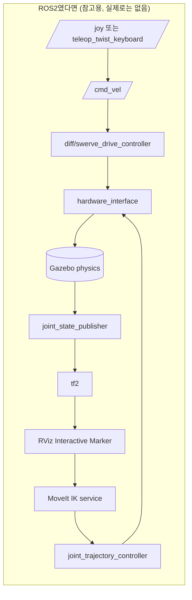
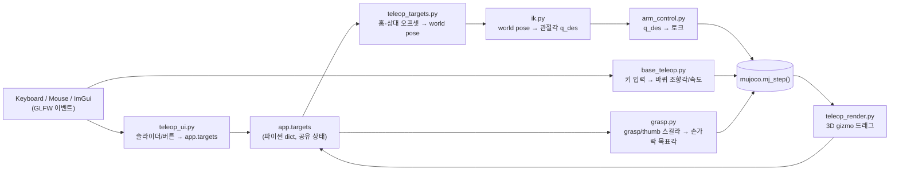
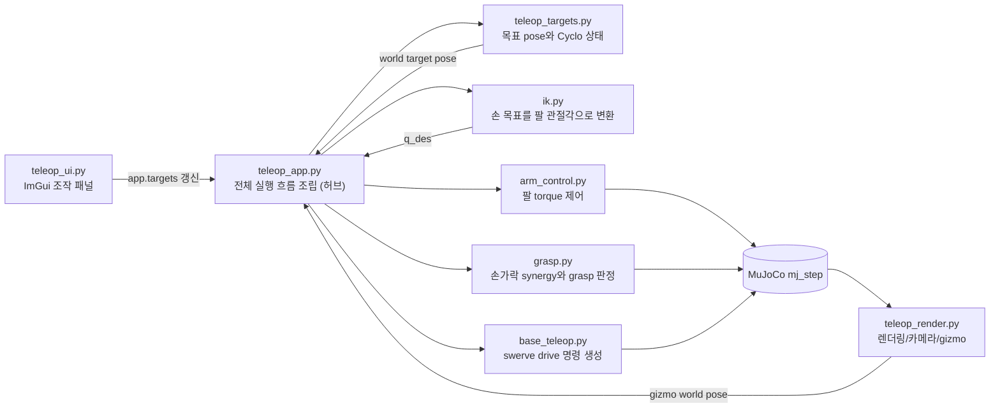
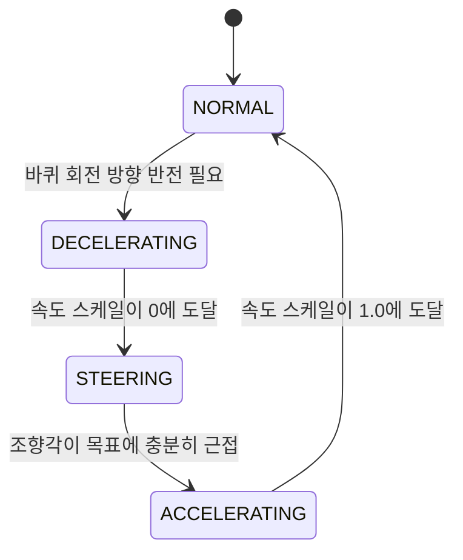
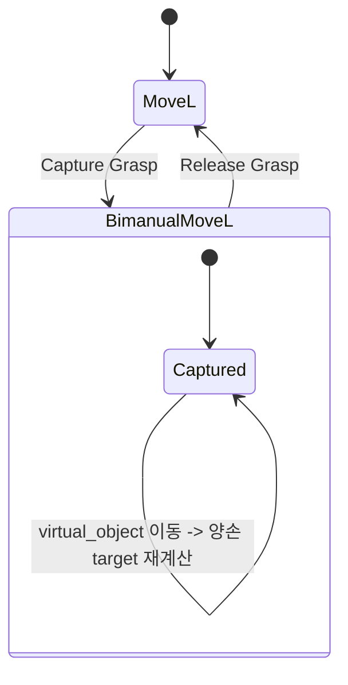
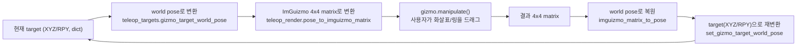
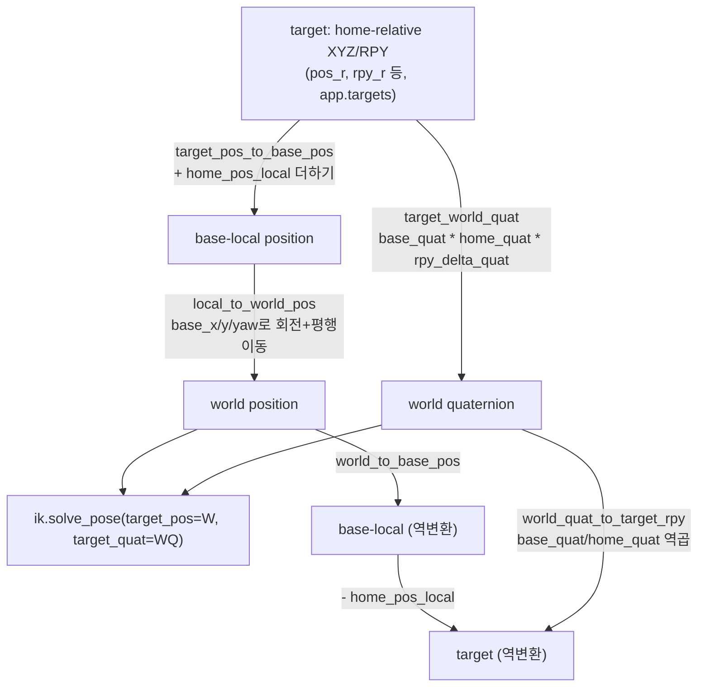

# ROS2 개발자를 위한 완전 가이드

> 이 문서 하나만 처음부터 끝까지 읽으면, **ROS2는 알지만 MuJoCo는 처음 보는 학생**이
> 이 저장소 전체(왜 이렇게 만들었는지, 무엇이 돌아가는지, 코드가 정확히 어떻게
> 흐르는지, 지금까지 어떤 버그를 어떻게 잡았는지)를 한 번에 이해하는 것을 목표로 한다.
> 다른 `docs/guide/` 문서들은 "이미 이 프로젝트 구조를 아는 사람"을 위한 빠른
> 레퍼런스(함수 표, Mermaid 함수 흐름도)에 가깝다. 이 문서는 그 반대다 — 처음
> 읽는 사람을 위해 개념부터, 비유부터, 순서대로 설명한다. 대신 그만큼 길다.
> 급하게 레퍼런스만 찾는다면 [`API 치트시트`](cheatsheet.md)나 [`흔한 함정
> 총정리`](pitfalls.md)가 더 빠르다.

## 이 문서의 사용법

1. Part 1~2는 **개념**이다 — ROS2/Gazebo에서 이미 알고 있는 것과 이 프로젝트가
   쓰는 것을 1:1로 매칭한다. MuJoCo를 한 번도 안 써봤어도 여기까지 읽으면
   "이게 대충 뭐 하는 물건인지" 감이 잡힌다.
2. Part 3~4는 **이 프로젝트 자체**다 — 무엇을 목표로 하는지, 왜 이런 규칙을
   세웠는지, 전체 코드가 한 프레임 동안 정확히 어떤 순서로 실행되는지.
3. Part 5~10은 **모듈별 딥다이브**다 — `src/` 밑의 파일 하나하나를, 수식과
   실제 코드를 인용하면서 설명한다. 순서는 저장소가 실제로 커진 순서(Phase
   순서)와도 같다.
4. Part 11~13은 **실전**이다 — 좌표계 정리, 테스트 철학, 실행 방법.
5. Part 14는 **버그 사례집**이다 — 이 프로젝트가 실제로 겪은 버그들을, 일반적인
   교훈으로 뽑아서 정리한다. MuJoCo/물리 시뮬레이션을 다루는 사람이라면 프로젝트와
   무관하게 읽을 가치가 있다.
6. 맨 끝에 **ROS2 ↔ 이 프로젝트 용어 대조표**가 있다. 읽다가 막히면 거기로
   점프해도 된다.

---

## TL;DR — 30초 요약

이 프로젝트는 ROS2 노드가 아니다. **`python3 src/teleop_app.py` 하나를 실행하면
끝나는 단일 프로세스, 단일 스레드 프로그램**이다. 그 안에서 MuJoCo라는 물리
엔진이 로봇(ROBOTIS FFW-SH5, 양팔+양손+모바일 베이스)을 시뮬레이션하고, 화면에는
3D 뷰와 ImGui 슬라이더 패널이 같이 뜬다. 사람이 슬라이더/버튼/3D 기즈모/키보드로
목표값을 입력하면, 매 프레임(25Hz) 다음이 순서대로 일어난다:

```
입력(마우스/키보드/ImGui) → 목표 pose 갱신(teleop_targets.py)
  → 역기구학(ik.py, 목표 pose를 관절각으로 변환)
  → 팔 토크 제어(arm_control.py) + 손가락 synergy(grasp.py) + 바퀴 명령(base_teleop.py)
  → data.ctrl에 기록 → MuJoCo 물리 스텝(mj_step) 실행 → 화면 렌더
```

로봇이 캔을 "쥔다"는 것은 좌표를 코드로 붙이는 게(kinematic attach) **절대**
아니고, 손가락 액추에이터가 실제로 캔 표면에 접촉력을 만들어서 마찰로 붙잡는
것이다 — 이게 이 프로젝트 세 번째 시도의 존재 이유다(아래 Part 3 참고).

---

# Part 1 — 개념 지도: ROS2 세계관에서 이 프로젝트로

## 1.1 큰 그림 비교표

ROS2로 로봇을 다뤄본 사람이 이 저장소를 열었을 때 가장 먼저 느낄 위화감은
"어라, `ros2 node list`가 없네, 토픽도 없네, launch 파일도 없네"일 것이다.
맞다. 없다. 이 프로젝트는 로보틱스 미들웨어(ROS2/DDS)를 전혀 쓰지 않고,
MuJoCo Python 바인딩 위에 순수 Python으로 물리 루프 + GUI를 얹은
**모놀리식 시뮬레이터**다. 아래 표로 개념을 먼저 맞춰두자.

| ROS2/로보틱스 스택 개념 | 이 프로젝트에서의 대응 | 비고 |
|---|---|---|
| ROS2 노드(node) | 없음 — `TeleopApp` 클래스 인스턴스 하나 | 프로세스가 하나뿐이라 노드 경계 자체가 없다 |
| 토픽 publish/subscribe | 없음 — 파이썬 함수 호출과 공유 dict(`app.targets`) | 전부 같은 프로세스, 같은 스레드라 직렬화/네트워크가 필요 없다 |
| 서비스(service) 호출 | 없음 — 그냥 함수 호출 | 예: `capture_grasp()`는 서비스가 아니라 메서드 |
| 액션(action, ex. `GripperCommand`) | `grasp.apply_grasp()` (스칼라 즉시 반영) | goal/feedback/result 개념 없음, 매 스텝 값만 밀어넣음 |
| URDF/xacro | MJCF(`models/full_scene.xml`) | 아래 2.1에서 상세 비교 |
| `robot_state_publisher` + tf2 | 없음 — MuJoCo가 `data.site_xpos`/`xmat`를 직접 계산해줌 | tf 트리 자체가 없다, 아래 Part 11 참고 |
| `joint_state_publisher` / `/joint_states` 토픽 | `data.qpos` 배열 직접 읽기 | 퍼블리시 안 하고 그냥 메모리에서 읽는다 |
| `ros2_control` (hardware_interface, controller_manager) | `arm_control.ArmTorqueController`, `grasp.apply_grasp`, `base_teleop.SwerveDrive` | 컨트롤러 플러그인 로딩 없이 그냥 파이썬 클래스 3개 |
| `ros2_control` command interface (position/velocity/effort) | MuJoCo actuator 타입 3종(`<position>`/`<velocity>`/`<motor>`) | 아래 2.5 |
| MoveIt (IK 서비스, 모션 플래닝, 충돌 회피 경로) | `src/ik.py`의 `InverseKinematics` | **IK만 있고 플래닝/충돌 회피 경로 생성은 없다** — 매 프레임 현재 자세에서 목표까지 한 스텝만 푼다 |
| RViz Interactive Marker (3D 드래그 핸들) | `teleop_render.py`의 ImGuizmo + MuJoCo mocap body | 아래 Part 10 |
| `rqt`/dynamic reconfigure 슬라이더 패널 | `teleop_ui.py`의 ImGui 패널 | 그림도 물리도 같은 창 안에서 그려진다 |
| Gazebo/Ignition (물리 시뮬레이터) | MuJoCo | 둘 다 "물리 엔진"이지만 세부 개념이 다르다 (아래 Part 2) |
| `nav2`(cmd_vel, twist_mux, diff_drive_controller) | `base_teleop.SwerveDrive` | ROS2 없이 직접 구현한 스워브 역기구학 |
| launch 파일(`.launch.py`) | 없음 — `python3 src/teleop_app.py` 한 줄 | 노드가 하나뿐이니 launch로 여러 프로세스를 묶을 필요가 없다 |
| 파라미터 서버(`ros2 param`) | 파이썬 모듈 최상단 상수(`grasp.py`의 `FINGER_OPEN_FRAC` 등) | 런타임 재설정 불가, 코드/XML 값을 고쳐야 함 |
| `colcon test` / `launch_testing` | `tests/test_phase_{0..6}.py` (headless, 순차 실행) | 아래 Part 12 |
| DDS QoS, 콜백 그룹, executor, spin | 없음 — `while` 루프 하나 | "멀티스레드로 인한 레이스 컨디션"이라는 문제 자체가 없다 |

## 1.2 왜 ROS2가 없는가

이 프로젝트는 실물 로봇을 조작하는 프로덕션 스택이 아니라, **"contact force만으로
캔을 쥘 수 있는가"**라는 물리 시뮬레이션 질문 하나에 집중하려고 만든 연구용/학습용
시뮬레이터다(Part 3 참고). ROS2를 쓰면 얻는 이점(멀티 프로세스 분산, 실제 하드웨어
드라이버 재사용, 표준화된 메시지)이 이 목표에는 오히려 군더더기다 — 노드 간
통신 지연, DDS 설정, launch 파일 관리 같은 인프라 문제를 디버깅하느라 정작
물리 튜닝에 쓸 시간을 뺏기고 싶지 않았다는 뜻이다. 그래서 **하나의 while 루프
안에서 입력→계산→물리 스텝→렌더가 전부 동기적으로 일어나는 구조**를 택했다.
이건 흔히 "teleop 프로토타입"에서 쓰는 접근이고, 실제로 이 프로젝트의 설계 원칙도
맨 위에 "사람이 조작해서 집는다(자율 실행 FSM 없음)"를 명시하고 시작했다.

## 1.3 아키텍처 다이어그램 비교

ROS2로 같은 걸 만들었다면 대략 이런 그래프가 됐을 것이다(참고용, 이 프로젝트엔
실존하지 않음):



이 프로젝트의 실제 구조는 이렇다 — 전부 한 프로세스, 화살표는 네트워크 메시지가
아니라 **파이썬 함수 호출/딕셔너리 읽기쓰기**:



핵심 차이: ROS2 버전은 노드마다 별도 프로세스/스레드이고 메시지가 DDS를 거쳐
비동기로 전달된다. 이 프로젝트는 **전부 하나의 `while` 루프 안에서 순서대로,
동기적으로** 실행된다. 그래서 "레이스 컨디션"이라는 단어 자체가 이 코드베이스에
등장하지 않는다 — 애초에 두 스레드가 동시에 뭔가를 건드릴 일이 없다.

---

# Part 2 — MuJoCo 속성 강의 (ROS2/Gazebo 경험자를 위해)

## 2.1 URDF vs MJCF

ROS2 생태계에서 로봇 모델은 URDF(또는 xacro로 조립되는 URDF)로 쓴다. MuJoCo는
자기만의 XML 방언인 **MJCF**(`models/*.xml`)를 쓴다. 개념은 비슷하지만
(둘 다 "링크 트리 + 관절 + 충돌/시각 형상"을 XML로 서술) 세부가 다르다:

| URDF | MJCF | 차이 |
|---|---|---|
| `<link>` | `<body>` | body는 관성(mass/inertia)뿐 아니라 그 안에 자식 body/joint/geom을 중첩해서 담을 수 있다(트리 구조가 XML 중첩 그 자체) |
| `<joint type="revolute">` | `<joint type="hinge">` | 개념 동일. MJCF는 `range`, `damping`, `armature`, `frictionloss` 등을 훨씬 세밀하게 노출 |
| `<visual>`/`<collision>` mesh | `<geom>` (visual/collision 겸용, `contype`/`conaffinity`로 구분) | URDF는 시각/충돌을 별도 태그로 분리, MJCF는 태그 하나에 role을 플래그로 표시 |
| 없음(tf가 대신함) | `<site>` | **이 프로젝트에서 가장 중요한 개념 중 하나** — 질량도 충돌도 없는 순수 "참조 좌표계" 마커. IK 목표점(`grasp_target_r/l`)이 바로 이 site다. tf frame과 비슷하지만 tf처럼 전역 트리로 자동 발행되지 않고, 코드가 필요할 때 `mj_jacSite` 등으로 직접 계산한다 |
| `<transmission>` + ros2_control `<ros2_control>` 블록 | `<actuator>` | 관절을 "무엇으로 어떻게 구동하는지" 지정. 아래 2.5 |
| 없음(Gazebo SDF에서 따로) | `<keyframe>` | qpos/ctrl의 스냅샷을 이름 붙여 저장(`home`, `pregrasp` 등) — 리셋할 때 그 상태로 즉시 복원 |

## 2.2 body / joint / site / geom / actuator 요약표

| MJCF 요소 | 의미 | ROS2/URDF 유사 개념 |
|---|---|---|
| `<body>` | 질량+관성을 가진 강체, 트리의 노드 | `<link>` |
| `<joint>` | body 사이의 자유도(각도, 위치 등) | `<joint>` |
| `<geom>` | 충돌/시각 형상(캡슐, 박스, mesh 등) | `<collision>`+`<visual>` |
| `<site>` | 질량 없는 참조 좌표계(센서/타겟 부착점) | tf frame(단, 자동 트리 발행은 없음) |
| `<actuator>` | joint에 힘/토크/속도/위치 목표를 넣는 구동기 | `ros2_control` command interface |
| `<keyframe>` | qpos/ctrl 스냅샷 | 없음(가장 가까운 게 MoveIt named target) |
| `mocap="true"` body | 물리(질량/충돌) 없이 외부 코드가 pose를 직접 지정하는 body | RViz Interactive Marker의 내부 표현과 비슷 |

## 2.3 `MjModel`과 `MjData` — "정적 서술"과 "동적 상태"의 분리

ROS2에서 URDF는 한 번 파싱되면 불변이고, 실제로 시시각각 변하는 상태(관절각 등)는
`/joint_states` 토픽으로 흐른다. MuJoCo도 정확히 이 둘을 나눈다:

- **`MjModel`**: XML을 컴파일한 결과. body/joint/geom/actuator 개수, 이름,
  질량, 관절 range, 액추에이터 게인 등 **바뀌지 않는 구조**. `mujoco.MjModel.from_xml_path(...)`로 한 번만 만든다.
- **`MjData`**: 그 모델의 **현재 상태**. `qpos`(관절 위치), `qvel`(관절 속도),
  `ctrl`(액추에이터 입력), `contact`(현재 접촉 목록) 등. `mujoco.MjData(model)`로
  만들고, 시뮬레이션이 진행되며 계속 바뀐다.

이 프로젝트가 "kinematic override 금지"라고 부르는 규칙(Part 3.2)은 결국
"`data.qpos`를 파이썬에서 직접 대입하지 마라, `data.ctrl`만 써서 액추에이터를
통해 간접적으로 움직여라"는 뜻이다. Gazebo에서 `SetModelState` 서비스로 모델을
순간이동시키는 것과 비슷한 치팅을 막는 것이다.

## 2.4 시뮬레이션을 진행시키는 두 함수

| 함수 | 하는 일 | 시간이 흐르는가 |
|---|---|---|
| `mj_forward(model, data)` | 지금 `qpos` 기준으로 운동학(forward kinematics)/힘/접촉을 다시 계산 | 아니오 |
| `mj_step(model, data)` | 한 타임스텝만큼 물리를 적분 — `qpos`/`qvel`이 실제로 바뀜 | 예 |

IK 솔버(`ik.py`)는 `mj_forward`만 반복 호출한다 — "이 관절각이면 손끝이 어디에
있을까"를 계산만 할 뿐 시간을 흘려보내지 않는다. 실제 로봇이 움직이는 건 메인
루프가 `mj_step`을 부를 때뿐이다. 이 구분이 "IK는 그냥 계산, 실제 이동은 물리
엔진이 담당"이라는 이 프로젝트 전체의 핵심 원칙이다.

## 2.5 액추에이터 3종 — `ros2_control` command interface와 비교

| MJCF 태그 | 동작 방식 | 이 프로젝트에서 쓰는 곳 | `ros2_control` 유사 인터페이스 |
|---|---|---|---|
| `<position>` | 목표 각도를 향해 내장 P(비례) 제어로 힘을 낸다 | 손가락, 리프트, 바퀴 조향 | `PositionJointInterface` |
| `<velocity>` | 목표 각속도를 추종 | 바퀴 구동(`wheel_drive`) | `VelocityJointInterface` |
| `<motor>` | 목표값을 그대로 토크로 출력(내장 제어 없음) | 팔 7관절(`arm_r_joint1..7`) | `EffortJointInterface` |

**왜 팔만 `<motor>`(순수 토크)를 쓰는가**가 이 프로젝트의 중요한 설계 결정이다.
MuJoCo의 `<position>` 액추에이터는 순수 비례 제어라 적분(I)도 피드포워드도
없어서, 무거운 7링크 팔이 정적 자세를 버틸 때 중력 때문에 15~20mm 정도의 잔류
오차가 생겼다(`arm_control.py` 참고). 그래서 팔은 `<motor>`로 바꾸고
파이썬에서 직접 `tau = qfrc_bias + kp*(q_des-q) - kd*qvel`(Part 7)을 계산해
써준다 — `ros2_control`의 `effort_controllers/JointGroupEffortController`를
직접 구현한 셈이다. 반면 손가락은 일부러 `<position>`(P 제어, 힘 제한 있음)을
그대로 쓰는데, 접촉하면 토크가 포화돼서 스스로 멈추는 "순응(compliant) 그립"이
바로 이 힘 제한 위치 제어에서 나오는 의도된 효과이기 때문이다(Part 5).

## 2.6 접촉(contact) — Gazebo에는 없던 새 개념들

Gazebo(ODE/Bullet/DART)를 써봤다면 마찰(friction), restitution 정도는 익숙할
텐데, MuJoCo는 접촉을 훨씬 세밀하게 조절하는 파라미터를 노출한다. 이 프로젝트의
grasp가 성립하는 이유가 전부 이 파라미터들에 있으므로 정리한다.

| 파라미터 | 의미 |
|---|---|
| `solref` | 접촉을 스프링-댐퍼로 모델링할 때의 시간상수/감쇠비. 작을수록(더 뻣뻣, stiff) 관통이 줄지만 발산하기 쉽다 |
| `solimp` | 접촉 impedance(얼마나 "단단하게" 위반을 막을지) 곡선 |
| `friction` | 접촉 마찰 계수(접선 방향 2개 + 비틀림/구름 방향까지, 최대 5차원) |
| `condim` | 접촉력의 차원(1=법선만, 3=마찰까지, 6=비틀림/구름까지) — `condim=6`은 캔이 손안에서 겉돌지 않게 회전 마찰까지 모델링 |
| `priority` | 두 geom이 접촉할 때 어느 쪽의 solref/solimp/friction/condim을 쓸지 우선순위. **이 프로젝트는 캔에 `priority="1"`을 줘서, 손가락 수십 개 geom을 하나하나 튜닝하는 대신 캔 쪽 파라미터 하나만 맞추면 되게 만들었다** |

Gazebo에서 물체를 "쥔다"는 걸 구현할 때 흔히 유혹받는 지름길이 fixed joint를
런타임에 붙였다 뗐다 하는 것(kinematic attach)인데, 이 프로젝트는 그 지름길을
전면 금지한다(Part 3.2) — 순전히 위 표의 파라미터들로 만든 접촉력만으로 캔이
붙어 있어야 한다.

## 2.7 "물리 치팅 금지" 철학이 왜 이렇게 강한가

이 프로젝트는 사실 **세 번째 시도**다. 이전 두 저장소(`ffw-sh5-mujoco`,
`ffw-sh5-teleoperation`)가 각각 "kinematic 부착 방식이라 사실 물리가 아님",
"C++ Bullet3인데 관통(penetration)을 못 잡음"으로 실패했다. 그래서 이번 저장소는
맨 처음부터 절대 규칙 1번으로 "kinematic override 금지"를 못 박고 시작했다 —
ROS2로 치면 "이 패키지는 `set_entity_state` 서비스를 그 어떤 이유로도 호출하지
않는다"는 프로젝트 헌장 같은 것이다.

---

# Part 3 — 프로젝트 정체성

## 3.1 무엇을 만들었나

ROBOTIS FFW-SH5(양팔 7DOF×2 + HX5-D20 5지 핸드×2 + 모바일 베이스)가 테이블
위의 캔을 **오직 접촉력만으로** 집어 드는 MuJoCo 텔레오퍼레이션 시뮬레이터.
기준 모델은 공식 `robotis_mujoco_menagerie`, contact/actuator 레시피의
기준점은 DeepMind `mujoco_menagerie/shadow_hand`(검증된 값에서 시작하고
임의로 발명하지 않는다는 원칙).

## 3.2 절대 규칙 (모든 Phase에 적용)

1. **kinematic override 금지** — `data.qpos[...] = value`로 물리 상태를 직접
   덮어쓰지 않는다. 유일한 예외는 reset과 물체 초기 배치(`teleop_app.py`의
   `_reset_can_random`이 이 예외에 해당하는 유일한 곳).
2. **물리 파라미터는 전부 XML에** — 파이썬에서 `model.geom_friction[...] = ...`
   같은 컴파일 후 수정 금지.
3. **Phase 순서 준수** — 성공 기준을 통과하기 전 다음 Phase 코드를 쓰지 않는다.
4. **Phase 완료마다 git commit + tag**.
5. **Phase마다 headless 테스트 스크립트를 남긴다.**

이 다섯 규칙은 지금까지 한 번도 깨진 적이 없다 — Part 14의 버그
사례들도 전부 "qpos를 덮어써서 대충 해결"하는 대신 XML/알고리즘에서 진짜 원인을
찾은 기록이다. (이 규칙들과 Phase별 상세 튜닝 기록은 저장소 초기에 `PLAN.md`/
`NOTES.md`라는 별도 파일에 있었으나, 이 문서를 포함한 mkdocs 사이트가 실제
문서 역할을 대체하면서 정리됐다 — 원본 기록은 git 히스토리에 남아 있다.)

## 3.3 Phase 0~6 여정 요약

| Phase | 무엇을 추가했나 | 핵심 성공 기준 | 테스트 파일 |
|---|---|---|---|
| 0 | 공식 모델 그대로 로드해서 구조 검증 | 5초 무제어 시뮬레이션 발산 없음 | `test_phase_0.py` |
| 1 | 오른손 단독 씬, mesh collision → capsule 교체 | 관통 20회 테스트 < 2mm | `test_phase_1.py` |
| 2 | grasp synergy(`grasp.py`) + 접촉력 기반 판정 | grasp+lift 10회 중 8회 이상 성공 | `test_phase_2.py` |
| 3 | 오른팔 + IK(`ik.py`) | IK 100개 샘플 95% 수렴, pick 7/10 | `test_phase_3.py` |
| 4 | 전신 로봇 + 텔레옵 GUI | pick 10회 중 3회 이상(수동), 스크립트 재현 10/10 | `test_phase_4.py` |
| 5 | 모바일 베이스, 실제 바퀴 마찰 주행(`base_teleop.py`) | 유휴/직진/충돌정지/제자리회전 회귀 | `test_phase_5.py` |
| 6 | Cyclo Control 스타일 3D 마커 텔레옵(`teleop_targets.py`, gizmo) | marker jog, capture/release, XYZ/RPY IK 게이트 | `test_phase_6.py` |

Phase 4까지는 "손이 캔을 쥔다"가 목표였고, Phase 5는 "로봇 전체가 바퀴로
움직인다", Phase 6은 "조작 인터페이스를 어떻게 손으로 직관적으로 다루는가"에
집중한 단계다. 특히 Phase 6은 요구사항이 여러 번 정정되며 진화했다
(슬라이더 → +/- jog 버튼 → Cyclo 패널 → 화면 안 3D gizmo, Part 10.5 참고) —
"내가 생각한 UI"와 "사용자가 실제로 원한 UI"가 다를 수 있다는 걸 보여주는 좋은
사례다.

## 3.4 현재 상태 스냅샷

- 버전 태그: `1.0.0` (그 이전 `0.0.1`/`0.0.2`/`0.1.0`, Phase 태그 `phase-0`~`phase-4`)
- 캔 시나리오만 라이브 — 한때 있었던 "상자 양손 들기(box scenario)" teleop 경로는
  이후 세션에서 제거되고(`4fabaae Remove box scenario from teleop`), 관련 물리
  코드(`bimanual_constraint.py`, XML의 `box_body`)는 legacy로 남아있지만
  `teleop_app.py`가 시작 시 `_disable_legacy_box_asset()`로 비활성화한다.
- 조작 철학은 "Cyclo Control"(ROBOTIS 자체 텔레옵 UI) 스타일 3D 마커
  기반으로 정착 — 자세한 내용은 Part 10.
- 문서 사이트: https://ggh-png.github.io/ffw-sh5-grasp/ (mkdocs-material,
  GitHub Pages를 쓰려고 저장소가 의도적으로 public이다)

---

# Part 4 — 전체 아키텍처 실행 흐름

## 4.1 파일 지도

```text
ffw-sh5-grasp/
├── assets/robotis_ffw/        # 공식 menagerie 원본 (수정 금지)
├── models/
│   ├── hand_only.xml          # Phase 1-2: 오른손 단독 + 캔
│   ├── arm_hand.xml           # Phase 3: 오른팔+오른손+테이블+캔
│   └── full_scene.xml         # Phase 4-6: 전신 로봇 (지금 teleop이 로드하는 모델)
├── src/
│   ├── teleop_app.py          # 조립 지점 + 메인 루프 (이 문서의 "허브")
│   ├── teleop_ui.py           # ImGui 패널
│   ├── teleop_render.py       # GLFW/렌더/카메라/3D gizmo
│   ├── teleop_targets.py      # target ↔ world pose 변환, Cyclo 상태
│   ├── ik.py                  # 6DOF DLS 역기구학
│   ├── arm_control.py         # 팔 토크 제어(PD+중력보상)
│   ├── grasp.py               # 손가락 synergy + 접촉 기반 grasp 판정
│   ├── base_teleop.py         # 스워브 드라이브
│   ├── bimanual_constraint.py # legacy(상자 양손 구속) — 현재 teleop 경로에서는 미사용
│   └── mj_util.py             # joint -> actuator 탐색 등 공용 MuJoCo 헬퍼
└── tests/test_phase_{0..6}.py # Phase별 headless 회귀 테스트
```

## 4.2 모듈 의존 다이어그램



각 화살표는 네트워크 메시지가 아니라 **같은 프로세스 안의 함수 호출/인자 전달**
이라는 점을 다시 강조한다.

## 4.3 메인 루프 완전 해부

`src/teleop_app.py`의 `TeleopApp.run()`이 프로그램의 심장이다. 실제 코드를
그대로 인용하고 줄마다 설명을 붙인다.

```python
def run(self):
    while not glfw.window_should_close(self.window):
        t0 = time.perf_counter()
        io = teleop_render.begin_frame(self)

        teleop_render.handle_camera_mouse(self, io)
        self._handle_edge_keys(io)
        drive_keys = self._read_drive_and_lift_keys(io)
        self._draw_ui_panel()
        self._step_physics(drive_keys)
        teleop_render.render_scene(self)
        teleop_render.end_frame(self, t0)

    teleop_render.shutdown(self)
```

| 줄 | ROS2식으로 말하면 |
|---|---|
| `while not glfw.window_should_close(...)` | `rclpy.spin()`에 해당하는 "이 프로그램이 살아있는 동안 반복" 루프. 단, executor도 콜백 큐도 없이 그냥 while문 |
| `begin_frame` | GLFW 이벤트 폴링 + ImGui 새 프레임 시작. `sensor_msgs/Joy` 콜백이 큐에서 이벤트를 꺼내는 것과 비슷한 역할을 여기서 동기적으로 함 |
| `handle_camera_mouse` | 순수 뷰어 카메라 조작(로봇 상태와 무관) — RViz 카메라 조작과 동급, 시뮬레이션에 영향 없음 |
| `_handle_edge_keys` | R(캔 리셋)/G(접촉 시각화)/C(카메라 전환) — "눌렀다 뗄 때 한 번만" 발동하는 키. `KeyEdge` 클래스가 직접 구현한 간단한 엣지 검출기(디바운스와 비슷) |
| `_read_drive_and_lift_keys` | 계속 눌려 있는 동안 계속 반응해야 하는 키(방향키 주행, Q/E 리프트) — level-triggered |
| `_draw_ui_panel` | `teleop_ui.draw_panel(self)` 호출 — 이 프레임의 슬라이더/버튼 렌더 + `app.targets` 갱신 (이 함수 자체는 물리를 전혀 안 건드림) |
| `_step_physics` | **진짜 로봇을 움직이는 부분.** 아래 4.3.1에서 통째로 해부 |
| `render_scene` | MuJoCo 3D 렌더 + gizmo + ImGui 그리기 + 버퍼 스왑 |
| `end_frame` | FPS 계산 + 남는 시간만큼 `time.sleep` (25Hz 유지) |

**"ROS2였다면 이건 무엇인가"**: 이 루프 전체가 대략 `MultiThreadedExecutor` 없이
`rclpy.spin_once()`를 25Hz 타이머 콜백 하나 안에서 반복하는 것과 같다. 다만
그 콜백 하나가 센서 읽기, 컨트롤러 계산, 액추에이터 명령, 렌더링까지 전부
한다 — 실제 ROS2라면 여러 노드/콜백 그룹으로 쪼갤 일을 일부러 안 쪼갠 것이다
(1.2절 참고).

### 4.3.1 `_step_physics(drive_keys)` 내부 순서

```python
def _step_physics(self, drive_keys):
    ctx_qpos = data.qpos.copy()
    # 1) Bimanual MoveL이 캡처된 상태면 virtual object target으로 양손 target을 갱신
    if self.cyclo_grasp_captured:
        self.apply_virtual_object_target()
    # 2) Grab/Release 버튼 상태를 grasp/thumb 슬라이더 값으로 서서히 ramp
    for side in ("r", "l"):
        ...
    # 3) 슬라이더 원시값 -> rate-limit된 smoothed_pos/smoothed_rpy
    for side in ("r", "l"):
        ...
    # 4) IK 모드인 손: solve_pose() 호출. FK 모드인 손: 관절각 슬라이더 값을 그대로 사용
    if self.arm_mode["r"] == "ik": ...
    if self.arm_mode["l"] == "ik": ...
    # 5) 스워브 드라이브 명령 계산 (프레임당 1회)
    wheel_cmds = self.base_drive.update(...)
    # 6) 물리 서브스텝 여러 번 반복: 토크/grasp/lift/바퀴 ctrl 기록 -> mj_step
    for _ in range(self.steps_per_frame):
        self.ctrl_r.apply(data, self.q_des_r)
        self.ctrl_l.apply(data, self.q_des_l)
        data.ctrl[self.lift_aid] = self.targets["lift"]
        ... wheel ctrl ...
        grasp.apply_grasp(model, data, ...)
        mujoco.mj_step(model, data)
```

여기서 반드시 짚어야 할 것 두 가지:

1. **렌더 프레임(25Hz)과 물리 스텝(더 촘촘한 `timestep`)은 다른 주기다.**
   `steps_per_frame = frame_dt / model.opt.timestep`만큼 `mj_step`을 여러 번
   돌린다 — ROS2의 "제어 루프 주기(예: 1kHz)"와 "디스플레이 갱신 주기(60Hz)"가
   다른 것과 같은 이유다. 안정적인 물리 적분에는 훨씬 촘촘한 타임스텝이
   필요하기 때문.
2. **IK/토크/grasp/바퀴 명령은 매 서브스텝마다 다시 적용된다.** 한 번 계산해서
   여러 스텝 동안 값을 "붙박이"로 두지 않고, 서브스텝 루프 안에서 매번
   `ctrl_r.apply`, `grasp.apply_grasp` 등을 다시 호출한다 — `ros2_control`의
   컨트롤러가 매 제어 주기마다 다시 계산되는 것과 같은 이유(제어값이 상태
   피드백에 반응해야 하므로).

## 4.4 "이건 ROS2 노드로 치면 무엇인가" — 파일별 정리

| 파일 | 굳이 ROS2 노드로 비유하면 |
|---|---|
| `teleop_app.py` | 모든 걸 한 콜백 안에서 처리하는 유일한 노드(사실상 launch 파일 + 노드 + executor를 겸함) |
| `teleop_ui.py` | `rqt` 플러그인 하나, 단 별도 프로세스가 아니라 인프로세스 위젯 |
| `teleop_render.py` | RViz(3D 뷰) + 그 안의 InteractiveMarkerServer를 한 파일에 합친 것 |
| `teleop_targets.py` | tf2 buffer/lookup + MoveIt의 "pose goal 계산"을 대신하는 순수 함수 모음 |
| `ik.py` | MoveIt의 IK 플러그인(KDL/TRAC-IK 자리) 하나만 떼어낸 것. 플래닝은 없다 |
| `arm_control.py` | `ros2_control`의 `effort_controllers` 플러그인 하나 |
| `grasp.py` | 그리퍼 액션 서버 + `/gripper/force_torque` 센서 판정 로직을 합친 것 |
| `base_teleop.py` | `swerve_drive_controller` + `twist_mux`를 합친 것 |

---

# Part 5 — 손 제어: `src/grasp.py`

## 5.1 grasp synergy란 무엇인가

실제 로봇 손(HX5-D20)은 손가락 마디마다 관절이 있지만(엄지 4개, 검지/중지/약지/
새끼 각 3~4개), 텔레옵에서 사람이 그 관절 하나하나를 슬라이더로 조작하는 건
비현실적이다. 그래서 **"synergy"**(스칼라 하나가 여러 관절을 동시에 움직이는
매핑)를 쓴다 — ROS2의 `control_msgs/action/GripperCommand`가 "그리퍼를 얼마나
닫을지" 스칼라 하나(`position`)만 받는 것과 똑같은 아이디어다. 이 프로젝트는
스칼라 2개를 쓴다:

| 슬라이더 | 매핑 대상 |
|---|---|
| `grasp` (0~1) | 검지+중지의 pip/dip/tip 관절 전부 동시에 |
| `thumb` (0~1) | 엄지의 mcp_pitch/ip 관절 + 엄지 MCP-yaw(방향) |

## 5.2 관절 지도와 상수

```python
FINGER_CURL_JOINTS = {
    "r": {
        "index": ("finger_r_joint6", "finger_r_joint7", "finger_r_joint8"),
        "middle": ("finger_r_joint10", "finger_r_joint11", "finger_r_joint12"),
    }, ...
}
THUMB_CURL_JOINTS = {"r": ("finger_r_joint3", "finger_r_joint4"), ...}
FINGER_OPEN_FRAC = 0.20   # grasp=0이어도 range 전체를 펴지 않고 20% 남겨둠
RING_PINKY_MAX_FRAC = 0.35  # 약지/새끼는 실제 grasp에 참여 안 함, 코스메틱으로만 35%까지 굽음
```

3점 파지(엄지+검지+중지)만 실제로 캔을 쥐고, **약지/새끼는 애초에 grasp에
참여하지 않는다** — MCP(스프레드) 관절은 XML에서 `range="0 0"`으로 아예
잠겨 있다. 이건 튜닝 실패가 아니라 처음부터 제시된 fallback이다:
"5지 전부"에 집착하지 않고 3점 파지로 단순화하는 게 "정직한 물리 파지"라는
목표에 더 맞다는 판단.

### 관절 매핑 공식

슬라이더 스칼라 \(s \in [0,1]\)(`grasp` 또는 `thumb`)를 관절 range \([lo, hi]\) 위의
목표각 \(\theta\)로 바꾸는 식은 두 단계다. 먼저 "완전히 펴진 상태에서도 이만큼은
남겨둔다"는 여유 비율 `open_frac`(검지/중지는 `FINGER_OPEN_FRAC=0.20`, 엄지 curl은
`THUMB_OPEN_FRAC=0.0`)을 적용해 실제 보간 비율을 구한다:

\[
\text{frac} = \text{open\_frac} + s\,(1 - \text{open\_frac})
\]

그다음 그 비율로 range를 선형 보간한다 — 단, 손마다 "펼침"이 `lo`/`hi` 중 어느 쪽인지
다르므로(`THUMB_CURL_OPEN_AT_HI`, 아래 참고) 두 방향이 있다:

\[
\theta =
\begin{cases}
lo + \text{frac}\,(hi - lo) & \text{open\_at\_hi = False (검지/중지, 오른손 엄지 등 대부분)} \\
hi - \text{frac}\,(hi - lo) & \text{open\_at\_hi = True (왼손 엄지 -- range 부호 자체가 미러링됨)}
\end{cases}
\]

이 두 식이 `grasp.py`의 `_ramp_value(lo, hi, frac, open_at_hi)` 함수 그 자체다.
약지/새끼는 애초에 실제 grasp에 참여하지 않으므로 `open_frac` 여유가 없고, 대신
`grasp` 스칼라에 비례해 자기 range의 `RING_PINKY_MAX_FRAC`(=0.35)까지만 코스메틱하게
움직인다:

\[
\theta_{\text{ring/pinky}} = lo + \big(s \cdot \text{RING\_PINKY\_MAX\_FRAC}\big)\,(hi - lo)
\]

## 5.3 접촉력 기반 판정 — `is_grasped`

이 프로젝트에서 "쥐었다"의 정의는 **위치가 아니라 순전히 접촉력**이다:

```python
def is_grasped(model, data, min_fingers=2, min_total_force=0.05,
               require_thumb=True, side="r"):
    forces = get_finger_can_contacts(model, data, side=side)
    if require_thumb and "thumb" not in forces:
        return False
    if len(forces) < min_fingers:
        return False
    return sum(forces.values()) >= min_total_force
```

`get_finger_can_contacts`는 이번 스텝에 발생한 모든 접촉(`data.contact`)을
순회하며, 캔과 맞닿은 접촉만 골라 `mj_contactForce()`로 법선력을 읽어 손가락
그룹별로 합산한다. ROS2로 치면 실제 F/T(force-torque) 센서 토픽을 구독해서
"그리퍼가 물체를 쥐었는지" 판정하는 노드와 같은 역할이다 — 다만 진짜 센서가
아니라 물리 엔진이 계산한 접촉력을 직접 읽는다는 차이가 있을 뿐, **"위치가
가까우면 쥔 걸로 친다" 같은 치팅은 하지 않는다.**

## 5.4 사례 연구 — 엄지 프리쉐입 버그

이 버그는 "고정값처럼 보이는 상수가 사실은 안전하지 않았다"는, 시뮬레이션
디버깅에서 자주 나오는 패턴을 잘 보여준다.

- **증상**: 엄지가 옆으로 벌어지는 대신 손바닥 쪽으로 접히길 원해서, MCP-yaw
  각도를 `-1.309 → -2.0326 rad`로 넓혔다.
- **회귀**: 그런데 `tests/test_phase_4.py`의 통합 pick 성공률이 80~90%에서
  20%로 급락했다.
- **원인**: 이 각도가 `THUMB_PRESHAPE` 안의 **완전 고정값**이라, `thumb=0`인
  **pregrasp 접근 단계**(팔이 아직 캔 쪽으로 스윙하는 중)에도 그대로 적용됐다.
  넓어진 각도 때문에 엄지가 스윙 도중 캔을 미리 쳐서 최대 85mm까지 밀어냈다
  (계측: 접촉이 스윙의 47% 지점에서 시작). `hand_only.xml` 기반 테스트는 팔
  자체가 없어서 이 문제를 원천적으로 못 잡는다.
- **수정**: MCP-yaw를 고정값이 아니라 `thumb` 스칼라로 `THUMB_YAW_REST`(안전한
  기존 각도) → `THUMB_YAW_CURL`(넓은 새 각도) 사이를 **선형 램프**하게 바꿨다.
  `thumb=0`(접근 중)엔 안전한 각도, `thumb`이 실제로 올라갈 때(팔이 이미 멈춘
  뒤)만 넓은 각도로 전환된다.

\[
\text{yaw}(\text{thumb}) = \text{yaw}_{\text{rest}} + \text{thumb}\,\big(\text{yaw}_{\text{curl}} - \text{yaw}_{\text{rest}}\big)
\]

코드로는 그대로:

```python
yaw_value = THUMB_YAW_REST[side] + thumb * (THUMB_YAW_CURL[side] - THUMB_YAW_REST[side])
```

`thumb=0`이면 항상 안전한 `yaw_rest`, `thumb=1`이면 사용자가 확인한 `yaw_curl`이 되고
그 사이는 선형 보간된다 — 5.2의 관절 매핑 공식과 똑같은 선형 램프이지만, 대상이
`grasp`/`thumb` 곡선 자체가 아니라 "커브가 어느 각도에서 어느 각도로 이어지는가"라는
점이 다르다.

**교훈**(일반화): "이 값은 스칼라와 무관하게 항상 적용된다"는 설계는, 그
스칼라가 취할 수 있는 **모든** 상태(여기서는 `thumb=0`인 접근 단계까지 포함)에서
안전할 때만 유효하다. 값을 하나 바꿀 때는 "지금 보고 있는 상태"뿐 아니라 그
값이 적용되는 **모든** 호출 시점을 따져봐야 한다.

---

# Part 6 — 역기구학: `src/ik.py`

## 6.1 이 프로젝트에 왜 MoveIt이 없는가

MoveIt은 (1) IK 계산 (2) 충돌을 피하는 전체 궤적 플래닝 (3) 궤적 실행까지
포괄하는 무거운 프레임워크다. 이 프로젝트는 그중 **(1)만** 필요하다 — 사람이
프레임마다 목표 pose를 조금씩 옮기면, 그 순간 "지금 관절각에서 그 목표까지
한 스텝 다가가는 관절각"만 풀면 되기 때문이다(연속 텔레옵이지 "여기서 저기로
경로를 계획해서 한 번에 가라"가 아니다). 그래서 `src/ik.py`는 MoveIt의 IK
플러그인 자리에 해당하는 것만 직접 구현했다 — 장애물을 피해 돌아가는 경로
계획, 궤적 스무딩, 속도 프로파일은 없다.

## 6.2 문제 정의와 DLS(damped least squares)

목표: MJCF의 `site`(`grasp_target_r`) 하나가 목표 위치/자세에 오도록 팔
7관절의 각도를 구한다. 야코비안 \(J\)을 그냥 역행렬(pseudo-inverse)로 풀면
특이 자세(singularity) 근처에서 관절 속도가 폭발한다. 그래서 감쇠항 \(\lambda\)를
더한 **damped least squares**를 쓴다:

\[
\Delta q = J^T (J J^T + \lambda^2 I)^{-1} \, e
\]

여기서 \(e\)는 위치 오차(목표 - 현재), \(\lambda=0.05\)가 기본값
(`DEFAULT_DAMPING`). 코드로는 이렇게 그대로 나타난다:

```python
def _dls_step(self, J, err):
    lam2 = self.damping ** 2
    JJt = J @ J.T + lam2 * np.eye(J.shape[0])
    return J.T @ np.linalg.solve(JJt, err)
```

## 6.3 계층형 IK — position이 orientation보다 우선

위치+자세 오차를 하나의 스택 야코비안(6×n)으로 합쳐서 한 번에 풀면(naive
6D DLS), 자세 오차가 크면 위치가 자세를 맞추려다 흔들리고, 반대도 마찬가지로
발산했다(실측으로 확인). 그래서 **task-priority(계층형)** 방식을 쓴다:

1. 위치 오차만으로 \(\Delta q_{pos}\)를 DLS로 먼저 푼다.
2. 자세 보정 \(\Delta q_{ori}\)은 위치 야코비안의 **null space**(위치에
   영향을 주지 않는 관절 조합)에만 투영한다:

\[
\Delta q_{ori} = J_r^T e_{ori} - J_p^T (J_p J_p^T + \lambda^2 I)^{-1} \big(J_p \, J_r^T e_{ori}\big)
\]

3. \(\Delta q = \Delta q_{pos} + \Delta q_{ori}\), 관절당 최대 변화량으로
   clamp.

이 순서 자체가 **ROS2/로보틱스에서 흔한 "task-priority IK"**(예: 상체는
위치 우선, 자세는 여유 자유도로만 맞추는 휴머노이드 전신 제어와 같은 발상)와
같은 패턴이다.

## 6.4 좌표계 함정 — site-local vs world

`mju_subQuat(ori_err, target_quat, cur_quat)`는 두 쿼터니언 사이의 회전을 작은-각도
근사의 축각(axis-angle) 벡터로 반환한다:

\[
e_{ori} \;\approx\; 2\,\mathrm{vec}\big(q_{target} \otimes q_{current}^{-1}\big)
\]

(정확히는 \(q_{target} = q_{current}\otimes \exp(e_{ori}/2)\)를 만족하는 \(e_{ori}\) —
각도가 작을 때 지수맵을 1차로 전개한 값과 같다.) 이 벡터(`ori_err`)는 **site 로컬
프레임**인데, `jacr`(회전 야코비안)은 **월드 프레임**이다. 이 둘을 그냥 곱하면 보정이
엉뚱한 관절로 샌다 — Phase 3에서 실제로 겪은 버그다. 고쳐진 코드:

```python
site_R = scratch.site_xmat[self.site_id].reshape(3, 3)
ori_err_world = site_R @ ori_err   # site-local -> world 변환 후에만 jacr와 곱함
```

이건 tf2에서 "이 벡터가 어느 frame_id 기준인지 확실히 하지 않고 계산하면
결과가 조용히 틀린다"는 것과 정확히 같은 종류의 함정이다 — 다만 tf2는 프레임
불일치를 종종 예외로 알려주는 반면, 이런 야코비안 계산은 **조용히** 틀린
결과를 낸다는 게 더 위험하다.

## 6.5 backtracking line search

계층형 IK만으로도 오차가 큰 경우 반복할수록 진동/발산했다. 그래서 매 반복마다
전체 스텝을 그대로 쓰지 않고, **실제로 비용(위치 오차 + 가중치×자세 오차)이
줄어드는지 확인하며 스텝을 절반씩 줄여 재시도**한다(최대 6회):

```python
cur_cost = pos_err_norm + ori_weight * ori_err_norm
step = 1.0
for _ in range(6):
    q_try = clamp(q + step * dq_full)
    ... 비용 재계산 ...
    if cost < cur_cost:
        break
    step *= 0.5
```

이게 있어야 "반복할수록 나빠지는" 상황에서도 **매 반복이 최소한 이전보다
나쁘지 않음을 보장**한다.

## 6.6 multistart — 국소해(local minimum) 탈출

`solve_pose`만으로는 큰 격차나 관절 한계 근처에서 국소해에 갇힐 수 있다.
`solve_pose_multistart`는 우선 `q_init`(보통 직전 프레임의 해 — 웜스타트라
싸고 대개 좋은 시작점)으로 시도하고, 실패하면 관절 range 안에서 무작위로
뽑은 시작점 여러 개(기본 8개)로 재시도한다. 이건 MoveIt의 IK 플러그인들도
흔히 쓰는 전략(예: BioIK, TRAC-IK의 랜덤 재시작)과 같다. 단, 실시간 텔레옵
루프(`_step_physics`)는 매 프레임 웜스타트 `solve_pose` 한 번만 쓴다 —
multistart는 비용이 크므로(최대 250 iter × 9 시도) 테스트/오프라인 검증에서만
쓰인다.

## 6.7 "왜 관절이 갑자기 멈춘 것처럼 보일까" — stuck-frame 최적화

`teleop_app.py`는 각 손의 IK 오차가 `STUCK_POS_TOL`(3cm) 이상인 상태가
`STUCK_FRAMES_THRESHOLD`(5프레임) 연속되면, 그 손의 반복 예산을 `IK_MAX_ITER`
(15)에서 `STUCK_MAX_ITER`(4)로 낮춘다. 이건 **정확도를 낮추는 게 아니다** —
어차피 15번을 다 써도 수렴 못 하고 같은 값에 멈춰 있던(실측으로 확인된) 경우만
골라서, "안 되는 걸 계속 비싸게 재시도"하는 낭비를 줄이는 최적화다. 실제로
수렴 중인 손은 항상 풀 예산(15)을 받는다.

---

# Part 7 — 팔 토크 제어: `src/arm_control.py`

## 7.1 왜 `<position>` 액추에이터로는 부족했나

MuJoCo 내장 `<position>` 액추에이터는 순수 비례(P) 제어다. 무거운 7링크 팔이
정지 자세를 유지할 때, 중력을 버티려면 어느 정도 오차가 "남아있는 상태"에서
힘이 나와야 하는데(비례 제어의 근본 특성), 이 잔류 오차가 사이트 기준
15~20mm나 됐다. 진단은 순서대로 세 가지 가설을 배제하며 진행했다(이 프로젝트의
"파라미터 무작위 조정 대신 순서대로 가설 검증" 원칙 그대로):

1. 텔레포트 테스트(목표각을 새 `MjData`에 직접 넣고 `mj_forward` 한 번) → 오차
   0.004mm. IK 자체는 문제없음.
2. 액추에이터 힘이 `forcerange`에 포화됐는지 확인 → 포화 안 됨(최대 부하의
   1/3 수준).
3. `ctrl` 클램핑이 실제로 걸렸는지 확인 → 안 걸림.
4. 60초 정지 테스트로 오차가 서서히(수 초 시간상수로) 줄어드는 걸 확인 →
   결합된 7링크 사슬이 `<position>`의 `dampratio=1`(각 관절을 독립 SISO로
   가정) 전제와 안 맞아서 임계 감쇠가 안 되는 게 근본 원인.

## 7.2 PD + 중력/코리올리 feedforward

관절 벡터 \(q\), 목표 관절각 \(q_{des}\), 관절 속도 \(\dot q\)에 대해 매 스텝
계산하는 토크는:

\[
\tau = \underbrace{h(q, \dot q)}_{\text{중력+코리올리+원심력 feedforward}}
     \;+\; \underbrace{K_p\,(q_{des} - q)}_{\text{위치 피드백}}
     \;-\; \underbrace{K_d\,\dot q}_{\text{속도 피드백(능동 댐핑)}}
\]

여기서 \(h(q,\dot q)\)는 MuJoCo가 매 스텝 계산해주는 `qfrc_bias`(지금 상태를
버티는 데 필요한 중력+코리올리+원심력의 합)를 그대로 가져다 쓴 것이고, \(K_p\),
\(K_d\)는 대각 게인 행렬(코드에서는 스칼라 `kp`, `kd`를 모든 관절에 동일하게
적용). 표준 로봇 팔 제어 문헌의 계산 토크(computed-torque)/역동역학 제어 형태
그대로다. 코드는 이 식을 그대로 옮긴 것뿐이다:

```python
tau = qfrc_bias[joint]         # h(q, qdot): 지금 상태에서 중력+코리올리+원심력을 정확히 상쇄
    + kp * (q_des - q)          # Kp (q_des - q)
    - kd * qvel                 # -Kd qdot
```

핵심은 \(h(q,\dot q)\) 항이다. 이걸 토크에 더해주면 **\(K_p\)를 아무리 올려도 못
없애던 정적 처짐이 사라진다** — \(K_p\)를 올리는 문제가 아니라 애초에 안 하고
있던 피드포워드를 넣는 문제였다는 게 이 진단의 핵심 결론이다.

```python
def apply(self, data, q_des, kp_scale=1.0):
    q = np.array([data.qpos[a] for a in self.qpos_adrs])
    qd = data.qvel[self.dof_ids]
    qfrc_bias = data.qfrc_bias[self.dof_ids]
    tau = qfrc_bias + self.kp * kp_scale * (np.asarray(q_des) - q) - self.kd * qd
    for aid, t in zip(self.actuator_ids, tau):
        lo, hi = self.model.actuator_ctrlrange[aid]
        data.ctrl[aid] = np.clip(t, lo, hi)
```

기본 게인은 `kp=600.0`, `kd=40.0`. `kp_scale`은 Bimanual 상자를 쥘 때 팔
강성을 낮추기 위한 여지로 남겨둔 파라미터(현재 can-only 경로에서는 항상 1.0).

## 7.3 `ros2_control`과 비교

이건 정확히 `ros2_control`의 `effort_controllers/JointGroupEffortController`가
하는 일을 직접 구현한 것이다 — 차이라면 `ros2_control`은 하드웨어 추상화 계층
(`hardware_interface`)을 거쳐 실제 모터 드라이버까지 이어지지만, 여기서는
`data.ctrl[aid] = tau`가 그대로 MuJoCo의 다음 `mj_step`에 반영된다는 점.

---

# Part 8 — 모바일 베이스: `src/base_teleop.py`

## 8.1 스워브 드라이브란

이 로봇은 차동구동(differential drive)이 아니라 **스워브(swerve) 드라이브**
다 — 바퀴 3개(`left_wheel`, `right_wheel`, `rear_wheel`) 각각이 독립적인
**조향(steer) 액추에이터**와 **구동(drive) 액추에이터**를 가진다. 그래서
로봇이 몸을 돌리지 않고도 임의 방향으로 이동(strafe)하거나, 제자리에서
회전할 수 있다. `src/base_teleop.py`는 ROBOTIS AI Worker의
`ffw_swerve_drive_controller` 구조를 그대로 본떴다.

## 8.2 두 계층 — 속도 스무딩 vs 스워브 역기구학

| 클래스 | 역할 |
|---|---|
| `BaseTeleop` | 키 입력(전후진/좌우/회전)을 부드러운 body-frame 속도 `(vx, vy, wz)`로 변환. 가속/제동을 지수적으로 스무딩 |
| `SwerveDrive` | 그 body velocity를 3개 바퀴 모듈 각각의 `(조향각, 구동속도)`로 변환(역기구학) + 180도 반전 최적화 + 정렬 게이팅 |

`BaseTeleop.update()`가 반환하는 `(vx_world, vy_world, wz)`는 ROS2의
`geometry_msgs/Twist`(정확히는 `cmd_vel`)와 같은 개념이다. 다만 여기서는
토픽으로 발행되는 대신 그냥 다음 함수 인자로 바로 전달된다.

## 8.3 스워브 역기구학의 세부 로직

각 바퀴 모듈에 대해, 몸체(base-frame) 속도 \(v_x, v_y, \omega\)와 모듈이 베이스
중심에서 떨어진 위치 \((x_i, y_i)\)로부터 그 바퀴가 실제로 내야 하는 평면 속도
벡터는 강체 운동학의 표준식이다(각속도 \(\omega\)에 의한 모듈 위치에서의 접선
속도를 더한 것):

\[
\begin{pmatrix} v_{i,x} \\ v_{i,y} \end{pmatrix}
=
\begin{pmatrix} v_x - \omega\, y_i \\ v_y + \omega\, x_i \end{pmatrix}
\]

이 벡터의 방향과 크기가 그대로 그 바퀴 모듈의 목표 조향각/목표 속력이다:

\[
\theta_i = \operatorname{atan2}(v_{i,y},\, v_{i,x}), \qquad
s_i = \sqrt{v_{i,x}^2 + v_{i,y}^2}
\]

목표 구동 각속도(바퀴 반지름 \(r\))는 \(\dot\phi_i = s_i / r\)다. 코드는 이 두
벡터식을 그대로 옮긴 것뿐이다:

```python
wheel_vel_x = vx_body - wz * module_y
wheel_vel_y = vy_body + wz * module_x
target_robot_angle = math.atan2(wheel_vel_y, wheel_vel_x + 1e-9)
target_speed = math.hypot(wheel_vel_x, wheel_vel_y)
```

1. **180도 반전 최적화**: 목표 조향각이 현재 조향각과 90도 넘게 차이 나면,
   조향을 반대쪽으로 도는 대신 "조향각 + 180도"로 놓고 바퀴 회전 방향을
   반대로 뒤집는다 — 조향 모터가 최대 반바퀴만 돌면 되게 하는 최적화(실제
   스워브 로봇에서 흔히 쓰는 기법).
2. **정렬 게이팅**(alignment gating): 조향이 아직 목표각에 충분히 안 맞았으면
   (`align_err`가 임계값 이상) 그 바퀴의 구동 속도를 0으로 강제한다 — 조향이
   덜 된 상태에서 바퀴가 돌면 엉뚱한 방향으로 밀리기 때문.
3. **반전 시퀀스**(`ReversalPhase`): 바퀴 회전 방향이 바뀔 때는
   `DECELERATING`(감속) → `STEERING`(그 자리에서 재조향) → `ACCELERATING`(재가속)
   순서로 상태를 전이한다 — 이건 사실상 작은 유한 상태 기계(FSM)다.



## 8.4 `nav2`와 비교하면

ROS2 nav2 스택이라면 `cmd_vel`을 만드는 부분(`BaseTeleop`에 해당)과, 그걸
실제 바퀴 명령으로 바꾸는 부분(`ros2_controllers`의 `swerve_drive_controller`
또는 유사 컨트롤러, `SwerveDrive`에 해당)이 별도 노드/플러그인으로 나뉜다.
여기서는 그냥 파이썬 클래스 2개다. `twist_mux`가 여러 소스(조이스틱, nav2,
키보드)의 `cmd_vel`을 우선순위로 중재하는 역할까지 하는데, 이 프로젝트는
소스가 키보드 하나뿐이라 그 중재 로직 자체가 필요 없다.

## 8.5 미해결 문제 — 제자리 회전 견인력 한계

실측 결과, 제자리 회전 각속도가 명령값의 **약 23%**밖에 안 나온다. 원인
후보를 하나씩 배제하며 조사했다(steer kp 5000→50000까지 10배 올려도 각도가
거의 안 변함 → P-droop 아님; forcerange 2000→8000 → 포화 안 됨; drive
kv 4→150 → 안 변함). **유일하게 영향을 준 변수는 바퀴-바닥 접촉의 `solref`**
였다 — 더 무르게 할수록 개선됐지만 timeconst 0.8을 넘기면 갑자기 6.7%로
붕괴하는 불안정 지점이 나타났다. 이건 진짜 **기하학적/마찰적 한계**(조향
범위 ±90.5도 근처에서 뒷바퀴가 막히거나, 사용 가능한 바퀴-바닥 마찰 예산
자체의 한계)이지 게인 튜닝으로 풀 문제가 아니라는 결론에 도달했고, 더 깊은
해결(바퀴 배치/마찰 재설계)은 다음 세션 과제로 남아 있다. **이 프로젝트의
디버깅 원칙**(Part 12.2)이 실전에서 어떻게 "이 이상은 파라미터 문제가
아니다"라는 결론까지 도달하는지 보여주는 좋은 사례다.

---

# Part 9 — Cyclo Control UI: 3D 마커 텔레옵

이 부분이 Phase 6에서 가장 많이 진화한 부분이자, ROS2의 RViz Interactive
Marker + MoveIt Cartesian 경로 개념과 가장 직접적으로 비교되는 부분이다.

## 9.1 MoveL / Bimanual MoveL — 두 가지 컨트롤러 모드

ROBOTIS의 "Cyclo Control" 텔레옵 UI(`/capture_grasp`,
`virtual_object_goal_move` 등 서비스/토픽 이름을 쓰는 실제 ROBOTIS 스택)를
본떠 이 프로젝트도 같은 이름의 개념을 UI에 재현했다:

| 모드 | 의미 | 이 프로젝트의 구현 |
|---|---|---|
| **MoveL** | 양손을 각각 독립적으로 목표 pose로 이동 | `pos_r/rpy_r`, `pos_l/rpy_l`을 각각 직접 편집 |
| **Bimanual MoveL** | "가상의 물체(virtual object)"를 하나 놓고, 그 물체를 옮기면 양손이 물체에 고정된 것처럼 같이 따라간다 | `virtual_object_pos/rpy` 하나만 편집하면 양손 target이 파생됨 |

## 9.2 Capture Grasp / Release Grasp 상태 머신



`capture_grasp(app)`가 하는 일: 캡처 순간의 virtual object pose를 \((p_{obj},
R_{obj})\), 그 순간 손의 world pose를 \((p_{hand}, R_{hand})\)라 하면, 손을
virtual object 기준 **상대 좌표**로 표현한 오프셋은 world→local 변환(회전의
역행렬은 전치행렬과 같으므로 \(R_{obj}^{-1} = R_{obj}^T\)):

\[
p_{\text{offset}} = R_{obj}^{T}\,(p_{hand} - p_{obj}), \qquad
R_{\text{offset}} = R_{obj}^{T} R_{hand}
\]

1. `sync_virtual_object_to_hand_targets` — virtual object를 지금 양손 target의
   중점으로 이동.
2. 위 식으로 양손 각각의 오프셋을 계산해 저장(`cyclo_capture_offsets`).

이후 `apply_virtual_object_target(app)`가 매 프레임(가상 물체가 캡처된 동안)
같은 관계를 역방향으로 풀어 virtual object의 **현재** pose \((p_{obj}',
R_{obj}')\)에서 손의 target pose를 다시 계산한다 — 저장해둔 오프셋을 그대로
다시 world 좌표로 펼치는 것뿐이다:

\[
p_{hand}' = p_{obj}' + R_{obj}'\,p_{\text{offset}}, \qquad
R_{hand}' = R_{obj}'\,R_{\text{offset}}
\]

```python
hand_pos = obj_pos + obj_R @ offset["pos"]
hand_quat = mat_to_quat(obj_R @ offset["mat"])
```

이건 정확히 **강체 변환(rigid transform) 합성**이다 — tf2의
`tf2_ros.TransformListener`가 "부모 프레임이 움직이면 자식 프레임도 같이
따라간다"를 계산하는 것과 수학적으로 동일한 연산을, 이 프로젝트는 tf 트리
없이 `teleop_targets.py`의 순수 함수로 직접 구현한 것이다.

## 9.3 mocap body와 RViz Interactive Marker

MuJoCo의 `mocap="true"` body(`ik_target_l`, `ik_target_r`,
`virtual_object_marker`)는 물리(질량/충돌)가 없고, 코드가 pose를 직접 써넣을
수 있는 "표시 전용" body다. 이 프로젝트에서는:

- 실제 **제어 입력**은 `app.targets`의 숫자 값(XYZ/RPY)이다.
- mocap body는 그 숫자 target을 **시각화**하기 위한 마커일 뿐이다
  (`sync_ik_mocaps_from_targets`가 매 프레임 동기화).
- **드래그해서 조작하는 3D gizmo도 결국 이 mocap의 world pose를 numeric
  target으로 역산해서 반영**한다(9.4절).

RViz의 Interactive Marker도 개념적으로 똑같다 — 화면에 표시되는 마커
자체는 "지금 목표가 어디인지 보여주는 것"이고, 실제 로봇을 움직이는 건 그
마커가 발행하는 pose를 구독하는 별도 컨트롤러다. 차이는 이 프로젝트엔
퍼블리셔/구독자가 없고 그냥 같은 프로세스 안 함수 호출이라는 것뿐.

## 9.4 3D gizmo — ImGuizmo와 좌표 변환 파이프라인

Session 11~12에 걸쳐 조작 방식이 여러 번 정정됐다(9.5절). 최종적으로 정착한
방식은 **화면 안 3D 오브젝트에 이동 화살표(XYZ)와 회전 링(Roll/Pitch/Yaw)이
직접 붙어서, 마우스로 드래그**하는 것이다(`imgui_bundle.imguizmo`, RViz의
Interactive Marker와 거의 똑같은 사용자 경험).

파이프라인:



`draw_transform_gizmo`가 매 프레임 하는 일 — 카메라의 view/projection
행렬을 MuJoCo의 `MjvCamera`에서 직접 재구성해서 ImGuizmo에 넘겨준다(3D
장면과 정확히 같은 시점에서 gizmo가 그려지도록):

```python
target = app._active_gizmo_target()          # "r"/"l"/"virtual" 중 지금 조작 대상
world_pos, world_quat = app._gizmo_target_world_pose(target)
object_matrix = pose_to_imguizmo_matrix(app, world_pos, world_quat)
view_matrix, proj_matrix = _imguizmo_camera_matrices(app, viewport)
changed = gizmo.manipulate(view_matrix, proj_matrix, gizmo.OPERATION.translate, ...)
if changed:
    new_pos, new_quat = imguizmo_matrix_to_pose(app, object_matrix)
    app._set_gizmo_target_world_pose(target, new_pos, new_quat)
```

`app.gizmo_mouse_active`(gizmo를 드래그 중이거나 마우스가 그 위에 있는지)는
`handle_camera_mouse`가 카메라 조작과 gizmo 조작을 혼동하지 않도록 막는
플래그다 — 마우스가 gizmo 위에 있으면 카메라 orbit이 동작하지 않는다.

## 9.5 진화 히스토리로 보는 "요구사항 정정" 사례

Phase 6은 UI 방식이 네 번 바뀌었다 — 각 단계는 "이게 맞겠지"라는 합리적
추측이 실제 사용자 의도와 달랐던 걸 보여준다:

1. **슬라이더**만: 처음엔 XYZ/RPY 값을 각각 슬라이더로 직접 편집.
2. **+/- jog 버튼**("조작감이 너무 구려, MoveIt처럼 해달라"는 요청): 선택한
   손 + step 크기를 정하고 +/- 버튼을 누르고 있으면 매 프레임 반복 적용.
3. **Cyclo Control 패널**("MoveIt jog가 아니라 ROBOTIS Cyclo Control 문서의
   `MoveL`/`Bimanual MoveL`/`virtual_object_goal_move` 구조를 원한다"는 정정):
   패널을 MoveL/Bimanual MoveL 라디오 버튼 + Capture/Release 버튼 구조로
   재구성.
4. **3D gizmo**("패널 버튼이 아니라 RViz Interactive Marker처럼 3D 화면 안에서
   직접 드래그하고 싶다"는 재정정): `imguizmo`를 렌더 루프에 붙여 지금 형태로
   완성.

**교훈**: "조작감이 구리다"는 피드백은 원인이 하나가 아닐 수 있다. 여기서는
겉보기에 비슷한 대안(2번, 3번)을 순서대로 시도했지만, 사용자가 실제로 참고하고
있던 건 구체적인 레퍼런스(ROBOTIS Cyclo Control 문서, RViz 스타일 gizmo)였다
— 애매한 요청일수록 "어떤 기존 도구/문서를 염두에 두고 있는지" 먼저 확인하는
게 왕복을 줄인다.

---

# Part 10 — 좌표계 완전 정리

## 10.1 이 프로젝트에 tf가 없는 이유

ROS2의 tf2는 "여러 좌표계(map, odom, base_link, ..., gripper) 사이의 관계를
트리로 관리하고, 아무 프레임 쌍이든 `lookupTransform`으로 바로 물어볼 수
있게" 해준다. 이 프로젝트는 그런 범용 트리가 없다 — 대신 `teleop_targets.py`
안에 **딱 필요한 변환들만** 손으로 짠 함수로 존재한다. 이건 tf2가 나쁘다는
뜻이 아니라, 좌표계 개수가 작고 고정돼 있어서(로봇 베이스, 손 2개, 가상
물체) 범용 트리 인프라를 들여올 이유가 없었다는 뜻이다. 다만 **그 대가로,
새 좌표계 관계가 필요할 때마다 수동으로 변환 함수를 추가해야 한다** —
tf2라면 자동으로 얻었을 조합(`lookupTransform("a", "z")`)을 여기서는 직접
구현해야 한다.

## 10.2 이 프로젝트가 실제로 쓰는 좌표계들

| 이름 | 원점/기준 | 무엇에 쓰이나 |
|---|---|---|
| world frame | MuJoCo 절대 좌표계 | `data.site_xpos`, `data.qpos`의 베이스 위치 등 물리 엔진이 실제로 계산하는 기준 |
| base frame | 로봇 베이스의 현재 `(base_x, base_y, base_yaw)` | 손 target이 "로봇이 어디로 가든 따라오도록" 베이스 기준으로 정의됨 |
| home-relative target | 각 손이 시작할 때의 위치/자세(`home_pos_local`, `home_quat_{r,l}`) 기준 오프셋 | 슬라이더/gizmo가 실제로 편집하는 값(`pos_r`, `rpy_r` 등) |
| virtual object frame | `virtual_object_marker`의 world pose | Bimanual MoveL에서 양손의 상대 pose를 저장하는 기준 |

## 10.3 변환 함수 지도



핵심 공식(위치) — base-local 위치 \((x,y,z)\)를 world 위치로 옮기는 변환은
베이스의 현재 \((x_b, y_b, \theta_b)\)(위치 2개 + yaw 각) 만큼 2D 회전 후
평행이동하는 것뿐이다(z는 평면 베이스이므로 그대로 유지):

\[
\begin{pmatrix} X \\ Y \\ Z \end{pmatrix}
=
\begin{pmatrix} x_b \\ y_b \\ 0 \end{pmatrix}
+
\begin{pmatrix} \cos\theta_b & -\sin\theta_b & 0 \\ \sin\theta_b & \cos\theta_b & 0 \\ 0 & 0 & 1 \end{pmatrix}
\begin{pmatrix} x \\ y \\ z \end{pmatrix}
\]

`world_to_base_pos`는 이 회전행렬의 역(전치, \(R^{-1}=R^T\))을 적용하고
\((x_b,y_b,0)\)를 먼저 빼는 역변환이다. 핵심 공식(회전) — "손 target의 world
quaternion"은 세 개의 쿼터니언 곱이다:

\[
q_{world} = q_{base\_yaw} \cdot q_{home} \cdot q_{rpy\_delta}
\]

- \(q_{base\_yaw}\): 로봇 베이스가 지금 얼마나 돌아있는지
- \(q_{home}\): 그 손이 시작할 때(0,0,0 슬라이더일 때)의 실제 자세
- \(q_{rpy\_delta}\): 슬라이더/gizmo가 지금 추가로 넣은 로컬 회전

**왜 절대(world) Euler 각이 아니라 "홈 기준 로컬 델타"를 쓰는가**: 처음엔
슬라이더가 절대 world-Euler 각을 그대로 보여줬는데, 홈 자세 자체가 identity가
아니라서 슬라이더 시작값이 (90, 0, 90) 같은 이상한 숫자였고, Tait-Bryan
Euler 각의 축 결합(coupling) 때문에 "Roll"이라는 라벨이 실제로는 world Y축을
돌리는 등 라벨과 실제 동작이 어긋났다(수치로 확인). 홈 자세에 로컬 델타를
합성하는 지금 방식은 (0,0,0)이 "지금 자세 그대로"가 되고, 그 근처에서는
각 슬라이더가 손의 실제 로컬 X/Y/Z축을 정확히 돌린다(단, 슬라이더 여러
개를 동시에 크게 움직이면 Euler 각의 근본적인 축 결합이 다시 나타난다 —
3-파라미터 Euler 표현의 수학적 한계이지 버그가 아니다).

---

# Part 11 — 테스트와 검증 철학

## 11.1 Phase별 테스트 게이트

| 파일 | 무엇을 검증하나 | 실행 방식 |
|---|---|---|
| `test_phase_0.py` | 공식 모델 로드, 5초 무제어 안정성 | headless |
| `test_phase_1.py` | 손가락-캔 관통 깊이(20회) < 2mm | headless |
| `test_phase_2.py` | 고정 손 grasp+lift(±5mm 노이즈 10회) ≥ 8/10 | headless |
| `test_phase_3.py` | IK 100개 샘플 95% 수렴 + 통합 pick ≥ 7/10 | headless |
| `test_phase_4.py` | 전신 hold 회귀 + IK + pick 10회 | headless |
| `test_phase_5.py` | BaseTeleop/SwerveDrive 단위 + 유휴/주행/충돌정지 회귀 | headless |
| `test_phase_6.py` | model/keyframe gate, marker jog, Bimanual MoveL capture/release, 3D gizmo pose round-trip, XYZ/RPY IK gate 등 8개 게이트 | headless |

모두 `mujoco`의 **오프스크린(headless)** 모드로 돈다 — 창을 띄우지 않고
물리만 돌려서 자동 판정한다. ROS2의 `launch_testing`/`colcon test`가 실제
노드를 띄우고 토픽을 관찰해 assert하는 것과 목적은 같지만, 여기는 노드도
토픽도 없으니 그냥 함수를 직접 호출해서 결과를 확인한다.

## 11.2 실행 방법

```bash
for p in 0 1 2 3 4 5 6; do python3 tests/test_phase_$p.py; done
```

각 파일은 독립적으로 실행 가능하다(공유 상태 없음, 매번 새 `MjModel`/`MjData`
생성) — `pytest` 같은 프레임워크 없이 `if __name__ == "__main__"` + 리턴
코드로 성공/실패를 판단하는 아주 단순한 구조다.

## 11.3 git tag = release 전략

Phase가 하나 끝날 때마다 `git tag phase-N`을 찍는다(3.2절 규칙 4).
지금은 `0.0.1`/`0.0.2`/`0.1.0`/`1.0.0` 같은 semver 태그도 병행한다. 이건
ROS2 패키지의 릴리즈 태깅과 같은 개념이지만, CI가 자동으로 태그를 찍어주는
게 아니라 사람이 "이 Phase의 성공 기준을 통과했다"고 판단한 시점에 수동으로
찍는다.

---

# Part 12 — 직접 실행해보기

## 12.1 설치

```bash
pip install --break-system-packages mujoco numpy trimesh pillow glfw imgui-bundle
```

## 12.2 실행

```bash
python3 src/teleop_app.py
```

하나의 네이티브 창에 3D 뷰 + ImGui 패널이 함께 뜬다(`mujoco.viewer.launch_passive`를
안 쓰고 GLFW+MuJoCo 저수준 렌더 API+ImGui를 직접 합성하는 이유는
`teleop_app.py` 모듈 docstring의 "Rendering note" 참고 — 요약하면 커스텀
위젯을 그 창 안에 같이 그리기 위해서다).

## 12.3 조작법

| 입력 | 기능 |
|---|---|
| Mouse left drag | 카메라 orbit |
| Mouse right drag | 카메라 pan |
| Mouse wheel | 카메라 zoom |
| `Up` / `Down` | 베이스 전진 / 후진 |
| `Left` / `Right` | 베이스 yaw 회전 |
| `[` / `]` | 베이스 좌 / 우 strafe |
| `Q` / `E` | 리프트 하강 / 상승 |
| `R` | 캔 리셋(±2cm 랜덤) |
| `G` | 접촉 point/force 시각화 토글 |
| `C` | 카메라 프리셋 전환 |

3D gizmo(화살표/회전 링)로 손 목표를 직접 드래그하려면, "Cyclo / Marker
Control" 패널에서 조작할 마커(Right/Left goal 또는 캡처 후 Virtual object)를
먼저 선택해야 한다.

## 12.4 UI 패널 투어

| 패널 | 역할 |
|---|---|
| Status | 컨트롤러 모드, 선택된 마커, sim/wall 시간, IK 오차, 베이스 pose |
| Cyclo / Marker Control | MoveL/Bimanual MoveL 전환, Capture/Release, 마커 선택, jog step 크기 |
| Right Arm / Left Arm | 손별 IK pose(XYZ/RPY) 또는 FK 관절각 슬라이더, IK↔FK 전환 버튼 |
| Can Grasp | 손별 grasp/thumb synergy 슬라이더 + Grab/Release 버튼 |
| Lift / Utilities | 리프트, 캔 리셋, 접촉 시각화, 카메라 전환 |
| Joint Monitor | 주요 관절의 현재 각도를 진행률 막대로 실시간 표시 |

## 12.5 문서 미리보기

```bash
pip install --break-system-packages mkdocs mkdocs-material
mkdocs serve
```

---

# Part 13 — 버그 사례집 (지뢰찾기 지도)

이 프로젝트가 실제로 겪고 고친 버그들이다. MuJoCo/물리 시뮬레이션을 다루는
사람이라면 이 프로젝트와 무관하게도 참고할 가치가 있다.

### 사례 1 — 미러링된 관절 range의 부호까지 뒤집힌 줄 몰랐던 버그

왼손 엄지 curl 관절(`finger_l_joint3/4`)의 range는 오른손(`[0, 1.5708]`,
lo=편 상태/hi=굽힘)의 기하학적 거울상인 `[-1.5708, 0]`인데, **hi=편 상태/
lo=굽힘으로 부호까지 뒤집혀 있었다.** `grasp.py`는 항상 `lo`를 "편 상태"로
취급했는데, 이게 왼손에서는 정반대였다 — thumb=0인데도 왼손 엄지가 최대
굴곡으로 명령받아 손바닥에 자가충돌(~40N)을 일으켰다.
**교훈**: 관절 매핑을 왼쪽에 미러링할 때, 숫자가 대칭인지만 보지 말고
**range의 물리적 의미(어느 쪽이 "편 상태"인지)도 같이 뒤집혔는지** 확인하라.

### 사례 2 — `data.ctrl[None]`이 배열 전체를 조용히 덮어쓰는 numpy 함정

액추에이터가 없는 관절을 조회하면 `aid=None`이 나온다. `data.ctrl[None] = value`를
그대로 실행하면 numpy는 이걸 `data.ctrl[np.newaxis] = value`로 해석해서
**배열 전체에 스칼라를 broadcast 대입**한다 — 에러 없이, 조용히. 이 버그는
이 프로젝트에서 **세 번** 반복됐다(Phase 2 최초 발견, Phase 5 모바일 베이스
추가 시, Session 8 약지/새끼 코스메틱 curl 추가 시) — 모델마다(hand_only/
arm_hand/full_scene) 어떤 관절에 액추에이터가 있는지가 다르기 때문에 매번
"이번엔 안전하겠지"라는 가정이 깨졌다. **교훈**: lookup 실패로 `None`이
나올 수 있는 값을 배열 인덱스에 그대로 쓰지 마라 — 반드시 `is None` 체크를
먼저 하라.

### 사례 3 — `priority`가 마찰/차원뿐 아니라 solref/solimp까지 통째로 가져간다

캔에 `priority="1"`을 준 순간, 접촉 파라미터(`friction`/`condim` 뿐 아니라
`solref`/`solimp`까지)를 **우선순위가 높은 쪽(캔)의 값으로 통째로** 쓴다는
걸 몰라서, 손가락 geom에 정성껏 넣은 `solref`/`solimp`가 무시되고 캔 쪽의
튜닝 안 된 기본값(훨씬 무름)이 적용되고 있었다 — 관통 28mm(한도 2mm의 14배).
캔에도 동일한 solref/solimp를 명시하자 즉시 3.16mm로 개선됐다. **교훈**:
`priority`는 "이 파라미터들 묶음 전체를 누구 걸 쓸지"를 정하는 것이지, 개별
파라미터를 섞어 쓰는 게 아니다 — 우선순위를 준 쪽에 필요한 파라미터를
전부 명시했는지 확인하라.

### 사례 4 — body에 없는 자유도만큼 접촉 강성이 비현실적으로 커진다

바퀴가 바닥과 항상 약 1.5mm 겹치도록(접촉 검출 안정성을 위해 의도적으로)
설계됐는데, `base_link`엔 **수직 방향 자유도가 아예 없어서** 이 겹침이
자연스러운 하중 평형 깊이로 "가라앉을" 수가 없었다. 그 고정된 깊이에서
MuJoCo 기본 접촉 강성은 로봇 실제 무게(982N)의 **28배**(27,500N)에 달하는
반발력을 냈고, 그래서 조향이 마찰을 이기지 못해 뒷바퀴가 90도 도는 데 5초씩
걸렸다. 전용 `<pair>`로 solref를 완화(0.02→0.15)하자 0.5초로 개선됐다.
**교훈**: body가 가진 자유도보다 접촉이 가정하는 자유도가 적으면(여기선
0개), 기본 접촉 강성을 믿지 말고 **그 고정된 관통 깊이에서 실제로 얼마나
큰 힘이 나오는지 직접 계산/측정**하라.

### 사례 5 — 원통 프리미티브의 자동 UV는 디테일한 2D 텍스처를 제대로 못 감는다

캔 라벨 이미지를 `type="cylinder"` 프리미티브에 직접 입히면 모든 각도에서
동일하게 압축/앨리어싱된 슬라이스만 보였다(텍스처 로딩, 렌더 컨텍스트,
스케일을 하나씩 소거하며 확인 — 원인은 오직 "원통 프리미티브의 자동 UV
생성 자체가 이런 걸 못 한다"는 것이었다, 단순 6색 블록 텍스처는 같은 설정
에서 정상 작동해서 확인 가능했다). **교훈**: 엔진의 자동 동작(auto-UV,
auto-inertia, auto-limits 등)에 기대는 가정은, 실제로 렌더/테스트해보기
전까지는 검증된 게 아니다. 명시적 UV를 가진 OBJ 메시를 직접 생성해서
해결했다.

### 사례 6 — `range="0 0"`은 `limited="true"` 없이는 아무 의미가 없다

약지/새끼 mcp 관절을 "range=0으로 잠갔다"고 Phase 2부터 문서에 적혀
있었지만, `limited="true"`를 빠뜨려서 MuJoCo의 `autolimits`가 **명시적
`[0,0]`과 "range 미지정"을 구분하지 못해** 이 잠금이 처음부터 한 번도
실제로 걸린 적이 없었다. 중력 토크가 수십 초에 걸쳐 서서히 밀어내서,
사용자가 60초 넘게 라이브로 지켜본 뒤에야 발견됐다(이 프로젝트의 평소
짧은 자동 테스트로는 절대 못 잡는 시간 상수). **교훈**: 코드/문서에 적힌
"이 관절은 고정돼 있다" 같은 불변식은, 실제로 `model.jnt_limited`를
확인하기 전까지는 **주장일 뿐 사실이 아니다.**

---

# Part 14 — 용어 사전 (ROS2 ↔ 이 프로젝트)

| ROS2/로보틱스 용어 | 이 프로젝트 용어 | 짧은 설명 |
|---|---|---|
| node | (없음, `TeleopApp` 인스턴스) | 프로세스가 하나뿐 |
| topic | (없음, `app.targets` dict) | 함수 인자로 직접 전달 |
| tf2 frame | `site`, base/target/world 좌표계 | 자동 트리 없음, `teleop_targets.py`가 수동 변환 |
| URDF | MJCF(`models/*.xml`) | Part 2.1 |
| `joint_state_publisher` | `data.qpos` 직접 읽기 | 퍼블리시 안 함 |
| `ros2_control` 컨트롤러 | `ArmTorqueController`, `apply_grasp`, `SwerveDrive` | 파이썬 클래스/함수 |
| MoveIt IK | `ik.InverseKinematics` | 플래닝/충돌회피 없음, IK만 |
| MoveIt Cartesian path | (없음) | 프레임마다 목표까지 한 스텝만 풂(연속 텔레옵) |
| RViz Interactive Marker | ImGuizmo + mocap body | Part 9.3~9.4 |
| `GripperCommand` action | `grasp.apply_grasp(grasp, thumb)` | 스칼라 2개 synergy |
| force/torque sensor topic | `mj_contactForce()` | 물리 엔진이 직접 계산 |
| `cmd_vel`(Twist) | `BaseTeleop.update()`의 `(vx, vy, wz)` | 동일 개념 |
| `swerve_drive_controller` | `SwerveDrive` | ROBOTIS 원본 구조 이식 |
| `nav2`/`twist_mux` | (없음) | 입력 소스가 키보드 하나뿐 |
| launch 파일 | (없음, `python3 src/teleop_app.py`) | 노드가 하나라 불필요 |
| 파라미터 서버 | 모듈 최상단 상수 | 런타임 재설정 불가 |
| `colcon test`/`launch_testing` | `tests/test_phase_{0..6}.py` | headless, 직접 실행 |
| Gazebo `SetModelState` 치팅 | `data.qpos[...]` 직접 대입 | **금지** (reset/초기배치 제외) |
| `dynamic_reconfigure`/`rqt` | `teleop_ui.py` (ImGui) | 같은 프로세스 내 위젯 |

---

## 다음으로 읽을 문서

- 함수 단위로 더 빠르게 찾고 싶다면: [`API 치트시트`](cheatsheet.md), [`흔한 함정 총정리`](pitfalls.md)
- 파일별 함수 표/Mermaid 흐름도만 빠르게 보고 싶다면: [`코드 가이드 홈`](index.md)부터 시작해서
  읽는 순서표를 따라가면 된다(`grasp.py` → `ik.py` → `arm_control.py` → `base_teleop.py` →
  `teleop_targets.py` → `teleop_ui.py` → `teleop_render.py` → `teleop_app.py`).
- 프로젝트가 왜 세 번째 시도인지, 전체 설계 근거를 더 보고 싶다면: [`프로젝트 개요`](../overview.md)
- 실행/조작만 빠르게 필요하다면: [`직접 실행하기`](../run.md)
