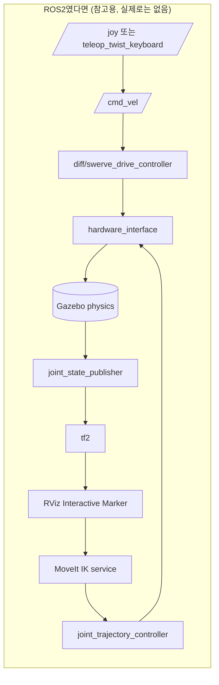
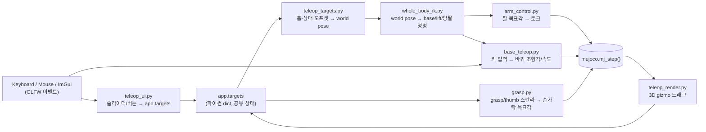

[← 전체 안내](../ros2-guide.md)

# Part 1 — 개념 지도: ROS2 세계관에서 이 프로젝트로 {: #part-1 }

## 1.1 큰 그림 비교표 {: #part-1-1 }

ROS2로 로봇을 다뤄본 사람이 이 저장소를 열었을 때 가장 먼저 느낄 위화감은
"어라, `ros2 node list`가 없네, 토픽도 없네, launch 파일도 없네"일 것이다.
맞다. 없다. 이 프로젝트는 로보틱스 미들웨어(ROS2/DDS)를 전혀 쓰지 않고,
MuJoCo Python 바인딩 위에 순수 Python으로 물리 루프 + GUI를 얹은
**모놀리식 시뮬레이터**다. 아래 표로 개념을 먼저 맞춰두자.

| ROS2/로보틱스 스택 개념 | 이 프로젝트에서의 대응 | 비고 |
|---|---|---|
| ROS2 노드(node) | 없음 — `TeleopApp` 클래스 인스턴스 하나 | 프로세스가 하나뿐이라 노드 경계 자체가 없다 |
| 토픽 publish/subscribe | 없음 — 파이썬 함수 호출과 공유 dict(`app.targets`) | 전부 같은 프로세스, 같은 스레드라 직렬화/네트워크가 필요 없다 |
| 서비스(service) 호출 | 없음 — 그냥 함수 호출 | 예: `capture_grasp()`는 서비스가 아니라 메서드 |
| 액션(action, ex. `GripperCommand`) | `grasp.apply_grasp()` (스칼라 즉시 반영) | goal/feedback/result 개념 없음, 매 스텝 값만 밀어넣음 |
| URDF/xacro | MJCF(`models/full_scene.xml`) | 아래 2.1에서 상세 비교 |
| `robot_state_publisher` + tf2 | 없음 — MuJoCo가 `data.site_xpos`/`xmat`를 직접 계산해줌 | tf 트리 자체가 없다, 아래 Part 11 참고 |
| `joint_state_publisher` / `/joint_states` 토픽 | `data.qpos` 배열 직접 읽기 | 퍼블리시 안 하고 그냥 메모리에서 읽는다 |
| `ros2_control` (hardware_interface, controller_manager) | `arm_control.ArmTorqueController`, `grasp.apply_grasp`, `base_teleop.SwerveDrive` | 컨트롤러 플러그인 로딩 없이 그냥 파이썬 클래스 3개 |
| `ros2_control` command interface (position/velocity/effort) | MuJoCo actuator 타입 3종(`<position>`/`<velocity>`/`<motor>`) | 아래 2.5 |
| MoveIt (IK 서비스, 모션 플래닝, 충돌 회피 경로) | `src/whole_body_ik.py`의 `WholeBodyIK` | base/lift/양팔 differential IK와 reactive collision CBF가 있고, ROS·전역 경로 플래너는 없다 |
| RViz Interactive Marker (3D 드래그 핸들) | `teleop_render.py`의 ImGuizmo + MuJoCo mocap body | 아래 Part 10 |
| `rqt`/dynamic reconfigure 슬라이더 패널 | `teleop_ui.py`의 ImGui 패널 | 그림도 물리도 같은 창 안에서 그려진다 |
| Gazebo/Ignition (물리 시뮬레이터) | MuJoCo | 둘 다 "물리 엔진"이지만 세부 개념이 다르다 (아래 Part 2) |
| `nav2`(cmd_vel, twist_mux, diff_drive_controller) | `base_teleop.SwerveDrive` | ROS2 없이 직접 구현한 스워브 역기구학 |
| launch 파일(`.launch.py`) | 없음 — `python3 src/teleop_app.py` 한 줄 | 노드가 하나뿐이니 launch로 여러 프로세스를 묶을 필요가 없다 |
| 파라미터 서버(`ros2 param`) | 파이썬 모듈 최상단 상수(`grasp.py`의 `FINGER_OPEN_FRAC` 등) | 런타임 재설정 불가, 코드/XML 값을 고쳐야 함 |
| `colcon test` / `launch_testing` | `tests/test_phase_{0..6}.py`, `tests/test_whole_body.py` | headless, 순차 실행; 아래 Part 12 |
| DDS QoS, 콜백 그룹, executor, spin | 없음 — `while` 루프 하나 | "멀티스레드로 인한 레이스 컨디션"이라는 문제 자체가 없다 |

## 1.2 왜 ROS2가 없는가 {: #part-1-2 }

이 프로젝트는 실물 로봇을 조작하는 프로덕션 스택이 아니라, **"contact force만으로
캔을 쥘 수 있는가"**라는 물리 시뮬레이션 질문 하나에 집중하려고 만든 연구용/학습용
시뮬레이터다(Part 3 참고). ROS2를 쓰면 얻는 이점(멀티 프로세스 분산, 실제 하드웨어
드라이버 재사용, 표준화된 메시지)이 이 목표에는 오히려 군더더기다 — 노드 간
통신 지연, DDS 설정, launch 파일 관리 같은 인프라 문제를 디버깅하느라 정작
물리 튜닝에 쓸 시간을 뺏기고 싶지 않았다는 뜻이다. 그래서 **하나의 while 루프
안에서 입력→계산→물리 스텝→렌더가 전부 동기적으로 일어나는 구조**를 택했다.
이건 흔히 "teleop 프로토타입"에서 쓰는 접근이고, 실제로 이 프로젝트의 설계 원칙도
맨 위에 "사람이 조작해서 집는다(자율 실행 FSM 없음)"를 명시하고 시작했다.

## 1.3 아키텍처 다이어그램 비교 {: #part-1-3 }

ROS2로 같은 걸 만들었다면 대략 이런 그래프가 됐을 것이다(참고용, 이 프로젝트엔
실존하지 않음):

이 프로젝트의 실제 구조는 이렇다 — 전부 한 프로세스, 화살표는 네트워크 메시지가
아니라 **파이썬 함수 호출/딕셔너리 읽기쓰기**:

핵심 차이: ROS2 버전은 노드마다 별도 프로세스/스레드이고 메시지가 DDS를 거쳐
비동기로 전달된다. 이 프로젝트는 **전부 하나의 `while` 루프 안에서 순서대로,
동기적으로** 실행된다. 그래서 "레이스 컨디션"이라는 단어 자체가 이 코드베이스에
등장하지 않는다 — 애초에 두 스레드가 동시에 뭔가를 건드릴 일이 없다.

---

[전체 안내](../ros2-guide.md) · [Part 2 →](./02-mujoco-model-data.md)
