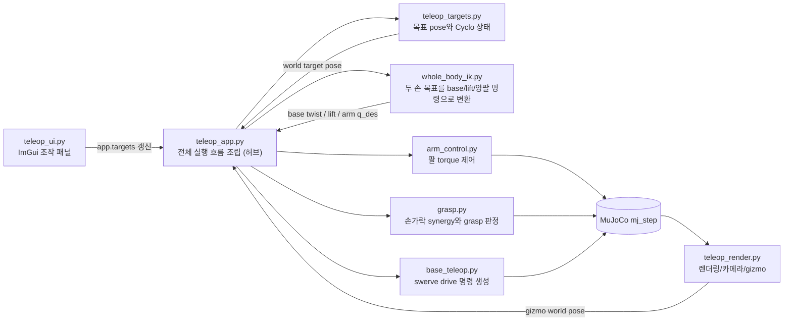

[← 전체 안내](../ros2-guide.md)

# Part 4 — 전체 아키텍처 실행 흐름 {: #part-4 }

## 기능 구현 요약

| 구분 | 내용 |
|---|---|
| 해결할 문제 | UI 입력, 목표 변환, IK, 액추에이터 명령, 물리 계산, 렌더링이 서로의 상태를 덮어쓰지 않으면서 한 프레임 안에서 일관된 순서로 실행돼야 한다. |
| 해결 방법 | `TeleopApp`만 조립 지점으로 두고 각 모듈은 계산 결과만 반환한다. `_step_physics()`가 제어 순서를, `_step_actuators()`가 최종 `data.ctrl` 쓰기를 소유한다. |
| 사용 수식 | 이 계층 자체에는 별도 제어 수식이 없다. 각 알고리즘의 수식은 Part 5~10에서 전개한다. |
| 코드 구현 과정 | `run()` → `teleop_ui.draw_panel()` → `_step_physics()` → `_step_actuators()` → `mujoco.mj_step()` → `teleop_render.render_scene()` 순으로 호출한다. |
| 수식 없이 사용하는 함수 | `_read_base_feedback()`, `_update_grasp_targets()`, `_smooth_hand_targets()`, `_smoothed_target_poses()`, `teleop_render.begin_frame()`, `teleop_render.end_frame()` |

## 4.1 파일 지도 {: #part-4-1 }

```text
ffw-sh5-grasp/
├── assets/robotis_ffw/        # 공식 menagerie 원본 (수정 금지)
├── models/
│   ├── hand_only.xml          # Phase 1-2: 오른손 단독 + 캔
│   ├── arm_hand.xml           # Phase 3: 오른팔+오른손+테이블+캔
│   └── full_scene.xml         # Phase 4-6: 전신 로봇 (지금 teleop이 로드하는 모델)
├── src/
│   ├── teleop_app.py          # 조립 지점 + 메인 루프 (이 문서의 "허브")
│   ├── teleop_ui.py           # ImGui 패널
│   ├── teleop_render.py       # GLFW/렌더/카메라/3D gizmo
│   ├── teleop_targets.py      # target ↔ world pose 변환, Cyclo 상태
│   ├── kinematics.py          # 정규화 pose + world-aligned FK/Jacobian 공용 계층
│   ├── whole_body_ik.py       # base/lift/양팔 weighted differential IK
│   ├── ik.py                  # legacy 단일 팔 6DOF DLS IK(회귀 테스트용)
│   ├── arm_control.py         # 팔 토크 제어(PD+중력보상)
│   ├── grasp.py               # 손가락 synergy + 접촉 기반 grasp 판정
│   ├── base_teleop.py         # 스워브 드라이브
│   └── mj_util.py             # joint -> actuator 탐색 등 공용 MuJoCo 헬퍼
└── tests/                     # Phase별 + whole-body headless 회귀 테스트
```

## 4.2 모듈 의존 다이어그램 {: #part-4-2 }



각 화살표는 네트워크 메시지가 아니라 **같은 프로세스 안의 함수 호출/인자 전달**
이라는 점을 다시 강조한다.

## 4.3 메인 루프 완전 해부 {: #part-4-3 }

`src/teleop_app.py`의 `TeleopApp.run()`이 프로그램의 심장이다. 실제 코드를
그대로 인용하고 줄마다 설명을 붙인다.

```python
def run(self):
    while not glfw.window_should_close(self.window):
        t0 = time.perf_counter()
        io = teleop_render.begin_frame(self)

        teleop_render.handle_camera_mouse(self, io)
        self._handle_edge_keys(io)
        drive_keys = self._read_drive_and_lift_keys(io)
        self._draw_ui_panel()
        self._step_physics(drive_keys)
        teleop_render.render_scene(self)
        teleop_render.end_frame(self, t0)

    teleop_render.shutdown(self)
```

| 줄 | ROS2식으로 말하면 |
|---|---|
| `while not glfw.window_should_close(...)` | `rclpy.spin()`에 해당하는 "이 프로그램이 살아있는 동안 반복" 루프. 단, executor도 콜백 큐도 없이 그냥 while문 |
| `begin_frame` | GLFW 이벤트 폴링 + ImGui 새 프레임 시작. `sensor_msgs/Joy` 콜백이 큐에서 이벤트를 꺼내는 것과 비슷한 역할을 여기서 동기적으로 함 |
| `handle_camera_mouse` | 순수 뷰어 카메라 조작(로봇 상태와 무관) — RViz 카메라 조작과 동급, 시뮬레이션에 영향 없음 |
| `_handle_edge_keys` | R(캔 리셋)/G(접촉 시각화)/V(collision CBF 시각화)/C(카메라 전환) — "눌렀다 뗄 때 한 번만" 발동하는 키. `KeyEdge` 클래스가 직접 구현한 간단한 엣지 검출기(디바운스와 비슷) |
| `_read_drive_and_lift_keys` | 계속 눌려 있는 동안 계속 반응해야 하는 키(방향키 주행, Q/E 리프트) — level-triggered |
| `_draw_ui_panel` | `teleop_ui.draw_panel(self)` 호출 — 이 프레임의 슬라이더/버튼 렌더 + `app.targets` 갱신 (이 함수 자체는 물리를 전혀 안 건드림) |
| `_step_physics` | **진짜 로봇을 움직이는 부분.** 아래 4.3.1에서 통째로 해부 |
| `render_scene` | MuJoCo 3D 렌더 + gizmo + ImGui 그리기 + 버퍼 스왑 |
| `end_frame` | FPS 계산 + 남는 시간만큼 `time.sleep` (25Hz 유지) |

**"ROS2였다면 이건 무엇인가"**: 이 루프 전체가 대략 `MultiThreadedExecutor` 없이
`rclpy.spin_once()`를 25Hz 타이머 콜백 하나 안에서 반복하는 것과 같다. 다만
그 콜백 하나가 센서 읽기, 컨트롤러 계산, 액추에이터 명령, 렌더링까지 전부
한다 — 실제 ROS2라면 여러 노드/콜백 그룹으로 쪼갤 일을 일부러 안 쪼갠 것이다
(1.2절 참고).

### 4.3.1 `_step_physics(drive_keys)` 내부 순서

```python
def _step_physics(self, drive_keys):
    ctx_qpos = data.qpos.copy()
    # 1) Bimanual MoveL이 캡처된 상태면 virtual object target으로 양손 target을 갱신
    if self.cyclo_grasp_captured:
        self.apply_virtual_object_target()
    # 2) Grab/Release 버튼 상태를 grasp/thumb 슬라이더 값으로 서서히 ramp
    for side in ("r", "l"):
        ...
    # 3) 슬라이더 원시값 -> rate-limit된 smoothed_pos/smoothed_rpy
    for side in ("r", "l"):
        ...
    # 4) IK 모드인 손: solve_pose() 호출. FK 모드인 손: 관절각 슬라이더 값을 그대로 사용
    if self.arm_mode["r"] == "ik": ...
    if self.arm_mode["l"] == "ik": ...
    # 5) 스워브 드라이브 명령 계산 (프레임당 1회)
    wheel_cmds = self.base_drive.update(...)
    # 6) 물리 서브스텝 여러 번 반복: 토크/grasp/lift/바퀴 ctrl 기록 -> mj_step
    for _ in range(self.steps_per_frame):
        self.ctrl_r.apply(data, self.q_des_r)
        self.ctrl_l.apply(data, self.q_des_l)
        data.ctrl[self.lift_aid] = self.targets["lift"]
        ... wheel ctrl ...
        grasp.apply_grasp(model, data, ...)
        mujoco.mj_step(model, data)
```

여기서 반드시 짚어야 할 것 두 가지:

1. **렌더 프레임(25Hz)과 물리 스텝(더 촘촘한 `timestep`)은 다른 주기다.**
   `steps_per_frame = frame_dt / model.opt.timestep`만큼 `mj_step`을 여러 번
   돌린다 — ROS2의 "제어 루프 주기(예: 1kHz)"와 "디스플레이 갱신 주기(60Hz)"가
   다른 것과 같은 이유다. 안정적인 물리 적분에는 훨씬 촘촘한 타임스텝이
   필요하기 때문.
2. **IK/토크/grasp/바퀴 명령은 매 서브스텝마다 다시 적용된다.** 한 번 계산해서
   여러 스텝 동안 값을 "붙박이"로 두지 않고, 서브스텝 루프 안에서 매번
   `ctrl_r.apply`, `grasp.apply_grasp` 등을 다시 호출한다 — `ros2_control`의
   컨트롤러가 매 제어 주기마다 다시 계산되는 것과 같은 이유(제어값이 상태
   피드백에 반응해야 하므로).

## 4.4 "이건 ROS2 노드로 치면 무엇인가" — 파일별 정리 {: #part-4-4 }

| 파일 | 굳이 ROS2 노드로 비유하면 |
|---|---|
| `teleop_app.py` | 모든 걸 한 콜백 안에서 처리하는 유일한 노드(사실상 launch 파일 + 노드 + executor를 겸함) |
| `teleop_ui.py` | `rqt` 플러그인 하나, 단 별도 프로세스가 아니라 인프로세스 위젯 |
| `teleop_render.py` | RViz(3D 뷰) + 그 안의 InteractiveMarkerServer를 한 파일에 합친 것 |
| `teleop_targets.py` | tf2 buffer/lookup + MoveIt의 "pose goal 계산"을 대신하는 순수 함수 모음 |
| `kinematics.py` | Pinocchio `framesForwardKinematics`/`LOCAL_WORLD_ALIGNED` Jacobian 계층의 MuJoCo 버전 |
| `ik.py` | MoveIt의 IK 플러그인(KDL/TRAC-IK 자리) 하나만 떼어낸 것. 플래닝은 없다 |
| `arm_control.py` | `ros2_control`의 `effort_controllers` 플러그인 하나 |
| `grasp.py` | 그리퍼 액션 서버 + `/gripper/force_torque` 센서 판정 로직을 합친 것 |
| `base_teleop.py` | `swerve_drive_controller` + `twist_mux`를 합친 것 |

---

[← Part 3](./03-project-identity.md) · [전체 안내](../ros2-guide.md) · [Part 5 →](./05-hand-control.md)
