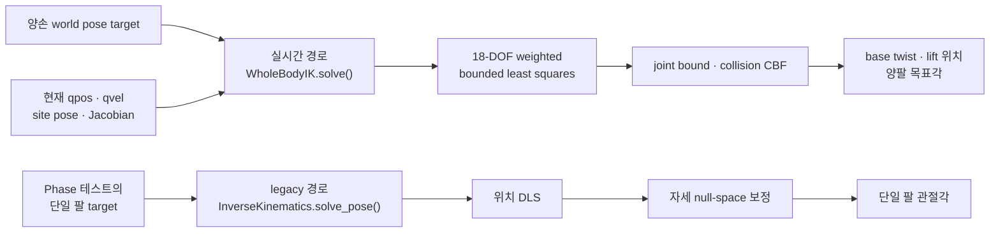
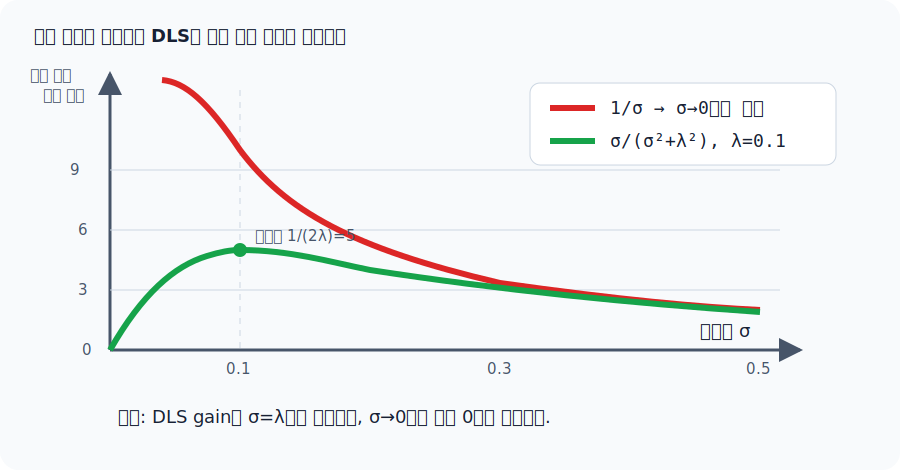
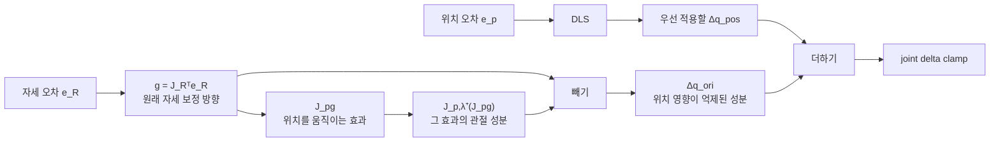
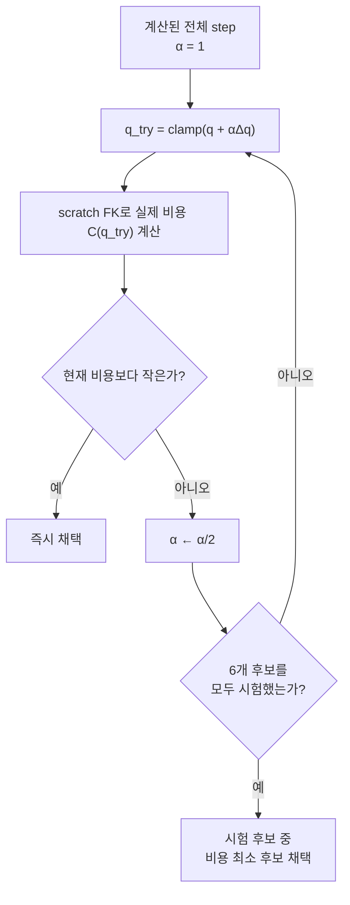

[← 전체 안내](../ros2-guide.md)

# Part 6 — 전신 IK와 단일 팔 DLS IK {: #part-6 }

!!! info "현재 실행 경로와 개발자 가이드"
    실시간 텔레옵은 [`WholeBodyIK`](../whole_body_ik.md)를 호출하고,
    [`kinematics.py`](../kinematics.md)가 FK·Jacobian·자세 오차를 공통 제공한다.
    [`ik.py`](../ik.md)의 단일 팔 DLS solver는 Phase 3·4·6 회귀 테스트와
    `tests/record_demo.py`에서 사용되는 legacy 검증 경로다.

!!! tip "DLS와 null-space 식만 집중해서 보고 싶다면"
    [DLS와 위치 우선 IK 수학](../ik-math.md)은 목적함수의 항별 전개와 미분부터
    primal/dual 변환, SVD gain, 정확한 projector와 damped 잔차까지 모든 중간
    등식을 생략하지 않고 전개한다. 이 Part는 시스템 맥락과 구현 흐름에 집중한다.

## 기능 구현 요약

| 구분 | 내용 |
|---|---|
| 해결할 문제 | 양손 목표를 base·lift·양팔이 함께 추종하되 속도/관절 한계와 충돌 안전거리를 지켜야 한다. 단일 팔 회귀 경로에서는 특이점의 관절 step 폭발도 막아야 한다. |
| 해결 방법 | 실시간 경로는 weighted bounded differential IK에 joint-limit bound와 collision barrier를 결합한다. legacy 단일 팔 경로는 위치 DLS 뒤에 자세 보정을 damped null-space로 투영한다. |
| 사용 수식 | 실시간 경로는 먼저 \(\dot q_0=\arg\min_{\ell\le\dot q\le u}\|A\dot q-b\|^2\)를 푼다. 충돌 제약이 켜지면 \(\arg\min_{\ell\le\dot q\le u}\|\dot q-\dot q_0\|^2+\mu\|\max(0,h-G\dot q)\|^2\)로 안전 보정한다. 단일 팔 식은 [DLS와 위치 우선 IK 수학](../ik-math.md)에 목적함수부터 생략 없이 전개했다. |
| 코드 구현 과정 | `TeleopApp._step_physics()` → `WholeBodyIK.solve()` → `kinematics.evaluate_site()` → `_bounded_least_squares()`/`_bounded_least_squares_with_barriers()` → base twist·lift 위치·양팔 위치 명령 반환 순서다. |
| 수식 없이 사용하는 함수 | `rebase()`는 수동 주행 handover 기준을 재설정하고, `set_rigid_grasp()`는 양손 상대 pose를 캡처하며, `collision_distances()`는 모니터링/시각화용 거리 상태를 반환한다. |

## 6.1 이 프로젝트에 왜 MoveIt이 없는가 {: #part-6-1 }

MoveIt은 (1) IK 계산 (2) 충돌을 피하는 전체 궤적 플래닝 (3) 궤적 실행까지
포괄하는 프레임워크다. 이 프로젝트는 사람이 매 프레임 조금씩 옮긴 양손 목표를
현재 상태에서 바로 추종하는 **속도 수준 전신 IK**가 핵심이므로 전체 경로
플래너를 두지 않았다. `src/whole_body_ik.py`가 base·lift·양팔 명령을 한 문제로
풀고, 결과를 실제 actuator 경로로 보낸다. `src/ik.py`는 단일 팔 알고리즘의
회귀·오프라인 검증을 담당한다. 어느 경로도 장애물 주위의 전역 경로, 궤적
스무딩, 시간 파라미터화를 생성하지 않는다.



위쪽이 현재 앱의 제어 경로이고 아래쪽은 회귀·학습용 단일 팔 경로다. 이어지는
6.2~6.7의 DLS 전개는 아래쪽 경로를 작은 예제로 삼고, 실시간 전신 식은
[`whole_body_ik.py` 개발자 가이드](../whole_body_ik.md)에서 이어진다.

## 6.2 이 Part를 이해하는 데 필요한 수학: 벡터, 행렬, 야코비안, null space {: #part-6-2 }

> 이 절은 선형대수를 아직 안 배웠거나(대학 1학년 1학기 수준을 가정) 배웠어도
> 가물가물한 사람을 위한 것이다. 아래 개념들만 잡고 가면 이후 나오는 모든 식을
> 그대로 따라갈 수 있다. 이미 익숙하다면 6.3으로 건너뛰어도 된다.

**벡터란**: 숫자를 순서대로 여러 개 묶어놓은 것. 화살표로 그리면 "어느
방향으로 얼마나"를 나타내는 것과 같다. 이 문서에서는 "위치"(x, y, z 세 숫자)나
"관절각 전체"(이 팔은 관절이 7개니까 숫자 7개)를 벡터로 다룬다.

**행렬이란, "벡터에 행렬을 곱한다"는 게 무슨 뜻인가**: 행렬은 숫자를 격자(표)
모양으로 늘어놓은 것이다. 행렬을 벡터에 곱하면(\(Ax\)) 새 벡터가 나오는데, 이건
"\(x\)라는 입력을 \(A\)라는 규칙에 따라 변환해서 출력을 만든다"는 뜻이다.
예를 들어

\[
\begin{pmatrix}\cos\theta & -\sin\theta \\ \sin\theta & \cos\theta\end{pmatrix}
\begin{pmatrix}x\\y\end{pmatrix}
\]

라는 곱은 "점 \((x,y)\)를 원점 기준으로 각도 \(\theta\)만큼 돌린 새 점"을
계산한다(이 행렬이 실제로 Part 8.3의 스워브 계산과 Part 10.3의 좌표 변환에
그대로 나온다). 즉 행렬은 "벡터를 다른 벡터로 바꾸는 규칙"을 숫자 표 하나로
적어둔 것이라고 생각하면 된다.

이 문서에서 또 자주 나오는 표기 두 가지:

- **전치(transpose, \(A^T\))**: 행렬의 행과 열을 맞바꾼 것(대각선을 기준으로
  뒤집는다고 생각해도 된다).
- **직교행렬(orthogonal matrix)**: 회전을 나타내는 행렬처럼, 열벡터들이 서로
  수직인 단위벡터로 이뤄진 특별한 행렬. 이런 행렬은 \(A^TA=I\)(단위행렬)를
  만족하는데, 이 말은 곧 **전치가 바로 역행렬**(\(A^{-1}=A^T\))이라는
  뜻이다 — 역행렬을 따로 어렵게 계산할 필요 없이 그냥 뒤집기만 하면 된다는
  것(Part 9.2, Part 10.3에서 이 성질을 그대로 쓴다). 아무 행렬이나 이 성질을
  갖는 건 아니고, 회전처럼 "길이와 각도를 보존하는 변환"만 그렇다.

**야코비안(Jacobian)이란**: 고등학교/1학년 미적분에서 "미분"은 "입력을 아주
조금 바꾸면 출력이 얼마나 바뀌는가"(변화율)를 알려주는 값이다. 그런데 이
프로젝트의 IK 문제는 입력이 숫자 하나가 아니라 관절각 7개, 출력도 손끝 위치
3개(x,y,z)다 — **입력도 여러 개, 출력도 여러 개인 함수의 "미분"에 해당하는
것이 야코비안**이다.

구체적으로, 관절각 \(q=(q_1,\dots,q_7)\)이 바뀌면 손끝 위치
\(x=(x_1,x_2,x_3)\)도 바뀐다. 이 관계를 \(x=f(q)\)라 하면, 야코비안 \(J\)는
"\(q_i\) 하나만 아주 조금 바꿨을 때 \(x_j\)가 얼마나 바뀌는지"를 전부 모아놓은
3×7 행렬이다(각 성분이 편미분):

\[
J_{ji} = \frac{\partial x_j}{\partial q_i}
\]

이 행렬을 알면, 관절을 \(\Delta q\)만큼 바꿨을 때 손끝이 대략 얼마나 움직일지
근사적으로 예측할 수 있다: \(\Delta x \approx J\,\Delta q\)(이것도 결국 "행렬 곱 =
변환"이라는 위 개념 그대로다). IK가 실제로 풀려는 문제는 이 식의 반대
방향이다 — "손끝이 목표까지의 오차 \(e\)만큼 움직이길 원하는데, 그러려면
관절을 얼마나(\(\Delta q\)) 바꿔야 하는가"를 거꾸로 구하는 것이 6.3의 DLS
공식이다. `mj_jacSite`가 매 반복마다 이 야코비안을 계산해준다 — MuJoCo가 로봇의
관절 구조(기구학)를 이미 알고 있어서 대신 계산해주는 것이고, 사용자가 미분식을
손으로 유도할 필요는 없다.

**null space(영공간, 커널)란**: 이 로봇 팔은 관절이 7개인데, 손끝 pose(위치
3 + 자세 3 = 6개 숫자)를 정하는 데는 이론적으로 6개 자유도만 있으면 충분하다 —
즉 필요한 것보다 관절이 하나 더 많다("여유 자유도", redundant DOF). 이런
경우 "손끝 위치는 전혀 안 바꾼 채로 팔 안쪽 자세만 바꿀 수 있는 관절 움직임의
조합"이 반드시 존재한다 — 실제로 팔을 뻗어 손끝을 책상 위 한 점에 고정한 채로
팔꿈치만 위아래로 움직여 보면, 사람 팔에서도 이런 여유가 있다는 걸 몸으로
느낄 수 있다.

야코비안의 언어로 말하면: 이렇게 "손끝에는 (근사적으로) 아무 영향을 주지 않는"
관절 방향 \(v\)들의 집합이 바로 \(J\)의 **null space**다. 정의는 \(Jv=0\)을
만족하는 모든 \(v\)의 집합 — "이 방향으로 관절을 움직여도 야코비안이 예측하는
손끝 변화는 정확히 0"이라는 뜻이다.

이게 6.4(계층형 IK)에서 왜 중요한가: 위치를 이미 다 맞춘 뒤에 자세가 아직
안 맞았다면, "위치에 영향을 주지 않는 방향"(=위치 야코비안 \(J_p\)의 null
space) 안에서만 관절을 추가로 움직이면, 방금 맞춘 위치에 미치는 영향을 억제하면서
자세를 마저 맞출 수 있다. "자세 오차를 관절 방향으로 바꾼 값"(\(J_r^Te_{ori}\))을
통째로 다 쓰는 대신, 그중 null space에 들어가는 성분만 걸러 쓰는 것이 6.4의
투영 공식이 하는 일이다.

**특이점(singularity) — 왜 갑자기 역행렬이 폭발하는가**: 관절 개수만큼 자유도가
있어도, 어떤 특정 자세에서는 "야코비안이 표현할 수 있는 방향의 개수"가
순간적으로 줄어드는 경우가 있다 — 예를 들어 팔을 완전히 쭉 편 자세에서는
팔꿈치를 살짝 굽혀도 손끝이 거의 안 움직인다(그 방향으로의 "민감도"가 0에
가까워진다). 이런 자세를 **특이점**이라 부른다. 역행렬을 취하는 계산은 사실상
"그 민감도로 나누기"를 하는 셈이라, 민감도가 0에 가까워지면 결과가 0으로
나누는 것처럼 무한대로 튄다. 6.3의 DLS 공식에 들어가는 감쇠항 \(\lambda\)가
바로 이 "거의 0으로 나누기"를 막아주는 안전장치다 — 나눗셈의 분모에 작은
양수를 더해 절대 0에 너무 가까워지지 않게 하는 것과 같은 발상이다.

## 6.3 문제 정의와 DLS(damped least squares) {: #part-6-3 }

목표: MJCF의 `site`(`grasp_target_r`) 하나가 목표 위치/자세에 오도록 팔
7관절의 각도를 구한다. 관절각을 조금 바꿨을 때(\(\Delta q\)) site 위치가 얼마나
움직이는지는 야코비안 \(J\)(`mj_jacSite`가 계산)이 1차 근사로 알려준다:
\(\Delta x \approx J\,\Delta q\). 목표는 원하는 위치 오차 \(e\)(목표-현재)를
그대로 만드는 \(\Delta q\)를 찾는 것, 즉 \(J\,\Delta q = e\)를 푸는 것이다.

**왜 그냥 \(J^{-1}\)(또는 \(J^+\), pseudo-inverse)로 풀지 않는가**: 이 로봇 팔은
7자유도라 \(J\)가 정사각행렬이 아니고(3×7 또는 6×7), 게다가 특정 자세(singularity,
예: 팔이 거의 다 펴진 상태)에서는 \(J J^T\)가 거의 특이(singular, 행렬식이 0에
가까움)해진다 — 역행렬을 취하면 그 근처에서 아주 작은 위치 오차 \(e\)에도 관절
속도 \(\Delta q\)가 무한대로 튄다(역행렬의 원소가 행렬식에 반비례하기 때문).
실제 텔레옵에서는 이게 "팔이 갑자기 확 튀는" 증상으로 나타난다.

**DLS가 이걸 어떻게 막는가**: 순수 최소제곱 대신, 아래 두 항을 동시에 작게 만드는
\(\Delta q\)를 찾도록 문제 자체를 바꾼다 — "오차를 줄이되, 관절을 너무 크게
움직이는 것도 페널티로 취급한다"(Tikhonov/능형 회귀와 같은 정규화 기법):

\[
\min_{\Delta q} \; \|J\,\Delta q - e\|^2 + \lambda^2 \|\Delta q\|^2
\]

이 최소화 문제를 풀면(미분해서 0으로 놓고 정리) 바로 아래 닫힌 형태 해가
나온다 — \(\lambda\)가 클수록 "관절을 작게 움직여라"는 페널티가 세져서 특이
자세 근처에서도 해가 안전한 크기로 유지된다. \(\lambda=0\)이고 \(JJ^T\)가
가역인 full-row-rank 조건에서만 아래 식은 \(J^T(JJ^T)^{-1}\), 즉 해당 형태의
Moore–Penrose pseudoinverse와 같아진다. 특이점에서는 \(JJ^T\)의 역행렬 자체가
존재하지 않으므로 \(\lambda=0\)으로 둘 수 없다:

\[
\Delta q = J^T (J J^T + \lambda^2 I)^{-1} \, e
\]

여기서 \(e\)는 위치 오차(목표 - 현재), \(\lambda=0.05\)가 기본값
(`DEFAULT_DAMPING`) — 너무 크면 수렴이 느려지고(관절을 조금씩만 움직이므로),
너무 작으면 다시 특이 자세 근처에서 불안정해지는 트레이드오프다. 코드로는 이렇게
그대로 나타난다:

```python
lam2 = self.damping ** 2
position_system = jacp @ jacp.T + lam2 * np.eye(3)
dq_pos = jacp.T @ np.linalg.solve(position_system, pos_err)
```

<figure markdown>
  
  <figcaption>특이값이 0에 가까워질 때 순수 의사역행렬의 gain은 폭증하지만 DLS gain은 유한하며 0으로 줄어든다.</figcaption>
</figure>

그림의 가로축 \(\sigma\)는 관절 움직임이 손 움직임으로 전달되는 민감도다. 왼쪽
특이점 영역에서 DLS 곡선이 내려가는 모습이 “움직이기 어려운 방향을 더 세게 밀지
않는다”는 감쇠항의 역할을 보여준다.

## 6.4 계층형 IK — position이 orientation보다 우선 {: #part-6-4 }

**왜 위치와 자세를 한 번에 안 푸는가**: 가장 직관적인 확장은 위치 오차(3)와 자세
오차(3)를 이어붙인 6차원 오차 벡터 하나에 6.3과 똑같은 DLS를 적용하는 것이다(스택
야코비안 6×n). 실제로 처음엔 이렇게 구현했지만, 자세 오차가 크면 위치를 맞추려는
성분과 자세를 맞추려는 성분이 같은 \(\Delta q\) 안에서 서로 간섭해 흔들리고
발산했다(실측으로 확인) — 두 목표가 같은 관절 예산을 놓고 매 스텝 다투는 구조이기
때문이다. 그래서 "위치가 항상 이긴다"는 우선순위를 아예 식에 박아넣는
**task-priority(계층형)** 방식을 쓴다:

1. 위치 오차만으로 \(\Delta q_{pos}\)를 6.3의 DLS로 먼저 푼다 — 자세는 아직
   전혀 고려하지 않은 순수 위치 해.
2. 자세 보정 \(\Delta q_{ori}\)를 그 위에 더하되, **위치에 미치는 영향을 크게 줄인
   방향으로만** 더한다. "위치를 안 건드리는 관절 조합들의 집합"이 정확히
   \(J_p\)의 null space(핵공간, \(J_p x = 0\)을 만족하는 \(x\) 전체)다. 임의의
   벡터 \(g\)를 그 null space에 투영하는 표준 공식은 \(g - J_p^{+}(J_p g)\)
   (전체에서 "\(J_p\)를 통해 위치에 영향을 주는 성분"을 빼는 것)인데, 여기서
   \(J_p^{+}\)는 6.3과 같은 damped pseudo-inverse를 재사용한다. \(g\)로는 자세
   오차를 관절 공간으로 보낸 gradient \(J_r^T e_{ori}\)를 쓴다:

\[
\Delta q_{ori} = \underbrace{J_r^T e_{ori}}_{g} - J_p^T (J_p J_p^T + \lambda^2 I)^{-1} \big(J_p \, \underbrace{J_r^T e_{ori}}_{g}\big)
\]

이렇게 만든 \(\Delta q_{ori}\)는 1차 근사에서 \(J_p\,\Delta q_{ori}\approx 0\)이라
— 즉 위에서 이미 구한 위치 해 \(\Delta q_{pos}\)를 거의 망치지 않으면서 남는
여유 자유도만으로 자세를 맞춘다.

!!! warning "damped projector는 정확한 영공간 projector가 아니다"
    여기서는 안정성을 위해 Moore–Penrose pseudoinverse 대신 damped
    pseudoinverse를 재사용한다. 따라서 \(J_p\Delta q_{ori}=0\)이 정확히 성립하는
    것이 아니라 대략 0에 가까워진다. damping, clamp, 유한 step과 비선형성 때문에
    작은 위치 변화가 남을 수 있다.

3. \(\Delta q = \Delta q_{pos} + \Delta q_{ori}\), 관절당 최대 변화량으로
   clamp.



자세 경로에서 `빼기` 상자가 핵심이다. 자세를 돌리려는 원래 방향 전체를 쓰지 않고,
그중 손 위치를 움직일 것으로 예측된 관절 성분을 제거한 뒤 위치 해에 더한다.

이 순서 자체가 **ROS2/로보틱스에서 흔한 "task-priority IK"**(예: 상체는
위치 우선, 자세는 여유 자유도로만 맞추는 휴머노이드 전신 제어와 같은 발상)와
같은 패턴이다.

## 6.5 좌표계 함정 — site-local vs world {: #part-6-5 }

### 쿼터니언(quaternion)이란

3차원 회전은 숫자 3개(Roll/Pitch/Yaw 같은 오일러각)로도 나타낼 수 있지만,
Part 10에서 보듯 오일러각은 축끼리 서로 얽히는("짐벌락"류) 문제가 있고, 두
회전을 이어붙이는 계산도 지저분하다. 그래서 로봇공학/그래픽스에서는 회전을
숫자 4개짜리 **쿼터니언** \(q=(w,x,y,z)\)로 표현하는 경우가 많다.

직관적으로: 3차원의 모든 회전은 "어떤 축 \(\hat n\)을 기준으로 각도 \(\theta\)만큼
돈다"는 형태로 나타낼 수 있다(회전축 + 회전각, 팽이가 어느 축으로 얼마나 도는지
떠올리면 된다). 쿼터니언은 이 정보를 \(q = (\cos\frac{\theta}{2},\ \sin\frac{\theta}{2}\,\hat n)\)
형태로 담아둔 것뿐이다(\(\theta=0\), 즉 "회전 없음"일 때 \(q=(1,0,0,0)\) —
이 문서에서 종종 나오는 "identity quaternion"이 이거다). 이 프로젝트가 실제로
쓰는 연산은 딱 세 가지다:

- **곱셈/합성(\(\otimes\))**: 두 회전을 순서대로 이어붙인 회전을 만든다 —
  "먼저 이만큼 돌리고 그다음 이만큼 더 돌린다"를 쿼터니언 곱 하나로 표현한다
  (Part 9, Part 10의 `q_base ⊗ q_home ⊗ q_rpy` 같은 식이 바로 이것).
- **역(inverse)**: 그 회전을 정확히 반대로 되돌리는 회전.
- **뺄셈(`mju_subQuat`)**: "회전 A에서 회전 B까지 가려면 어떤 회전을 추가로
  해야 하는가"를 구한다(오차 계산에 쓰인다) — 바로 아래에서 이 연산이 나온다.

곱셈/역원의 정확한 계산식은 이 문서 범위 밖이지만, **"곱하면 회전이 합쳐지고,
역을 취하면 회전이 반대로 뒤집힌다"**는 성질만 기억하면 이후 나오는 식을 전부
그대로 읽을 수 있다 — 회전 버전의 "숫자 곱하기/나누기"라고 생각하면 된다.

### quaternion 부호와 world-aligned 회전 오차

`kinematics.shortest_orientation_error()`는 "지금 자세(`cur_quat`)에서 목표
자세(`target_quat`)까지 가는 데 필요한 가장 짧은 회전"을 world-frame 축각 벡터로
반환한다:

\[
q_e=q_{target}\otimes q_{current}^{-1},\qquad
e_{ori}=\hat n\,2\operatorname{atan2}(\|q_{e,xyz}\|,q_{e,w})
\]

곱셈을 `target * inverse(current)` 순서로 하므로 축은 MuJoCo `jacr`와 같은 world
frame이다. 또 quaternion은 \(q\)와 \(-q\)가 같은 자세를 나타내므로, 두 quaternion의
내적이 음수면 target 부호를 뒤집고 단위 길이로 정규화한다. 이 과정을 빼면 180°
근처에서 같은 자세가 갑자기 긴 회전 명령으로 바뀔 수 있다. 현재 공용 코드:

```python
target = normalize_quaternion(target)
current = normalize_quaternion(current)
if np.dot(target, current) < 0:
    target = -target
error_world = shortest_orientation_error(target, current)
```

`kinematics.evaluate_site()`와 scratch `KinematicsSolver.forward()`가 pose와 Jacobian을
항상 이 규칙으로 제공하므로 단일 팔 IK와 whole-body IK가 같은 좌표계를 사용한다.

## 6.6 backtracking line search {: #part-6-6 }

**왜 DLS+null-space 투영만으로는 부족한가**: `max_joint_delta`로 스텝 크기 자체는
이미 한 번 clamp되지만(6.3), 그건 "관절이 한 번에 얼마나 크게 움직일 수 있는지"의
상한일 뿐이지 "그 방향이 실제로 오차를 줄이는 방향인지"는 보장하지 않는다.
\(\Delta q = J^{-1}e\) 형태의 계산은 애초에 야코비안이 **국소(local) 선형 근사**
라는 전제 위에 있다 — 오차 \(e\)가 작을 때는 이 근사가 잘 맞지만, 오차가 크면
실제 site 이동량이 야코비안이 예측한 것과 크게 달라질 수 있다(관절 각도가 크게
움직일수록 비선형성이 커지므로). 계층형 IK만으로도 오차가 큰 경우 반복할수록
진동/발산한 게 바로 이 근사 오차가 누적된 결과였다. 그래서 매 반복마다
전체 스텝을 그대로 쓰지 않고, **실제로 비용(위치 오차 + 가중치×자세 오차)이
줄어드는지 확인하며 스텝을 절반씩 줄여 재시도**한다(최대 6회) — "계산된 방향은
믿되, 그 방향으로 얼마나 멀리 가도 안전한지는 직접 측정해서 정한다"는 뜻이다:

```python
cur_cost = pos_err_norm + ori_weight * ori_err_norm
step = 1.0
for _ in range(6):
    q_try = clamp(q + step * dq_full)
    ... 비용 재계산 ...
    if cost < cur_cost:
        break
    step *= 0.5
```

구현은 비용이 감소한 후보를 찾으면 즉시 채택한다. 여섯 후보가 모두 개선되지 않으면
시험한 후보 중 비용이 가장 작은 것을 택하므로 큰 step의 위험은 줄지만, **매 반복의
단조 감소를 수학적으로 보장하지는 않는다**.



## 6.7 multistart — 국소해(local minimum) 탈출 {: #part-6-7 }

legacy 단일 팔 `solve_pose`만으로는 큰 격차나 관절 한계 근처에서 국소해에 갇힐 수 있다.
`solve_pose_multistart`는 우선 `q_init`(보통 직전 프레임의 해 — 웜스타트라
싸고 대개 좋은 시작점)으로 시도하고, 실패하면 관절 range 안에서 무작위로
뽑은 시작점 여러 개(기본 8개)로 재시도한다. 이건 MoveIt의 IK 플러그인들도
흔히 쓰는 전략(예: BioIK, TRAC-IK의 랜덤 재시작)과 같다. 이 함수는 Phase
회귀 테스트와 오프라인 검증에서만 쓰인다. 실시간 텔레옵 루프는 단일 팔
`solve_pose`나 multistart를 호출하지 않고 `WholeBodyIK.solve()`를 프레임당
한 번 호출한다.

## 6.8 두 solver의 실제 사용 위치와 실행 예산 {: #part-6-8 }

| 경로 | 호출 위치 | 프레임당 동작 |
|---|---|---|
| `WholeBodyIK.solve()` | `TeleopApp._step_physics()` | 현재 상태에서 bounded least-squares 문제를 한 번 구성하고 푼다. |
| `InverseKinematics.solve_pose()` | Phase 3·4·6 테스트, `tests/record_demo.py` | 호출자가 지정한 반복 수 안에서 DLS와 line search를 반복한다. |
| `solve_pose_multistart()` | 테스트/오프라인 검증 | 웜스타트 실패 시 여러 초기값을 시도하므로 실시간 루프에는 넣지 않는다. |

예전 구현의 stuck-frame 상수나 손별 반복 예산 감소 로직은 현재 코드에 없다.
실시간 성능은 반복 횟수를 임의로 줄이는 대신 `WholeBodyIK.solve()` 한 번의
latency를 `tests/test_whole_body.py`에서 측정해 회귀를 막는다.

---

[← Part 5](./05-hand-control.md) · [전체 안내](../ros2-guide.md) · [Part 7 →](./07-arm-torque-control.md)
