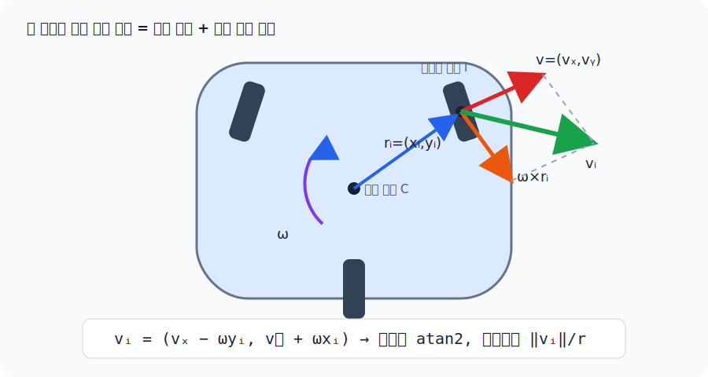
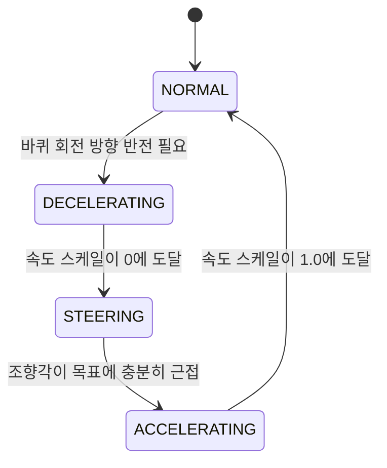

[← 전체 안내](../ros2-guide.md)

# Part 8 — 모바일 베이스: `src/base_teleop.py` {: #part-8 }

!!! info "함께 볼 개발자 가이드"
    클래스별 상태와 제어 단계는 [`base_teleop.py` 개발자 가이드](../base_teleop.md)에서
    실제 API와 함께 볼 수 있다.

## 기능 구현 요약

| 구분 | 내용 |
|---|---|
| 해결할 문제 | body-frame 속도 명령을 세 스워브 모듈의 조향각과 바퀴속도로 바꾸고, 180° 조향 대신 바퀴 방향 반전을 선택하며, 실제 feedback으로 안전하게 전환해야 한다. |
| 해결 방법 | 각 모듈 위치에서 병진속도와 회전속도를 합성하고, 가장 가까운 등가 조향 상태를 선택한 뒤 steering rate와 drive acceleration을 제한한다. |
| 사용 수식 | 모듈 \(i\)에서 \(v_{ix}=v_x-\omega_z y_i\), \(v_{iy}=v_y+\omega_z x_i\), \(\theta_i=\operatorname{atan2}(v_{iy},v_{ix})\), \(\dot\phi_i=\sqrt{v_{ix}^2+v_{iy}^2}/r\). 8.3에서 외적의 성분 전개부터 순서대로 보인다. |
| 코드 구현 과정 | `BaseTeleop.update_body()`가 입력을 body twist로 만들고 → `SwerveDrive.update_twist()`가 `SwerveKinematics.inverse()`를 호출하고 → `_control_module()`이 전환 상태를 결정하고 → `_rate_limit_drive_commands()`가 최종 명령을 제한한다. |
| 수식 없이 사용하는 함수 | `_nearest_feasible_state()`는 조향 한계 안의 등가 상태를 고르고, `_update_reversal_phase()`는 stop-align-resume 상태를 전환한다. `_hold_zero()`, `_current_steering()`, `_current_wheel_velocity()`는 정지와 feedback 처리를 담당한다. |

## 8.1 스워브 드라이브란 {: #part-8-1 }

이 로봇은 차동구동(differential drive)이 아니라 **스워브(swerve) 드라이브**
다 — 바퀴 3개(`left_wheel`, `right_wheel`, `rear_wheel`) 각각이 독립적인
**조향(steer) 액추에이터**와 **구동(drive) 액추에이터**를 가진다. 그래서
로봇이 몸을 돌리지 않고도 임의 방향으로 이동(strafe)하거나, 제자리에서
회전할 수 있다. `src/base_teleop.py`는 ROBOTIS AI Worker의
`ffw_swerve_drive_controller` 구조를 그대로 본떴다.

## 8.2 세 계층 — 입력, 기구학, feedback 제어 {: #part-8-2 }

| 클래스 | 역할 |
|---|---|
| `BaseTeleop` | 키 입력(전후진/좌우/회전)을 부드러운 body-frame 속도 `(vx, vy, wz)`로 변환. 가속/제동을 지수적으로 스무딩 |
| `SwerveKinematics` | 임의 body twist를 feasible wheel state로 변환하고, wheel feedback에서 body twist를 복원 |
| `SwerveDrive` | reversal FSM, steering rate limit, 전체 module alignment gating을 적용해 actuator 명령 생성 |

`BodyTwist(vx, vy, wz)`는 ROS2의 `geometry_msgs/Twist`와 비슷한 개념이지만 실제
ROS message는 아니다. 키보드의 `BaseTeleop.update_body()`와
`WholeBodyIK.solve()`가 같은 순수 Python 값 객체를 만들며, 토픽이나 node 없이
`SwerveDrive.update_twist()`에 바로 전달한다.

## 8.3 스워브 역기구학의 세부 로직 {: #part-8-3 }

### 외적(cross product)이란, 그리고 왜 회전하는 물체 위의 점은 원 접선 방향으로 움직이는가

두 3차원 벡터 \(a\), \(b\)의 **외적** \(a\times b\)는 그 둘 다에 수직인 새
벡터를 만드는 연산이다(방향은 오른손 법칙으로 정해지고, 크기는
\(|a||b|\sin\phi\), \(\phi\)는 두 벡터 사이 각도). "왜 회전에 이게 나오는가"는
다음 그림으로 이해하면 된다: 팽이가 중심을 축으로 각속도 \(\omega\)로 돌고
있을 때, 중심에서 \(r\)만큼 떨어진 점은 원을 그리며 움직이는데, 원운동 중인
점의 순간 속도는 항상 그 점과 중심을 잇는 반지름 벡터에 **수직**이다(원의
접선 방향). 각속도 벡터(회전축 방향, 크기가 \(\omega\))를 \(\vec\omega\)라 하면
그 점의 속도는 정확히 \(\vec\omega \times r\)로 쓸 수 있다 — 외적이 "두 벡터
모두에 수직인 벡터"를 만드는 연산이라는 정의 자체가 "반지름에 수직인 접선
속도"라는 그림과 정확히 들어맞기 때문이다.

이 로봇의 베이스는 z축(수직축) 둘레로만 도니까 \(\vec\omega\)는 z축 방향
성분만 있고 크기가 스칼라 \(\omega\)인 벡터다. 이 특수한 경우(2D 평면 회전)엔
외적 공식이 아주 간단해진다: z축 방향 벡터와 xy평면 벡터 \(r=(x_i,y_i)\)의
외적은 \(\omega\times r = \omega\,(-y_i,\,x_i)\) — \(r\)을 정확히 90도 회전시킨
벡터에 크기 \(\omega\)를 곱한 것과 같다. (2D에서는 외적을 벡터가 아니라
스칼라 \(\omega\)만으로 다루는 게 관례라, 이후로는 그냥 이 결과 공식만 쓴다.)

**이 식이 실제로 어디에 쓰이는가**: 강체(베이스)가 중심에서 각속도 \(\omega\)로
회전하고 동시에 \((v_x,v_y)\)로 평행이동할 때, 중심에서 \((x_i,y_i)\)만큼
떨어진 점(바퀴 모듈)의 순간 속도는 "중심의 이동 속도" + "회전으로 인한 접선
속도"를 그냥 더한 것이다(강체 속도장 공식 \(v_{point} = v_{center} + \omega
\times r\)). 그래서 각 바퀴 모듈이 실제로 내야 하는 평면 속도는:

\[
\begin{pmatrix} v_{i,x} \\ v_{i,y} \end{pmatrix}
=
\underbrace{\begin{pmatrix} v_x \\ v_y \end{pmatrix}}_{\text{베이스 평행이동}}
+
\underbrace{\omega\begin{pmatrix} -y_i \\ x_i \end{pmatrix}}_{\text{회전에 의한 접선 속도}}
=
\begin{pmatrix} v_x - \omega\, y_i \\ v_y + \omega\, x_i \end{pmatrix}
\]

**왜 조향각을 따로 계산하는가**: 스워브 모듈은 자동차 바퀴처럼 "이 방향으로
굴러갈 수 있는" 방향이 조향각 하나로 정해져 있어서, 위에서 구한 속도 벡터를
그 바퀴가 낼 수 있는 형태(방향 하나 + 그 방향으로의 속력 하나)로 다시 분해해야
한다 — 벡터를 극좌표로 바꾸는 것과 같다:

\[
\theta_i = \operatorname{atan2}(v_{i,y},\, v_{i,x}), \qquad
s_i = \sqrt{v_{i,x}^2 + v_{i,y}^2}
\]

목표 구동 각속도(바퀴 반지름 \(r\))는 바퀴가 미끄러짐 없이 굴러간다고 가정할 때
접선속도 \(=\) 반지름×각속도이므로 \(\dot\phi_i = s_i / r\)다. 코드는 이 두
벡터식을 그대로 옮긴 것이다. 완전 정지는 각도를 새로 계산하지 않고 현재 조향각을
유지하는 별도 분기로 처리한다:

<figure markdown>
  
  <figcaption>빨강 병진 벡터와 주황 회전 접선 벡터를 더한 초록 벡터의 방향이 조향각이고, 길이가 모듈 선속도다.</figcaption>
</figure>

```python
wheel_vel_x = vx_body - wz * module_y
wheel_vel_y = vy_body + wz * module_x
robot_angle = math.atan2(wheel_vel_y, wheel_vel_x)
linear_speed = math.hypot(wheel_vel_x, wheel_vel_y)
```

1. **제한 범위 안 동치각 탐색**: 조향각 \(\theta_i\)와 \(\theta_i+180°\)는 "같은 직선
   위에서 반대로 도는" 같은 조향 자세다 — 바퀴 방향 자체는 축이지 화살표가
   아니므로, 반대 방향으로 구르면 원래 원하던 속도 벡터와 정확히 같은 효과를
   낸다. 그래서 목표 조향각이 현재 조향각과 90도 넘게 차이 나면,
   조향을 반대쪽으로 도는 대신 "조향각 + 180도"로 놓고 바퀴 회전 방향을
   반대로 뒤집는다. 현재 MuJoCo 모델과 런타임은 공식 최신 설정과 같은 약
   ±6.28 rad를 사용한다. 그래도 먼저 각도를 구한 뒤 clamp하지 않고
   `target + k*pi` 후보를 모두 만들고, 주어진 제한 범위 안에서 현재각과 가장
   가까운 `(조향각, drive sign)` 조합을 고른다. 그래서 좁은 범위를 주입한 단위
   테스트에서도 같은 알고리즘을 그대로 검증할 수 있다.
2. **정렬 게이팅**(alignment gating): 조향이 아직 목표각에 충분히 안 맞았으면
   (`align_err`가 임계값 이상) 그 바퀴의 구동 속도를 0으로 강제한다 — 바퀴가
   가리키는 방향과 실제로 굴러가는 방향은 같아야 하는데, 조향이 안 끝난
   중간 각도에서 구동을 걸면 바퀴는 "지금 가리키는(틀린) 방향"으로 미는 힘을
   내서 로봇 전체가 의도와 다른 쪽으로 밀린다 — 위 벡터 분해가 "조향이
   이미 끝났다"는 걸 전제로 하고 있기 때문에 생기는 제약이다.
3. **반전 시퀀스**(`ReversalPhase`): 바퀴 회전 방향이 바뀔 때는
   `DECELERATING`(감속) → `STEERING`(그 자리에서 재조향) → `ACCELERATING`(재가속)
   순서로 상태를 전이한다 — 이건 사실상 작은 유한 상태 기계(FSM)다. 이미 멈춘
   바퀴는 없애야 할 운동 에너지가 없으므로 방향을 즉시 바꿔 불필요한 지연을 없앤다.



4. **전역 wheel saturation**: 어떤 한 바퀴가 속도 상한을 넘으면 그 바퀴만 clamp하지
   않고 모든 바퀴 속도에 같은 scale을 곱한다. 그래야 모듈 속도 비율이 보존돼 요청한
   차체 translation/yaw 방향이 포화 뒤에도 바뀌지 않는다.

## 8.4 `nav2`와 비교하면 {: #part-8-4 }

ROS2 nav2 스택이라면 `cmd_vel`을 만드는 부분(`BaseTeleop`에 해당)과, 그걸
실제 바퀴 명령으로 바꾸는 부분(`ros2_controllers`의 `swerve_drive_controller`
또는 유사 컨트롤러, `SwerveDrive`에 해당)이 별도 노드/플러그인으로 나뉜다.
여기서는 그냥 파이썬 클래스 3개다. `twist_mux`가 여러 소스(조이스틱, nav2,
키보드)의 `cmd_vel`을 우선순위로 중재하는 역할까지 하는데, 여기서는 키보드와
whole-body IK 두 소스를 `teleop_app.py`가 직접 중재한다. 키를
누르는 동안 manual body twist가 우선이고, 그렇지 않으면 whole-body base twist가
같은 스워브 경로로 들어간다. ROS 패키지나 controller manager는 설치하지 않는다.

## 8.5 Whole-body IK와 연결 {: #part-8-5 }

`whole_body_ik.py`는 `KinematicTree`가 직접 만든 full Jacobian에서 base x/y/yaw 열도
함께 사용한다.
해에서 나온 world base velocity는 현재 yaw의 역회전으로 body frame에 바꾼 뒤
`SwerveDrive.update_twist()`에 전달된다. solver가 base qpos를 직접 적는 것은 아니다.
UI의 **Whole-body Control**을 OFF로 바꾸면 base x/y/yaw와 lift의 velocity bound를
정확히 0으로 고정해 팔만 IK에 참여한다. 키보드 주행과 수동 lift 명령은 별도 경로라
계속 쓸 수 있고, 전환 시 world target과 virtual object pose는 보존된다.


Cyclo 공식 구현에서 참고한 핵심은 공용 kinematics 계층, `J^T W J` 형태의 weighted
task, velocity bound, 관절 한계 control-barrier constraint, bimanual rigid-grasp
relative Jacobian이다. collision pair도 최근접점의 점 Jacobian 차이로 distance
gradient를 만들고 3 cm 안에서 감시해 1 cm CBF를 건다. 이 프로젝트는 Pinocchio/FCL/OSQP/ROS를
가져오지 않고 MuJoCo의
world-aligned site Jacobian과 18변수 NumPy BVLS box-QP로 푼다. 한 번 bound에
고정한 변수를 해제하지 못했던 이전 one-way active set과 달리 active-bound
gradient의 KKT 부호를 검사해 필요한 변수를 다시 free set으로 돌려보낸다.

## 8.6 해결된 모바일 결함 — 조향 정지와 제자리 회전 {: #part-8-6 }

게인만 올려서는 풀리지 않던 두 원인을 물리 회귀로 분리했다.

첫째, 조향 rate limiter가 매 프레임 실제 조향각을 기준으로 다음 명령을 만들었다.
타이어 정지마찰로 실제축이 늦으면 position servo 오차가 일정하게 고정되어 토크도
더 이상 커지지 않았고, 앞바퀴가 약 20°에서 갇혔다. 이제 limiter는 이전 **명령
궤적**에서 다음 명령을 만든다. 실제 피드백은 alignment gating과 reversal FSM에만
사용한다. 피드백이 일부러 지연되는 단위 테스트에서도 명령이 1.57 rad까지 계속
전진하는지 검사한다.

둘째, 90° 조향에서 세 wheel-drive collision cylinder가 `base_link`의 보이지 않는
collision box와 약 25.3 mm 교차했다. steer body만 제외했던 기존 contact 설정으로는
그 자식인 drive body 접촉이 남았다. 세 `base_link↔wheel_drive` pair를 명시적으로
제외하고 조향 범위를 공식 설정의 ±2π로 맞춰, ±90° 경계의 동치각 선택이 작은
명령 변화마다 drive sign을 뒤집는 현상도 제거했다.

셋째, 키를 놓자 wheel velocity actuator의 제동 역토크가 접촉을 통해 차체를 반대
방향으로 밀었고, 동시에 startup WBIK reference가 수동 이동을 오차로 해석해 원위치
복귀 명령까지 만들었다. 수동 이동 중 target frame을 실제 base SE(2)만큼 운반하고
handover 시 solver를 rebase한다. 한때 제동 반동을 피하려고 현재 wheel speed를 계속
목표로 복사했지만, 이 방식은 차체가 멈춘 뒤에도 바퀴가 계속 도는 결함을 남겼다.
현재는 geared drive의 reflected rotor inertia를 `armature=0.8`로 모델링하고 zero
body command에서 wheel target을 0으로 만들어 실제로 주차한다. 1초 후진 release
회귀에서 차체 속도는 0.20초, 모든 바퀴는 0.32초 안에 멈추며 역방향 이동은
3.73 mm다.

현재 headless 물리 테스트는 90° 자세 내부 접촉 0건을 확인한 다음 strafe, pure yaw,
translation+yaw, 전후 반전을 실제 wheel-floor contact로 실행한다. pure yaw 1 rad/s
명령은 초기 조향 시간을 포함한 2초에 약 94.5° 회전하고, 복합 명령은 2초에
0.671 m와 59.6°를 동시에 만든다. 따라서 예전의 "명령의 23% 견인력 한계" 결론은
폐기되었고, 원인은 마찰 예산 자체가 아니라 rate-limit 기준과 내부 충돌 기하였다.

---

[← Part 7](./07-arm-torque-control.md) · [전체 안내](../ros2-guide.md) · [Part 9 →](./09-teleoperation-ui.md)
