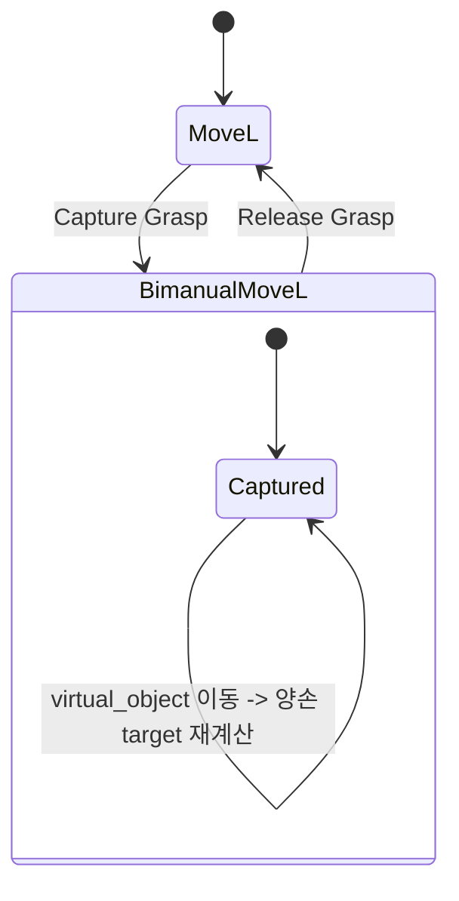
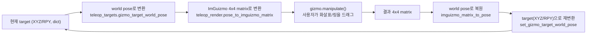

[← 전체 안내](../ros2-guide.md)

# Part 9 — Cyclo Control UI: 3D 마커 텔레옵 {: #part-9 }

!!! info "함께 볼 개발자 가이드"
    패널 이벤트는 [`teleop_ui.py`](../teleop_ui.md), 창·카메라·gizmo는
    [`teleop_render.py`](../teleop_render.md), 목표 상태 변환은
    [`teleop_targets.py`](../teleop_targets.md)에서 각각 확인할 수 있다.

## 기능 구현 요약

| 구분 | 내용 |
|---|---|
| 해결할 문제 | 사용자가 두 손을 독립적으로 움직이거나 가상 물체 하나로 함께 움직이고, UI·3D gizmo·IK가 같은 목표 상태를 보도록 해야 한다. |
| 해결 방법 | `app.targets`를 단일 명령 상태로 두고 MoveL과 Bimanual MoveL의 상태 전이를 함수로 분리한다. 렌더러는 world pose만 편집하고 변환 계층이 다시 target 값으로 환산한다. |
| 사용 수식 | 이 페이지의 모드 전환과 UI 상태 관리에는 별도 최적화 수식이 없다. pose 변환 수식은 Part 10, 변환된 목표를 푸는 IK 수식은 Part 6에 있다. |
| 코드 구현 과정 | `teleop_ui.draw_panel()`이 입력을 받고 → `capture_grasp()` 또는 `release_grasp()`가 모드를 바꾸고 → `apply_virtual_object_target()`이 양손 목표를 만들고 → `draw_transform_gizmo()`와 `set_gizmo_target_world_pose()`가 3D 조작 결과를 되돌려 쓴다. |
| 수식 없이 사용하는 함수 | `sync_virtual_object_to_hand_targets()`, `active_gizmo_target()`, `gizmo_target_world_pose()`, `sync_marker_visibility()`, `sync_ik_mocaps_from_targets()`, `teleop_render.render_scene()` |

이 구조는 ROS2의 RViz Interactive Marker + MoveIt Cartesian 목표 처리와 가장
직접적으로 비교할 수 있다.

## 9.1 MoveL / Bimanual MoveL — 두 가지 컨트롤러 모드 {: #part-9-1 }

ROBOTIS의 "Cyclo Control" 텔레옵 UI(`/capture_grasp`,
`virtual_object_goal_move` 등 서비스/토픽 이름을 쓰는 실제 ROBOTIS 스택)를
본떠 이 프로젝트도 같은 이름의 개념을 UI에 재현했다:

| 모드 | 의미 | 이 프로젝트의 구현 |
|---|---|---|
| **MoveL** | 양손을 각각 독립적으로 목표 pose로 이동 | `pos_r/rpy_r`, `pos_l/rpy_l`을 각각 직접 편집 |
| **Bimanual MoveL** | "가상의 물체(virtual object)"를 하나 놓고, 그 물체를 옮기면 양손이 물체에 고정된 것처럼 같이 따라간다 | `virtual_object_pos/rpy` 하나만 편집하면 양손 target이 파생됨 |

## 9.2 Capture Grasp / Release Grasp 상태 머신 {: #part-9-2 }



**이 변환이 왜 필요한가**: "양손으로 물건을 함께 들고 있다"는 건 곧 두 손이
서로에 대해 정해진 상대 위치/자세를 유지한 채(마치 보이지 않는 막대로 이어진
강체처럼) 같이 움직인다는 뜻이다. 이 프로젝트에서 그 "보이지 않는 막대"의
기준이 virtual object다 — 사용자가 그 하나의 target만 옮기면, 미리 잠가둔 상대
관계를 통해 양손 target이 자동으로 따라온다. 이 관계를 잠그는(capture) 시점의
pose가 기준이 된다.

`capture_grasp(app)`가 하는 일: 캡처 순간의 virtual object pose를 \((p_{obj},
R_{obj})\), 그 순간 손의 world pose를 \((p_{hand}, R_{hand})\)라 하면, 손을
virtual object 기준 **상대 좌표**로 표현한 오프셋은 world→local 변환이다. 회전
행렬 \(R_{obj}\)는 직교행렬(orthogonal, 열벡터들이 서로 수직인 단위벡터)이라서
역행렬이 전치행렬과 같다는 성질(\(R_{obj}^{-1} = R_{obj}^{T}\), 곱해서 확인:
\(R^TR=I\))을 그대로 쓸 수 있어 역행렬을 따로 계산할 필요가 없다:

\[
p_{\text{offset}} = R_{obj}^{T}\,(p_{hand} - p_{obj}), \qquad
R_{\text{offset}} = R_{obj}^{T} R_{hand}
\]

1. `sync_virtual_object_to_hand_targets` — virtual object를 지금 양손 target의
   중점으로 이동.
2. 위 식으로 양손 각각의 오프셋을 계산해 저장(`cyclo_capture_offsets`).

이후 `apply_virtual_object_target(app)`가 매 프레임(가상 물체가 캡처된 동안)
같은 관계를 역방향으로 풀어 virtual object의 **현재** pose \((p_{obj}',
R_{obj}')\)에서 손의 target pose를 다시 계산한다 — 저장해둔 오프셋을 그대로
다시 world 좌표로 펼치는 것뿐이다:

\[
p_{hand}' = p_{obj}' + R_{obj}'\,p_{\text{offset}}, \qquad
R_{hand}' = R_{obj}'\,R_{\text{offset}}
\]

```python
hand_pos = obj_pos + obj_R @ offset["pos"]
hand_quat = mat_to_quat(obj_R @ offset["mat"])
```

이건 정확히 **강체 변환(rigid transform) 합성**이다 — tf2의
`tf2_ros.TransformListener`가 "부모 프레임이 움직이면 자식 프레임도 같이
따라간다"를 계산하는 것과 수학적으로 동일한 연산을, 이 프로젝트는 tf 트리
없이 `teleop_targets.py`의 순수 함수로 직접 구현한 것이다.

## 9.3 mocap body와 RViz Interactive Marker {: #part-9-3 }

MuJoCo의 `mocap="true"` body(`ik_target_l`, `ik_target_r`,
`virtual_object_marker`)는 물리(질량/충돌)가 없고, 코드가 pose를 직접 써넣을
수 있는 "표시 전용" body다. 이 프로젝트에서는:

- 실제 **제어 입력**은 `app.targets`의 숫자 값(XYZ/RPY)이다.
- mocap body는 그 숫자 target을 **시각화**하기 위한 마커일 뿐이다
  (`sync_ik_mocaps_from_targets`가 매 프레임 동기화).
- **드래그해서 조작하는 3D gizmo도 결국 이 mocap의 world pose를 numeric
  target으로 역산해서 반영**한다(9.4절).

RViz의 Interactive Marker도 개념적으로 똑같다 — 화면에 표시되는 마커
자체는 "지금 목표가 어디인지 보여주는 것"이고, 실제 로봇을 움직이는 건 그
마커가 발행하는 pose를 구독하는 별도 컨트롤러다. 차이는 이 프로젝트엔
퍼블리셔/구독자가 없고 그냥 같은 프로세스 안 함수 호출이라는 것뿐.

## 9.4 3D gizmo — ImGuizmo와 좌표 변환 파이프라인 {: #part-9-4 }

조작 방식은 **화면 안 3D 오브젝트에 이동 화살표(XYZ)와 회전 링(Roll/Pitch/Yaw)이
직접 붙어서, 마우스로 드래그**하는 것이다(`imgui_bundle.imguizmo`, RViz의
Interactive Marker와 거의 똑같은 사용자 경험).

파이프라인:



`draw_transform_gizmo`가 매 프레임 하는 일 — 카메라의 view/projection
행렬을 MuJoCo의 `MjvCamera`에서 직접 재구성해서 ImGuizmo에 넘겨준다(3D
장면과 정확히 같은 시점에서 gizmo가 그려지도록):

```python
target = app._active_gizmo_target()          # "r"/"l"/"virtual" 중 지금 조작 대상
world_pos, world_quat = app._gizmo_target_world_pose(target)
object_matrix = pose_to_imguizmo_matrix(app, world_pos, world_quat)
view_matrix, proj_matrix = _imguizmo_camera_matrices(app, viewport)
changed = gizmo.manipulate(view_matrix, proj_matrix, gizmo.OPERATION.translate, ...)
if changed:
    new_pos, new_quat = imguizmo_matrix_to_pose(app, object_matrix)
    app._set_gizmo_target_world_pose(target, new_pos, new_quat)
```

`app.gizmo_mouse_active`(gizmo를 드래그 중이거나 마우스가 그 위에 있는지)는
`handle_camera_mouse`가 카메라 조작과 gizmo 조작을 혼동하지 않도록 막는
플래그다 — 마우스가 gizmo 위에 있으면 카메라 orbit이 동작하지 않는다.

---

[← Part 8](./08-mobile-base.md) · [전체 안내](../ros2-guide.md) · [Part 10 →](./10-coordinate-frames.md)
