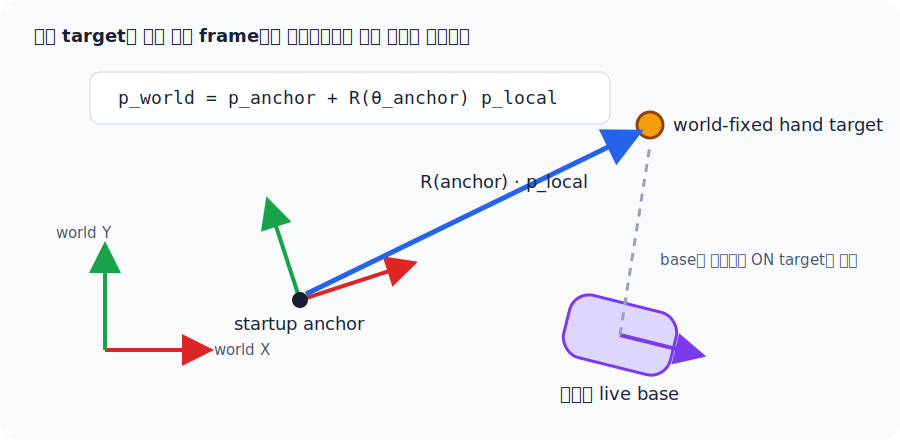
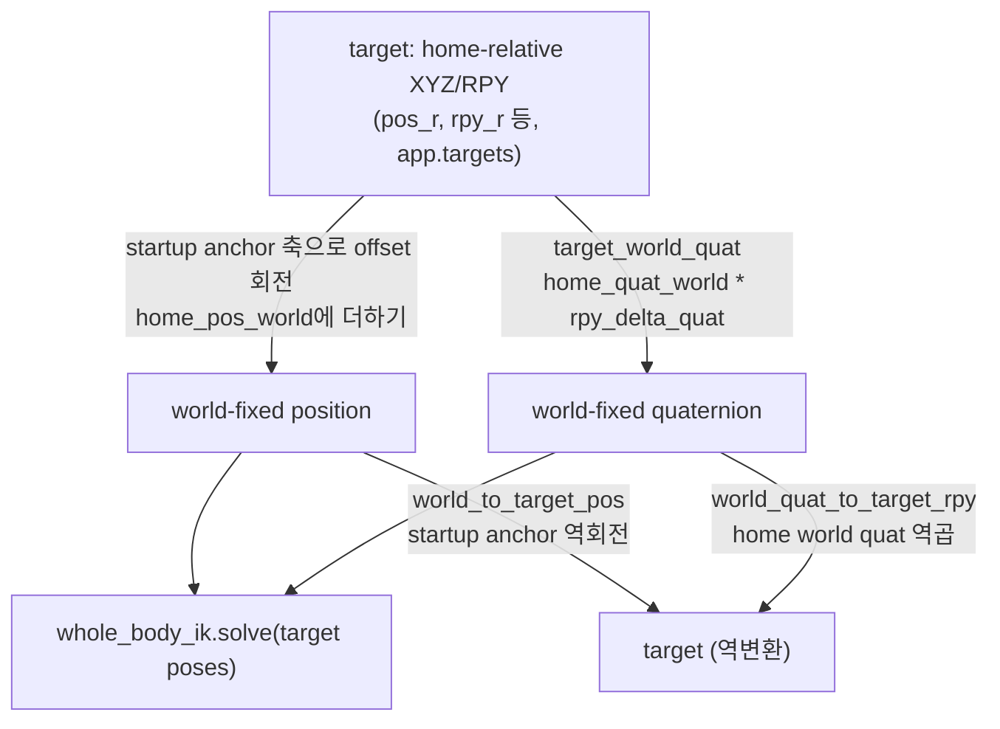

[← 전체 안내](../ros2-guide.md)

# Part 10 — 좌표계 완전 정리 {: #part-10 }

!!! info "함께 볼 개발자 가이드"
    각 변환 함수의 인자와 반환값은
    [`teleop_targets.py` 개발자 가이드](../teleop_targets.md)에 정리돼 있다.

## 기능 구현 요약

| 구분 | 내용 |
|---|---|
| 해결할 문제 | UI의 home-relative XYZ/RPY, 움직이는 base 좌표, 고정된 world 좌표, virtual-object 좌표를 서로 혼동하지 않고 왕복 변환해야 한다. |
| 해결 방법 | 위치는 기준점과 yaw 회전으로, 자세는 정규화 quaternion 곱으로 변환한다. Whole-body 모드에서는 시작 시 anchor를 고정하고 수동 base 이동 때만 anchor를 측정된 SE(2) 변화만큼 운반한다. |
| 사용 수식 | 손 목표는 \(p_{hand,w}=p_{home,w}+R_z(\psi_a)\Delta p\), 역변환은 \(\Delta p=R_z(\psi_a)^T(p_{hand,w}-p_{home,w})\)다. 가상 물체는 \(p_{obj,w}=t_a+R_z(\psi_a)p_{obj,a}\)를 쓴다. 자세는 quaternion 곱과 역곱으로 왕복한다. 10.3에서 모두 전개한다. |
| 코드 구현 과정 | `set_home_references()`가 기준을 저장하고 → `target_pos_to_world_pos()`와 `target_world_quat()`가 IK용 world pose를 만들고 → `world_to_target_pos()`와 `world_quat_to_target_rpy()`가 gizmo 결과를 UI 값으로 되돌린다. |
| 수식 없이 사용하는 함수 | `base_pose()`는 MuJoCo 상태를 읽고, `rpy_deg_to_quat()`와 `quat_to_rpy_deg()`는 표현을 변환한다. `carry_world_targets_with_base()`는 수동 주행 시 모든 기준 pose를 함께 갱신한다. `mujoco.mju_mulQuat()`, `mju_negQuat()`, `mju_quat2Mat()`, `mju_mat2Quat()`가 quaternion 연산을 수행한다. |

## 10.1 이 프로젝트에 tf가 없는 이유 {: #part-10-1 }

ROS2의 tf2는 "여러 좌표계(map, odom, base_link, ..., gripper) 사이의 관계를
트리로 관리하고, 아무 프레임 쌍이든 `lookupTransform`으로 바로 물어볼 수
있게" 해준다. 이 프로젝트는 그런 범용 트리가 없다 — 대신 `teleop_targets.py`
안에 **딱 필요한 변환들만** 손으로 짠 함수로 존재한다. 이건 tf2가 나쁘다는
뜻이 아니라, 좌표계 개수가 작고 고정돼 있어서(로봇 베이스, 손 2개, 가상
물체) 범용 트리 인프라를 들여올 이유가 없었다는 뜻이다. 다만 **그 대가로,
새 좌표계 관계가 필요할 때마다 수동으로 변환 함수를 추가해야 한다** —
tf2라면 자동으로 얻었을 조합(`lookupTransform("a", "z")`)을 여기서는 직접
구현해야 한다.

## 10.2 이 프로젝트가 실제로 쓰는 좌표계들 {: #part-10-2 }

| 이름 | 원점/기준 | 무엇에 쓰이나 |
|---|---|---|
| world frame | 시뮬레이션 절대 좌표계 | `KinematicTree`가 계산한 site pose와 `data.qpos`의 베이스 위치가 공유하는 기준 |
| live base frame | 로봇 베이스의 현재 `(base_x, base_y, base_yaw)` | wheel command의 body/world 변환과 현재 상태 표시 |
| startup anchor frame | 앱 시작 시 캡처한 base pose | 입력 XYZ 축은 로봇의 시작 앞/옆/위를 유지하면서 target world pose를 고정 |
| home-relative target | 각 손의 시작 world 위치/자세(`home_pos_world`, `home_quat_world`) 기준 오프셋 | 슬라이더/gizmo가 편집하는 값(`pos_r`, `rpy_r` 등) |
| virtual object frame | `virtual_object_marker`의 world pose | Bimanual MoveL에서 양손의 상대 pose를 저장하는 기준 |

## 10.3 변환 함수 지도 {: #part-10-3 }

<figure markdown>
  
  <figcaption>Whole-body 모드의 손 목표는 움직이는 live base가 아니라 startup anchor와 world에 고정된다.</figcaption>
</figure>

**왜 현재 base frame을 쓰면 안 되는가**: 팔만 IK 변수였을 때는 손 목표를 현재
base에 붙여도 된다. 하지만 whole-body IK에서 base를 10 cm 움직였는데 target도 같은
방향으로 10 cm 다시 계산되면 task error는 그대로다. solver는 목표를 잡으려고 계속
주행하고 목표는 계속 도망가는 양의 피드백이 된다.

그래서 UI offset 축은 앱 시작 시 base 방향으로 고정하고, 최종 목표는 world에
고정한다. startup anchor의 평행이동과 yaw를 각각
\(t_a=(x_{b0},y_{b0},0)^T\), \(\psi_a=\theta_{b0}\)라 두면

\[
R_z(\psi_a)=
\begin{pmatrix}
\cos\psi_a&-\sin\psi_a&0\\
\sin\psi_a& \cos\psi_a&0\\
0&0&1
\end{pmatrix}
\]

이다. 가상 물체의 anchor-local 위치 \(p_{obj,a}\)를 world로 옮기는 식은

\[
\boxed{p_{obj,w}=t_a+R_z(\psi_a)p_{obj,a}}
\]

이다. 양변에서 \(t_a\)를 빼고 \(R_z(\psi_a)^T\)를 곱하면 역변환은

\[
\begin{aligned}
p_{obj,w}-t_a&=R_z(\psi_a)p_{obj,a},\\
R_z(\psi_a)^T(p_{obj,w}-t_a)
&=R_z(\psi_a)^TR_z(\psi_a)p_{obj,a},\\
&=Ip_{obj,a},\\
\boxed{p_{obj,a}=R_z(\psi_a)^T(p_{obj,w}-t_a)}
\end{aligned}
\]

가 된다. 이것이 `anchor_local_to_world_pos()`와
`world_to_anchor_local_pos()`의 대응이다.

손 UI 위치는 anchor 원점에서의 절대 위치가 아니라 시작 손 위치
\(p_{home,w}\)에 더할 offset \(\Delta p\)다. 따라서

\[
\boxed{p_{hand,w}=p_{home,w}+R_z(\psi_a)\Delta p}
\]

이고, 역변환을 같은 순서로 전개하면

\[
\begin{aligned}
p_{hand,w}-p_{home,w}&=R_z(\psi_a)\Delta p,\\
R_z(\psi_a)^T(p_{hand,w}-p_{home,w})
&=R_z(\psi_a)^TR_z(\psi_a)\Delta p,\\
\boxed{\Delta p=R_z(\psi_a)^T(p_{hand,w}-p_{home,w})}
\end{aligned}
\]

이다. 두 식은 각각 `target_pos_to_world_pos()`와 `world_to_target_pos()`의
Whole-body 분기다.

손 target world quaternion은 시작 손 자세에 UI delta를 합성한다:

\[
q_{world} = q_{home\_world} \cdot q_{rpy\_delta}
\]

왼쪽에 \(q_{home\_world}^{-1}\)를 곱하면 역변환은

\[
\begin{aligned}
q_{home\_world}^{-1}\otimes q_{world}
&=q_{home\_world}^{-1}\otimes
(q_{home\_world}\otimes q_{rpy\_delta})\\
&=(q_{home\_world}^{-1}\otimes q_{home\_world})
\otimes q_{rpy\_delta}\\
&=q_I\otimes q_{rpy\_delta}\\
\boxed{q_{rpy\_delta}=q_{home\_world}^{-1}\otimes q_{world}}
\end{aligned}
\]

- \(q_{home\_world}\): 그 손이 시작할 때(0,0,0 슬라이더일 때)의 world 자세
- \(q_{rpy\_delta}\): 슬라이더/gizmo가 지금 추가로 넣은 로컬 회전

**왜 절대(world) Euler 각이 아니라 "홈 기준 로컬 델타"를 쓰는가**: 처음엔
슬라이더가 절대 world-Euler 각을 그대로 보여줬는데, 홈 자세 자체가 identity가
아니라서 슬라이더 시작값이 (90, 0, 90) 같은 이상한 숫자였고, Tait-Bryan
Euler 각의 축 결합(coupling) 때문에 "Roll"이라는 라벨이 실제로는 world Y축을
돌리는 등 라벨과 실제 동작이 어긋났다(수치로 확인). 홈 자세에 로컬 델타를
합성하는 지금 방식은 (0,0,0)이 "지금 자세 그대로"가 되고, 그 근처에서는
각 슬라이더가 손의 실제 로컬 X/Y/Z축을 정확히 돌린다(단, 슬라이더 여러
개를 동시에 크게 움직이면 Euler 각의 근본적인 축 결합이 다시 나타난다 —
3-파라미터 Euler 표현의 수학적 한계이지 버그가 아니다).

---

[← Part 9](./09-teleoperation-ui.md) · [전체 안내](../ros2-guide.md) · [Part 11 →](./11-testing.md)
