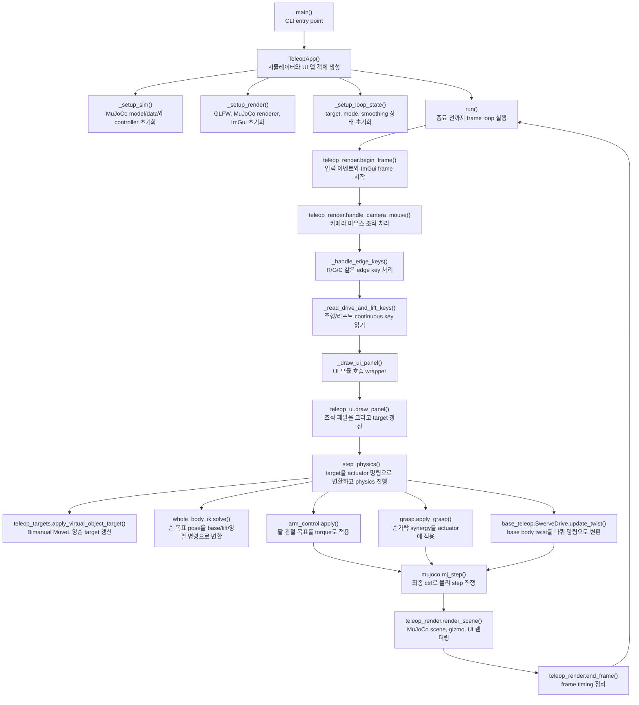

# `src/teleop_app.py`

앱의 조립 지점이다. MuJoCo model/data를 만들고, UI/렌더/target/IK/control 모듈을
연결한 뒤 메인 루프를 실행한다.

## 책임

| 구분 | 내용 |
|---|---|
| 초기화 | model/data, whole-body IK, arm/swerve controller, actuator/site/joint id 준비 |
| 입력 | 키보드 edge 입력, 주행/리프트 continuous 입력 |
| 상태 | `app.targets`, arm mode, grab state, Cyclo state |
| 물리 step | target smoothing, IK solve, actuator command, `mj_step` |
| 연결 | `teleop_ui`, `teleop_render`, `teleop_targets` wrapper 제공 |

## 메인 루프

```python
while not glfw.window_should_close(self.window):
    io = teleop_render.begin_frame(self)
    teleop_render.handle_camera_mouse(self, io)
    self._handle_edge_keys(io)
    drive_keys = self._read_drive_and_lift_keys(io)
    self._draw_ui_panel()
    self._step_physics(drive_keys)
    teleop_render.render_scene(self)
    teleop_render.end_frame(self, t0)
```

## 함수와 메서드

### 모듈 함수

| 이름 | 역할 |
|---|---|
| `rpy_deg_to_quat(rpy_deg)` | `teleop_targets.rpy_deg_to_quat()` wrapper |
| `quat_to_rpy_deg(q)` | `teleop_targets.quat_to_rpy_deg()` wrapper |
| `_reset_can_random(model, data, rng)` | 캔 free joint를 home 근처에 랜덤 리셋 |
| `_parse_args(argv)` | CLI 인자 파싱 |
| `main(argv=None)` | `TeleopApp().run()` 실행 |

### `KeyEdge`

| 메서드 | 역할 |
|---|---|
| `pressed(window, key)` | 눌림 edge를 한 번만 true로 반환 |

### `TeleopApp`

| 메서드 | 역할 |
|---|---|
| `__init__()` | sim, render, loop state 초기화 |
| `_setup_sim()` | model/data 로드, solver/controller/id/target 상태 생성 |
| `_setup_render()` | `teleop_render.setup_render()` 호출 |
| `_setup_loop_state()` | q_des, FK slider, timing, input 상태 생성 |
| `reset_can()` | 캔 위치 리셋 후 `mj_forward()` |
| `reset_active_object()` | 캔/grab/Cyclo 상태 리셋 |
| `_disable_legacy_box_asset()` | XML에 남은 box asset 비활성화 |
| `cycle_camera()` | 카메라 preset 전환 |
| `set_arm_mode(side, mode)` | 손별 IK/FK 전환과 target 동기화 |
| `_draw_ui_panel()` | `teleop_ui.draw_panel(self)` 호출 |
| `_handle_edge_keys(io)` | `R/G/C` edge key 처리 |
| `_read_drive_and_lift_keys(io)` | 주행/리프트 continuous key 처리 |
| `_step_physics(drive_keys)` | target smoothing, IK, base/grasp/lift/arm command, `mj_step` |
| `run()` | 전체 frame loop 실행 |

## 함수 흐름



### `teleop_targets.py` wrapper

기존 렌더/테스트 호출 계약을 유지하기 위해 아래 이름은 `TeleopApp`에 남아 있다.
실제 계산은 `teleop_targets.py`가 수행한다.

| wrapper | 실제 역할 |
|---|---|
| `_base_pose()` | base x/y/yaw와 yaw quaternion |
| `_local_to_world_pos()` / `_world_to_base_pos()` | base/world 위치 변환 |
| `_target_pos_to_base_pos()` / `_target_pos_to_world_pos()` / `_world_to_target_pos()` | 손별 home-relative target 위치 변환 |
| `_target_world_quat()` / `_world_quat_to_target_rpy()` | 손별 RPY/world quaternion 변환 |
| `_world_quat_to_virtual_rpy()` | virtual object RPY 변환 |
| `_quat_to_mat()` / `_mat_to_quat()` | quaternion/matrix 변환 |
| `_target_world_pose()` | 손 target world pose |
| `_virtual_object_world_pose()` | virtual object world pose |
| `sync_virtual_object_to_hand_targets()` | virtual object를 양손 중점에 배치 |
| `capture_grasp()` | Bimanual MoveL capture |
| `release_grasp()` | Bimanual MoveL release |
| `apply_virtual_object_target()` | virtual object pose로 양손 target 갱신 |
| `_bimanual_marker_visible()` | virtual marker 표시 여부 |
| `_sync_marker_visibility()` | marker alpha 갱신 |
| `_active_gizmo_target()` | gizmo 대상 선택 |
| `_gizmo_target_world_pose()` | gizmo 대상 world pose |
| `_set_gizmo_target_world_pose()` | gizmo 결과를 target에 반영 |
| `_sync_ik_mocaps_from_targets()` | mocap marker와 target 동기화 |

## `_step_physics()` 내부 순서

1. Bimanual MoveL capture 상태면 virtual object target을 양손 target으로 적용한다.
2. grab/release button 상태를 grasp/thumb slider 값으로 ramp한다.
3. raw target을 `smoothed_pos`, `smoothed_rpy`로 rate-limit한다.
4. startup anchor 기준 값에서 world-fixed 양손 target pose를 만든다. 수동 베이스
   주행 중에는 target frame도 측정된 base SE(2) 이동만큼 함께 운반한다.
5. `whole_body_ik.solve()`가 base x/y/yaw, lift, IK 모드 양팔을 한 문제로 푼다.
6. FK 모드인 손은 FK slider 값을 사용하고 whole-body arm 변수는 0속도로 고정한다.
7. 키보드 base 명령이 있으면 우선하고, 없으면 whole-body base twist를 선택한다.
8. `base_teleop.SwerveDrive.update_twist()`로 wheel command를 계산한다.
9. 물리 substep마다 arm torque, lift, wheel, hand command를 `data.ctrl`에 쓴다.
10. `mujoco.mj_step()`을 호출한다.

## 직접 쓰는 `data`

| 쓰기 위치 | 목적 |
|---|---|
| `_reset_can_random()` | 자유물체 캔 리셋 |
| `_disable_legacy_box_asset()` | legacy box asset 비활성화 |
| `_step_physics()` | actuator command 기록과 `mj_step` |

로봇 관절 위치를 live `data.qpos`로 직접 덮어쓰지 않는다.

ROS/MoveIt/Pinocchio/OSQP를 import하지 않는다. 공식 AIWorker/Cyclo에서 참고한 것은
body-twist 스워브 제어와 weighted differential IK 알고리즘 구조뿐이다.
