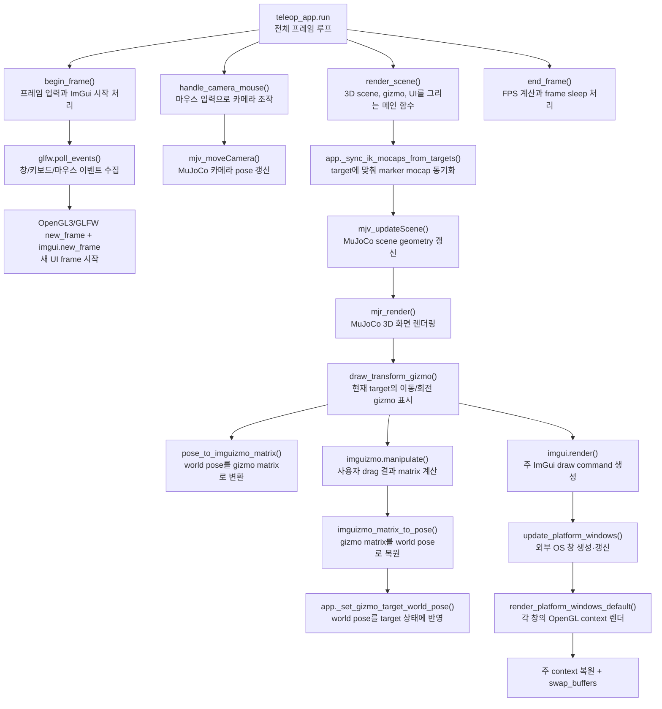

# `src/teleop_render.py`

GLFW 창, MuJoCo scene render, 카메라, 3D gizmo를 담당한다.

UI·목표 상태와 gizmo가 연결되는 전체 흐름은
[Part 9 — Cyclo Control UI](ros2/09-teleoperation-ui.md)에서 확인한다.

## 역할

| 항목 | 내용 |
|---|---|
| Window | MuJoCo용 주 GLFW window와 ImGui 플랫폼 window 생성/종료 |
| UI backend | ImGui 네이티브 GLFW/OpenGL3 backend + multi-viewport OS 창 |
| Scene | MuJoCo `MjvScene`, `MjrContext` 렌더링 |
| Camera | mouse orbit/pan/zoom |
| Gizmo | ImGuizmo translate/rotate 조작 |

## 함수

| 함수 | 역할 |
|---|---|
| `set_camera_preset(cam, preset)` | overview/right-hand close-up 카메라 설정 |
| `setup_render(app, window_w, window_h)` | GLFW, ImGui multi-viewport backend, MuJoCo render context 생성 |
| `begin_frame(app)` | event poll, ImGui input 처리, 새 frame 시작 |
| `shutdown(app)` | 모든 플랫폼 창, ImGui backend와 GLFW 종료 |
| `handle_camera_mouse(app, io)` | 마우스 입력을 MuJoCo camera move로 변환 |
| `pose_to_imguizmo_matrix(app, world_pos, world_quat)` | world pose를 ImGuizmo matrix로 변환 |
| `imguizmo_matrix_to_pose(app, matrix)` | ImGuizmo matrix를 world pose로 변환 |
| `_imguizmo_camera_matrices(app, viewport)` | ImGuizmo용 view/projection matrix 생성 |
| `draw_transform_gizmo(app, viewport)` | 주 viewport의 desktop 좌표에서 target 위에 gizmo를 렌더링하고 결과 반영 |
| `render_scene(app)` | MuJoCo와 주 ImGui draw 뒤 각 플랫폼 창을 별도 context로 렌더링 |
| `end_frame(app, t0)` | frame frequency update와 sleep |

## 함수 흐름



## Frame 순서

```text
begin_frame()
handle_camera_mouse()
teleop_ui.draw_panel()
teleop_app._step_physics()
render_scene()
end_frame()
```

## 데이터 변경

| 읽기 | 쓰기 |
|---|---|
| `app.model`, `app.data`, `app.targets`, camera state | `app.cam`, `app.gizmo_mouse_active`, target wrapper 호출 |

렌더 모듈은 직접 IK나 physics step을 수행하지 않는다.

## Gizmo와 target의 화면 좌표 정렬

MuJoCo의 `MjrRect(0, 0, framebuffer_width, framebuffer_height)`는 **주 창 내부의
framebuffer 좌표**다. 반면 multi-viewport를 켠 ImGui draw list는 **desktop 절대
좌표**를 사용한다. 따라서 ImGuizmo에 `MjrRect.left/bottom`을 그대로 주면 주 창의
desktop 위치만큼 gizmo가 target marker에서 벗어난다.

`draw_transform_gizmo()`는 카메라 projection의 aspect에는 MuJoCo framebuffer 크기를
사용하지만, `set_drawlist()`와 `set_rect()`에는 `imgui.get_main_viewport()`의
`pos/size`를 사용한다. 즉 3D target을 projection한 위치와 gizmo가 그려지는 viewport
원점이 같은 좌표계가 된다.

## 실제 창 밖으로 분리되는 이유

단순히 `imgui.begin()`을 여러 번 호출하면 논리적인 ImGui 창만 여러 개일 뿐, 모두
주 GLFW 창의 client area 안에 잘린다. 이 구현은 `viewports_enable`을 켜고 ImGui의
네이티브 GLFW/OpenGL3 backend를 초기화한다. 프레임 끝에는 다음 순서가 추가된다.

```text
imgui.render()
opengl3_render_draw_data(main draw data)
imgui.update_platform_windows()
imgui.render_platform_windows_default()
glfw.make_context_current(main window)
```

그래서 도구 창을 메인 창 밖으로 옮기면 ImGui가 해당 창을 위한 별도 GLFW OS 창과
OpenGL context를 만든다. 주 context를 마지막에 복원하지 않으면 다음 MuJoCo frame이
잘못된 창에 그려질 수 있으므로 이 순서를 바꾸지 않는다.
