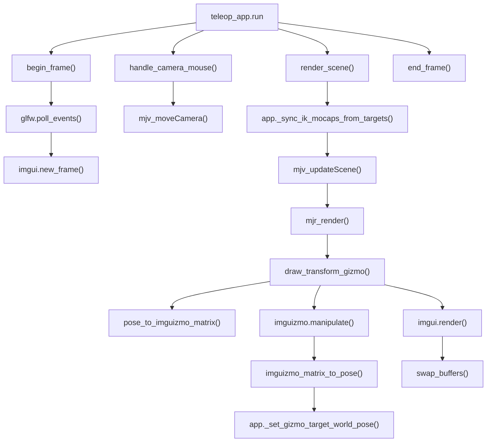

# `src/teleop_render.py`

GLFW 창, MuJoCo scene render, 카메라, 3D gizmo를 담당한다.

## 역할

| 항목 | 내용 |
|---|---|
| Window | GLFW window 생성/종료 |
| UI backend | ImGui context와 GLFW renderer |
| Scene | MuJoCo `MjvScene`, `MjrContext` 렌더링 |
| Camera | mouse orbit/pan/zoom |
| Gizmo | ImGuizmo translate/rotate 조작 |

## 함수

| 함수 | 역할 |
|---|---|
| `set_camera_preset(cam, preset)` | overview/right-hand close-up 카메라 설정 |
| `setup_render(app, window_w, window_h)` | GLFW, ImGui, MuJoCo render context 생성 |
| `begin_frame(app)` | event poll, ImGui input 처리, 새 frame 시작 |
| `shutdown(app)` | ImGui backend와 GLFW 종료 |
| `handle_camera_mouse(app, io)` | 마우스 입력을 MuJoCo camera move로 변환 |
| `pose_to_imguizmo_matrix(app, world_pos, world_quat)` | world pose를 ImGuizmo matrix로 변환 |
| `imguizmo_matrix_to_pose(app, matrix)` | ImGuizmo matrix를 world pose로 변환 |
| `_imguizmo_camera_matrices(app, viewport)` | ImGuizmo용 view/projection matrix 생성 |
| `draw_transform_gizmo(app, viewport)` | 현재 target의 translate/rotate gizmo 렌더링 및 결과 반영 |
| `render_scene(app)` | marker sync, MuJoCo render, gizmo, ImGui draw, swap buffers |
| `end_frame(app, t0)` | frame frequency update와 sleep |

## 함수 흐름



## Frame 순서

```text
begin_frame()
handle_camera_mouse()
teleop_ui.draw_panel()
teleop_app._step_physics()
render_scene()
end_frame()
```

## 데이터 변경

| 읽기 | 쓰기 |
|---|---|
| `app.model`, `app.data`, `app.targets`, camera state | `app.cam`, `app.gizmo_mouse_active`, target wrapper 호출 |

렌더 모듈은 직접 IK나 physics step을 수행하지 않는다.
