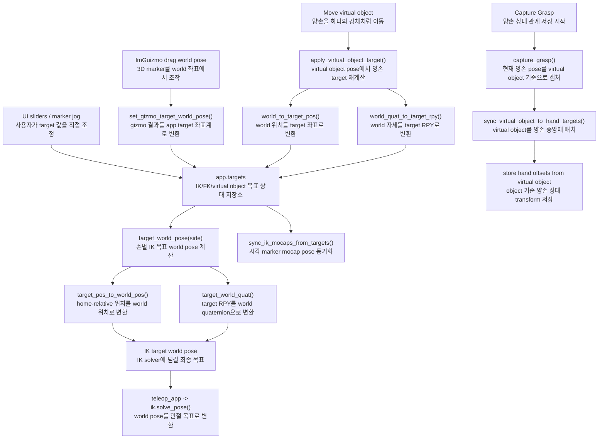

# `src/teleop_targets.py`

UI target, 3D marker/gizmo pose, IK world pose 사이의 변환을 담당한다.

## Target 의미

| 값 | 의미 |
|---|---|
| `pos_r`, `pos_l` | 각 손의 시작 위치 기준 XYZ offset |
| `rpy_r`, `rpy_l` | 각 손의 시작 자세 기준 RPY delta |
| `virtual_object_pos` | base frame의 virtual object 위치 |
| `virtual_object_rpy` | base frame 기준 virtual object RPY |

## 수식

> **왜 base-local 좌표가 필요한가**: IK는 world 좌표 기준 목표를 받지만, 손
> target 슬라이더는 "로봇 기준 앞/옆/위"를 조작하려는 것이다 — 베이스가 주행
> 중에 움직여도 슬라이더 값 자체는 그대로 두고 싶으므로, 매 프레임 베이스의
> 현재 pose로 변환해서 IK에 넘긴다. 자세한 이유는
> [ROS2 개발자를 위한 튜토리얼 Part 10.3](ros2-guide.md#part-10-3) 참고.

base-local 위치 \((x,y,z)\) → world 위치, 베이스 pose \((x_b,y_b,\theta_b)\)만큼
2D 회전 후 평행이동(`local_to_world_pos`; 역변환 `world_to_base_pos`는 반대 순서로
뺀 뒤 \(R^{T}\)를 곱한다):

\[
\begin{pmatrix} X\\Y\\Z \end{pmatrix} =
\begin{pmatrix} x_b\\y_b\\0 \end{pmatrix} +
\begin{pmatrix} \cos\theta_b & -\sin\theta_b & 0\\ \sin\theta_b & \cos\theta_b & 0\\ 0&0&1 \end{pmatrix}
\begin{pmatrix} x\\y\\z \end{pmatrix}
\]

손 target의 world quaternion(`target_world_quat`)은 세 쿼터니언의 곱:

\[
q_{world} = q_{base\_yaw} \otimes q_{home} \otimes q_{rpy\_delta}
\]

양손으로 물건을 함께 드는 건 두 손이 서로에 대한 상대 pose를 유지한 채(보이지
않는 막대로 이어진 강체처럼) 같이 움직인다는 뜻이다 — virtual object가 그
기준이고, capture 시점의 상대 오프셋을 한 번 저장해두면 이후 virtual object만
옮겨도 그 관계가 그대로 재적용된다. Bimanual MoveL의 world→virtual-object-local
오프셋 캡처(`capture_grasp`)와 그 역변환(`apply_virtual_object_target`),
\(R^{-1}=R^{T}\)(회전행렬은 직교행렬이라 역행렬이 전치행렬과 같다):

\[
p_{\text{offset}} = R_{obj}^{T}(p_{hand}-p_{obj}), \quad R_{\text{offset}} = R_{obj}^{T}R_{hand}
\qquad\Longleftrightarrow\qquad
p_{hand} = p_{obj} + R_{obj}\,p_{\text{offset}}, \quad R_{hand} = R_{obj}\,R_{\text{offset}}
\]

## 함수

| 함수 | 역할 |
|---|---|
| `rpy_deg_to_quat(rpy_deg)` | RPY degree를 quaternion으로 변환 |
| `quat_to_rpy_deg(q)` | quaternion을 RPY degree로 변환 |
| `set_home_references(app)` | 양손 시작 위치/자세를 target 기준으로 저장 |
| `base_pose(app)` | base x/y/yaw, sin/cos, yaw quaternion 반환 |
| `local_to_world_pos(app, p_local)` | base-local 위치를 world 위치로 변환 |
| `world_to_base_pos(app, p_world)` | world 위치를 base-local 위치로 변환 |
| `target_pos_to_base_pos(app, side, pos_target)` | 손별 home-relative offset을 base-local 위치로 변환 |
| `target_pos_to_world_pos(app, side, pos_target)` | 손별 target 위치를 world 위치로 변환 |
| `world_to_target_pos(app, side, world_pos)` | world 위치를 손별 target offset으로 변환 |
| `target_world_quat(app, side)` | 손별 RPY target을 world quaternion으로 변환 |
| `world_quat_to_target_rpy(app, side, world_quat)` | world quaternion을 손별 RPY target으로 변환 |
| `world_quat_to_virtual_rpy(app, world_quat)` | world quaternion을 virtual object RPY로 변환 |
| `quat_to_mat(quat)` | quaternion을 3x3 rotation matrix로 변환 |
| `mat_to_quat(mat)` | 3x3 rotation matrix를 quaternion으로 변환 |
| `target_world_pose(app, side)` | 손 target의 world position/quaternion 반환 |
| `virtual_object_world_pose(app)` | virtual object의 world position/quaternion 반환 |
| `sync_virtual_object_to_hand_targets(app)` | virtual object를 양손 target 중점으로 이동 |
| `capture_grasp(app)` | 양손 target을 virtual object 기준 상대 transform으로 저장 |
| `release_grasp(app)` | Bimanual MoveL capture 해제 |
| `apply_virtual_object_target(app)` | virtual object pose에서 양손 target 재계산 |
| `bimanual_marker_visible(app)` | virtual marker 표시 여부 반환 |
| `sync_marker_visibility(app)` | virtual marker alpha 갱신 |
| `active_gizmo_target(app)` | 현재 gizmo 대상 반환 |
| `gizmo_target_world_pose(app, target)` | gizmo 대상의 world pose 반환 |
| `set_gizmo_target_world_pose(app, target, world_pos, world_quat)` | gizmo 결과를 target 값으로 반영 |
| `sync_ik_mocaps_from_targets(app)` | 손/virtual marker mocap pose를 target과 동기화 |

## 함수 흐름



## Bimanual MoveL 상태 흐름

```text
MoveL
  right/left target을 독립 조작

Capture Grasp
  현재 양손 target pose를 virtual object 기준 상대 transform으로 저장

Bimanual MoveL
  virtual object pose 변경
  -> 저장된 상대 transform 적용
  -> left/right target 자동 갱신

Release Grasp
  다시 독립 MoveL 상태
```

## 사용 위치

- `teleop_app.py`: target wrapper와 물리 step에서 호출
- `teleop_render.py`: gizmo pose 조회/반영 wrapper를 통해 사용
- `teleop_ui.py`: capture/release/apply 메서드를 통해 사용
