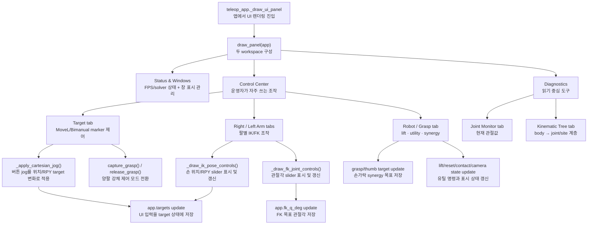

# `src/teleop_ui.py`

ImGui 기반 텔레옵 UI를 그린다. 자주 쓰는 조작은 `Control Center`, 읽기 중심 도구는
`Diagnostics` 탭으로 묶는다. 두 워크스페이스만 **네이티브 OS 창**으로 분리되므로
메인 MuJoCo 창 밖으로 이동할 수 있으면서 작업 표시줄과 화면은 복잡해지지 않는다.

MoveL/Bimanual MoveL 상태 전이 안에서 이 패널이 맡는 위치는
[Part 9 — Cyclo Control UI](ros2/09-teleoperation-ui.md)에서 확인한다.

## 역할

| 항목 | 내용 |
|---|---|
| 입력 | `app` 객체의 현재 상태 |
| 출력 | `app.targets`, mode, marker 선택, 버튼 상태 변경 |
| 직접 물리 계산 | 없음 |
| 렌더링 | ImGui widget만 담당 |
| 창 상태 | `app.ui_windows`에 두 워크스페이스 표시 여부 저장 |

## 주요 함수

| 함수 | 역할 |
|---|---|
| `_begin_expanded(title, flags=0)` | ImGui `begin()` 반환값 차이를 정규화 |
| `_ensure_window_state(app)` | 창 표시 상태·트리 filter와 최초 외부 분리 요청 준비 |
| `_begin_tool_window(app, key)` | 외부/메인 배치 요청을 적용하고 독립 도구 창 시작 |
| `_ik_err_text(app, side)` | IK/FK 모드에 맞는 오차 표시 문자열 생성 |
| `_note_manual_pose_edit(app)` | 수동 target 편집 hook |
| `_clamp(value, lo, hi)` | 값 clamp |
| `_slider_float_clamped(label, value, lo, hi, fmt)` | slider 값 clamp 처리 |
| `_draw_vector_sliders(prefix, values, axes, lo, hi, fmt, on_change)` | XYZ/RPY 반복 slider 렌더링 |
| `_ensure_jog_state(app)` | marker jog 관련 기본 상태 생성 |
| `_clamp_pose_targets(targets, side)` | 손 target 범위 제한 |
| `_apply_cartesian_jog(app, side, pos_delta, rpy_delta)` | 선택된 marker target을 step 단위로 이동/회전 |
| `_repeat_button(label)` | 누르고 있는 동안 반복되는 버튼 처리 |
| `_draw_jog_row(app, title, axis_labels, step, is_rotation)` | XYZ/RPY +/- jog 버튼 행 |
| `_active_marker_choices(app)` | 현재 controller 상태에서 선택 가능한 marker 목록 반환 |
| `_selected_marker_label(app)` | 선택 marker label 반환 |
| `_draw_cyclo_control_panel(app)` | MoveL/Bimanual MoveL, capture/release, marker jog UI |
| `_draw_status_panel(app, data)` | 상태 요약 표시 |
| `_draw_ik_pose_controls(app, targets, side)` | 손별 XYZ/RPY target slider |
| `_draw_fk_joint_controls(app, side)` | 손별 FK joint slider |
| `_draw_arm_panel(app, targets, side)` | 오른팔/왼팔 IK/FK 패널 |
| `_draw_can_grasp_panel(app, targets)` | grasp/thumb synergy 패널 |
| `_draw_lift_utils_panel(app, targets)` | 전신 ON/OFF, lift/reset/contact/collision/camera 패널 |
| `_draw_joint_monitor(app, data)` | 관절 위치 monitor |
| `kinematic_tree_body_ids(app, scope, show_full)` | 오른팔/왼팔 target의 조상 body 또는 전체 body id 선택 |
| `_draw_kinematic_tree(app)` | body 아래 joint/site를 중첩한 실시간 기구학 트리 렌더링 |
| `_draw_window_visibility(app)` | 표시 여부와 **Detach/Return** 배치 버튼 렌더링 |
| `_draw_tab(label, draw_contents)` | 선택된 tab 내용만 렌더링 |
| `_draw_control_center(app, targets)` | Target·양팔·Robot/Grasp 탭 구성 |
| `_draw_diagnostics(app, data)` | Kinematic Tree·Joint Monitor 탭 구성 |
| `draw_panel(app)` | 두 워크스페이스의 frame entry point |

## 함수 흐름



## 창 구조

```text
FFW-SH5 Status & Windows       항상 표시되는 상태/창 관리자
├── FFW-SH5 Control Center     기본 표시
│   ├── Target                 MoveL, capture/release, jog
│   ├── Right / Left Arm       팔별 IK pose 또는 FK joint
│   └── Robot / Grasp          전신·lift·시각화·손가락
└── FFW-SH5 Diagnostics        기본 표시
    ├── Kinematic Tree         world → body → joint/site
    └── Joint Monitor          현재 관절값
```

첫 프레임에는 상태 창만 MuJoCo 주 창 안에 남고 두 워크스페이스는 주 창 오른쪽
바깥에 생성된다. 각 창을 다른 모니터로 옮길 수 있다. **Detach tools
outside**는 현재 배치 파일과 관계없이 다시 외부로 내보내고, **Return tools to main**은
두 워크스페이스를 주 창 안 기본 위치로 되돌린다.

각 워크스페이스 오른쪽 위 `×`로 닫아도 상태 창의 **Workspaces** 체크박스로 다시 열
수 있다. **Show all**, **Control only**, **Hide all**은 표시 상태를 일괄 변경하며 창의
위치와 크기는 ImGui 설정에 저장된다. 실제 OS 창 생성과 context 전환은
[`teleop_render.py`](teleop_render.md)가 담당한다.

## 기구학 트리 창

기본 **Both arms** 범위에서는 양쪽 `grasp_target`까지 필요한 조상 body만 보여준다.
`Right`/`Left`로 한 체인만 고를 수 있고, **Show full MJCF tree**를 켜면 wheel, head,
finger, 물체를 포함한 전체 모델 트리를 탐색한다.

- `[controlled]`: Whole-Body IK의 Jacobian 열로 쓰는 joint
- `[IK target]`: FK/Jacobian을 계산하는 손끝 site
- hinge: 현재 각도를 degree로 표시
- slide: 현재 변위를 meter로 표시

## 데이터 변경 원칙

- UI는 `app.targets`와 app 상태만 바꾼다.
- `mj_step`, IK solve, actuator command는 수행하지 않는다.
- 실제 반영은 `teleop_app.py`의 `_step_physics()`에서 한다.
- **Whole-body Control** 버튼은 `toggle_whole_body_control()`을 호출하고 상태줄에는
  `ON` 또는 `OFF (arm-only)`와 실제 body command가 표시된다.
- `Move time`은 현재 UI 호환용 상태값이며 trajectory scheduler에는 연결되지 않는다.
  목표 응답은 `teleop_app.py`의 frame rate limit과 controller gain이 결정한다.
