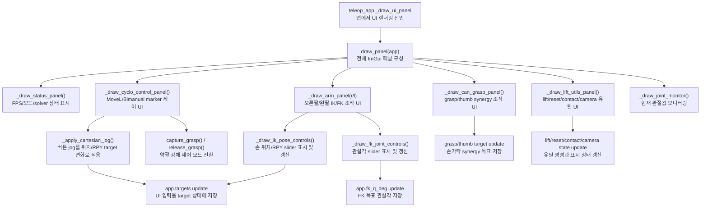

# `src/teleop_ui.py`

ImGui 기반 텔레옵 패널을 그린다.

MoveL/Bimanual MoveL 상태 전이 안에서 이 패널이 맡는 위치는
[Part 9 — Cyclo Control UI](ros2/09-teleoperation-ui.md)에서 확인한다.

## 역할

| 항목 | 내용 |
|---|---|
| 입력 | `app` 객체의 현재 상태 |
| 출력 | `app.targets`, mode, marker 선택, 버튼 상태 변경 |
| 직접 물리 계산 | 없음 |
| 렌더링 | ImGui widget만 담당 |

## 주요 함수

| 함수 | 역할 |
|---|---|
| `_begin_expanded(title, flags=0)` | ImGui `begin()` 반환값 차이를 정규화 |
| `_ik_err_text(app, side)` | IK/FK 모드에 맞는 오차 표시 문자열 생성 |
| `_note_manual_pose_edit(app)` | 수동 target 편집 hook |
| `_clamp(value, lo, hi)` | 값 clamp |
| `_section(title, default_open=True)` | collapsing header 생성 |
| `_slider_float_clamped(label, value, lo, hi, fmt)` | slider 값 clamp 처리 |
| `_draw_vector_sliders(prefix, values, axes, lo, hi, fmt, on_change)` | XYZ/RPY 반복 slider 렌더링 |
| `_ensure_jog_state(app)` | marker jog 관련 기본 상태 생성 |
| `_clamp_pose_targets(targets, side)` | 손 target 범위 제한 |
| `_apply_cartesian_jog(app, side, pos_delta, rpy_delta)` | 선택된 marker target을 step 단위로 이동/회전 |
| `_repeat_button(label)` | 누르고 있는 동안 반복되는 버튼 처리 |
| `_draw_jog_row(app, title, axis_labels, step, is_rotation)` | XYZ/RPY +/- jog 버튼 행 |
| `_active_marker_choices(app)` | 현재 controller 상태에서 선택 가능한 marker 목록 반환 |
| `_selected_marker_label(app)` | 선택 marker label 반환 |
| `_draw_cyclo_control_panel(app)` | MoveL/Bimanual MoveL, capture/release, marker jog UI |
| `_draw_status_panel(app, data)` | 상태 요약 표시 |
| `_draw_ik_pose_controls(app, targets, side)` | 손별 XYZ/RPY target slider |
| `_draw_fk_joint_controls(app, side)` | 손별 FK joint slider |
| `_draw_arm_panel(app, targets, side)` | 오른팔/왼팔 IK/FK 패널 |
| `_draw_can_grasp_panel(app, targets)` | grasp/thumb synergy 패널 |
| `_draw_lift_utils_panel(app, targets)` | 전신 ON/OFF, lift/reset/contact/collision/camera 패널 |
| `_draw_joint_monitor(app, data)` | 관절 위치 monitor |
| `draw_panel(app)` | 전체 UI 패널 entry point |

## 함수 흐름



## 패널 구조

```text
FFW-SH5 Teleop
├── Status
├── Cyclo / Marker Control
├── Right Arm
├── Left Arm
├── Can Grasp
├── Lift / Utilities (Whole-body Control ON/OFF)
└── Joint Monitor
```

## 데이터 변경 원칙

- UI는 `app.targets`와 app 상태만 바꾼다.
- `mj_step`, IK solve, actuator command는 수행하지 않는다.
- 실제 반영은 `teleop_app.py`의 `_step_physics()`에서 한다.
- **Whole-body Control** 버튼은 `toggle_whole_body_control()`을 호출하고 상태줄에는
  `ON` 또는 `OFF (arm-only)`와 실제 body command가 표시된다.
- `Move time`은 현재 UI 호환용 상태값이며 trajectory scheduler에는 연결되지 않는다.
  목표 응답은 `teleop_app.py`의 frame rate limit과 controller gain이 결정한다.
