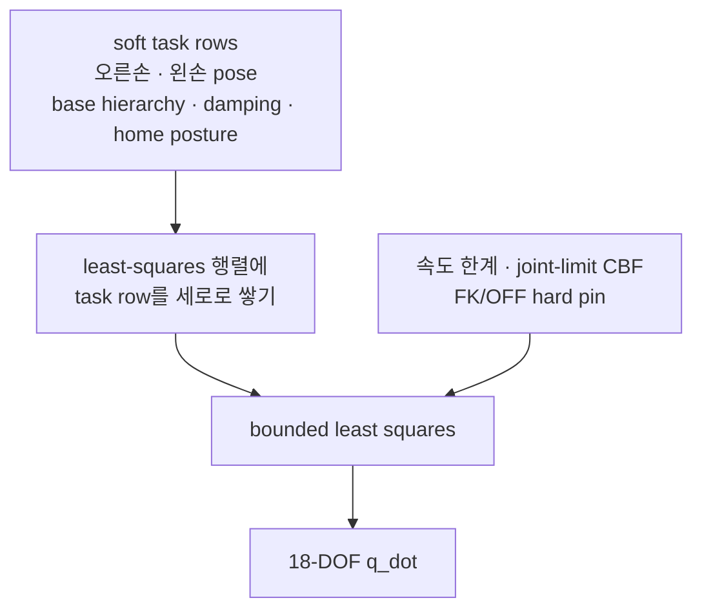
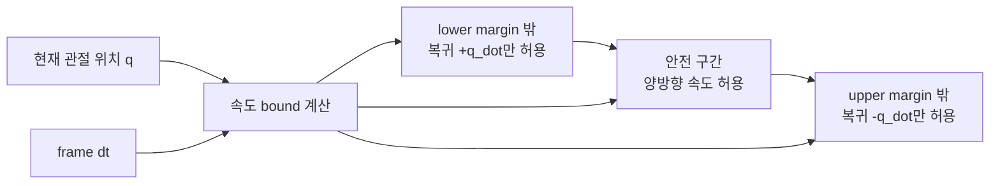
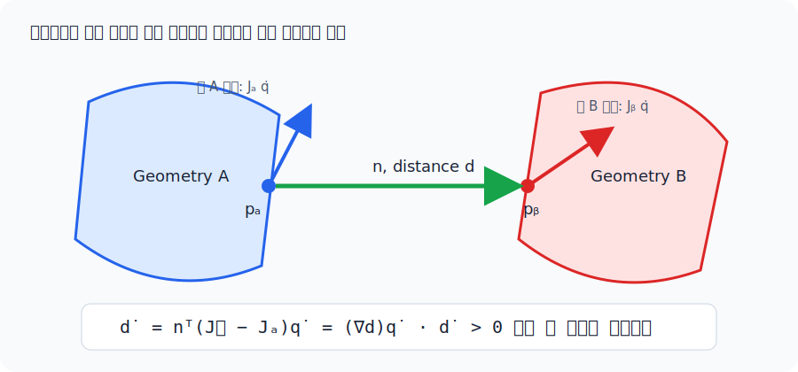
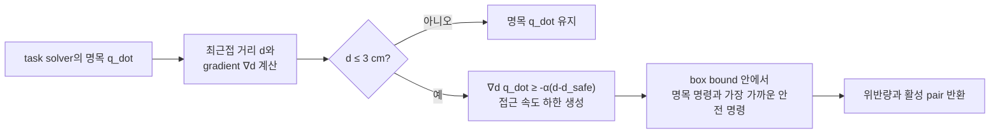
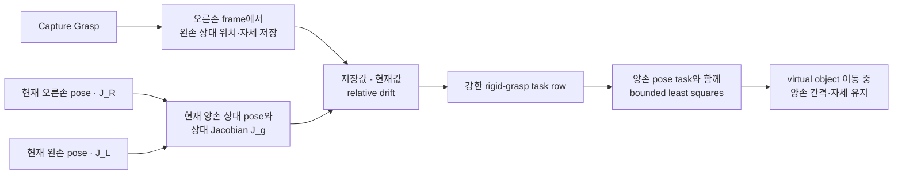
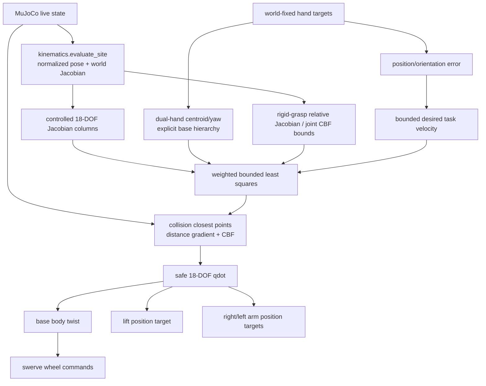

# `src/whole_body_ik.py`

손 target을 팔만으로 맞추지 않고 모바일 베이스 3축, 리프트 1축, 양팔 14축을 한
문제에서 푸는 ROS 비의존 differential whole-body IK다.

ROS2/MoveIt 관점의 개념 비교와 legacy DLS 식의 역할은
[Part 6 — 전신 IK와 단일 팔 DLS IK](ros2/06-inverse-kinematics.md)를 함께 본다.

## 제어 변수와 출력

제어 속도 벡터는 다음 18개 자유도다.

\[
\dot q = [\dot x_b,\dot y_b,\dot\theta_b,\dot q_{lift},
\dot q_{r,1:7},\dot q_{l,1:7}]^T
\]

| 해의 성분 | 실제 적용 경로 |
|---|---|
| base x/y/yaw 속도 | body frame으로 회전 → `SwerveDrive.update_twist()` → 실제 바퀴 마찰 |
| lift 위치 | `lift_joint` position actuator |
| 양팔 위치 | `ArmTorqueController`의 PD + feedforward 토크 |

solver는 live `data.qpos`를 쓰지 않는다. MuJoCo Jacobian과 현재 pose를 읽어 다음
명령만 반환한다.

site pose, world-aligned Jacobian, signed-distance gradient가 만들어지는 과정은
[기구학과 충돌 거리](kinematics.md)에 분리해 설명한다. 이 문서는 그 결과를 어떻게
전신 task와 safety constraint로 조립하는지에 집중한다.

## Whole-body ON/OFF

UI의 **Whole-body Control** 버튼은 같은 solver를 두 참여 범위로 실행한다.

| 모드 | differential IK 변수 | 동작 |
|---|---|---|
| ON | base x/y/yaw + lift + IK 모드 팔 | 양손 공통 이동은 base hierarchy도 사용 |
| OFF (arm-only) | IK 모드 팔 | base/lift 네 속도 bound를 `[0, 0]`으로 고정 |

OFF는 task weight를 낮추는 방식이 아니므로 damping, nominal posture, collision slack의
수치 절충으로 잔류 base/lift 속도가 생길 수 없다. Joint-limit CBF와 collision CBF는
동일하게 남아 있으며, OFF에서는 허용된 팔 관절만으로 제약을 만족시킨다. 리프트
slider와 키보드 base 주행은 IK 밖의 독립 수동 명령이므로 계속 사용할 수 있다.

전환 시 앱은 양손/virtual-object의 world pose를 먼저 저장한 뒤 새 모드 좌표계로
target 값을 역변환한다. smoothing 값도 함께 맞추고 solver reference를 `rebase()`하며
cached base twist를 0으로 지워 marker jump나 과거 명령 재생을 막는다.

구조는 ROBOTIS의
[`cyclo_motion_controller_core`](https://github.com/ROBOTIS-GIT/cyclo_control/tree/ceffbd7562028f6b317e462911e2a0991b9ba735/cyclo_motion_controller_core)가
pose/Jacobian을 한 kinematics 계층에서 계산하고 weighted task QP에 속도·관절 한계·
양손 제약을 넣는 방식과 collision pair의 최근접점 Jacobian/CBF를 참고했다. 여기서는
ROS, Pinocchio, FCL, OSQP를 가져오지 않고 MuJoCo+NumPy 알고리즘으로만 구현한다.
구체적으로 공식
[`kinematics_solver.cpp`](https://github.com/ROBOTIS-GIT/cyclo_control/blob/ceffbd7562028f6b317e462911e2a0991b9ba735/cyclo_motion_controller_core/src/kinematics/kinematics_solver.cpp)의
distance gradient와
[`vr_controller.cpp`](https://github.com/ROBOTIS-GIT/cyclo_control/blob/ceffbd7562028f6b317e462911e2a0991b9ba735/cyclo_motion_controller_core/src/controllers/ai_worker/vr_controller.cpp)의
collision CBF/slack 구성을 기준으로 삼았다.

## Weighted differential IK

각 손의 world pose 오차에서 원하는 task velocity를 만든다.

\[
\dot x_i^* =
\begin{bmatrix}
K_p(p_i^*-p_i) \\
K_R e_{R,i}
\end{bmatrix},\qquad
\dot x_i = J_i(q)\dot q
\]

양손 task, damping, home posture task를 한 least-squares 문제에 쌓는다.

\[
\min_{\dot q}
\sum_{i\in\{L,R\}}\|W_i(J_i\dot q-\dot x_i^*)\|^2
+\|W_d\dot q\|^2
+\|W_h(\dot q-K_h(q_{home}-q))\|^2
\]

subject to:

\[
\dot q_{min}\le\dot q\le\dot q_{max}
\]

그림에서 세로로 쌓인 각 row는 “이 요구를 얼마나 잘 맞출 것인가”를 뜻한다. 반면
아래쪽 bound는 절충 대상이 아니라 해가 반드시 머물러야 하는 범위다. 그래서
Whole-body OFF와 FK 팔은 작은 weight가 아니라 lower=upper=0으로 고정한다.

관절 위치 한계는 Cyclo와 같은 control-barrier velocity bound를 box에 교차한다.

\[
-\alpha(q-q_{min}-m)\le\dot q\le
\alpha(q_{max}-m-q)
\]

따라서 한계에 가까울수록 접근 속도가 연속적으로 0으로 줄고, 외력 때문에 margin
밖으로 나간 경우에는 복귀 방향 속도만 허용한다. Euler 한 step이 경계를 넘지 않도록
실효 gain은 \(\min(\alpha,1/\Delta t)\)다.

관절이 안전 구간 중앙에 있으면 원래 속도 상한을 쓸 수 있다. 양끝에 가까워질수록
경계 방향 bound가 0으로 좁아지고, margin 밖에서는 반대 방향인 복귀 속도만 남는다.

## Reactive collision avoidance

`kinematics.default_collision_pairs()`는 WBIK가 실제로 움직일 수 있는 geometry만
고른다. 양팔 사이, 한 팔의 비인접 link, 팔과 base/lift/상체/head, 팔/손과 table을
포함한다. 반면 wheel-floor 접촉, 손가락-object 접촉, can은 의도된 물리/그립
접촉이므로 제외한다. 경로를 미리 만드는 motion planner가 아니라 매 제어 frame의
안전한 속도를 만드는 reactive avoidance다.

각 pair의 signed distance \(d\)와 최근접점 \(p_A,p_B\)를 MuJoCo에서 얻고, 두
점의 world Jacobian으로 Cyclo와 같은 distance gradient를 계산한다.

\[
n={p_B-p_A\over\|p_B-p_A\|},\qquad
\nabla d=n^T(J_B-J_A)
\]

<figure markdown>
  
  <figcaption>두 최근접점의 상대 속도를 법선에 투영하면 signed distance가 줄거나 늘어나는 속도 \(\dot d=\nabla d\,\dot q\)가 된다.</figcaption>
</figure>

관통 중에는 최근접점 segment 방향이 뒤집히므로 gradient 부호도 뒤집는다. oriented
palm box와 table box에서 MuJoCo 3.10의 일반 convex-distance 값이 불연속적으로 0이
되는 경우가 있어, 그 한 조합만 palm AABB의 table-normal support point clearance로
계산한다. palm-palm도 같은 GJK feature 전환을 피하기 위해 두 palm box의 보수적인
bounding sphere 거리와 center Jacobian을 쓴다. 나머지 mesh pair는 실제 최근접점을
쓴다.

거리 3 cm 안에서 다음 collision CBF가 활성화된다.

\[
\nabla d\,\dot q\ge-\alpha(d-d_{safe}),\qquad d_{safe}=0.01\text{ m}
\]

거리가 충분하면 명목 IK 명령을 그대로 쓴다. 3 cm buffer 안에서는 “더 가까워지는
속도”만 제한하며, 이미 1 cm 안전거리 안이라면 오른쪽 항이 양수가 되어 실제로
떨어지는 방향의 속도를 요구한다.

실효 \(\alpha=\min(50,1/\Delta t)\)라 Euler 한 step이 1 cm 경계를 건너는 속도를
막고, 이미 관통하거나 1 cm 안으로 밀린 상태에서는 양의 분리 속도를 요구한다.
Cyclo의 slack penalty 1000을 ROS 없는 squared-hinge active set으로 풀어 task가
물리적으로 불가능한 경우에도 유한한 최선 해를 반환한다. 이 보정은 base 가속
shaping 뒤에 적용하므로 명령 smoothing이 안전 제약을 다시 깨지 않는다.

### Collision 시각화

앱에서 `V`를 누르거나 **Collision CBF Viz** 체크박스를 켜면 실제 MuJoCo collision
geometry(group 3)가 반투명 청색으로 표시된다. 동시에 controller가 3 cm buffer 안에서
평가 중인 pair의 최근접점 두 개와 연결선을 그린다.

| 색 | 의미 |
|---|---|
| 노랑 | 1~3 cm: buffer 안이지만 안전거리 밖 |
| 주황 | 0~1 cm: 안전거리 안, 분리 CBF 활성 |
| 빨강 | 음의 signed distance: 이미 관통 |

화면 상태줄에는 active pair 수, 최소 거리, soft-CBF slack 위반량도 표시한다. 이 선은
`WholeBodyIK.collision_distances()`를 통해 제어기와 정확히 같은 geometry/거리 함수를
사용한다. `G`의 물리 contact point/force 표시는 별도 토글이므로 두 시각화를 동시에
비교할 수도 있다.

position/orientation task weight는 각각 10/5, error gain은 8/7이다. task 속도는
linear 1.0 m/s, angular 2.5 rad/s로 제한하고, base/lift/arm 속도 상한은 각각
0.55 m/s·1.2 rad/s, 0.25 m/s, 2.0 rad/s다. 각 DOF의 damping/posture weight도
서로 다르다.

양손이 함께 움직일 때 14개 팔 자유도만으로 공통 오차를 흡수하면 물리 베이스가
늦게 따라오고 해의 작은 부호 변화가 스워브 반전을 반복시킬 수 있다. 그래서 첫
solve에서 base pose와 양손 pose를 기준으로 저장하고, 이후 두 target의 평균 이동과
평균 yaw 변화를 명시적인 base x/y/yaw 목표로 만든다. 강한 selector row로 이 목표를
least-squares에 넣고 최종 base 3축에는 계층 우선순위를 정확히 적용한다. lift와 팔은
같은 문제 안에서 각 손의 나머지 residual을 푼다.

base 명령은 큰 오차에서는 빠르게 사용하되 손 위치 오차 8 cm, 자세 오차 0.25 rad
안쪽에서 점차 fade한다. 선형 8 m/s², 각 4 rad/s² 가속 제한으로 한 프레임짜리 부호
반전을 억제한다. 앱의 target도 프레임당 최대 3 cm/8°로 ramp해 급격한 marker 이동을
물리적으로 추종 가능한 명령으로 바꾼다.

## Bimanual rigid-grasp 제약

Capture Grasp 시 왼손 pose를 오른손 frame에 저장한다. 캡처가 활성화되면 Cyclo의
bimanual MoveL과 같은 상대 twist Jacobian을 강한 task row로 추가한다.

\[
J_g = J_L -
\begin{bmatrix}I&-[r_{RL}]_\times\\0&I\end{bmatrix}J_R,
\qquad J_g\dot q=\dot x_{rel}^*
\]

\(\dot x_{rel}^*\)는 캡처한 상대 위치·자세로 되돌리는 drift correction이다. 접촉으로
오차가 커져도 전체 QP를 압도하는 불가능한 속도가 되지 않도록 선형/각속도 norm을
제한한다. Release Grasp 시 이 reference와 task를 함께 제거한다.

## 왜 target은 world에 고정하는가

기존 target은 현재 base frame에 붙어 있었다. 베이스가 10 cm 움직이면 target도 같은
방향으로 10 cm 움직였기 때문에 팔만 제어할 때는 편했지만, 베이스를 IK 변수로 넣으면
베이스가 움직여도 오차가 줄지 않는다. 목표가 계속 도망가는 셈이다.

whole-body 모드에서는 앱 시작 시 base pose를 target anchor로 캡처한다. 이후
`pos_r/l`은 그 anchor 축에서 표현하되 최종 target world pose는 고정된다. 따라서
solver가 base Jacobian 열을 사용해 실제 task error를 줄일 수 있다.

## 제한된 least-squares 구현

OSQP, SciPy, Pinocchio, ROS를 추가하지 않기 위해 18변수 box-QP를 NumPy의
bounded-variable least squares(BVLS) active set으로 푼다.

1. unconstrained `numpy.linalg.lstsq` 해를 box로 투영해 시작한다.
2. 현재 active bound를 고정하고 free 변수의 최소제곱 해를 구한다.
3. 새 해가 box 밖이면 경계까지 line search하고 그 bound를 active로 만든다.
4. feasible 해에서는 gradient의 KKT 부호를 검사해 잘못 고정된 bound를 해제한다.
5. 모든 active/free 변수가 KKT 조건을 만족하면 종료한다.

이전 one-way active set은 한 번 bound에 고정한 변수를 다시 해제하지 못해 결합된
Jacobian 열에서 feasible하지만 최적이 아닌 해를 낼 수 있었다. 새 solver는 bound에
들어갔다가 나오는 좌표를 자연스럽게 처리한다. 3변수 문제의 모든 active set을
완전탐색하는 회귀와 비교해 목적함수 차이가 \(10^{-14}\) 미만인지 검사한다.
BVLS 전환 후 현재 머신의 충돌 비활성 양손 solve는 약 0.7 ms, 현재 table 회귀에서
workspace constraint 2개가 활성화된 solve는 약 0.95 ms다. 회귀 gate는 5 ms 미만을 요구해 25 Hz 앱의
40 ms 프레임 예산을 잠식하는 구현 회귀를 막는다.

## 함수 흐름

## 테스트

`tests/test_whole_body.py`는 다음을 확인한다.

- 스워브 역기구학→정기구학 100개 무작위 왕복
- 주입한 ±90° 조향 범위의 동치각과 전역 wheel saturation
- 3변수 box-QP 25개의 완전탐색 optimum 비교
- 관절 한계 접근 감속·한 step 안전·margin 밖 복귀 CBF
- self-collision 최근접점 distance gradient와 중앙 유한차분의 최대 오차
- 손-상체 자기충돌 접근 명령이 분리 속도로 바뀌는지
- table 하강 명령의 CBF 위반 감소, lift 방향 전환, 활성 상태 latency
- collision pair가 멀 때 기존 solver와 명령이 bit 단위로 같은지
- collision 시각화 on/off, 색상, 최근접점/연결선 render primitive 생성
- 충돌하는 양손 명령에서 rigid-grasp 상대 twist 감소
- virtual object 80 mm 명령의 실제 동역학에서 hand midpoint 77.1 mm 이동,
  상대 pose drift 0.2 mm/0.02°
- base가 움직여도 hand/virtual-object target이 world에 고정되는지
- solver가 live qpos를 바꾸지 않고 base/lift/양팔을 모두 쓰는지
- arm-only solve에서 base/lift 네 속도가 정확히 0이고 양팔 오차는 감소하는지
- UI ON/OFF 왕복에서 손/virtual-object world pose가 보존되고 cached twist가 0인지
- 양손 whole-body solve 평균 latency가 5 ms 미만인지
- 무작위 XYZ/yaw target 40개 모두에서 한 step 뒤 오차 감소, read-only, 속도 bound
- 실제 wheel-ground contact에서 longitudinal/lateral/vertical/yaw 양손 target 추종

물리 회귀의 최종 combined pose error 비율은 longitudinal 0.039, lateral 0.049,
vertical 0.008, yaw 0.164다. yaw 25° 명령의 2초 결과는 base yaw 22.2°, 손 위치
오차 23.9 mm, 손 자세 오차 1.4°다. 완전한 순간 수렴을 주장하지 않고, 정해진 시간과
물리 접촉 안에서 오차가 안정적으로 줄어드는지를 gate로 둔다.

수동 주행 중에는 world target frame을 실제 base SE(2) 이동만큼 함께 운반하고,
정지 handover에서 solver의 base/hand reference를 현재 target으로 `rebase()`한다.
그러지 않으면 startup target이 수동 이동을 새 WBIK 오차로 해석해 키를 놓은 뒤
원래 위치로 돌아간다. 테스트는 수정 전 -0.320 m/s였던 복귀 twist가 0인지, 실제
물리 release의 역방향 이동이 5 mm 미만인지, 이후 새 target에 다시 반응하는지 본다.
