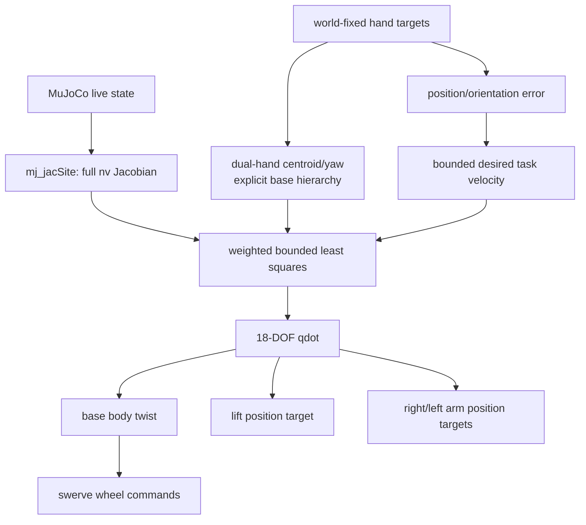

# `src/whole_body_ik.py`

손 target을 팔만으로 맞추지 않고 모바일 베이스 3축, 리프트 1축, 양팔 14축을 한
문제에서 푸는 ROS 비의존 differential whole-body IK다.

## 제어 변수와 출력

제어 속도 벡터는 다음 18개 자유도다.

\[
\dot q = [\dot x_b,\dot y_b,\dot\theta_b,\dot q_{lift},
\dot q_{r,1:7},\dot q_{l,1:7}]^T
\]

| 해의 성분 | 실제 적용 경로 |
|---|---|
| base x/y/yaw 속도 | body frame으로 회전 → `SwerveDrive.update_twist()` → 실제 바퀴 마찰 |
| lift 위치 | `lift_joint` position actuator |
| 양팔 위치 | `ArmTorqueController`의 PD + feedforward 토크 |

solver는 live `data.qpos`를 쓰지 않는다. MuJoCo Jacobian과 현재 pose를 읽어 다음
명령만 반환한다.

## Weighted differential IK

각 손의 world pose 오차에서 원하는 task velocity를 만든다.

\[
\dot x_i^* =
\begin{bmatrix}
K_p(p_i^*-p_i) \\
K_R e_{R,i}
\end{bmatrix},\qquad
\dot x_i = J_i(q)\dot q
\]

양손 task, damping, home posture task를 한 least-squares 문제에 쌓는다.

\[
\min_{\dot q}
\sum_{i\in\{L,R\}}\|W_i(J_i\dot q-\dot x_i^*)\|^2
+\|W_d\dot q\|^2
+\|W_h(\dot q-K_h(q_{home}-q))\|^2
\]

subject to:

\[
\dot q_{min}\le\dot q\le\dot q_{max},\qquad
q_{min}+m\le q+\Delta t\dot q\le q_{max}-m
\]

position/orientation task weight는 각각 10/5, error gain은 8/7이다. task 속도는
linear 1.0 m/s, angular 2.5 rad/s로 제한하고, base/lift/arm 속도 상한은 각각
0.55 m/s·1.2 rad/s, 0.25 m/s, 2.0 rad/s다. 각 DOF의 damping/posture weight도
서로 다르다.

양손이 함께 움직일 때 14개 팔 자유도만으로 공통 오차를 흡수하면 물리 베이스가
늦게 따라오고 해의 작은 부호 변화가 스워브 반전을 반복시킬 수 있다. 그래서 첫
solve에서 base pose와 양손 pose를 기준으로 저장하고, 이후 두 target의 평균 이동과
평균 yaw 변화를 명시적인 base x/y/yaw 목표로 만든다. 강한 selector row로 이 목표를
least-squares에 넣고 최종 base 3축에는 계층 우선순위를 정확히 적용한다. lift와 팔은
같은 문제 안에서 각 손의 나머지 residual을 푼다.

base 명령은 큰 오차에서는 빠르게 사용하되 손 위치 오차 8 cm, 자세 오차 0.25 rad
안쪽에서 점차 fade한다. 선형 8 m/s², 각 4 rad/s² 가속 제한으로 한 프레임짜리 부호
반전을 억제한다. 앱의 target도 프레임당 최대 3 cm/8°로 ramp해 급격한 marker 이동을
물리적으로 추종 가능한 명령으로 바꾼다.

## 왜 target은 world에 고정하는가

기존 target은 현재 base frame에 붙어 있었다. 베이스가 10 cm 움직이면 target도 같은
방향으로 10 cm 움직였기 때문에 팔만 제어할 때는 편했지만, 베이스를 IK 변수로 넣으면
베이스가 움직여도 오차가 줄지 않는다. 목표가 계속 도망가는 셈이다.

whole-body 모드에서는 앱 시작 시 base pose를 target anchor로 캡처한다. 이후
`pos_r/l`은 그 anchor 축에서 표현하되 최종 target world pose는 고정된다. 따라서
solver가 base Jacobian 열을 사용해 실제 task error를 줄일 수 있다.

## 제한된 least-squares 구현

OSQP, SciPy, Pinocchio, ROS를 추가하지 않기 위해 18변수용 작은 active-set solver를
NumPy로 구현했다.

1. 아직 자유로운 변수로 `numpy.linalg.lstsq`를 푼다.
2. bound를 가장 크게 위반한 변수를 경계에 고정한다.
3. 남은 자유 변수로 다시 푼다.
4. 모든 변수가 bound 안에 들 때 종료한다.

Cyclo의 weighted task/QP 구조와 Mink/Pink의 differential IK 원리는 반영하되, 이
프로젝트 실행에 그 패키지들을 설치할 필요는 없다.

## 함수 흐름

## 테스트

`tests/test_whole_body.py`는 다음을 확인한다.

- 스워브 역기구학→정기구학 100개 무작위 왕복
- 주입한 ±90° 조향 범위의 동치각과 전역 wheel saturation
- base가 움직여도 hand/virtual-object target이 world에 고정되는지
- solver가 live qpos를 바꾸지 않고 base/lift/양팔을 모두 쓰는지
- 무작위 XYZ/yaw target 40개 모두에서 한 step 뒤 오차 감소, read-only, 속도 bound
- 실제 wheel-ground contact에서 longitudinal/lateral/vertical/yaw 양손 target 추종

물리 회귀의 최종 combined pose error 비율은 longitudinal 0.039, lateral 0.049,
vertical 0.008, yaw 0.165다. yaw 25° 명령의 2초 결과는 base yaw 22.2°, 손 위치
오차 24.0 mm, 손 자세 오차 1.4°다. 완전한 순간 수렴을 주장하지 않고, 정해진 시간과
물리 접촉 안에서 오차가 안정적으로 줄어드는지를 gate로 둔다.

수동 주행 중에는 world target frame을 실제 base SE(2) 이동만큼 함께 운반하고,
정지 handover에서 solver의 base/hand reference를 현재 target으로 `rebase()`한다.
그러지 않으면 startup target이 수동 이동을 새 WBIK 오차로 해석해 키를 놓은 뒤
원래 위치로 돌아간다. 테스트는 수정 전 -0.320 m/s였던 복귀 twist가 0인지, 실제
물리 release의 역방향 이동이 5 mm 미만인지, 이후 새 target에 다시 반응하는지 본다.
