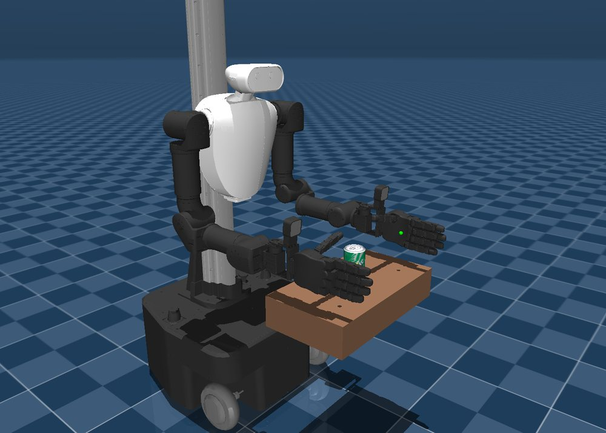
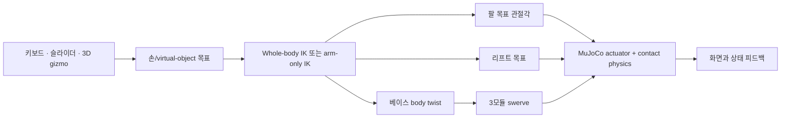

# ffw-sh5-grasp

FFW-SH5 양팔 모바일 로봇을 MuJoCo 물리 안에서 조작하는 ROS-free 텔레오퍼레이션
프로젝트다. 손 목표를 움직이면 팔, 리프트, 스워브 베이스가 함께 추종할 수 있고,
필요하면 버튼 하나로 팔만 사용하는 모드로 바꿀 수 있다.

<figure class="hero-figure" markdown>
  
  <figcaption>양팔 14축, 양손, 리프트, 3모듈 스워브 베이스와 캔을 포함한 전체 시뮬레이션.</figcaption>
</figure>

## 어디서 시작하면 되나

원하는 목적에 맞는 한 줄만 따라가면 된다.

| 목적 | 먼저 읽을 문서 | 다음 문서 |
|---|---|---|
| 앱을 바로 실행하고 싶다 | [10분 빠른 시작](getting-started.md) | [조작과 UI](run.md) |
| 어떤 모드를 써야 할지 모르겠다 | [제어 모드 선택](control-modes.md) | [핵심 개념](concepts.md) |
| 바퀴·IK·collision 동작이 이상하다 | [문제 해결](troubleshooting.md) | [테스트와 검증](testing.md) |
| 전체 코드 흐름을 파악하고 싶다 | [프로젝트 구조](overview.md) | [코드 가이드](guide/index.md) |
| ROS2/MoveIt 관점에서 이해하고 싶다 | [ROS2 개발자 심화 튜토리얼](guide/ros2-guide.md) | 모듈별 코드 가이드 |

!!! tip "처음이라면 긴 튜토리얼부터 읽지 않아도 된다"
    실행이 목적이면 **빠른 시작 → 제어 모드 → 조작과 UI** 세 문서면 충분하다.
    ROS2 튜토리얼은 수학, 개발 역사, 버그 사례까지 포함한 심화 자료다.

## 30초 동작 모델

핵심은 목표와 물리를 분리한다는 것이다. UI가 로봇 관절 위치를 직접 덮어쓰지
않는다. 목표를 바꾸면 IK가 명령을 계산하고, 팔 토크·리프트 actuator·실제 바퀴와
지면 마찰을 통해 로봇이 움직인다.

## 현재 제공하는 기능

| 기능 | 현재 동작 |
|---|---|
| 손 목표 | 손별 home-relative XYZ/RPY, 숫자 slider, jog, 3D gizmo |
| 전신 제어 | base x/y/yaw + lift + 양팔 14축 bounded differential IK |
| Arm-only | Whole-body OFF에서 base/lift IK 속도를 정확히 0으로 고정 |
| 양팔 동기화 | Bimanual MoveL + virtual object + captured rigid-grasp |
| 충돌 회피 | 팔-팔·팔-몸체·팔/손-table의 reactive signed-distance CBF |
| 충돌 표시 | `V` 또는 UI 체크박스로 geometry와 최근접점/연결선 표시 |
| 모바일 베이스 | 키보드 body twist와 WBIK twist가 동일한 실제 swerve actuator 경로 사용 |
| 캔 grasp | 손가락 synergy와 contact force 기반 판정; 물체 부착 치팅 없음 |
| 종속성 | NumPy + MuJoCo 순수 Python 알고리즘, ROS/MoveIt/Pinocchio/FCL/OSQP 없음 |

## 자주 헷갈리는 세 가지

1. **Whole-body OFF는 로봇 전체 정지가 아니다.** 자동 IK에서 base/lift를 빼는
   모드다. 키보드 주행과 수동 lift는 여전히 사용할 수 있다.
2. **Collision avoidance는 경로 플래너가 아니다.** 3 cm 안의 접근 속도를 매 frame
   보정하는 reactive safety layer이며 기본 안전거리는 1 cm다.
3. **키를 놓은 뒤 물리적으로 멈추는 데 짧은 시간이 필요하다.** 명령은 즉시 zero로
   바뀌지만 바퀴와 차체는 제동한다. 검증 기준은 차체 0.20초, 모든 바퀴 0.32초다.

## Demo

  <iframe
    src="https://www.youtube.com/embed/2LV_RsAGdz8"
    title="ffw-sh5-grasp demo"
    style="position: absolute; inset: 0; width: 100%; height: 100%; border: 0;"
    allow="accelerometer; autoplay; clipboard-write; encrypted-media; gyroscope; picture-in-picture; web-share"
    allowfullscreen>
  </iframe>

