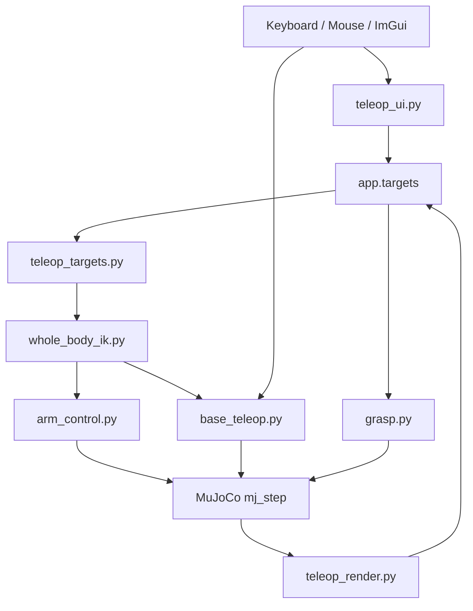

# 프로젝트 구조

> 이 문서는 표/다이어그램 위주의 빠른 요약이다. 처음 보는 사람이라면
> [ROS2 개발자를 위한 튜토리얼](guide/ros2-guide.md)을 먼저 읽는 걸 권장한다 —
> 여기 나오는 내용을 왜 이렇게 설계했는지까지 순서대로 설명한다.

## 현재 범위

| 항목 | 상태 |
|---|---|
| 전신 모델 | `models/full_scene.xml` |
| 조작 방식 | GLFW + MuJoCo render + ImGui |
| 전신 목표 | world-fixed 손별 home-relative XYZ/RPY |
| 양팔 목표 | Cyclo-style virtual object marker |
| 캔 grasp | contact force 기반 |
| IK | base 3축 + lift + 양팔 14축 weighted whole-body IK + reactive collision CBF |
| 베이스 | ROBOTIS-style swerve drive, 실제 바퀴 마찰 |
| 종속성 | ROS 없음, NumPy + MuJoCo 알고리즘 구현 |
| 테스트 | Phase 0-6 + whole-body |

## 런타임 흐름

## 주요 모듈

| 파일 | 역할 |
|---|---|
| `src/teleop_app.py` | 앱 생성, MuJoCo model/data 준비, 메인 루프, 입력, 물리 step |
| `src/teleop_ui.py` | ImGui 패널, 버튼/슬라이더, marker jog |
| `src/teleop_render.py` | GLFW window, MuJoCo scene render, camera, ImGuizmo, collision CBF overlay |
| `src/teleop_targets.py` | target pose 변환, marker sync, Bimanual MoveL 상태 |
| `src/base_teleop.py` | 키 입력 smoothing, swerve inverse kinematics, wheel command |
| `src/kinematics.py` | 공유 pose/FK/Jacobian + collision pair 최근접 거리 gradient |
| `src/whole_body_ik.py` | 양손 task를 base/lift/양팔 velocity로 공동 최적화 |
| `src/ik.py` | 기존 단일 팔 IK와 Phase 3/4 독립 회귀 경로 |
| `src/arm_control.py` | 팔 관절 토크 명령 계산 |
| `src/grasp.py` | 손가락 synergy 적용, 접촉 기반 grasp 판정 |
| `src/bimanual_constraint.py` | legacy box rigid grasp projection helper |
| `src/mj_util.py` | `grasp.py`/`arm_control.py`가 공용으로 쓰는 MuJoCo 조회 헬퍼(joint -> actuator 탐색) |

## 데이터 흐름

1. UI와 gizmo가 `app.targets`를 갱신한다.
2. `teleop_targets.py`가 target 값을 world pose로 변환한다.
3. `kinematics.py`가 정규화된 손 pose와 world-aligned Jacobian을 계산한다.
4. `whole_body_ik.py`가 world pose를 base/lift/양팔 공동 명령으로 변환한다.
5. `arm_control.py`가 팔 위치 명령을 토크로 변환한다.
6. `base_teleop.py`가 whole-body 또는 키보드 body twist를 바퀴 조향각/속도로 변환한다.
7. `grasp.py`가 grasp/thumb 값을 손가락 actuator target으로 변환한다.
8. `teleop_app.py`가 모든 actuator command를 `data.ctrl`에 쓰고 `mj_step`을 호출한다.
9. `teleop_render.py`가 scene과 marker/gizmo를 다시 그린다.

## Target 좌표계

| Target | 의미 |
|---|---|
| `pos_r`, `pos_l` | 손별 시작 위치 기준 XYZ offset |
| `rpy_r`, `rpy_l` | 손별 시작 자세 기준 Roll/Pitch/Yaw |
| `virtual_object_pos` | base anchor의 virtual object 위치(수동 주행 중 anchor도 함께 이동) |
| `virtual_object_rpy` | base anchor 기준 virtual object RPY |

## 테스트 구성

| Phase | 파일 | 검증 |
|---|---|---|
| 0 | `test_phase_0.py` | 원본 모델 로드와 안정성 |
| 1 | `test_phase_1.py` | 손 collision 관통 |
| 2 | `test_phase_2.py` | 고정 손 grasp/lift |
| 3 | `test_phase_3.py` | 오른팔 IK/pick |
| 4 | `test_phase_4.py` | 전신 hold/IK/pick |
| 5 | `test_phase_5.py` | 입력 응답/FSM/조향 limiter와 전후·strafe·yaw·복합·반전 물리 주행 |
| 6 | `test_phase_6.py` | marker, Bimanual MoveL, XYZ/RPY target |
| WBIK | `test_whole_body.py` | ROS-free gate, 관절·충돌 CBF, 거리 gradient, 스워브 왕복/포화, 무작위 solver 40회, 실제 4방향 whole-body 추종 |
