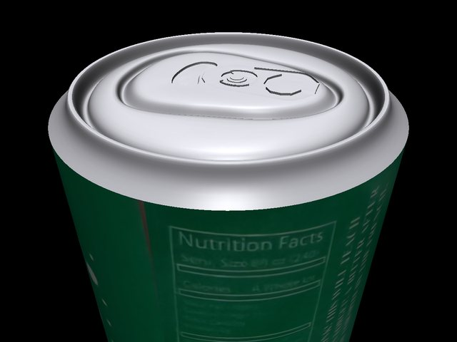

# 프로젝트 개요 — 왜 이렇게 만들었는가

ROBOTIS FFW-SH5 이동형 양팔 로봇이 **kinematic 치팅 없이, contact force만으로** 테이블
위 캔을 집어 드는 텔레오퍼레이션 시뮬레이터. 이 페이지는 **무엇을** 만들었는지가 아니라
**왜 이런 구조로 만들었는지**를 기록한다. (How — MuJoCo의 어떤 기능을 어떤 순서로
썼는가 — 는 [MuJoCo 튜토리얼](guide/index.md) 쪽을 보면 된다.)

<span class="phase-track">
<span>Phase 0–6 전체 완료</span>
<span>test_phase_0…6 PASS</span>
<span>캔 pick · 실제 바퀴 주행 PASS</span>
<span>Cyclo marker 양팔 제어</span>
</span>

---

## 01 — 출발점: 왜 "물리적으로 진짜"여야 하는가

이 레포는 세 번째 시도다. 앞선 두 번의 실패가 이 프로젝트의 유일한 절대 규칙을 만들었다.

!!! failure "시도 1 · 실패 — C++ / Bullet3"
    손가락-캔 관통(penetration)을 끝내 해결하지 못함. 콜리전이 물리적으로 안정되지
    않아 폐기.

!!! failure "시도 2 · 실패 — MuJoCo, kinematic 부착"
    손가락을 캔에 강제로 붙여서 "쥔 것처럼" 보이게 함 — 접촉력이 아니라 좌표 대입이라
    물리가 아니었음.

!!! quote "그래서 정해진 절대 규칙"
    이번 레포는 시작부터 **"`data.qpos[...]` 직접 대입 금지"**를 제1원칙으로 못박았다.
    캔을 들어올렸다는 것은 오직 손가락 액추에이터가 만든 접촉력이 중력을 이겼다는
    뜻이어야 한다 — 시뮬레이터에게 "이미 쥐고 있다"고 알려주는 지름길은 없다.

대신 기준점으로 삼은 건 DeepMind `mujoco_menagerie/shadow_hand`의 검증된 contact/
actuator 레시피, 그리고 재현 목표는 "AI Worker FFW-SH5 Teleoperation" 레퍼런스 영상의
조작 경험(EE pose 슬라이더 + grasp synergy 스칼라 하나로 손 전체가 자연스럽게 감싸쥐는
것)이다.

---

## 02 — 구조: 세 개의 모델, 한 번에 하나씩 검증

복잡도를 한 번에 넣지 않는다. 손 → 팔+손 → 전신, 매 단계마다 이전 단계의 검증된 수치를
그대로 물려받는다.

| 모델 | Phase | 내용 |
|---|---|---|
| `models/hand_only.xml` | 1–2 · 손만 | 오른손 하나를 mocap+weld로 공중에 고정하고 캔 하나만 놓는다. 콜리전 형상(캡슐 근사)과 grasp synergy 매핑을 여기서 전부 확정한다 — 변수가 가장 적은 상태에서. |
| `models/arm_hand.xml` | 3 · 팔 + 손 | 오른팔 7DOF를 붙이고 IK를 얹는다. 손 쪽 수치는 그대로 두고 "팔이 어긋난 자세로 데려다 놔도 여전히 쥘 수 있는가"만 새로 검증한다. |
| `models/full_scene.xml` | 4–5 · 전신 + 베이스 | 양팔·양손·헤드·리프트·모바일 베이스를 전부 붙인다. 오른손 grasp 기하는 Phase 1–2 값을 한 글자도 안 바꾼 채 그대로 상속. |

| Phase | 내용 | 결과 |
|---|---|---|
| 0 | 공식 robotis_ffw menagerie 자산 임포트, 5초 무제어 발산 테스트 | ✓ nq=70 nv=69 |
| 1 | 메시 콜리전 → 캡슐 근사 | ✓ 관통 28mm → 1.17mm, 20/20 |
| 2 | 3점 파지(엄지·검지·중지) 확정, ±5mm 노이즈 | ✓ 10/10 |
| 3 | 계층형 DLS IK + 팔 통합 pick | ✓ 10/10 |
| 4 | 양팔/양손 + 단일 네이티브 창 UI + 토크 제어 | ✓ 8/10 |
| 5 | 가상 액추에이터 → 실제 바퀴 마찰 구동으로 재작업 | ✓ 슬립 0.8% |

각 Phase 완료 시점마다 git 태그(`phase-0` … `phase-4`)를 남기고, 다음 Phase는 이전
Phase의 테스트를 절대 깨지 않는 것을 조건으로 시작한다 — `tests/test_phase_N.py`는
지금도 전부 독립 실행 가능한 회귀 테스트다.

---

## 03 — 판단: 여러 방법 중 무엇을 골랐는가

!!! abstract "Collision — 메시 대신 캡슐"
    HX5-D20 손가락의 콜리전 지오메트리는 전부 메시였다 — 접촉이 불안정하고 느렸다.
    `trimesh`로 각 손가락 부품의 로컬 AABB를 실측해 장축을 캡슐 축으로 근사했다.

    **왜:** 안정적인 contact force가 이 프로젝트의 유일한 성공 기준이라, 콜리전
    프리미티브 자체의 신뢰도가 다른 무엇보다 우선한다.

!!! abstract "Inverse Kinematics — 계층형 DLS, 스택형 아님"
    위치·자세 오차를 하나로 쌓은 6D IK는 자세 오차가 클 때 발산했다. 대신 위치를
    먼저 풀고, 자세는 위치 자코비안의 널스페이스에 투영해 보정한다.

    **왜:** "정확도"보다 "텔레옵 중 절대 발산하지 않는 것"이 먼저다 — 느리게
    수렴하는 것보다 이상한 방향으로 튀는 게 훨씬 나쁘다.

!!! abstract "Arm actuation — 순수 위치 제어 대신 토크+피드포워드"
    MuJoCo `<position>` 액추에이터는 적분/피드포워드 항이 없어 하중 하에서 정적
    처짐이 났다. `tau = qfrc_bias + kp·(q_des−q) − kd·qvel`로 교체.

    **왜:** 처짐이 자세에 따라 달라져서(팔꿈치 각도 등) 그때그때 게인을 다시 맞추는
    대신, 애초에 중력을 상쇄하는 쪽이 근본적이다.

!!! abstract "Grasp control — 스칼라 두 개 + force-limited 액추에이터"
    20개 손가락 관절을 각각 조작하지 않는다. `grasp`/`thumb` 스칼라 하나씩이 여러
    관절의 부분 구간으로 매핑되고, 힘이 제한된 액추에이터가 캔 표면에서 자연스럽게
    포화되며 감싼다.

    **왜:** 레퍼런스 영상의 조작감(슬라이더 하나로 자연스러운 파지)을 그대로
    재현하면서도, "얼마나 세게 쥐는가"가 아니라 "접촉이 됐는가"로 성공을 판정할 수
    있다.

!!! abstract "Grasp topology — 5지 완전 제어 대신 3점 파지"
    약지·새끼까지 능동 제어하는 5지 파지를 오래 시도했으나 수렴하지 않았다.
    계획서에 이미 적혀 있던 대체안(엄지+검지+중지)으로 전환하니 바로 풀렸다.

    **왜:** "더 실제 손 같아 보이는" 목표보다 "물리적으로 안정적으로 쥐어지는"
    목표가 우선 — 완전성에 집착하다 계획서의 탈출구를 늦게 쓴 것 자체가 교훈으로
    남았다.

!!! abstract "Locomotion — 가상 액추에이터 대신 진짜 바퀴 마찰"
    처음엔 베이스에 평면 관절 + velocity actuator를 직접 걸었다. 사용자 요청으로
    이를 걷어내고, 바퀴 3개에 실제 조향+구동 관절과 지면 마찰 접촉을 복원해
    ROBOTIS AI Worker의 `ffw_swerve_drive_controller` 흐름을 따른 `SwerveDrive`
    컨트롤러로 변환했다.

    **왜:** 이 프로젝트의 제1원칙(kinematic 치팅 금지)을 손 파지에만 적용하고
    이동에는 예외를 두는 건 일관성이 없다 — 바퀴도 결국 마찰로 밀어야 한다.

---

## 04 — 진단 로그: 겉보기엔 안 보이던 버그들

이 프로젝트의 규칙: 파라미터를 몇 배씩 바꿔도 결과가 똑같으면, 그 파라미터는 원인이
아니다. 아래는 그렇게 걸러낸 것들.

| 증상 | 실제 원인 | 확인 방법 |
|---|---|---|
| 손가락이 캔을 28mm 관통 | 충돌 쌍의 `priority`가 `solref`/`solimp`까지 통째로 가져감 — 캔 쪽엔 그 값이 없어 기본값(무름)으로 계산됨 | 캔에도 동일 solref 명시 → **28mm → 3.16mm** |
| 바퀴가 거의 안 움직임(슬립 99%+) | 바닥을 바퀴와 정확히 같은 높이(z=0.1465)에 두니 부동소수점 경계에서 바퀴 3개 중 2개가 `data.contact`에서 통째로 빠짐 | 1.5mm 의도적 겹침으로 재배치 → **슬립 → 0.8%** |
| 조향이 뻣뻣하고 제자리 회전이 거의 안 됨 | 베이스에 수직 자유도가 없어 바퀴의 1.5mm 겹침이 평형에 정착 못 함 → 기본 접촉 강성이 실제 무게의 28배(27,500N vs 982N) | 바퀴-바닥 전용 solref 완화 → **조향 5s → 0.5s** |
| 왼손 엄지가 기본 자세부터 접혀 있음 | 왼손 엄지 관절 range가 오른손과 부호까지 미러링됐는데, 매핑 코드는 항상 `lo`를 "편 상태"로 취급 — 왼손만 정반대 | 손별 보간 방향 플래그 추가 → **접촉력 40N → 0N** |
| 약지가 수십 초에 걸쳐 서서히 처짐 | `range="0 0"`으로 "잠갔다"고 문서화돼 있었지만 `limited="true"`가 빠져, Phase 2 이후 한 번도 실제로 잠긴 적이 없었음 | `model.jnt_limited` 직접 확인 후 유효 범위로 교체 |
| 캔 라벨이 어느 각도에서도 로고 없이 줄무늬만 | 원통 프리미티브의 자동 UV 생성이 사진형 텍스처를 원주로 매끄럽게 감아주지 못함(로딩/렌더 컨텍스트/스케일 순으로 소거 후 확인) | OBJ에 명시적 UV를 직접 계산해 부여 |

<figure class="hero-figure" markdown>
  
  <figcaption><b>라벨은 대체 지오메트리가 아니라 원본 <code>soda_can.stl</code> 위에
  감겨 있다.</b> 면 법선 기준으로 옆면/캡을 나누려 했더니 풀탭의 국소적으로 가파른
  디테일 때문에 전체 면의 78%가 "캡"으로 분류되는 오류가 남 — 대신 버텍스 반지름을
  높이의 함수로 프로파일링해 "반지름이 일정한 구간(전체 높이의 5–92%)"을 라벨
  영역으로 잡았다.</figcaption>
</figure>

각 버그가 실제로 어떤 MuJoCo 기능과 관련됐는지, 그리고 일반화된 교훈은
[MuJoCo 튜토리얼의 함정 총정리](guide/pitfalls.md)에 더 자세히 정리돼 있다.

---

## 05 — 현재 상태

Phase 0–6 기준으로 캔 pick, 실제 바퀴 주행, Cyclo Control식 양팔 marker/XYZ/RPY
제어가 동시에 회귀 테스트를 통과한다.

| PHASE 0 | PHASE 1 | PHASE 2 | PHASE 3 | PHASE 4 | PHASE 5 | PHASE 6 |
|---|---|---|---|---|---|---|
| PASS | PASS | PASS | PASS | PASS | PASS | PASS |

```text
ffw-sh5-grasp/
├── models/            # hand_only → arm_hand → full_scene
├── src/
│   ├── ik.py              # 계층형 6DOF DLS IK
│   ├── arm_control.py     # 토크 + 중력 피드포워드
│   ├── grasp.py           # synergy 스칼라 → 관절 매핑
│   ├── base_teleop.py     # ROBOTIS식 SwerveDrive 바퀴 제어
│   ├── teleop_app.py      # 단일 네이티브 창 메인 루프
│   ├── teleop_targets.py  # 손 목표 pose 변환 + Cyclo-style bimanual target
│   ├── teleop_ui.py       # ImGui 슬라이더 패널
│   └── teleop_render.py   # MuJoCo 렌더링 + 카메라 + ImGuizmo
├── tests/             # test_phase_0.py … test_phase_6.py
├── assets/soda_can/   # 실제 라벨을 두른 캔 STL
├── docs/              # 이 mkdocs 문서 사이트
└── PLAN.md · NOTES.md · README.md
```

실행: `python3 src/teleop_app.py` — 방향키로 베이스(실제 바퀴 마찰),
Cyclo Control식 `MoveL`/`Bimanual MoveL` UI와 숫자 슬라이더로 양팔 EE pose와
can grasp를 조작한다.
검증: `python3 tests/test_phase_{0,1,2,3,4,5,6}.py`, 전부 독립 실행 가능한 headless
회귀 테스트. 자세한 실행법은 [직접 실행하기](run.md) 참고.

Phase 6에서는 `switch_scenario`/box workflow를 제거하고, capture된 양팔 target을
virtual object marker 기준 상대 pose로 유지하는 Cyclo-style bimanual MoveL 흐름을 검증한다.

!!! info "상세 진단 기록"
    각 세션의 상세 진단 기록은 레포의 `NOTES.md`에 남아 있다.
