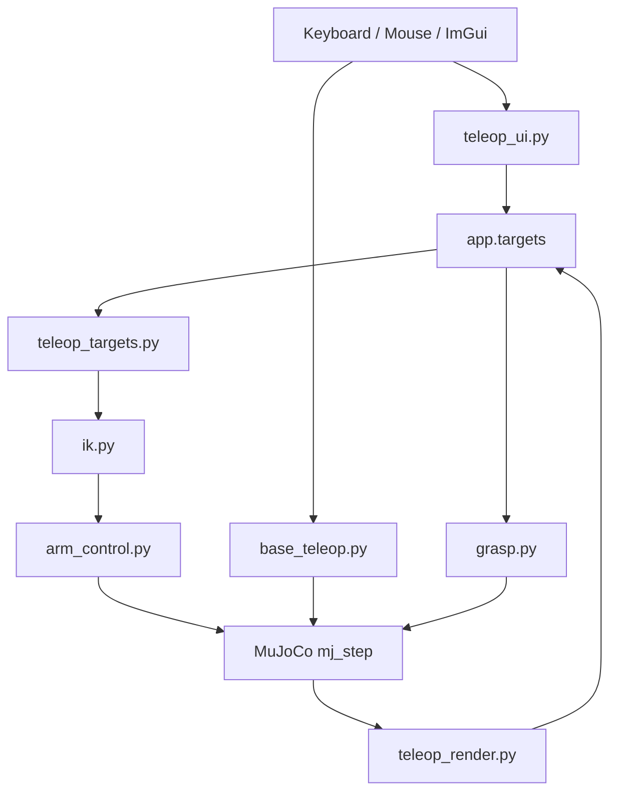

# 프로젝트 구조

## 현재 범위

| 항목 | 상태 |
|---|---|
| 전신 모델 | `models/full_scene.xml` |
| 조작 방식 | GLFW + MuJoCo render + ImGui |
| 팔 목표 | 손별 home-relative XYZ/RPY |
| 양팔 목표 | Cyclo-style virtual object marker |
| 캔 grasp | contact force 기반 |
| 베이스 | ROBOTIS-style swerve drive |
| 테스트 | Phase 0-6 |

## 런타임 흐름

## 주요 모듈

| 파일 | 역할 |
|---|---|
| `src/teleop_app.py` | 앱 생성, MuJoCo model/data 준비, 메인 루프, 입력, 물리 step |
| `src/teleop_ui.py` | ImGui 패널, 버튼/슬라이더, marker jog |
| `src/teleop_render.py` | GLFW window, MuJoCo scene render, camera, ImGuizmo |
| `src/teleop_targets.py` | target pose 변환, marker sync, Bimanual MoveL 상태 |
| `src/base_teleop.py` | 키 입력 smoothing, swerve inverse kinematics, wheel command |
| `src/ik.py` | 목표 site 위치/자세를 만족하는 관절각 계산 |
| `src/arm_control.py` | 팔 관절 토크 명령 계산 |
| `src/grasp.py` | 손가락 synergy 적용, 접촉 기반 grasp 판정 |
| `src/bimanual_constraint.py` | legacy box rigid grasp projection helper |
| `src/mj_util.py` | `grasp.py`/`arm_control.py`가 공용으로 쓰는 MuJoCo 조회 헬퍼(joint -> actuator 탐색) |

## 데이터 흐름

1. UI와 gizmo가 `app.targets`를 갱신한다.
2. `teleop_targets.py`가 target 값을 world pose로 변환한다.
3. `ik.py`가 world pose를 팔 관절각 `q_des`로 변환한다.
4. `arm_control.py`가 `q_des`를 토크 명령으로 변환한다.
5. `grasp.py`가 grasp/thumb 값을 손가락 actuator target으로 변환한다.
6. `base_teleop.py`가 키 입력을 바퀴 조향각/속도로 변환한다.
7. `teleop_app.py`가 모든 actuator command를 `data.ctrl`에 쓰고 `mj_step`을 호출한다.
8. `teleop_render.py`가 scene과 marker/gizmo를 다시 그린다.

## Target 좌표계

| Target | 의미 |
|---|---|
| `pos_r`, `pos_l` | 손별 시작 위치 기준 XYZ offset |
| `rpy_r`, `rpy_l` | 손별 시작 자세 기준 Roll/Pitch/Yaw |
| `virtual_object_pos` | base frame의 virtual object 위치 |
| `virtual_object_rpy` | base frame 기준 virtual object RPY |

## 테스트 구성

| Phase | 파일 | 검증 |
|---|---|---|
| 0 | `test_phase_0.py` | 원본 모델 로드와 안정성 |
| 1 | `test_phase_1.py` | 손 collision 관통 |
| 2 | `test_phase_2.py` | 고정 손 grasp/lift |
| 3 | `test_phase_3.py` | 오른팔 IK/pick |
| 4 | `test_phase_4.py` | 전신 hold/IK/pick |
| 5 | `test_phase_5.py` | swerve/base 주행 |
| 6 | `test_phase_6.py` | marker, Bimanual MoveL, XYZ/RPY target |
