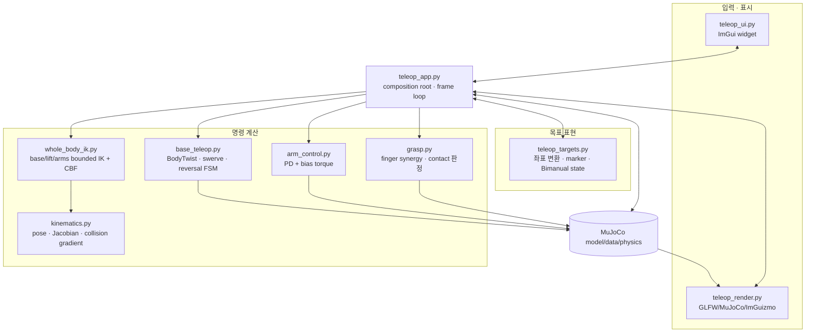
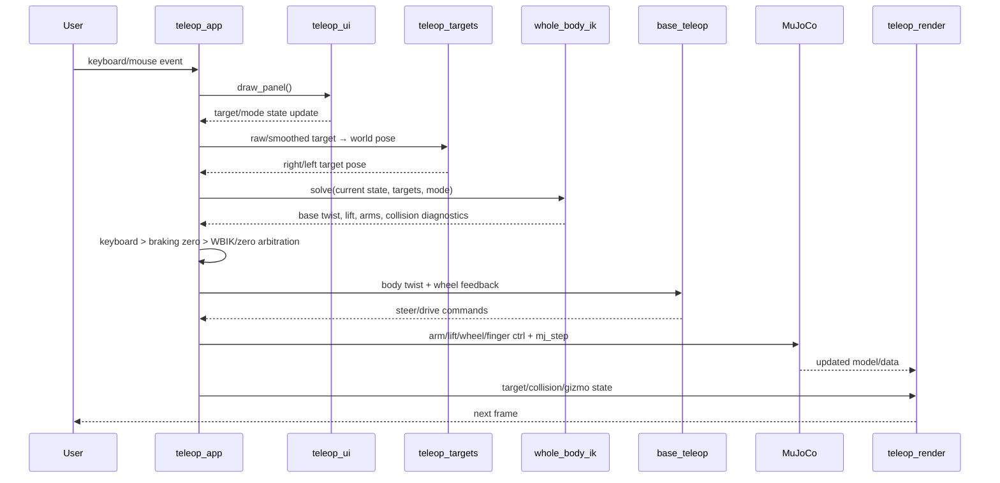
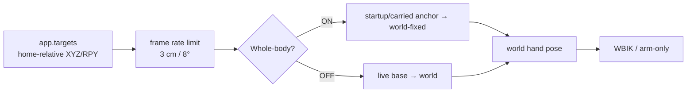

# 아키텍처와 데이터 흐름

코드를 읽기 전에 “어느 파일이 무엇을 소유하는가”를 빠르게 찾는 문서다. 제어 개념이
먼저 필요하면 [동작 원리](concepts.md)를 읽는다.

## 한 문장 구조

`teleop_app.py`가 입력, target 변환, whole-body solver, actuator controller와 renderer를
한 frame loop에 조립하며, 나머지 모듈은 각자의 계산만 담당한다.

## 계층별 구조



## 파일 책임 지도

| 파일 | 입력 | 출력 | 하지 않는 일 |
|---|---|---|---|
| `teleop_app.py` | 모든 app 상태와 입력 | frame별 actuator command + `mj_step` | 수학 구현을 중복하지 않음 |
| `teleop_ui.py` | app 상태 | target/mode 상태 변경 | IK, physics, 3D render 없음 |
| `teleop_render.py` | model/data/target pose | scene, camera, gizmo | controller 계산 없음 |
| `teleop_targets.py` | UI target, base/anchor pose | world hand/virtual pose | actuator 접근 없음 |
| `kinematics.py` | model/data, site/geom id | 정규화 pose/Jacobian/distance gradient | target 정책 없음 |
| `whole_body_ik.py` | current state, world target | base twist, lift/arm position | live qpos write 없음 |
| `base_teleop.py` | keys/BodyTwist, wheel feedback | steer angle + wheel speed | MuJoCo/ROS import 없음 |
| `arm_control.py` | current arm state, `q_des` | motor torque | IK target 해석 없음 |
| `grasp.py` | grasp/thumb, contact | finger target, grasp 판정 | 물체 weld 없음 |
| `ik.py` | 한 손 pose | 단일 팔 관절 해 | 현재 teleop WBIK 경로 아님 |
| `mj_util.py` | joint id | 연결된 actuator id | 제어 정책 없음 |

구현을 수정할 때는 [코드 읽기 시작](guide/index.md)의 목적별 경로에서 해당 모듈과
최소 회귀 테스트를 함께 찾을 수 있다. 공용 pose/Jacobian/distance 계산은
[기구학과 충돌 거리](guide/kinematics.md)에 따로 정리되어 있다.

## 상태의 소유권

| 상태 | 소유/갱신 위치 | 소비 위치 |
|---|---|---|
| `app.targets` | UI, gizmo, target transition | teleop target 변환, physics step |
| `whole_body_enabled` | UI toggle / app transition | target frame, solver participation, arbitration |
| `arm_mode` | arm panel | active solver side 또는 FK slider |
| `cyclo_grasp_captured` | Capture/Release | virtual-object target과 rigid-grasp task |
| `commanded_base_twist` | app arbitration | `SwerveDrive.update_twist()`와 status |
| `q_des_r/l` | WBIK 또는 FK selection | arm torque controllers |
| collision diagnostics | WBIK command | status와 render overlay |
| `data.qpos/qvel` | MuJoCo physics | 모든 feedback 계산 |

## 한 frame의 호출 흐름



## Target 좌표 흐름



ON/OFF 전환은 현재 world pose를 저장한 뒤 반대 표현으로 역변환한다. 이 때문에 UI의
숫자는 바뀔 수 있지만 marker의 실제 world 위치는 보존된다.

## Base 명령 우선순위

```text
키보드 입력 중
  → keyboard BodyTwist
키 해제 뒤 물리 제동 중
  → zero BodyTwist
정지 완료 + Whole-body ON
  → WBIK BodyTwist
정지 완료 + Whole-body OFF
  → zero BodyTwist
```

모든 경우 마지막 단계는 같은 `SwerveDrive.update_twist()`다. 수동/자동 경로가 다른
wheel controller를 사용하지 않는다.

## ROS-free 경계

| ROS2에서 흔한 구성 | 이 프로젝트의 경계 |
|---|---|
| node/topic/action | 한 프로세스의 명시적 함수 호출과 app state |
| tf2 | `teleop_targets.py`의 NumPy/quaternion 변환 |
| MoveIt Servo/IK | `whole_body_ik.py` + `kinematics.py` |
| collision checker | MuJoCo geom distance + Jacobian CBF |
| `twist_mux` | `teleop_app.py`의 keyboard/WBIK arbitration |
| swerve controller plugin | `base_teleop.py` |
| `ros2_control` | MuJoCo actuator `data.ctrl` |

ROS2 관점에서 구조와 알고리즘을 더 깊게 보려면 [ROS2 관점의 시스템 해설](guide/ros2-guide.md)을
읽는다.

## 테스트 연결

| 계층 | 가장 직접적인 테스트 |
|---|---|
| target/UI/state transition | `test_phase_6.py` |
| swerve input/FSM/물리 | `test_phase_5.py` |
| WBIK/BVLS/collision/physical mobile | `test_whole_body.py` |
| 단일 팔 FK/Jacobian/IK | `test_phase_3.py` |
| grasp/contact | `test_phase_1.py`, `test_phase_2.py` |

변경 영역별 실행 순서는 [테스트와 검증](testing.md)에 있다.
